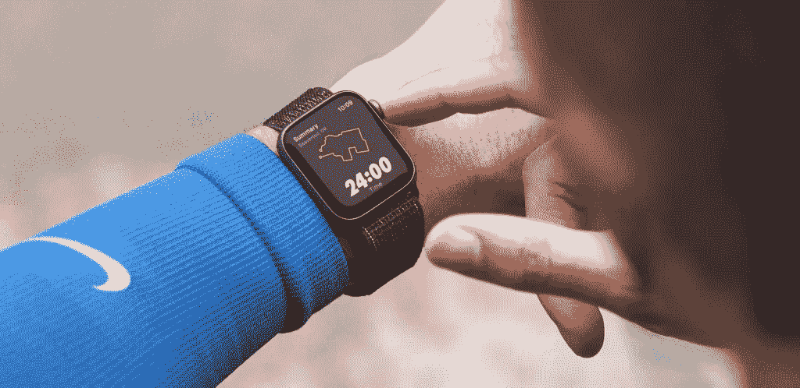
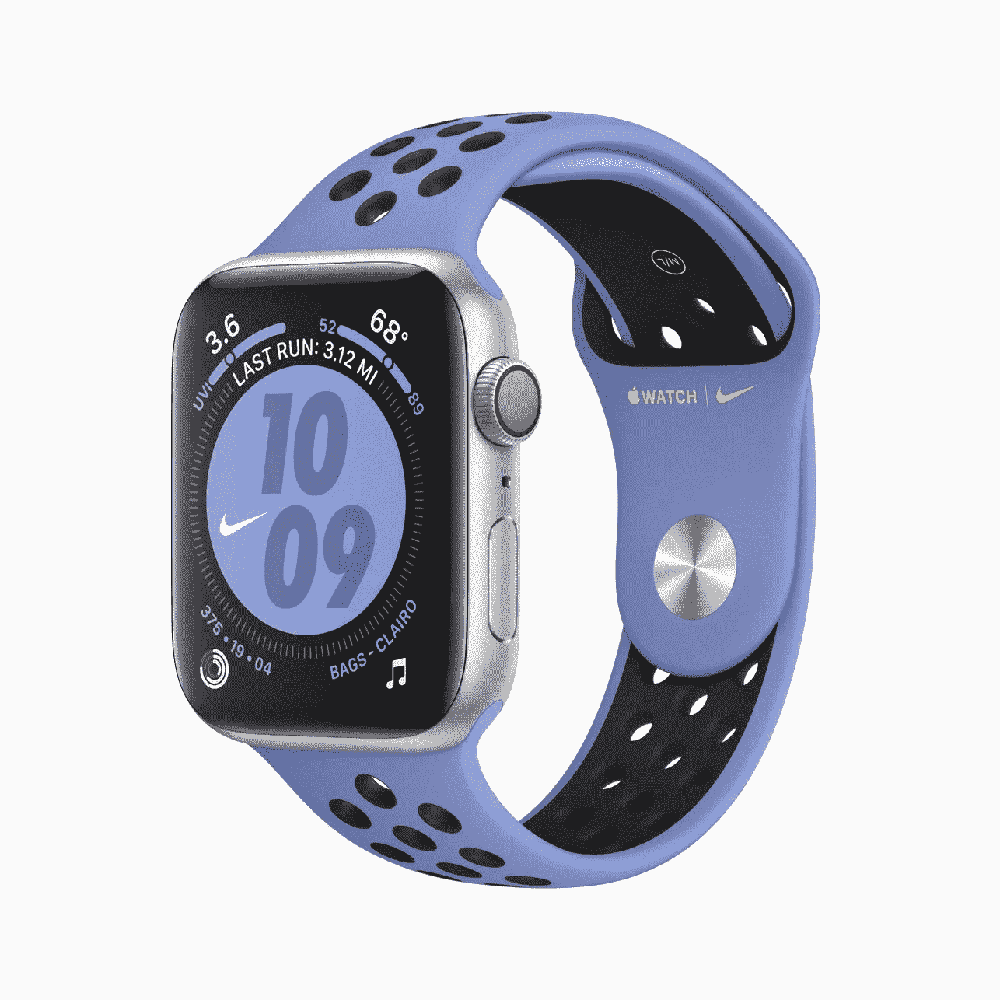
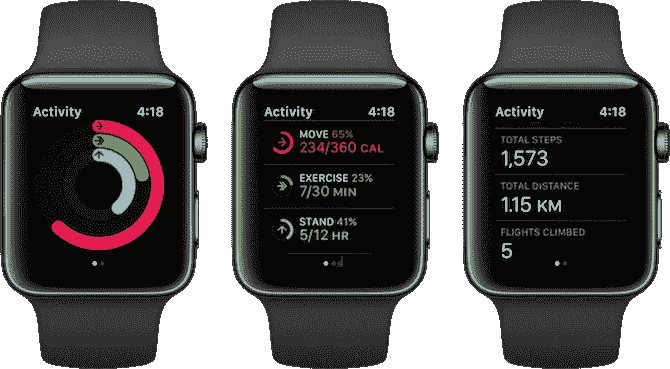

# 关于购买你的第一块苹果手表，你需要知道的一切

> 原文：<https://blog.devgenius.io/everything-you-need-to-know-about-buying-your-first-apple-watch-966a95d90b3c?source=collection_archive---------49----------------------->

## 来自苹果手表新主人的诚实观点

来源:https://www.nike.com/apple-watch

我终于做到了。几个月后(几年后！！！)在认真考虑购买一款[苹果手表](https://www.apple.com/watch/)之后，我最终花了整整 600 美元买了一款[苹果手表 Nike+](https://www.apple.com/apple-watch-nike/) Series 5。是的，即使在经济崩溃的疫情，我也愿意尽我所能把我可能是最后一份薪水的一大块直接扔给苹果。

多年来，我一直在猜测苹果手表——它是干什么用的？真的能有多好？我真的想经常丢下手机吗？反正不是还需要放在口袋里吗？如果你有这些问题，我会回答这些问题，并讨论我在使用新手表的第一周学到的东西。

我到底买了什么:

*   apple Watch Nike+Series 5 GPS+Cellular，带标准黑色/无烟煤色运动表带
*   额外 49 美元的山顶白色耐克运动圈
*   “最快”运输额外收费 8 美元

在简要阅读了系列 3 和系列 5 手表之间的差异后，我发现许多人都同意，就其提供的功能而言，系列 5 不值得与系列 3 的价格差异。我甚至有朋友支持这个决定，喜欢他们新的第三季。然而，一篇评论很快改变了我的决定，指出“你花了几百美元买了一个 2 岁(对我来说几乎 3 岁)的处理器。”这是真的——你现在可以省钱了，但是你很有可能不得不尽快更换那块手表。我直奔主题，买了耐克苹果手表系列 5 GPS+手机。如果你想了解更多关于构建 Apple watch 时的不同选择，请阅读我的另一篇文章，[哪款 Apple Watch 适合你？](https://medium.com/@hannahnduckworth/which-apple-watch-is-right-for-you-7973932b7e2f)

来源:[https://www.gladstoneobserver.com.au](https://www.gladstoneobserver.com.au/subscriptions/premium-offer/)

值得专门写一段来称赞苹果在运输方面的出色客户体验。我选择为“最快”运输支付额外费用，而不是标准的免费选项，因为我想更快地拿到手表。我想也许这只手表能给我的世界带来生命和欢乐，否则我会被隔离在家里。我在太平洋标准时间周三下午 3 点左右订购了手表，不到 24 小时就拿到了。从订单确认到送货上门，我每一步都收到苹果的短信更新。我的额外乐队本应多花一天时间，但他们甚至设法在同一时间交付。太神奇了。

现在，谈到一些话题，我希望在第一次购买 Apple Watch 时能了解更多信息:

这个东西是做什么的？

回答:老实说，没有我想的那么多。对健身方面毫无兴趣的 Apple Watch 购买者…我真的很困惑。Apple Watch 是一款不错的健身显示器。然而，我期望只是如此…多…多。老实说，我不是在抱怨，我认为苹果手表有太多的炒作，经过这么多年，我想我开始说服自己这只是一个迷你 iPhone。举个例子，

**交流**:很尴尬，在我的白日梦里，我想象自己把所有的短信、邮件和交流都转移到了手表上。现实中，在手表上发短信很难！没有键盘！好了，别笑了..是的，我希望它有一个迷你屏幕大小的键盘。没有。语音转文本或用指尖乱涂字母的选项，但是这个功能实际上一次只能识别一个字母，大约 70%的时间都是正确的。这使得在手表上发短信非常费力。你可以发短信，我只是不喜欢对着我的设备说话。这只是“我”的事情。那我该怎么办？继续用我的手机…邮件是另一回事。如果你像世界上大多数人一样使用 gmail，你只能收到 Gmail 通知。没有能力阅读你的电子邮件。现在，您只需要在多个地方检查通知。

说到这个，

**谷歌应用**:没有。我想象自己阅读电子邮件，通过谷歌地图导航，在 Chrome 上进行快速搜索。我知道这听起来很天真，但我再次认为手表可以做到这一切！你无法在手表上体验你最喜欢的谷歌应用。

这让我想到，

**一般的应用** : Gah。手表上的应用程序通常都是非常非常“轻”的版本。我很惊讶地看到有这么多应用程序与手表不兼容。如果你有一个兼容的应用程序，几乎所有与它的交互都将在实际的 iPhone 版本上完成。甚至新闻！看不了苹果新闻，只能浏览头条。

**音乐**:可以，Apple Watch 播放音乐，但只能是 Apple Music。如果你喜欢 Spotify，并且想买一个 Apple Watch，这样你就可以不用手机跑步，你要么放弃音乐，要么一直带着手机跑步。你唯一的选择是为 Apple Music 付费，它将通过你的手表播放。这在理论上听起来不错，但归根结底，你不能从现有的音乐应用程序中移植你的播放列表、收藏夹或任何数据，这很糟糕。我要说，这肯定是 Spotify 和 Apple Watch 最大的持续失望。我们就不能好好相处吗？

# **手表的真正价值**

拥有 Apple Watch 几个月后，我已经能够克服它的缺点了。

我认为苹果手表上的活动追踪是最有价值和最重要的功能

老实说，我不记得没有它的生活。手表的最大价值在于健身追踪功能。我是一个铁杆积极锻炼者，但这让我达到了一个新的水平。没有一天我会错过关闭活动环的机会。如果你需要激励，没有什么比你的苹果手表更能让你兴奋了，它会提醒你“每天这个时候你的活动量通常会更高。”它充满了友好的小提醒，提醒你可以做得更好…

> 老实说，我不记得没有它的生活。

手表的另一个牛逼之处是闹钟。如果你戴着手表睡觉，你可以设置闹钟，每天早上通过微小的触觉振动叫醒你。这是如此的放松，比被声音闹钟吵醒要愉快得多。计时器的工作原理也是一样的——这对烘烤、洗衣等也非常方便。

不用手机就能在附近或任何你想去的地方走动也是一个好处。然而，我要警告你——苹果的 Watch 存在一些严重的网络连接问题。当我有 75%的时间不在手机上时，我的手表会连接到我的威瑞森计划。但我已经接受了这个事实。

**底线**

苹果手表是一项大投资。起初可能会觉得有点乏味。然而，很快，就像所有其他苹果产品一样，它将成为你生活中必不可少的一部分。如果你重视健身追踪、不用手机的实时通知，并且有现金，我说去吧。