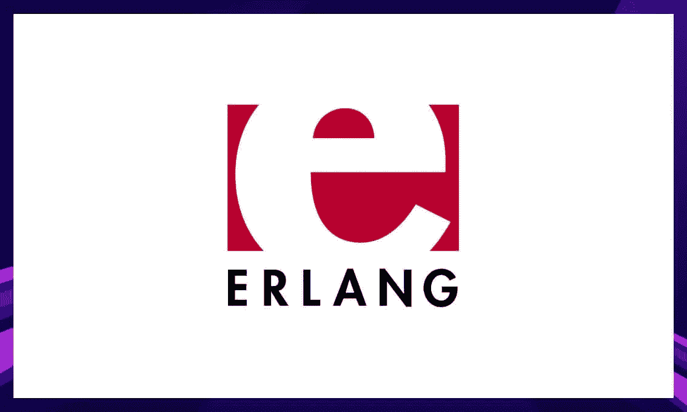
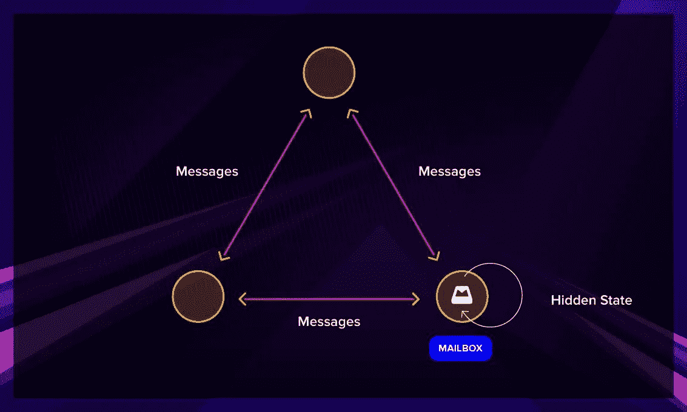
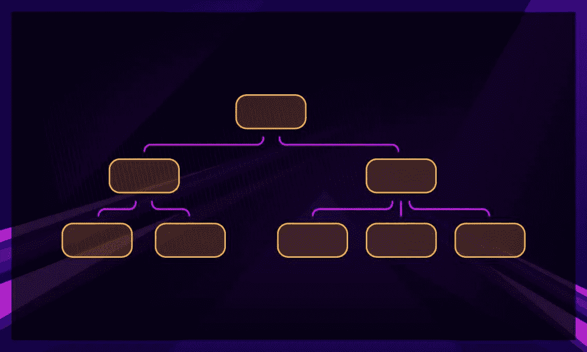
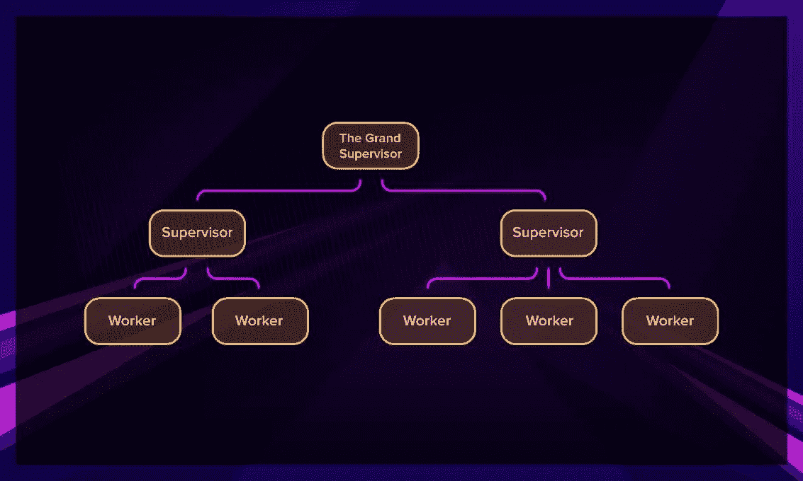
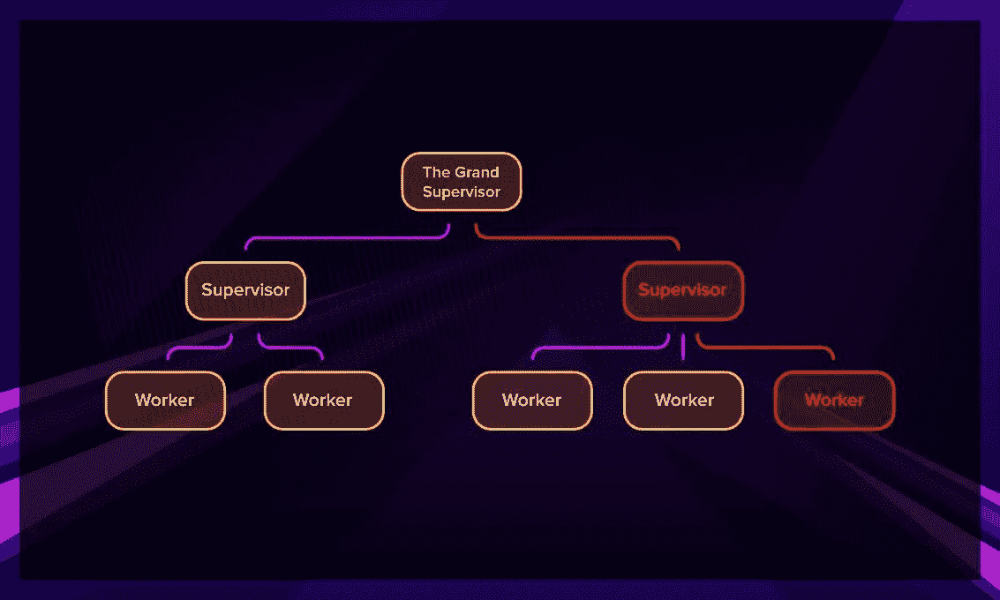

# 关于 2021 年的 Erlang，你需要知道的一切

> 原文：<https://blog.devgenius.io/everything-you-need-to-know-about-erlang-in-2021-6cf7b0e5378d?source=collection_archive---------4----------------------->

## 了解有关支持 WhatsApp 和微信的面向并发的函数式语言的更多信息。

今天，我们将看看一个相当古老又有些古怪的。你们大多数人可能都没有注意到这种语言。

虽然 Erlang 不像一些现代编程语言那样受欢迎，但它悄悄地运行着 WhatsApp 和微信等应用程序，这些应用程序每天都为海量用户提供服务。

在这篇文章中，我将告诉你更多关于这种语言，它的历史，以及你是否应该考虑自己学习它。

# 什么是 Erlang，它用在什么地方？

Erlang 是一种功能性的通用语言，面向构建具有高可用性保证的可伸缩并发系统。

它建于 20 世纪 80 年代末的爱立信公司，用于处理电话交换机。当时，电话交换系统是最复杂的系统之一，就像现在的互联网一样。因此，用于编程的语言需要支持高并发性和零停机时间。

在经历了多种现有的语言选择后，公司的三个人——乔·阿姆斯特朗、罗伯特·维尔丁和迈克·威廉姆斯——决定创造他们自己的语言。这导致了最酷的编程语言之一，也可能是我见过的最棒的语言营销视频。

那么，这种语言与其他语言的区别是什么呢？

# 面向过程

Erlang 与其他语言的主要区别在于它基于进程的计算模型。它使用独立的轻量级进程，通过消息相互通信。

这些进程可以接收消息，并且作为对消息的响应，创建新的进程，向其他进程发送消息，或者修改它们的状态。换句话说，二郎遵循的是[演员模式](https://www.brianstorti.com/the-actor-https://www.brianstorti.com/the-actor-model/model/#:~:text=The%20actor%20model%20is%20a,this%20model%20is%20probably%20Erlang%20.)。如果你在 JVM 上用过 Akka，你会有宾至如归的感觉。

这些进程是独立的，创建速度快，并且只占用少量内存。通过创建更多的组件来扩展您的系统是很容易的。由于这些进程无法辨别其他进程是在同一个内核上还是在另一个地方，因此您可以轻松地进行水平扩展(通过添加更多机器)和垂直扩展(通过添加内核)。

# 功能的

人们通常将 Erlang 与 Scala 和 Haskell 等其他语言归为函数式编程语言。FP 的一些特征是:

*   纯函数的频繁使用
*   高阶函数
*   模式匹配

关于函数式编程的更多信息，你可以在我们的[对 FP](https://serokell.io/blog/introduction-to-functional-programming) 的介绍中找到。

# Erlang 有什么用？

首先，只要涉及到跨网络的多个代理之间的消息传递，Erlang 就是一个很好的选择，因为它很好地映射了语言的基本结构。

它非常适合:

*   **聊天应用。**消息应用，包括一些著名的例子，如微信和 WhatsApp，使用 Erlang 来处理数量惊人的并发用户。Erlang 有一个很棒的消息平台，叫做 [ejabberd](https://www.ejabberd.im/) ，可以用来创建大规模的聊天应用。
*   **消息队列系统**。RabbitMQ ，一个实现 AMQP 和其他协议的开源消息代理，是 Erlang 的一个巨大成功。
*   **区块链。** [Aeternity](https://aeternity.com/) ，一个可伸缩的、安全的、分散的 dapps 的区块链，使用 Erlang 作为它的节点实现。
*   **二进制操作。**从历史上看，Erlang 必须支持快速实现二进制通信协议。因此，它具有使二进制操作更加舒适的特性，比如对二进制进行模式匹配。例如，您可以将 Erlang 用作一个十六进制编辑器。
*   **其他分布式高性能服务。如果你需要在你的金融科技项目中处理来自许多地方的交易，或者创建一个竞价/用户匹配平台，Erlang 也不是最差的选择。**

您可以在[我们的 Elixir 和 Erlang 公司列表](https://serokell.io/blog/elixir-companies)中查看一些 Erlang 的常见用例。

# 这看起来很复杂。可以用 Erlang 搭建 web app 吗？

是的。总的来说，Erlang 非常适合创建快速且可伸缩的 web 应用程序。如果你到了那里，那是相当值得的。不过，有一些警告。

你的 web 应用程序(以及任何其他使用 HTTP 的应用程序)的核心将是 [Cowboy](https://github.com/ninenines/cowboy) ，但除此之外，你需要知道 web 应用程序由什么组成，并分别为每一层选择工具。

库都有很好的文档，但是新手级别的入门资料相对较少，你不会找到所有内容的教程。不是 JavaScript。

总而言之，如果您决定构建 web 应用程序，使用基于 Erlang 的语言 [Elixir](https://serokell.io/blog/introduction-to-erlang#erlang-vs.-elixir) 可能是更好的选择。

# 为什么应该在项目中使用 Erlang？

与其他编程语言相比，Erlang 有三个显著的优势，这主要源于该语言独特的构建方式。

*   **并发。Erlang 虚拟机 BEAM 使用轻量级的执行线程(称为进程)。这些是隔离的，运行在所有 CPU 上，并通过消息进行通信。由于这一点以及语言的功能特性，用 Erlang 编写并发程序并不困难。**
*   **伸缩性。** Erlang 非常适合现代计算和当今多核 CPU 的分布式特性。Erlang 进程允许我们通过添加更多的机器和向现有机器添加更多的内核来轻松扩展系统。
*   **可靠性。** Erlang 有个座右铭——[“让它崩溃”](https://verraes.net/2014/12/erlang-let-it-crash/)。由于独特的容错方法，轻量级进程可以由管理系统快速重启，这有助于您构建自我修复系统。虽然这看起来不太可靠，但它处理了大多数不是由于严重的实现错误引起的错误。

# 让它崩溃吧

在这一节中，我将尝试深入了解 Erlang 应用程序是如何构建的，以及“让它崩溃”的理念在现实生活中是如何实现的。

实际上，让它崩溃并不意味着用户或系统崩溃。这是 Erlang 极力避免的事情。相反，当失败不可避免地发生时，它是关于控制失败，因为在生活中，事情有时确实会失败。倒霉事时有发生。我们来看看 Erlang 是怎么清理的。

基本上，Erlang 应用程序是一个进程树。

在树的底部，我们有工作进程——完成大部分工作的进程。在他们之上，我们有监督员，他们发动工人并检查他们。

监督者本身可以被监督；我们可以很容易地在树的顶部添加一个高级主管。

如果某个进程崩溃，它会向其主管发送一条消息。根据所设置的监管策略，要么只重启该进程，要么重启其监管下的所有进程。

如果在一段时间内，重新启动连接的工作线程并没有解决给定次数的问题，那么 supervisor 将终止它的所有子进程，然后终止它自己。在这一点上，试图处理问题的责任被向上推到下一个监管层。

只有当顶级监管程序失败时，它才会重新启动，应用程序才会崩溃。

# 二郎 vs 仙丹

Erlang 不是唯一一种在 BEAM 上运行的语言；还有很多其他的。主要的是仙丹。

# 什么是仙丹？

灵药是何塞·瓦里姆在 21 世纪初发明的。他选择了 Erlang，并在其上做了一个更现代的语法的薄层，类似于 Ruby。

由此产生的语言是对 Erlang 和 Ruby 的改进。它在 2015-2016 年经历了一次体面的人气飙升，当时其主要网络框架 [Phoenix](https://www.phoenixframework.org/) 发布。

你可以在我们的[关于仙丹](https://serokell.io/blog/introduction-to-elixir)的介绍中了解更多关于仙丹和凤凰的信息。

# 仙丹优于二郎

Elixir 实际上并没有给 Erlang 增加很多新特性。在 Elixir 中可以做的一切，在 Erlang 中也可以做，并且可以互相调用这两种语言。Elixir 的大部分优势源于这样一个事实，即它具有更现代的、类似 Ruby 的语法，这使得它比 Erlang 更受欢迎。

以下是 Elixir 相对于 Erlang 的优势:

*   **现代句法。如果你已经用其他流行的编程语言编写过程序，那么 Elixir 的语法就更容易理解了。它删除了一些样板代码，可以提高开发人员的生产力。**
*   **人气更高。很长一段时间以来，长生不老药一直是两者中更受欢迎的，所以关于长生不老药的内容也更为现代，而且有更多的长生不老药问世。**
*   **框架。如果你对 web 开发感兴趣，Phoenix 是最好的框架之一，如果你想做 web 开发和函数式编程，它绝对是最方便的。谈到框架，Elixir 也有神经——一个令人敬畏的嵌入式软件框架。如果这是你想走的路线，仙丹是更好的选择。**

# 二郎值得学习吗？

那么，你为什么要学习这门语言呢？原因有三:

*   您正在关注使用 Erlang 的特定领域中的位置。例如，你喜欢聊天应用，你想在 WhatsApp 工作。那是合理的。
*   你希望编写非常小的、可移植的程序，尽可能少依赖。Erlang 实际上使您能够做很多开箱即用的事情。
*   你是一个真正好奇的人，想要发现新的编程方式，而不会立即给底线带来好处。既然如此，我欢迎你加入光束的行列。

如果最后一个是真的，我会给你指出长生不老药的方向。虽然这两种语言都很好使用，但 Elixir 似乎是最近更受欢迎的一种。它会给你更多的工作机会，也更容易学习。

之后，您可以学习 Erlang 以及它的工作原理。了解 Erlang 在 Elixir 下的功能将有助于您编写更好的 Elixir 代码，并使您更有可能被聘为 Elixir 开发人员。

无论如何，我不认为你会对 BEAM 之旅的任何部分感到遗憾，即使它不全是阳光和彩虹(BEAM 语言有时会变得很奇怪)。如果您想知道从哪里开始，我会指导您学习一些 Erlang 来获得更大的好处！或者我们的[学习仙丹](https://serokell.io/blog/learn-elixir)初学者指南。

如果你想阅读更多关于 BEAM 语言的帖子，请在 [Twitter](https://twitter.com/serokell) 或 [Medium](https://serokell.medium.com/) 上关注我们。

*最初发布于*[*https://sero Kell . io*](https://serokell.io/blog/introduction-to-erlang)*。*