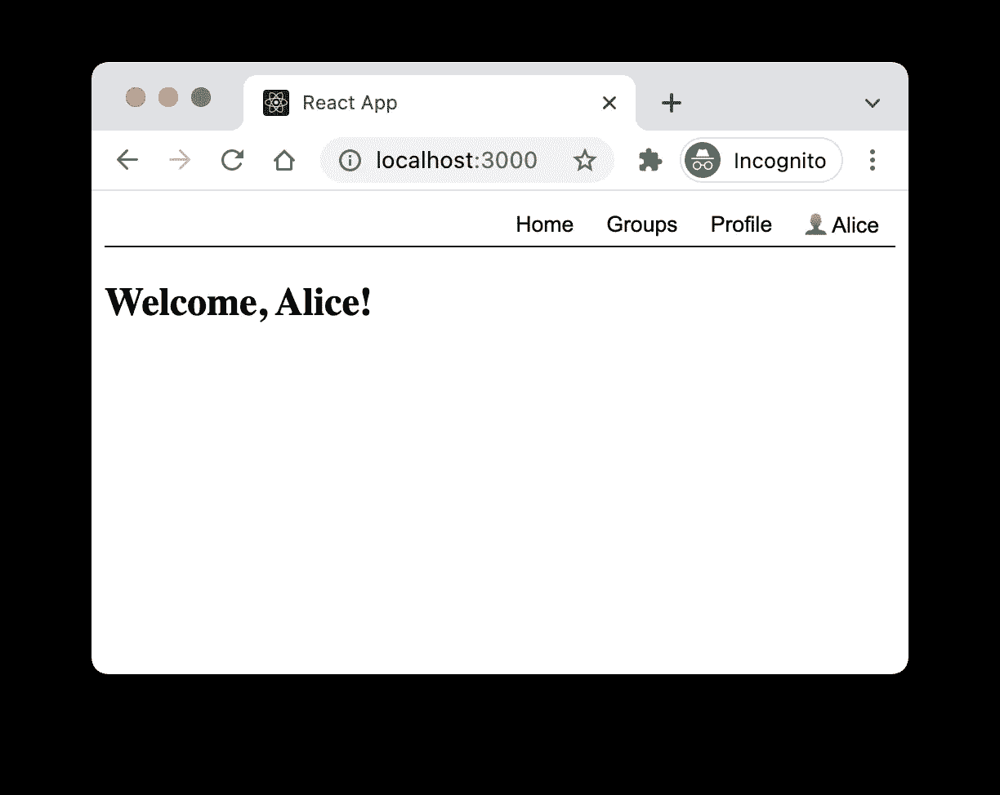
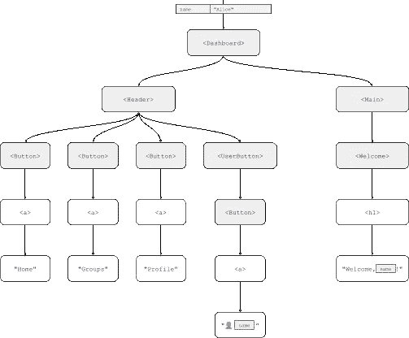
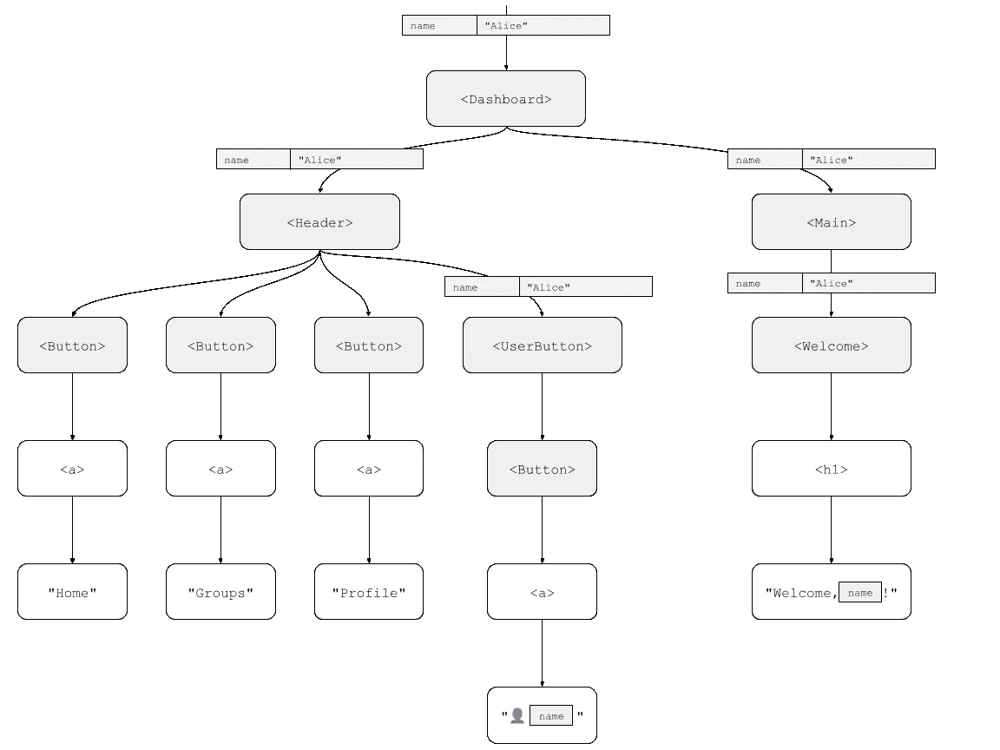
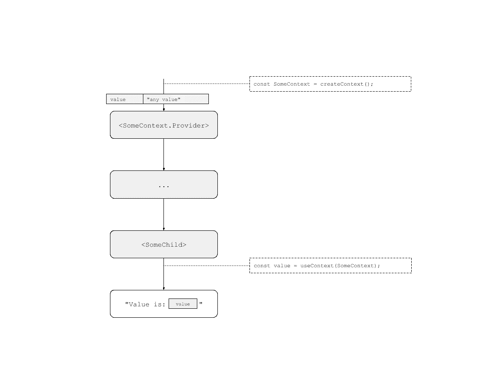
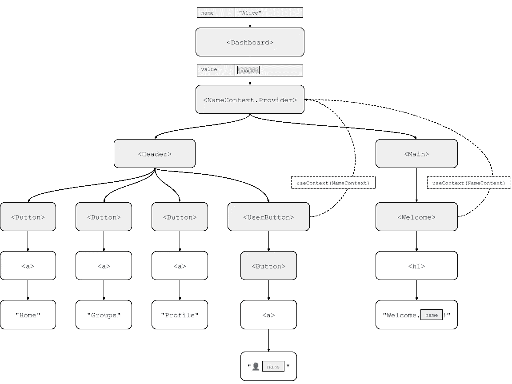
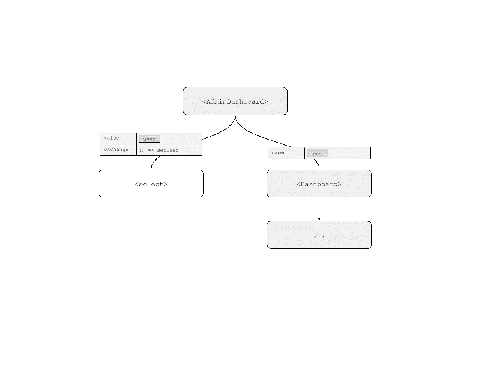
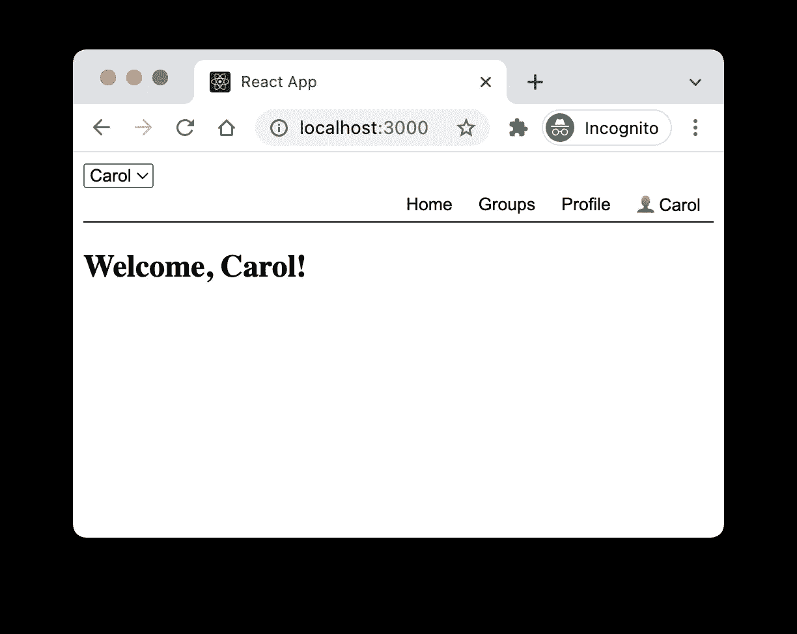
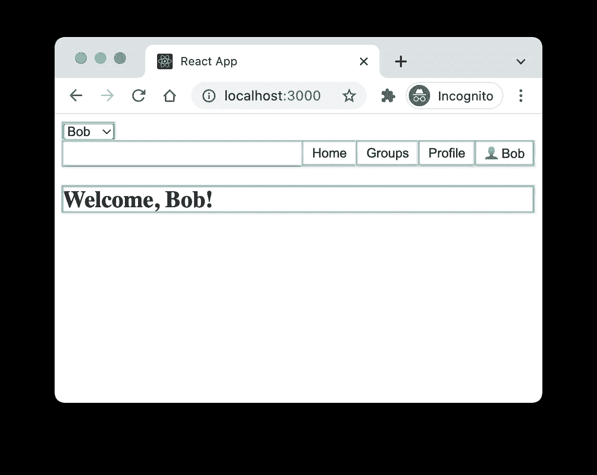
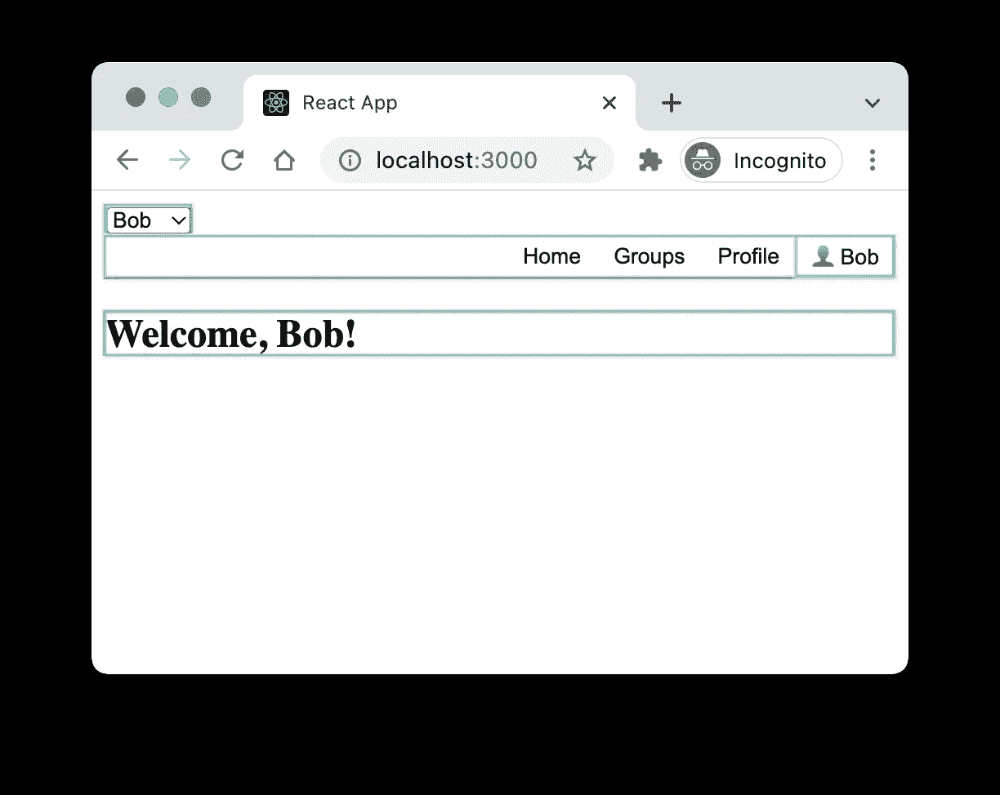

# 关于 2022 年的 React 环境，您需要知道的一切，第 1 部分

> 原文：<https://blog.devgenius.io/everything-you-need-to-know-about-react-context-in-2022-part-1-d39c9b2f81db?source=collection_archive---------8----------------------->

## 文章节选

## *摘自* [*反应迅速，第二版*](https://www.manning.com/books/react-quickly-second-edition?utm_source=medium&utm_medium=referral&utm_campaign=book_mardan2_react_2_3_22) *作者莫滕·巴克伦德*

*本节选探讨了 React 上下文的使用。*

如果你是 React 开发人员或者想了解更多关于 React 的知识，请阅读这篇文章。

享受七五折优惠 [*快速反应，第二版*](https://www.manning.com/books/react-quickly-second-edition?utm_source=medium&utm_medium=referral&utm_campaign=book_mardan2_react_2_3_22) 在[manning.com](https://www.manning.com/books/react-quickly-second-edition?utm_source=medium&utm_medium=referral&utm_campaign=book_mardan2_react_2_3_22)结账时，将 **fccmardan2** 输入折扣代码框。

让我们开始构建一个解决现实世界问题的应用程序。我们将制作一个用户仪表板，即您登录应用程序后看到的屏幕。这个控制面板有一个欢迎信息，通过名字来欢迎你，在左上角还有一个按钮，显示你的名字和到你的设置页面的链接。这里的技巧是名称是动态的，将由后端返回给我们。

最终结果应该如图 1 所示。



图 1 我们的用户仪表板的期望最终结果..这个截图中用户名显示了两次，这是这里问题的核心。

让我们把它分成几个部分。我们希望顶部菜单成为标题的一部分，中央欢迎页面只是我们的应用程序可以显示的许多页面中的一个。我们知道我们将在未来添加更多的东西，所以让我们在准备中添加一些额外的层。我们将使用如图 2 所示的组件方法。



图 2 我们的组件结构，带有名称所需的占位符。请注意“name”属性是如何被使用了两次，但仍然没有作为属性传递到任何地方。

然而，正如您在图 2 中看到的，我们没有显示我们如何从组件树的最顶端获得名称，在那里它被传递到仪表板组件，一直到需要显示它的末端的两个较小的组件。

仅使用常规的 React 属性，我们需要将属性传递给需要它的组件。如果我们这样做了，它将如图 3 所示。



图 3 我们的组件结构，如果我们将名称传递给每个需要传递它的组件。总共有五个组件需要 name 属性，但是其中只有两个真正显示了它

但是请注意，在这个组件树中，我们将 name 属性同时传递给 Header 和 Main 组件。这些组件本身实际上都不需要这个属性。我们必须将该属性传递给这两个组件的唯一原因是，它们可以将该属性转发给另一个组件。

然而，这当然是可行的，我们可以实现它，所以让我们在清单 1 中实现它。

**清单 1 带有许多名称属性的仪表板。**

```
const BUTTON_STYLE = {
   display: 'inline-block',
   padding: '4px 10px',
   background: 'transparent',
   border: '0',
 };
 const HEADER_STYLE = {
   display: 'flex',
   justifyContent: 'flex-end',
   borderBottom: '1px solid',
 };
 function Button({ children }) {
   return <button style={BUTTON_STYLE}>{children}</button>;
 }
 function UserButton({ name }) {
   return <Button>{name}</Button>;    #A
 }
 function Header({ name }) {    #B
   return (
     <header style={HEADER_STYLE}>
       <Button>Home</Button>
       <Button>Groups</Button>
       <Button>Profile</Button>
       <UserButton name={name} />    #C
     </header>
   );
 }
 function Welcome({ name }) {
   return <section><h1>Welcome, {name}!</h1></section>;
 }
 function Main({ name }) {    #B
   return <main><Welcome name={name} /></main>;    #C
 }
 function Dashboard({ name }) {
   return <><Header name={name} /><Main name={name} /></>;
 }
```

你知道你可以在 React 中直接使用表情符号吗？你可以！

**#B 这里我们将一个名称属性传递给一个实际上不需要使用该属性本身的组件**

**#C 组件只有被传递了属性才能够将其传递给另一个组件。**

## **源代码**

您可以从[https://github . com/rq2e/rq2e/tree/main/ch10/rq10-dashboard-props](https://github.com/rq2e/rq2e/tree/main/ch10/rq10-dashboard-props)下载上述示例的源代码，或者您可以通过运行以下代码片段来初始化一个预填充了此示例的新 React 项目:

```
npx create-react-app rq10-dashboard-props --template rq10-dashboard-props
```

这是一个合理的方法，而且行之有效。如果您在浏览器中打开它，您会看到我们在图 1 中想要的东西。

## **反应上下文**

那些属性被传递给组件，只是为了让它们传递给另一个组件，这看起来不像是好的软件设计。一定有更好的办法。如果我们可以有一个封装了许多组件的存储对象，当所有子组件请求数据时，它可以向所有子组件提供数据，那会怎么样？并且它们应该能够这样做，而不需要传递任何额外的属性。

恭喜，我们刚刚发明了反应上下文。上下文正是这样做的。它用一个值包装了许多组件，所有后代组件都可以访问这个值，而根本不需要通过属性。

## **支柱钻孔**

向组件添加属性的唯一目的是允许该组件将这些属性传递给其他组件，这可能反过来只需要允许那些组件将这些属性传递给另一层组件，这种做法被称为*正确钻孔*。你*钻*你的*属性*穿过很多层组件，因为你需要从外到内得到它。

在大型代码库中，Prop drilling 很快就会成为一个问题，React Context 是解决这个问题的最佳工具之一。如果没有适当的设计模式，比如使用上下文提供者，您可能会在一些组件上有几十个属性，只是因为在组件树的下面需要它们才添加的。

这显然是糟糕的软件设计，也是 React Context 如此受欢迎的原因之一。

React 中的上下文由两部分组成。它需要一个包含要传递给任何后代组件的值的提供者，还需要一个使用者，您可以在每个后代组件中使用它来访问所提供的值。

上下文提供者是一个非常简单的 React 组件。消费者可以通过两种不同的方式创建:要么作为一个具有子功能的组件，要么作为一个`useContext`钩子。前一种方法很不寻常，也很麻烦，所以我们根本不打算用它。在现代的 React 应用程序中，你可能永远也不会看到它被使用。它只在基于类的代码库中有用，在那里你不能使用钩子变体。

本质上，使用上下文类似于图 4。



图 4 对提供者使用钩子，消费者使用 useContext 钩子。

这里我们需要两个 React API。首先，我们需要 createContext 来定义上下文，我们将把它存储在一个变量中。这是一个在任何组件之外创建的变量，与其他组件位于相同的位置，因此可以像任何其他组件一样被引用。

另一部分是 useContext 挂钩。这个钩子引用上下文并返回当前的上下文值。

让我们继续将前面的 NameContext 添加到组件树的仪表板应用程序中。我们在图 5 中这样做了。



图 5 仪表板应用程序组件树及其周围的上下文。

这就是我们所需要的。我们可以在清单 2 中实现它。

## 清单 2 带有上下文的仪表板。

```
import { createContext, useContext } from 'react';    #A
 const BUTTON_STYLE = {
   display: 'inline-block',
   padding: '4px 10px',
   background: 'transparent',
   border: '0',
 };
 const HEADER_STYLE = {
   display: 'flex',
   justifyContent: 'flex-end',
   borderBottom: '1px solid',
 };
 const NameContext = createContext();    #B
 function Button({ children }) {
   return <button style={BUTTON_STYLE}>{children}</button>;
 }
 function UserButton() {    #C
   const name = useContext(NameContext);    #D
   return <Button>{name}</Button>;
 }
 function Header() {    #C
   return (
     <header style={HEADER_STYLE}>
       <Button>Home</Button>
       <Button>Groups</Button>
       <Button>Profile</Button>
       <UserButton />
     </header>
   );
 }
 function Welcome() {    #C
   const name = useContext(NameContext);    #D
   return <section><h1>Welcome, {name}!</h1></section>;
 }
 function Main() {    #C
   return <main><Welcome /></main>;
 }
 function Dashboard({ name }) {
   return (
     <NameContext.Provider value={name}>    #E
       <Header />
       <Main />
     </NameContext.Provider>
   );
 }
```

**#A 我们从 React 包中导入两个函数**

**#B 上下文是在全局范围内创建的，因此我们可以从任何地方访问它。**

**#C 我们的许多组件不再具有任何属性。**

需要访问名称的两个组件可以通过使用 useContext 挂钩到上下文来实现。

在仪表板组件中，我们确保将整个树包装在一个上下文提供者中，以名称作为上下文值。

**源代码**

您可以从[https://github . com/rq2e/rq2e/tree/main/ch10/rq10-dashboard-context](https://github.com/rq2e/rq2e/tree/main/ch10/rq10-dashboard-context)下载上述示例的源代码，或者您可以通过运行以下代码片段来初始化一个预填充了此示例的新 React 项目:

```
npx create-react-app rq10-dashboard-context --template rq10-dashboard-context
```

我们得到了和以前完全一样的结果，但是在我们看来有了更好的数据流。

## **上下文挂钩是有状态的**

使用上下文来存储在整个应用程序中使用的静态值当然很好，但更好的是我们还可以在其中存储动态信息。`useContext`钩子是有状态的，所以如果上下文值改变了,`useContext`钩子将使使用它的组件自动重新呈现。

让我们想象一下同一个仪表板，但这次您是一名管理员，希望能够看到数据库中任何用户的仪表板。作为管理员，您有一个用户下拉列表，可以查看其控制面板。我们将如图 6 所示实现它，其中仪表板组件与之前的组件相同(为了节省空间，我们不会显示它的所有子组件)。



图 6 管理仪表板允许用户选择查看哪个用户的仪表板。管理仪表板包括一个选择框和常规用户仪表板。

我们将使用一个简单的 select 元素来允许用户在系统中的三个用户之间进行选择:Alice、Bob 和 Carol。我们可以使用一个简单的 useState 来记住所选择的用户，并根据需要将其传递给组件。让我们用清单 3 中的这个新的管理员仪表板来扩展前面的例子。

**清单 3 管理员仪表板。**

```
import { useState, createContext, useContext } from 'react';    #A
 const BUTTON_STYLE = {
   display: 'inline-block',
   padding: '4px 10px',
   background: 'transparent',
   border: '0',
 };
 const HEADER_STYLE = {
   display: 'flex',
   justifyContent: 'flex-end',
   borderBottom: '1px solid',
 };
 const NameContext = createContext();
 function Button({ children }) {
   return <button style={BUTTON_STYLE}>{children}</button>;
 }
 function UserButton() {
   const name = useContext(NameContext);
   return <Button>{name}</Button>;
 }
 function Header() {
   return (
     <header style={HEADER_STYLE}>
       <Button>Home</Button>
       <Button>Groups</Button>
       <Button>Profile</Button>
       <UserButton />
     </header>
   );
 }
 function Welcome() {
   const name = useContext(NameContext);
   return <section><h1>Welcome, {name}!</h1></section>;
 }
 function Main() {
   return <main><Welcome /></main>;
 }
 function Dashboard({ name }) {    #B
   return (
     <NameContext.Provider value={name}>
       <Header />
       <Main />
     </NameContext.Provider>
   );
 }
 function AdminDashboard() {
   const [user, setUser] = useState('Alice');    #C
   return (
     <>
       <select value={user} onChange={(evt) => setUser(evt.target.value)}>    #D
         <option>Alice</option>
         <option>Bob</option>
         <option>Carol</option>
       </select>
       <Dashboard name={user} />    #E
     </>
   );
 }
```

**#A 我们还需要导入 useState 钩子**

**#B 仪表板组件内部的一切都和之前一样**

**#C 我们创建一个简单的状态，默认为 Alice**

**#D 我们使用一个受控的选择元素来选择一个用户**

**#E 我们将当前选择的用户传递给仪表板组件。**

## **源代码**

您可以从[https://github . com/rq2e/rq2e/tree/main/ch10/rq10-dashboard-admin](https://github.com/rq2e/rq2e/tree/main/ch10/rq10-dashboard-admin)下载上述示例的源代码，也可以通过运行以下代码片段来初始化一个预填充了此示例的新 React 项目:

```
npx create-react-app rq10-dashboard-admin --template rq10-dashboard-admin
```

如果我们在浏览器中尝试这样做，看起来如图 7 所示。继续从下拉列表中选择一个不同的名称，并在菜单和标题中查看仪表板中正确更新的名称。



图 7 显示 Carol 的用户控制面板的管理控制面板，因为我们已经在左上方的管理下拉列表中选择了她的名字。

## **记忆化**

不过这里还有一件事要做。您可能会想，当我们在名称上下文中更改名称时，我们如何确保正确的组件被重新呈现？这是一个公平的问题。因为如果您打开 React developer tools 中的 debug 选项，它会突出显示任何重新呈现的组件，您会看到所有组件都在重新呈现，如图 8 所示。



图 8 当用户选择改变时，所有组件重新呈现。您可以看到整个标题重新呈现，因为标题中的所有按钮都单独重新呈现，它们周围都有一个蓝色框。

原因很简单。任何组件在其父组件重新渲染时都会重新渲染。因此，当仪表板组件重新呈现时，它的两个子组件 Header 和 Main 也将重新呈现。当他们渲染，他们所有的孩子也这样做，等等。但是这两个组件，Main 和 Header，实际上并不需要重新渲染，因为对它们来说什么都没有改变。我们可以通过记忆这两个成分来了解这一点。让我们在清单 4 中继续这样做。

**清单 4 带有记忆功能的管理员仪表板。**

```
import { memo, useState, createContext, useContext } from 'react';    #A
 const BUTTON_STYLE = {
   display: 'inline-block',
   padding: '4px 10px',
   background: 'transparent',
   border: '0',
 };
 const HEADER_STYLE = {
   display: 'flex',
   justifyContent: 'flex-end',
   borderBottom: '1px solid',
 };
 const NameContext = createContext();
 function Button({ children }) {
   return <button style={BUTTON_STYLE}>{children}</button>;
 }
 function UserButton() {
   const name = useContext(NameContext);
   return <Button>{name}</Button>;
 }
 const Header = memo(function Header() {    #B
   return (
     <header style={HEADER_STYLE}>
       <Button>Home</Button>
       <Button>Groups</Button>
       <Button>Profile</Button>
       <UserButton />
     </header>
   );
 }
 function Welcome() {
   const name = useContext(NameContext);
   return <section><h1>Welcome, {name}!</h1></section>;
 }
 const Main = memo(function Main() {    #B
   return <main><Welcome /></main>;
 }
 function Dashboard({ name }) {
   return (
     <NameContext.Provider value={name}>
       <Header />
       <Main />
     </NameContext.Provider>
   );
 }
 function AdminDashboard() {
   const [user, setUser] = useState('Alice');
   return (
     <>
       <select value={user} onChange={(evt) => setUser(evt.target.value)}>
         <option>Alice</option>
         <option>Bob</option>
         <option>Carol</option>
       </select>
       <Dashboard name={user} />
     </>
   );
 }
```

我们只改变两件事。我们从 React 包中导入 memo 函数。

我们用它来记忆两个组件。

## **源代码**

您可以从[https://github . com/rq2e/rq2e/tree/main/ch10/rq10-dashboard-memo](https://github.com/rq2e/rq2e/tree/main/ch10/rq10-dashboard-memo)下载上述示例的源代码，或者您可以通过运行以下代码片段来初始化一个预填充了此示例的新 React 项目:

```
npx create-react-app rq10-dashboard-memo --template rq10-dashboard-memo
```

当我们现在在浏览器中打开它，并在启用调试器的情况下更改用户时，我们看到只有必需的组件被重新呈现，如图 9 所示。



图 9 这一次，只有正确的元素被重新呈现。看起来标题周围有一个蓝框，但它实际上是围绕着整个仪表板组件(应该是重新呈现的)。您可以看到标题组件没有被重新呈现，因为标题中的其他按钮显然没有被重新呈现。

钩子正在工作。它们使它们的组件重新呈现，而它们的父组件根本不重新呈现——就像有状态钩子应该做的那样！

这是非常漂亮的。如果我们思考其中的含义，整个上下文概念是非常强大的。我们一会儿就要做这个，但首先我们要更详细地看一下上下文 API。

查看[第 2 部分](https://manningbooks.medium.com/everything-you-need-to-know-about-react-context-in-2022-part-2-c2ce63b3f7f3)了解更多信息。感谢阅读。