# 关于 ReactJs 和 ReactJs 项目创建您需要知道的一切。

> 原文：<https://blog.devgenius.io/everything-you-need-to-know-about-reactjs-and-reactjs-project-creation-4ba0d03666f7?source=collection_archive---------12----------------------->

# 什么是 React js。？

名为 React 的用户界面开发库是用 JavaScript 编写的。它由脸书和一个开源开发者社区共同管理。尽管 React 是一个库而不是一种语言，但它在 web 开发领域非常流行。该库于 2013 年 5 月首次发布，此后成为最常用的 web 开发前端库之一。

# **为什么我们需要使用 React js？**

React 使构建动态 web 应用程序变得更简单，因为它比 JavaScript 涉及更少的编写工作并提供更多的功能，而 JavaScript 在编写代码时往往会变得非常复杂。这与 JavaScript 形成对比，后者更容易创建静态 web 应用程序。

React 利用虚拟 DOM 提高了性能，从而加快了 web 应用程序的开发。与传统 web 应用程序再次更新所有组件不同，虚拟 DOM 检查组件以前的状态，并只更新真实 DOM 中被修改过的内容。这与更新所有组件的传统 web 应用形成对比。

组件是任何 React 应用程序的基本单元。通常情况下，一个应用程序将由许多不同的组件组成。可重用组件组件是任何 React 应用程序的构建块。这些组件包括它们自己的逻辑和控件，并且它们能够在整个程序中重用。因此，设计应用程序所需的时间大大减少了。

仅单向的数据流。React 只利用一个方向的数据流。这表明开发人员在开发 React 项目时，通常会将子组件包含在各自的父组件中。因为数据只在一个方向上移动，所以调试故障和精确定位应用程序中被质疑的精确时间发生问题的位置要简单得多。

React 的学习曲线相当低，因为它的大部分原理与 HTML 和 JavaScript 中的相似，并增加了一些有用的特性。然而，与其他工具和框架一样，您需要投入一些时间来很好地了解 React 库。

它适用于为 web 和移动设备创建应用程序，包括:我们很清楚 React 用于构建在线应用程序；然而，这并不是它唯一能够做的事情。利用 React Native 框架可以制作出令人惊叹的移动应用程序，React Native 是由 React 本身开发的。这个框架非常受欢迎。事实上，React 可能会被用于为网络和移动平台开发应用程序的过程中。

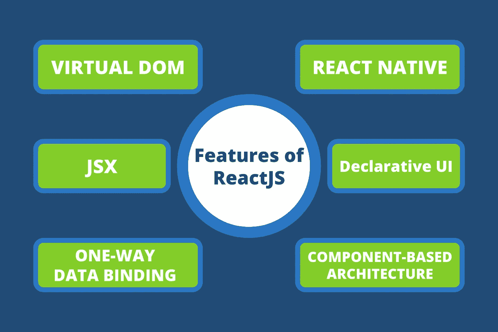

反应堆的特征

# 从头开始创建 React 项目..

我们可以使用`npx create-react-app <file-name>`命令轻松创建 react 项目，但是作为 react 开发人员，我们需要知道如何从头开始创建 react 项目。因此，让我们一步一步地看看如何从头开始创建 react 项目。

1.  首先你必须创建一个新的目录，并使用 cd 命令进入它

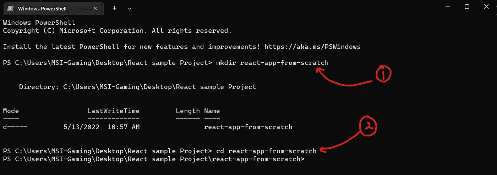

2.接下来，您必须使用`npm init -y`命令初始化 package.json 文件。

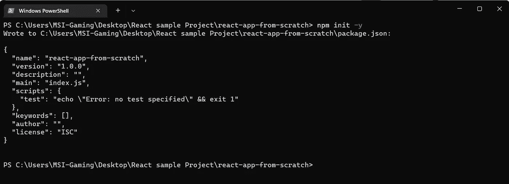

现在，如果您检查之前创建的目录，您可以看到 package.json 文件已创建。之后，您可以使用您喜欢的代码编辑器打开该目录。(Visual Studio 代码，WebStorm 等。)

3.接下来，您必须使用`npm install react react-dom — save` *命令安装 react，并使用* `npm install --save-dev parcel` *命令将包安装为开发依赖项。*

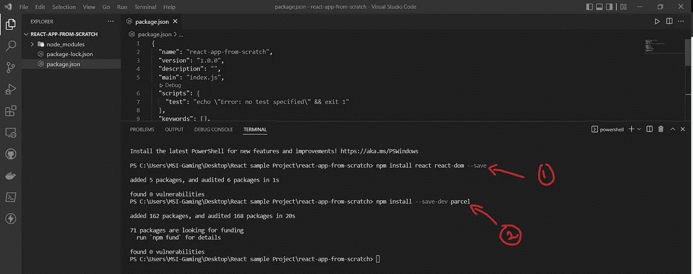

安装一些软件包

4.接下来，您必须创建如下的文件夹结构

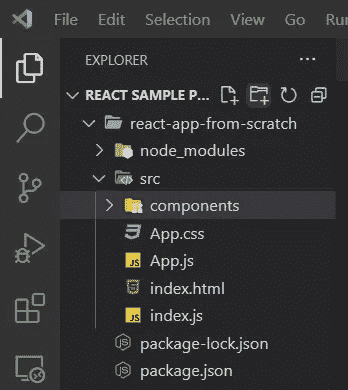

文件夹结构

5.接下来，配置 App.js、index.js、index.html，并将运行脚本添加到 package.json，如下所示

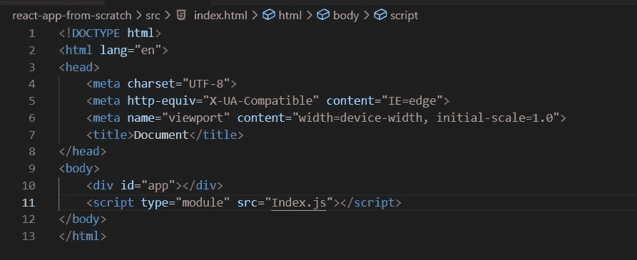

index.html

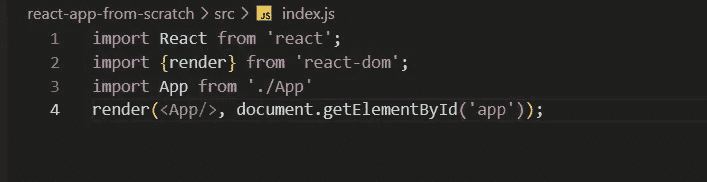

索引. js

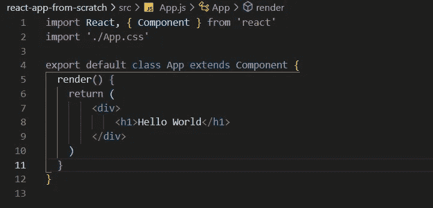

App.js

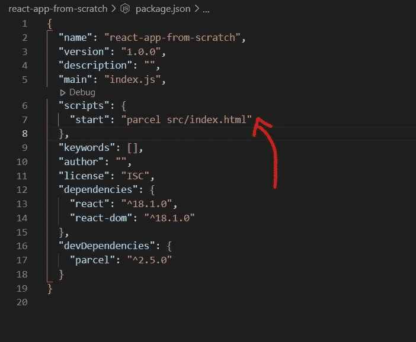

package.json

6.您的简单 react 项目现在已经成功创建。要将 react 应用程序投入使用，您需要启动终端并键入`npm start`命令。一旦我们的项目终端已经启动，它将显示服务器运行的网址；之后，我们可以使用该 URL 来确定我们的项目是否正在运行。如果我们的项目运行没有错误，我们可以在浏览器中看到“hello word”。

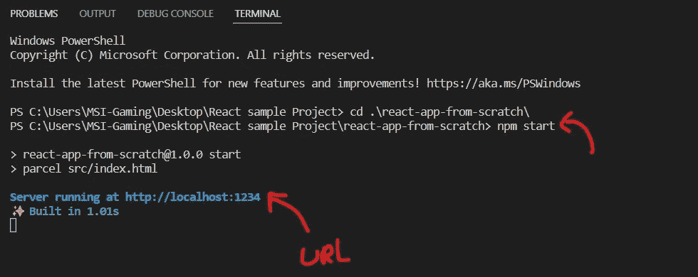

末端的

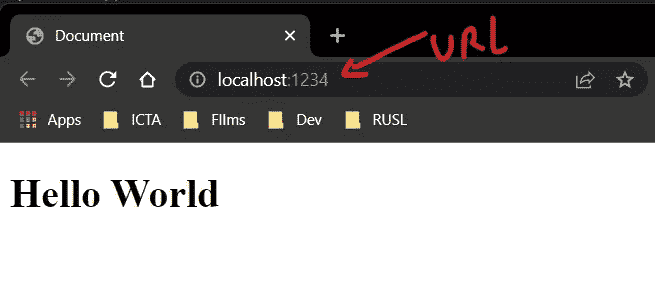

在浏览器中运行服务器 URL 后

> 您可以使用以下链接获得文件夹结构

*链接-*[*https://github . com/nim na-thiranjaya/simp la-react-app-fom-scratch . git*](https://github.com/nimna-thiranjaya/simpla-react-app-fom-scratch.git)

这是从头开始构建 react 项目所遵循的过程。使用`npm install react-router-dom`命令安装 React 路由器 Dom。安装后，您可以为不同的组件配置多个端点，并为您的 web 应用程序构建前端。

*本文中的所有内容都有详细介绍。我真的希望在这篇文章结束时，你能更好地理解 react 是什么以及我们为什么利用它，使用* `*npx create-react-app <file-name>*` *命令构建一个简单的 react 项目，并从头开始创建简单的 react 项目。我很高兴与您分享 react 是目前世界上使用最广泛的前端开发库！*