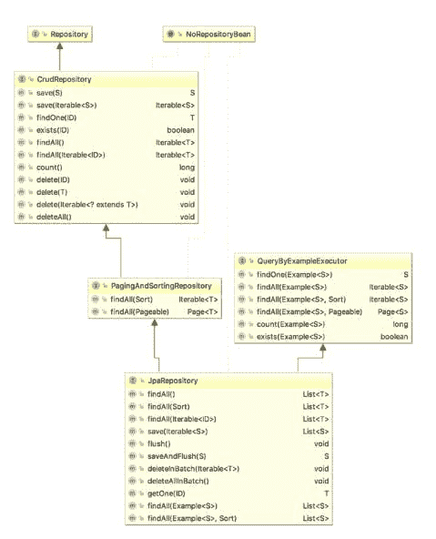

# 关于 Spring Data JPA 你需要知道的一切

> 原文：<https://blog.devgenius.io/everything-you-need-to-know-about-spring-data-jpa-e52bd8606ff9?source=collection_archive---------3----------------------->

在本文中，我涵盖了您需要了解的关于 Spring Data JPA 的所有内容，这样您就可以在您的 Spring Boot 应用程序中更自信地使用这个库。我已经看到了很多关于何时使用`CrudRepository`或`JpaRepository`的困惑，所以我也将涉及到这一点。

# 什么是 Spring Data JPA？

正如 Spring 的官方文档所说,“Spring Data JPA 使得实现基于 JPA 的存储库变得容易。它改进并简化了基于 JPA 的数据访问层的实现。总的来说，数据访问应用程序更容易实现。”

使用 Spring Data JPA，可以避免应用程序中大量 Java 持久 API (JPA)的样板代码。该库还使得从数据库中查询数据变得容易，减少了开发人员对 SQL 查询的大量实现。

作为开发人员，您只需编写包括任何自定义方法的存储库接口，Spring Data JPA 将自动提供大部分实现。

# 什么时候使用 Spring 数据 JPA？

什么时候使用 Spring 数据 JPA 实际上取决于你的用例。但是大多数 Spring 应用程序都需要数据对象。如果你有数据对象，你将需要一种方法来访问它们，使用它们进行交易。

如果您正在构建一个基于数据库的 web 应用程序，那么您将最终创建代表您的数据库实体的对象。当一个层访问这些对象或创建存储在数据库中的数据时，您将需要访问 API。你可以实现`repository`接口，它将提供基本的 CRUD 操作。程序员甚至不需要实现这些接口方法。

您还可以在这些存储库接口中添加自定义方法。

1.  在接口中创建新方法
2.  编写 JPQL 查询，并在查询开始处添加注释`@Query`。
3.  也可以编写 JPA 命名查询

Spring Data JPA 的其他一些主要特性是:

1.  域类的审计
2.  在批量加载、动态查询中很有用
3.  支持实体的 XML 映射

# Spring 数据 JPA 库的详细信息

在您的应用程序中，您可以轻松地包含依赖关系，如下所示:

```
implementation 'org.springframework.boot:spring-boot-starter-data-jpa'
```

现在，要启用 JPA 存储库，请向主应用程序类添加以下注释:

```
@EnableJpaRepositories(basePackages = "com.betterjavacode.modelmapperdemo")
```

现在，要为您的任何域对象添加存储库，您可以创建一个扩展`JpaRepository`或`CrudRepository`的接口。

这将如下所示:

```
@Repository
public interface OrderRepository extends JpaRepository<Order, Long>
{
    List findAllByCustomer (Customer customer);
}
```

正如您在上面看到的，我们添加了一个新的接口，它代表了一个域对象`Order`。我还添加了一个自定义方法`findAllByCustomer`。JPA 命名查询将负责这个方法的实现，以获取客户的所有订单。

# 配置

Spring Boot 将 Hibernate 配置为默认的 JPA 提供者。如果您想要定制这个配置或者改变默认的 JPA 提供者，您将不得不在您的 Spring 配置中创建一个`entityManagerFactory` bean。

```
@Configuration
@EnableTransactionManagement
@EnableJpaRepositories("com.betterjavacode.modelmapperdemo")
@PropertySource("classpath:application.properties")
public class DataConfig {

	private final String PROPERTY_DRIVER = "driver";
	private final String PROPERTY_URL = "url";
	private final String PROPERTY_USERNAME = "user";
	private final String PROPERTY_PASSWORD = "password";
	private final String PROPERTY_SHOW_SQL = "hibernate.show_sql";
	private final String PROPERTY_DIALECT = "hibernate.dialect";

	@Autowired
	Environment environment;

	@Bean
	LocalContainerEntityManagerFactoryBean entityManagerFactory() {
		LocalContainerEntityManagerFactoryBean lfb = new LocalContainerEntityManagerFactoryBean();
		lfb.setDataSource(dataSource());
		lfb.setPersistenceProviderClass(HibernatePersistence.class);
		lfb.setPackagesToScan("com.betterjavacode.modelmapperdemo");
		lfb.setJpaProperties(hibernateProps());
		return lfb;
	}

	@Bean
	DataSource dataSource() {
		DriverManagerDataSource ds = new DriverManagerDataSource();
		ds.setUrl(environment.getProperty(PROPERTY_URL));
		ds.setUsername(environment.getProperty(PROPERTY_USERNAME));
		ds.setPassword(environment.getProperty(PROPERTY_PASSWORD));
		ds.setDriverClassName(environment.getProperty(PROPERTY_DRIVER));
		return ds;
	}

	Properties hibernateProps() {
		Properties properties = new Properties();
		properties.setProperty(PROPERTY_DIALECT, environment.getProperty(PROPERTY_DIALECT));
		properties.setProperty(PROPERTY_SHOW_SQL, environment.getProperty(PROPERTY_SHOW_SQL));
		return properties;
	}

	@Bean
	JpaTransactionManager transactionManager() {
		JpaTransactionManager transactionManager = new JpaTransactionManager();
		transactionManager.setEntityManagerFactory(entityManagerFactory().getObject());
		return transactionManager;
	}
}
```

上面的代码显示了如果您计划定制默认休眠配置，如何添加配置。

*   `@EnableTransactionManagement` -启用应用程序中的事务，尤其是在创建或更新数据时。
*   `@PropertySource` -读取将在数据源 bean 中使用的应用程序属性。

如前所述，Spring Boot 使用 Hibernate 作为默认的持久性提供者。但是很少有像 OpenJPA 或 EclipseLink 这样的持久性提供者。

# CrudRepository 和 JpaRepository 的区别

我们之前讨论过创建扩展`JpaRepository`或`CrudRepository`的存储库接口。但是什么时候用哪个呢？在这一节中，我将阐明关于这些存储库接口的更多细节。

`CrudRepository`是基础接口。`JpaRepository`延伸`PagingAndSortingRepository`，T9 又延伸`CrudRepository`。



*   `CrudRepository` -这提供了 CRUD 功能。
*   `PagingAndSortingRepository` -为可排序和可分页的数据提供功能。
*   `JpaRepository` - JpaRepository 提供了 JPA 相关的函数来刷新持久性上下文以及批量删除数据。

简而言之，可以使用`JpaRepository`，因为它将包含`CrudRepository`和`PagingAndSortingRepository`中的所有其他方法。

# 结论

在这篇文章中，我展示了 Spring Data JPA 库的细节以及如何使用它。我还展示了配置细节和要使用的存储库接口。

*原载于 2021 年 4 月 11 日*[*https://betterjavacode.com*](https://betterjavacode.com/spring-boot/everything-you-need-to-know-about-spring-data-jpa)*。*