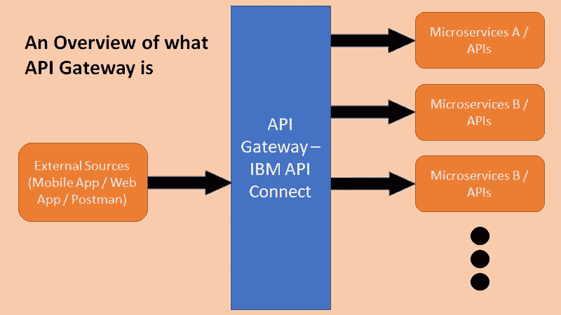
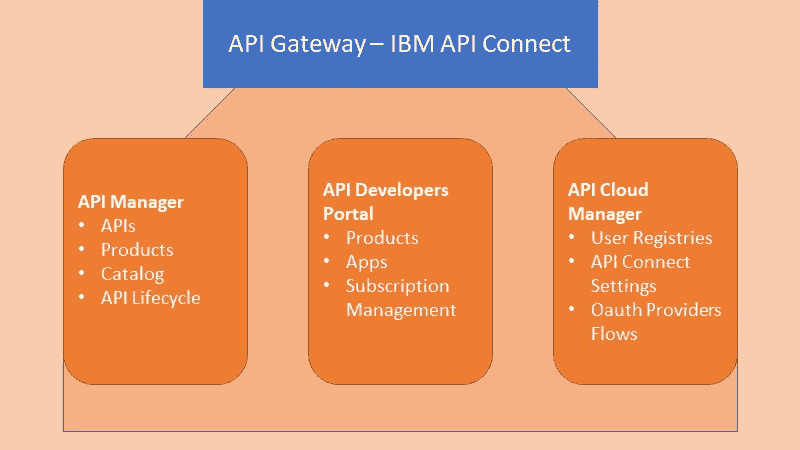
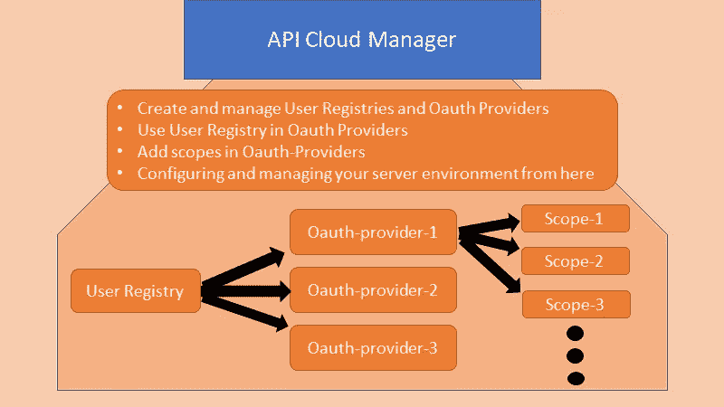
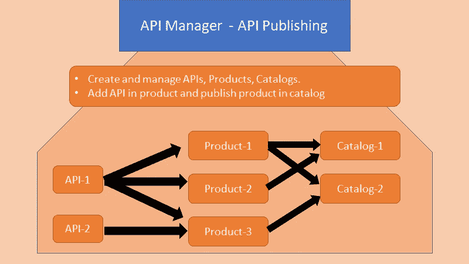
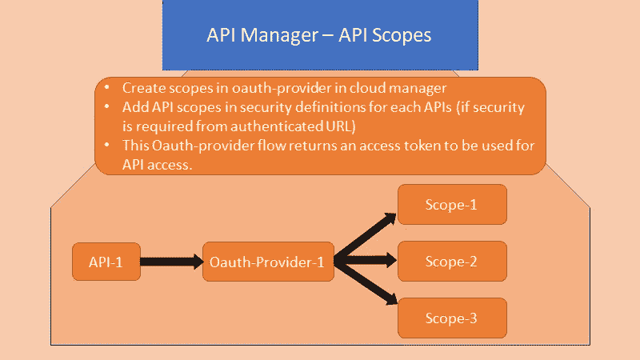
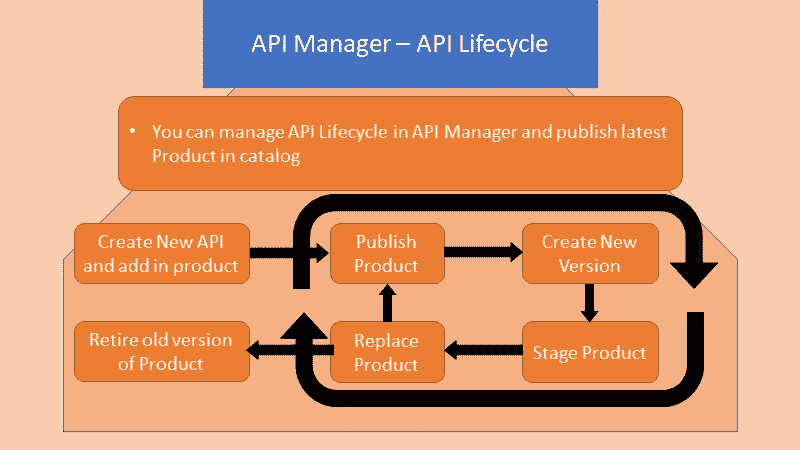
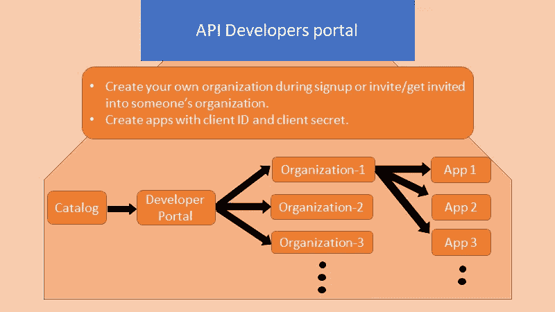
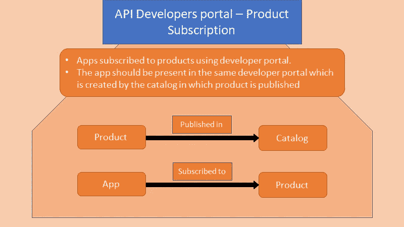
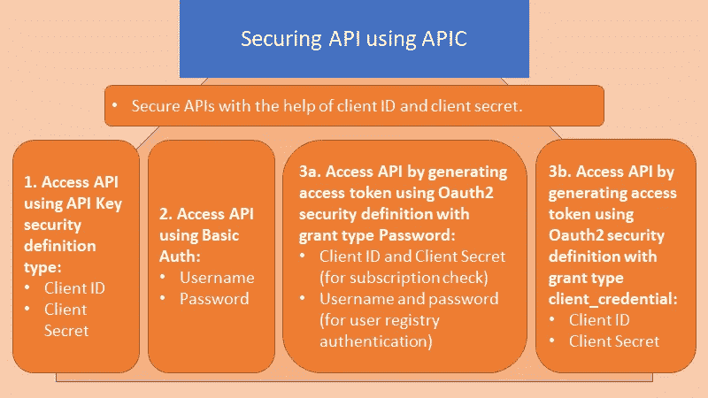

# 基本理解 IBM API Connect 需要知道的一切

> 原文：<https://blog.devgenius.io/everything-you-need-to-know-for-basic-understanding-of-ibm-api-connect-81cb66325fe2?source=collection_archive---------1----------------------->

我从事 IBM API Connect 已经有一段时间了。在这段时间里，随着在这个产品上获得的一些经验，我已经成为我的项目中任何 API 连接问题的焦点人物。API Connect 是我们项目的吸引中心，因为它将外部系统连接到内部系统。我在我的团队内部以及我的客户那里举办过几次关于 API connect 的知识传授会议，他们最终会从事这项工作。

我已经通过对 API Connect 的研究，通过不断尝试错误、失败、失败然后最终成功获得经验，学会了 API Connect 的大部分东西。在这篇文章中，我将解释 APIC 的基础知识，这将需要开始工作。

# APIC 概述:

API Connect 是嵌入了最新技术的最先进产品。它可以与 Cloud Pak 一起安装，用于在 Red Hat Open Shift 上集成，也称为 CP4I。下面的图 1 显示了 API 网关的主要概念及其使用方法。

图 API 网关概述

**另请阅读:**[IBM 如何帮助更快地在云上构建数据基础设施](https://medium.com/dev-genius/how-ibm-is-helping-build-data-infrastructure-on-cloud-faster-37997ce7b02e)

如上所示，API gateway 是调用微服务 API 的所有外部调用的入口点。API gateway 的主要概念是保护微服务，同时允许访问外部世界以利用底层数据或服务。API 网关管理传入流量，还可以通过将流量转移到相关服务来提供负载平衡。

**也可以阅读:** [为什么所有的开发者都应该学习和理解 REST/SOAP 服务](https://medium.com/dev-genius/why-all-the-developers-should-learn-and-understand-rest-soap-services-377c13388b5b)

# 简介:

在这篇文章中，我将解释 IBM APIC 公司的工作。

**关键词:** API，产品，应用，目录，订阅，发布，OAuth 提供商。

图 2: API 连接概述

API Connect 平台本身由三个管理门户组成。

1.  API 云管理器门户
2.  API 管理器门户
3.  API 开发者门户

您可以认为这些门户是为特定角色定义的。API 云管理器是为 APIC 的管理，API 管理器门户是为 API 的开发和 API 开发者门户是为将使用 API 的外部开发人员。在图 2 中，我已经解释了这些门户提供了什么。

# **API 云管理器:**

API 云管理器类似于 API 网关的管理器。这是您定义 OAuth 提供者流、用户注册详细信息、认证服务详细信息和拓扑的地方。这是您配置或查看 API 网关环境设置的地方。

在这里，您还定义了整个应用程序的范围。范围可以是移动应用程序、web 应用程序或桌面应用程序，也可以是管理门户的开发人员或管理员。

API Cloud Manager 门户的访问权限通常授予 API 网关的管理员。

图三。API 云管理器概述

上图显示了云管理器中不同组件之间的关系。首先创建用户注册中心或者到认证服务的链接，然后创建 OAuth 提供者。多个 OAuth 提供者可以使用同一个本地用户注册中心/认证 URL 服务。对于每个 OAuth 提供者，可以定义多个作用域。

# **API 管理器门户:**

API 管理器门户是您创建或管理 API 本身、其产品以及产品发布目录的地方。这是您管理 API 及其产品的生命周期的地方。下面提到的是实体和 API 管理器门户之间的关系:

1.  一个产品由一个或多个 API 组成。
2.  API 可以添加到一个或多个产品中。
3.  产品在一个或多个目录中发布。
4.  目录可以有一个或多个产品。
5.  要在目录中发布产品，您必须添加所有添加到目录中的设置，例如产品中存在的 API 正在使用的 OAuth 提供者。

图 4。API 管理器— API 发布

6.您可以为单个 API 添加多个作用域，该作用域应该在所选的 OAuth 提供者中提及，如图 3 所示。

7.一个 API 在给定时间只能映射到一个 OAuth 提供者。

图五。API 范围映射

**API 生命周期:**API GW 的主要特性之一就是管理 API 产品的生命周期。产品生命周期在我博客上的一篇早期文章的[中有解释。API Connect 允许创建、版本化、暂存、发布和停用产品。图 6 显示了产品生命周期在 APIC 是如何运作的。](https://medium.com/dev-genius/what-is-killedbygoogle-com-and-why-is-it-so-cool-d98e2c861f6b)

阅读更多:[产品生命周期解释](https://medium.com/dev-genius/what-is-killedbygoogle-com-and-why-is-it-so-cool-d98e2c861f6b)

图六。API 产品生命周期解释

当我们创建 API 时，为了发布它，我们必须将它添加到产品中，并在目录中部署该产品。产品的生命周期如上图。它首先被创建和发布，当我们对我们的产品进行更改或向相同的产品添加新的 API 时，我们制作它的新版本，登台产品并替换已发布的产品，然后发布新版本。旧版本会自动退役。

**API 的类型:**当我说我们创建 API 时，我的意思是我们可以调用后端微服务 API，或者我们可以创建自己的 API 来返回我们定制的代码。

# **API 开发者门户:**

需要讨论的第三个门户是 API 开发者门户。让我们回忆一下，我们讨论过产品是在目录中发布的。当我们从 API Manager 创建一个目录时，我们同时创建了一个开发者门户。一个开发者门户只属于一个目录。

开发人员门户的范围是我们必须向其公开我们的服务的人。这些开发人员可以创建他们自己的组织或空间，他们可以添加他们的同事在共享空间工作，他们可以创建共享的应用程序，并订阅在同一目录上展示的产品。

Developer's portal 通过向外界公开我们的 API 并允许他们通过订阅来使用它，从而将我们的 API 货币化。

图 7: API 开发者门户概述

**摘要:**产品发布到目录中。每个目录创建一个 API 开发者门户。应用程序在开发者门户中创建，然后订阅发布的应用程序。

# 保护 API:

保持 API 的安全性是 API gateway 最重要的特性之一。在 APIC，可以用三个基本选项定义安全性。

1.  第一种是通过 apiKey，如 client_id 和 client_secret。这些是在从开发者门户创建应用程序时创建的。您需要为产品订阅一个应用程序，并传递其凭据以访问 API。当我们访问 API 时，它在 API 网关级别检查订阅并验证凭证。
2.  定义安全性的第二种方法是使用基本身份验证方法。这需要运行身份验证服务，该服务将对用户进行身份验证，以允许用户访问 API。如上所述，到认证服务的链接是在云管理器中设置的。
3.  第三种方法是使用 OAuth2 安全定义，其中包括使用我们在上面的云管理器中创建的 OAuth 提供者。你可以阅读更多关于 OAuth 是什么的内容，你可以[在这里阅读](https://www.csoonline.com/article/3216404/what-is-oauth-how-the-open-authorization-framework-works.html)。
4.  第四种方法是保持 API 的开放性和不安全性，这样任何人都可以不经认证就来使用它。(不推荐)

在 OAuth2 安全定义中，有两种方法可以实现这一点。API Connect 上总共有 5 种授权类型。您可以使用两种主要授权类型:

1.  **授权类型:密码:-** 通过使用密码授权类型，有两种基本的认证发生。一个是在网关级别，另一个是在认证服务级别。要访问 API，您必须通过这两个身份验证来访问令牌。因此，您必须设置四个重要参数来获得访问令牌，即 client_id、client_secret、用户名和密码。
2.  **授权类型:Client_credential:-** 此授权类型用于访客用户访问。使用这种授权类型，您只需要在网关级别进行身份验证，就可以获得访问 API 的访问令牌。网关检查给定的 client_id 是否正确，以及应用程序是否订阅了 API 产品。
3.  其他三种授权类型是隐式、访问代码和资源所有者— JWT。(我没有使用过这些授权类型，所以我不会详细讨论它们)。

对于这两种授权类型，如果给定的凭证是正确的，就可以获得访问令牌。该访问令牌最终用于访问 API。

# 结论:

在本文中，我提到了 IBM API Connect 的基本工作原理。现在下一步要做的是在 IBM Cloud 上安装您自己版本的 IBM API Connect 并开始使用。

快乐阅读！！

快乐学习！！