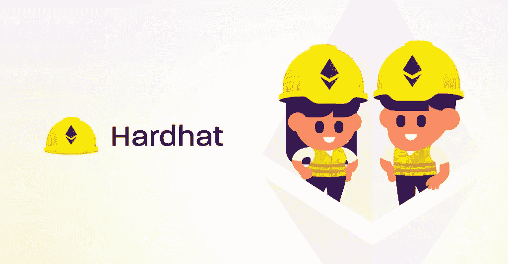

# EVM 区块链开发教程 Pt1:什么是 Hardhat？如何创建一个安全帽项目？

> 原文：<https://blog.devgenius.io/evm-blockchain-development-tutorial-pt1-what-is-hardhat-how-to-create-a-hardhat-project-c08176af0e3e?source=collection_archive---------5----------------------->

EVM 兼容的区块链开发上最流行和最现代的平台之一。

## 什么是安全帽？

Hardhat 是最流行的兼容 EVM 的区块链开发框架之一。虽然有各种各样的框架，如 Truffle、Remix IDE 和 Scaffold ETH，但它仍然比其他框架使用得更频繁。它很容易下载并被大多数其他区块链开发者使用，而且它是一个新的框架。

## **安全帽为什么会流行起来？**

Hardhat 因其简单的集成、灵活的基础设施、方便的使用以及在部署时创建 JavaScript 或 TypeScript 项目的能力而广受欢迎。

## **安全帽有哪些组成部分？**

**安全帽网络**

Hardhat network 是一个用于开发的本地以太坊节点。它为您提供了一个运行测试、调试代码和部署本地机器契约的环境。可以专门编译，外部客户端可以通过 npx hardhat 节点连接。例如，如果您想要显式运行，您可以运行 npx hard hat run–network hard hat scripts/my _ script . js。

**安全帽赛跑运动员**

众所周知，当开发人员与 Hardhat 交互时，Hardhat runner 是主要组件。其灵活的基础设施和可扩展的任务运行器帮助开发人员管理和自动化智能合约开发。

**用于 VS 代码的安全帽**

VS 代码支持一系列扩展的稳固性。下载 Hardhat 后，您可以添加 Hardhat 支持，它永远不会产生可靠性版本问题，使您的开发过程保持最新。它有一系列用于开发和测试的助手，使区块链上的应用程序开发变得容易。

## **如何安装 Hardhat？**

要安装 Hardhat，你需要 NPM(节点包管理器)。你可以在这里下载 NodeJS 和 NPM [。下载 nodeJS 和 NPM 后，可以用 ***node-v*** 和 ***npm-v*** 查看其最新版本。如果您的平台没有任何可用的软件，您可以查看](https://nodejs.org/en/)[其他下载](https://nodejs.org/en/download/)来找到适合您电脑的兼容版本。

下载完 nodeJS 和 NPM 后，需要打开终端，写命令，***NPM install–save dev hard hat***。下载后，您需要运行 npx hardhat，您会看到各种选项，询问您是否要退出、创建 JavaScript 项目、TypeScript 项目或空的 hardhat.config.js。一旦您选择了首选，hardhat 将相应地继续您的选择。一旦你下载了 hardhat，强烈建议你通过***NPM install–save-dev @ nomicfoundation/hard hat-toolbox***安装 nomic foundation 工具箱，安装完成后你就可以开始工作了。

## **安装 VS 代码**

在开发基于 EVM 的应用程序时，通常使用 VS 代码。要安装 VS 代码，你需要去它的网站，然后根据你的操作系统安装 VS 代码。安装完 VS 代码后，需要设置一个开发环境，允许在 VS 代码上安装 Hardhat。然后，添加 Solidity 调试器、Solidity Visual Developer、solidity-solhint、Solidity Extended，根据你的操作系统(从 solidity-windows、solidity-mac、solidity-Linux)、MythX、Tarantula 中选择 Solidity。

## **如何创建安全帽项目？**

现在，在我们完成了开发所需的所有步骤之后，您需要通过您的终端创建一个 hardhat 项目。打开终端后，您需要编写 ***mkdir*** 命令，并编写您的 ***项目名称(例如 mkdir-MyToken)*** 并用 ***cd MyToken*** 打开，或者您可以为您的项目命名不同的名称。

你觉得安全帽怎么样？你用过安全帽吗？在下面的评论区分享你的想法和经历。