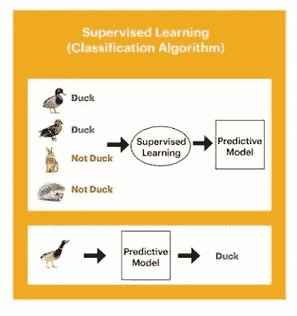
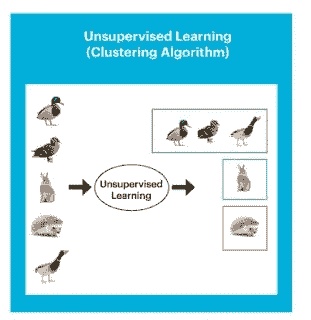

# 机器学习的发展及其再强化

> 原文：<https://blog.devgenius.io/evolution-of-machine-learning-and-its-re-enforcements-ff011a6e6c9c?source=collection_archive---------11----------------------->

**AI 是一段人造智能**

机器学习(ML)的目标是理解信息的结构，并将信息放入个人可以感知和使用的模型中。在基本注册中，计算是 PC 用来计算或解决问题的定制指导原则集。[沿着这些思路，人工智能鼓励个人计算机从示例信息中建立模型，以根据获得的信息输入来机械化动态循环。](https://prisma.ai/)

**组装技术**

面部识别创新允许在线媒体平台帮助客户分享他们伴侣的照片，并给他们贴上标签。 [**光学字符识别**](https://prisma.ai/products.html) 创新将图片上的文字变成移动排序。由 AI 控制的 Proposal motors 根据客户的喜好推荐接下来要看的电影或电视节目。依靠人工智能**探索的自动驾驶汽车可能很快就会被买家买走。**

# **机器学习方法**

****监督学习****

**PC 被给予标有理想产量的模型信息源。这种技术背后的动机是让计算可以选择通过对比其实际产量和“指示”产量来“学习”，以发现错误，并根据需要改变模型。沿着这些思路的管理适应利用例子来预测对额外的未标记信息的标记尊重。**

****

****型号****

**1.带标签的动物照片可以用作信息信息来订购不带标签的动物照片。**

**2 .一种计算可能会考虑带有标记为鱼的鲨鱼图片和命名为水的海洋图片的信息。**

**3.它可以利用记录的证券交易数据来预测即将到来的不确定性，或者被用来筛选垃圾邮件。**

****无监督学习****

**在无监督学习中，信息是未标记的，因此学习计算被留下来发现其信息中的共享特征。由于未标记的信息比标记的信息更丰富，鼓励独立学习的人工智能技术尤为重要。在没有被告知一个“正确”答案的情况下，单独学习技术可以看一眼复杂的信息，这些信息更广泛，而且显然是不重要的，以可以想象的重要方式整理出来。**

****

****型号****

**1.异常位置，包括欺骗性签证/万事达卡购买**

**2.未标记的动物照片可以用作计算的信息，以发现相似之处并将动物照片排列在一起。**

**3.与怀孕和婴儿用品相关的营销努力可以集中于特定人群，以扩大他们的购买数量。**

## **机器学习算法准确预测新冠肺炎风险**

**约翰霍普金斯药物治疗专家(Johns 美国马里兰州巴尔的摩)已经建立了高级人工智能框架，该框架可以精确预测患者与冠状病毒的会话将如何进行，并以有效合理的结构将其发现传回给临床医生。这种新的预后工具被称为严重的**适应性风险预测器(SCARP)，可以帮助描述因冠状病毒住院的患者一天和七天的危险，这些冠状病毒正在形成一种更极端的疾病类型或正在传播。****

****SCARP 旨在为临床医生提供一种直观、多功能的先见之明设备，使连续的临床因素能够在患者床边输入。****

****通过生成定制的临床预测，即在接下来的一天和一周内，以及在住院治疗的最初 14 天内的任何时间产生极度不适或死亡，SCARP 将使临床小组能够就如何最好地治疗每一位新冠肺炎患者做出更明智的选择。对患者在接下来的 24 小时和一周内发展为严重疾病或死亡的持续危险有一个强有力的处理，可以帮助医疗保健供应商为他们的新冠肺炎患者做出更明智的决定和治疗选择，因为他们的病情随着时间的推移而加重。****