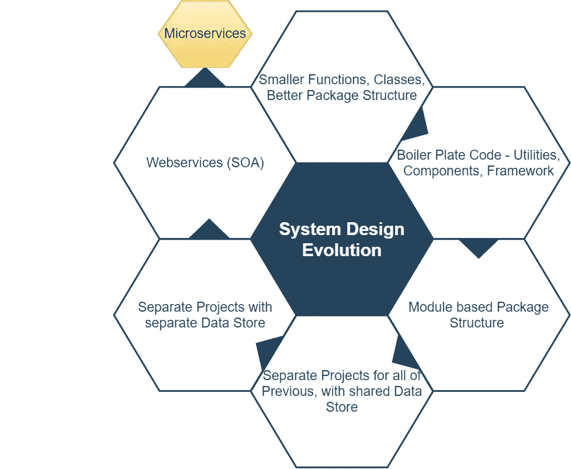
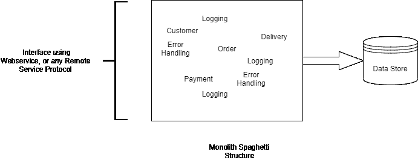
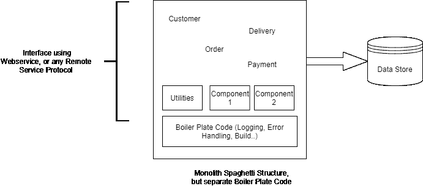
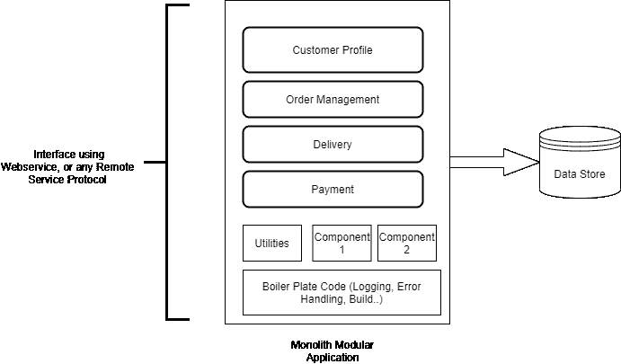
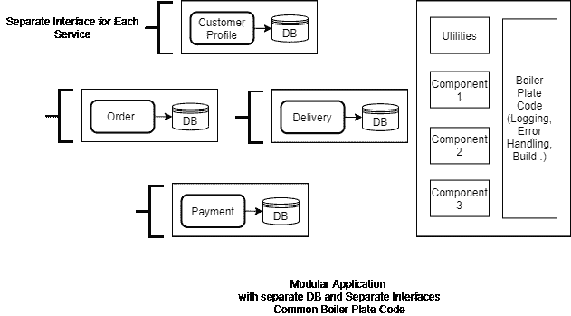
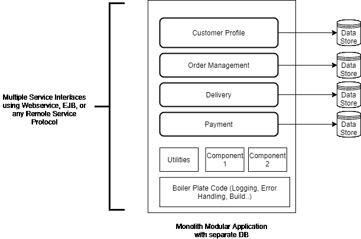
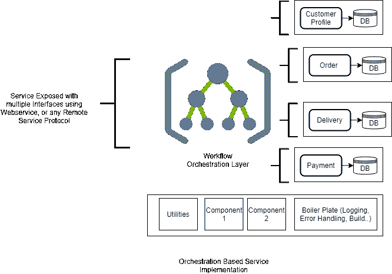

# 系统设计的演变，从微功能到微服务

> 原文：<https://blog.devgenius.io/evolution-of-system-design-from-micro-functions-to-micro-services-53cdf8e276ac?source=collection_archive---------0----------------------->

自从我开始我的软件开发生涯以来，我经历了各种各样的设计原则和模式。然而，有一个原则非常突出，以至于许多新的开发方法、设计模式，甚至团队结构都是遵循这个原则发展而来的。

这就是“单一责任原则”又称 SRP。为什么不呢，SRP 通过正确的代码结构、更好的可读性和可维护性、更好的发布管理，以及最重要的团队责任和敏捷性，为更多的创新和有效的软件开发提供了可能性。

**参考* [*此处*](https://matrixexplorer.medium.com/key-principles-of-software-architecture-3a500f177f93) *阅读更多关于 SPR 和其他关键架构原则的内容。这个原则是关于一个代码单元拥有一个责任。*

“代码单元”是基于谁是消费者的上下文。因此，应用程序、模块、包、类、函数都可以被称为一个代码单元，这取决于“谁是客户”。

无论单元是什么，设计的发展和努力总是为了实现更模块化的实现，从而支持更好的可维护性和可伸缩性的系统。

另一个重要的方面是支持独立开发，这可以鼓励团队中的责任感和敏捷性。

我们开发了许多产品，从基本的整体式应用开始，到管理良好的大型模块化整体式应用，再到非常分散的应用。

这里是系统设计的进化之旅，整理了过去二十年的经验。

旅程中的关键收获是对基础知识的理解，系统设计如何有机地发展以应对各种挑战，动机以及学习。

# 系统评估:较小的尺寸，清晰的意图

旅程从整体应用程序设计开始。

虽然独石，需要高质量的代码(*参考* [*干净的代码*](https://medium.com/dev-genius/art-of-clean-code-b921142a05e9) )和干净的结构始终完好无损。

因此，在旅程中，首要的焦点是定义更小的代码结构(函数和类)，目的很明确。这有助于使代码易于阅读和维护，并为重用提供了**可能性。**

我记得曾多次讨论过方法和类的大小，正确的代码行数。最终，我明白了

> 小尺寸不在于行数，而更在于任何有逻辑的头脑一眼就能领会的意图。

## 学问

*   保持尺寸“小于小”是非常有用的。它有助于使代码和意图变得清晰，并为重用提供了可能性。点击此处阅读更多' [*艺术的干净代码*](https://medium.com/dev-genius/art-of-clean-code-b921142a05e9)
*   对于代码行来说，没有单一的最佳数量。它应该基于“代码单元”的意图。当我们从代码中看到另一个清晰的意图时，我们应该把它分开。
*   不要为了使代码变小而破坏代码。这可能会破坏结构，创建更多的类或接口，盲目地遵循 size 参数。正确的方法是寻找独立的可定义的意图。

# 系统评估:在正确的包中构建代码

另一个结构上的改进是通过采用正确的包结构(和命名约定)来驱动的，这可以传达意图。

这似乎是一个显而易见的选择，但是许多 monolith 应用程序经过多年发展成为高度交叉引用的结构，代码库的形状不比意大利面条好多少。

我记得各种各样的 monolith 和 mammoth 项目，我们接受挑战，以正确的(包)结构重构遗留代码。这是一项比听起来乏味得多的工作。

由于这些项目已经发展了很多年，大部分代码都是交叉引用的，没有明确的模块或层的界限。进行一次代码更改要么需要多年的系统经验，要么需要一些魔法棒。

整块意大利面结构

## **学习**

*   正确的结构有助于通过定义任何一段代码的位置来产生更清晰的代码。
*   它有助于加强对模块和层边界的尊重，甚至鼓励使用正确的接口和交互协议，如果早期定义的话。
*   一开始就定义一个有效的结构。它对整个系统质量有巨大的价值。
*   重构是开发人员的生活方式，但是正确结构的早期定义可能会对代码质量和结构产生重大影响。因此，这是一个重要的架构考虑因素。

在正确的包中构建的代码首先有助于提高开发人员的效率，随后是对部署的更多改进，等等。，我们将在接下来的段落中讨论。

# 系统评估:可重用组件和实用程序

下一个评估是在可重用组件和实用程序中构建代码。它有助于将可重用的代码放在一个地方，以便于重用和减少返工(*)。*

## ***实用程序类别***

*一组提供常用实现的通用可重用函数。*

*可重用，无状态，只有行为没有数据。可重用性的最简单形式。*

## ***组件***

*可重用实现的下一级分组，但是可以维护状态和行为。*

*因此，任何人都可以通过使用主组件接口来使用功能，这隐藏了所有的复杂性。*

*组件和实用工具在以更好的可读性和可维护性的形式组织代码方面帮助很大。这也减少了返工。有了更清晰的边界，它也为自治团队 *的端到端所有权播种了方向。**

**

# ***系统评估:独立项目中的代码结构***

*到目前为止已经有了很多改进，但是有一个挑战仍然没有改变，那就是基于业务特性/关注点的代码分离(让我们称之为模块)。*

*实用程序/组件有助于将可重用的样板代码分离出来，然而，业务特性的实现仍然留给包来构建。*

*我记得当我们一个产品的代码库变得如此庞大，以至于几乎不可能管理它。由于构建时间、二进制文件大小等明显的挑战，将整个代码库打包在一个 Jar/War 中会导致问题。没有多年的经验，寻找正确的代码位置是一件痛苦的事情。*

*我们通过基于包结构实现定制构建来捆绑模块代码，从而解决了这个问题。这是可行的，但这是一项繁琐而复杂的工作。结构或包的任何变化都可能破坏整个构建。*

*更好的解决方案是将所有实用程序、组件和模块的代码库分成单独的项目。代码仍然与运行时依赖相耦合。然而，它有助于建立一个更好的发展结构。*

**

## *学问*

*   *关注点的分离与物理资产的分离一起工作得更好。*
*   *人类的大脑理解环境的能力有限。将它分解成独立的物理结构也有助于更好地理解。*

# *系统评估:具有单独模式的独立可部署项目*

*紧密耦合的挑战仍然存在。*

*我们仍然需要将整个系统作为一个单元来构建和部署。这意味着整个系统需要测试，随着数据库的变化一起部署。这意味着任何微小的改变，在投入生产之前都需要大量的验证工作。*

*交叉依赖的主要障碍是数据库。因此，下一步是将数据库和代码库分离到不同的项目中。*

*我们为每个模块定义了单独的模式。任何数据或操作的跨模块交互都是通过接口严格定义的(EJB，Spring，...).*

*我们还定义了模块的依赖层次结构(如网络层),以避免交叉依赖循环，并引入模块来访问所有其他模块使用的公共数据。*

**

*有了上面的分离，就有可能分别构建和部署模块。它对实现独立开发、部署和发布能力帮助很大。*

> *独立有代价。*

*由于分布式系统的挑战，我们很快就达到了这个目标。*

*   ***性能:**当我们在不同的模块中移动时，通过远程接口、servlet 或基于 XML 的协议的多个跨模块交互会导致性能问题。*
*   ***分布式事务管理:**跨模块事务管理是另一个挑战，可以通过分布式事务或最终一致性模式来解决。两者都不是可行或容易的选择。*
*   ***故障管理:**当一个服务稍后异步响应故障，并且原始调用者需要管理整个回滚以净化状态时，故障管理领域面临更多的挑战。解决方案是保留状态和跨服务回滚的逻辑*
*   ***报告或交叉引用数据用例:**需要来自多个服务的数据的报告或任何查询对性能影响很大。解决方案是要么取消结构的规范化，要么让报告数据中的所有数据都可以复制。*

*所有这些解决方案都是可行的，但都有自己的成本，因此需要权衡成本和收益。*

*一个简单的解决方法是在 EJB 技术堆栈中使用本地接口或在 Java 世界中通过引用调用，这意味着打破单独部署的界限，远程交互协议如 SOAP、RMI 和跨模块通信作为本地引用(而不是远程服务)。*

**

*该解决方案有助于管理上述前三个挑战，同时保持独立的项目结构。*

*用于报告等的大量交叉引用数据的挑战。通过在这里反规范化数据模式和复制所需数据解决了这个问题。*

## *学问*

*   *过度去规范化可能代价高昂。它需要适当的设计来应对分布式系统的挑战。*
*   *如果不完美能让生活变得轻松，那也没什么。至少，只要我们没有正确的解决方案来管理(分布式系统的)完美性。*

# *系统评估:模块化整体运作良好*

*被遗漏的关键用例是独立部署、可伸缩性以及如何做到技术不可知。*

*可伸缩性仍然与整个应用程序联系在一起，使用直接引用是相互依赖的。*

*技术独立也是不可能的，因为整个系统紧密地基于一个技术生态系统。*

*然而，这些对我们来说并不是迫在眉睫的挑战，因为整个产品计划在同一技术堆栈上，并且可以通过在多个节点上一起部署耦合的模块来实现所需的可伸缩性级别。*

*有了合适的模块结构，效果很好。它在许多产品实现中运行良好。*

## *学问*

*   *模块化整体可以很好地管理许多用例。*
*   *主动导轨到位，确保模块化结构的完整性，以及发布和部署的既定流程。*

# *系统评估:分布式服务模型*

*到目前为止一切顺利。然而，谁不想要更多呢？*

*因此，我们探索了分布式服务模型。十年前，我们使用安讯士、UDDI、WSDL 和 SOAP，使用 SOA/web 服务栈实现了服务。*

*但是由于已知的分布式系统的挑战，我们将它限制在不需要跨模块数据的独立服务上。或者当需要向外界公开应用程序接口时。*

*管理分布式服务模型的缺陷仍然是一个挑战。总之，在缺少分布式事务的情况下管理故障场景是很棘手的。*

*它需要每个服务保留回滚状态，等待另一个服务交互完成，并在任何失败的情况下回滚。将所有这些逻辑保留在服务中会使服务和实际业务流变得混乱。*

*我们通过使用工作流系统作为业务流程的编排器，通过开发具有独立部署和注册的独立服务等，进行了进一步的试验。*

*服务间通信的责任交给了工作流，工作流管理跨服务交互的所有逻辑/复杂性、回退逻辑、最终数据一致性、服务流日志等公共服务。*

*这是一个有趣的解决方案，因为分布式服务模型世界的所有复杂性都包含在核心服务业务逻辑之外的工作流中。*

**

*然而，它运行得很好，但有许多复杂性。例如，调试是一件痛苦的事情。开发人员必须在系统方面受过很好的训练，并且有很高的技能来维护和理解这个高度分布式的系统。*

## *学问*

*   *使用新技术和设计模式是有吸引力的。很容易为这些所迷惑。*
*   *然而，它不应该以使系统维护变得复杂为代价，从而给团队和产品都带来痛苦。*
*   *重要的是稳定产品，增加团队对系统的理解，然后选择更复杂的设计。*

# *适用于许多情况的可行解决方案*

*在评估了所有模型及其优缺点后，我们在大多数用例中使用了整体模块化结构，有时也使用混合模式。它很好地满足了高度模块化和优雅的解决方案的标准，同时避免了分布式服务模型的缺陷。*

*这不是一个完美的(微服务类)解决方案。然而，通过混合可重用组件和各种面向服务的构造，它有助于在更大程度上平衡模块化、性能和独立开发，同时满足多年前期望的用例。*

*只有当用例需要时，我们才使用 orchestrator 类型的高度分布式模式。例如，在动态系统的情况下，任何新的服务都可以动态地添加到系统中。在这里，编排层(工作流)包含了分布式服务交互的所有复杂性。*

# *摘要*

*这个旅程主要是为了拥有一个系统，它可以支持独立的开发和部署，更好的可伸缩性，更好的可维护代码，同时为团队中端到端的所有权和责任播种方向。*

*以下是这一旅程的主要标志:*

*   *较小的函数，具有良好命名约定的类*
*   *更好的包清晰地定义层*
*   *作为实用程序、组件、框架的可重用样板代码*
*   *使用正确的包结构和命名来分离模块*
*   *模块的独立项目，以帮助开发人员在一个重点领域工作*
*   *跨项目分离，包括数据库，促进独立开发和部署*
*   *最后是完全独立的服务(网络服务、EJB 或其他)..)*

*在任何时代，使用任何底层技术都有可能实现良好的系统设计。我们在上述旅程中体验和试验了不同的技术，如 EJB、Spring、Webservices 等等。然而，技术肯定有助于可重用语言结构和框架的可用性。*

*最后，我们达成了一个非常重要的'**独立原则**'，在这整个旅程中我们都能感受到。一次旅行:*

*   *独立的代码库，拥有自己的行为。*
*   *拥有独立的数据库，拥有自己的状态*
*   *独立的技术堆栈，可以独立发展*
*   *独立包装和运输，独立构建和部署*
*   *为了支持独立的可伸缩性*
*   *独立所有权，促进端到端的责任和自主团队结构(敏捷性)*

*顺便说一句，没有这样的“独立原则”:)。然而，仍然*

> *获得独立性是系统设计的关键驱动力，因为每个部分都可以以自己的方式繁荣发展(类似于现实生活，人性)。*

*关键是，这是许多产品和团队进化的结果。*

*原则和需求由来已久，希望实现更好的可维护代码、可重用性、可伸缩性，以及更负责任和高效的团队结构，同时促进执行的独立性。*

*随着技术、模式和工具套件的进步，支持这些需求变得更加有效。微服务模式就是一个很好的补充，它*不是每个挑战的灵丹妙药*，但是提供了一个很好的定义好的模式和技术栈。*

*我们将在下一篇文章中讨论微服务。*

**如果你有什么建议，随时联系我****Linkedin****:*[*Mohit Gupta*](https://www.linkedin.com/in/mohitkgupta/)*