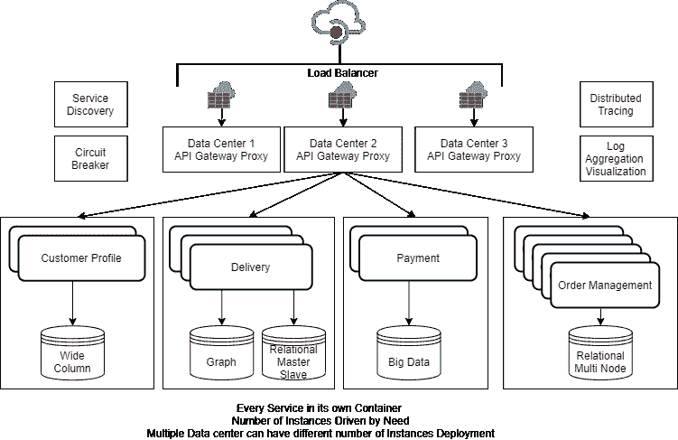

# 系统设计的发展——微服务的优势

> 原文：<https://blog.devgenius.io/evolution-of-system-design-microservices-benefits-6d0b2233f686?source=collection_archive---------1----------------------->

## 微服务对于更好和更有效的解决方案有很多好处，此外，它对于更好的组织结构也有很大好处。

在 [Unsplash](https://unsplash.com?utm_source=medium&utm_medium=referral) 上[扣球](https://unsplash.com/@spikeball?utm_source=medium&utm_medium=referral)拍摄的照片

[在之前的文章](https://medium.com/dev-genius/evolution-of-system-design-from-micro-functions-to-micro-services-53cdf8e276ac)中，我们讨论了系统设计评估的旅程，从高度耦合的整体到模块化的整体，再到高度分布式的应用，以及 orchestrator(工作流)驱动的集成模型的可能性。

我们还讨论了系统设计的各种目标和驱动力[这里](https://matrixexplorer.medium.com/evolution-of-system-design-web-services-to-microservices-9d660506c93f)把我们带到了微服务模式。

在本文中，我们将深入探讨微服务的优势，以及这些优势如何与系统设计发展的目标保持一致。

让我们来谈谈微服务架构模式的关键原则。

# **可独立释放**

服务应该可以独立发布。这意味着:

*   它应该包含所有的逻辑和数据。
*   内部实现的任何变化都不应该要求其他服务的变化，反之亦然。
*   接口的改变应该是向后兼容的，这样客户就可以在不破坏系统的情况下计划升级。
*   部署管道应该能够将服务的变更带到生产环境(到客户端)，而不依赖于其他服务的部署。

*一旦有活动的客户端使用该服务，您就不会希望突然的更改或在您进行更改时强迫它们进行更改来破坏它们的系统。然而，这是可以计划的。这就是需要保持变更向后兼容的地方。例如，保持旧的操作不变，但加入新的味道，并要求客户逐渐转向这一点。*

这一原则给我们设计界面、构建代码(以及团队)和部署模型的方式带来了重大变化。

一旦我们开始独立发布微服务，就给团队的设计思维过程带来了很大的转变。

## **好处:**

*   它要求通过遵循封装原则来仔细考虑接口的定义，并鼓励团队提前思考以避免频繁的更改。当我们在不影响客户的情况下，基于对可独立发布的服务的理解发布合同时，它会自动将责任设置为不破坏客户系统或推动客户做出突然的改变。
*   它需要定义良好的部署管道，可以独立地将服务变更推向生产，而不需要召集多个团队并消耗每个人的时间。这也意味着使系统设计简单，没有复杂的交叉依赖。
*   只有拥有强大的验证测试套件，独立部署才有可能。否则，部署将总是需要来自客户端的任何影响的验证，这不符合独立发布原则。因此，它移动团队来保持测试用例套件超级强大，最好有 TDD 和广泛集成，E2E 测试用例。
*   最重要的影响是责任感，它通过促进端到端的服务所有权(包括服务的正常运行时间)灌输给团队。它驱使团队有明确的目标和目的。

对系统设计过程和团队责任有如此大的好处，这是微服务最重要的原则。

如果想从微服务入手，就从这个原则入手。其余的一切将逐渐在正确的地方安顿下来。

# **基于业务领域的完全包含的服务**

微服务结构应该由业务领域驱动，也就是我们试图解决的问题领域(也可能是技术领域)。

用一个域的完全包含的责任来定义服务，通过一个清晰的契约来促进封装和端到端所有权。它还有助于减少交叉问题，从而减少复杂的交叉依赖。

*以前保持服务‘独立可发布’的原则将逐渐要求这一点。*

因此，设计应该围绕业务领域，将系统分割成不同的领域/服务。一旦确定，下一步就是为域接口定义一个契约，并实现服务于这些接口的服务。

有了一组定义良好的领域服务之后，混合和支持任何简单或复杂的业务功能或用例就变得非常容易了。

这就是为什么微服务提倡松散耦合的更小的微服务，这些微服务可以以任何可能的方式相互协作，以构建更大的系统并服务于不同的用例。

> 微服务本质上提升了 SPR、DRY 和可重用性的能力。

## 公共反模式

自包含服务意味着封装支持域功能所需的一切，包括前端、控制器、业务逻辑和数据。

一个常见的缺陷是直接跨服务访问数据，或者使用数据库共享状态。这是一个大的**反模式**，违背了封装原则和微服务的全部目的。

一旦这种反模式出现，它会通过使服务相互依赖，破坏独立的发布能力，逐渐破坏整个系统设计。最重要的是，这也可能打破团队的责任结构，这是一个更大的损失。

因此，确保服务中数据的正确封装非常重要。任何数据都应该只能通过服务接口访问，服务接口为客户端抽象任何更改。

(在大型生态系统中)可能会有一些特殊情况需要处理，比如当我们需要来自多个服务的数据时进行报告。这是有定义的模式的，比如将数据复制或发布到通用的只读数据存储等等。建议利用这些模式来满足这种需求，而不是创建跨数据连接。

> 跨越服务边界直接访问数据很可能是微服务优势结束的开始。

# 独立可扩展、容错

一旦服务可以独立部署(最好放在容器中，以便于部署和管理)，那么根据需要(负载、可用性、故障转移等)独立扩展这些服务本身也变得很容易。

例如，在下图中，如果消费者花更多的时间浏览购物车和处理订单请求，就有可能立即实例化更多的订单管理服务映像。而较少使用的服务，如客户档案和支付管理，仍然可以通过更少的实例继续服务。

这还意味着，如果任何一项服务出现致命故障，例如客户资料管理，系统的其余部分可以继续为客户服务，而不会对订单管理、支付和交付产生任何影响。

在最坏的情况下，特定故障服务的流量也可以被路由到其他数据中心的备用节点。

根据需求扩展单个服务的可能性，以及在服务级别管理同一数据中心内或跨数据中心的故障的多种选择的潜力，对为客户提供高度可扩展和容错解决方案的能力有很大影响。

它还有助于控制“总拥有成本(TCO)”。

# 技术和实施选择的自由

微服务通过技术中立的接口(主要是 REST 或队列或类似的接口)公开..).

它为团队提供了选择任何技术、模式和数据存储来支持服务实现的灵活性。这些选择可以基于产品的功能性、技能可用性、非功能性需求以及时间/资金的可用性。

对于团队来说，这在灵活性和独立性方面是一个巨大的好处，因为他们可以选择技术或实现模式，而不会被其他服务的其他需求所强迫。

一个大的反模式是当我们基于更大的系统需求定义技术堆栈和数据存储时，每个服务都被迫使用它。它扼杀了创新，并多次导致不合标准的解决方案。

灵活性有利于适应现实，因此有利于技术、产品和流程的创新。它促进有效执行。

选择的灵活性有助于鼓励团队针对给定的约束或实际情况提出最佳解决方案。这反过来促进了所有权、目标感和归属感。

因此，它有助于创新的解决方案，更好地参与团队，同时控制成本。

# 降低总拥有成本

将上面列出的所有好处联系起来。您将认识到这些带来的好处，通过在域服务的粒度级别上有更多的选择来管理总拥有成本。

通过选择扩展单个服务、选择正确的技术或框架或现成的解决方案、选择不同的团队结构和技能，微服务为团队提供了越来越多的工具，以根据可用资源选择有效解决方案的最佳路线。

因此，它有助于控制总体拥有成本。

# 更好的组织结构—所有权驱动

微服务通过更小的自治团队促进端到端的服务所有权，这些团队的任务是对服务质量和可用性完全负责。

> 所有权驱动的团队结构有巨大的潜力来改变组织。

它定义了人们如何获得所有权，他们如何感觉与团队目标的更高目标联系在一起。

通过促进团队层面的所有权，它有助于使决策过程民主化，并使其更接近行动发生的地方。决策变得更好，因此更有效。

因此，微服务模式通过清晰的所有权结构促进了更好的责任性。

没有微服务，清晰的所有权结构、责任驱动的团队也绝对可以实现。然而，由于小型自治团队所拥有的小型解耦服务的固有属性，微服务模式自然会支持它，并进一步促进它。

*** [*这里的*](https://hbr.org/1978/05/problems-of-matrix-organizations) *是对矩阵式组织的挑战的有趣解读，其中许多挑战可以通过责任/所有权驱动的组织结构得到很好的缓解。*

# 结论

这么多好处，微服务绝对是产品值得探索的架构模式。

如果采用得当，它可以带来巨大的好处，同时还可以调整组织结构。

然而，它仍然不能解决所有问题或管理所有情况。在做出明智的决定之前，理解这种分布式架构模式带来的各种挑战是值得的。我们将在以后的文章中讨论这些内容。

# 然后

本系列将有更多的文章介绍微服务模式的各种挑战以及管理这些挑战的可能解决方案。

***快乐学习&敬请期待更多...***

# 参考

[1]:系统设计进化之旅 [*此处*](https://medium.com/dev-genius/evolution-of-system-design-from-micro-functions-to-micro-services-53cdf8e276ac)

[2]:系统设计评估的目标，微服务[此处](https://medium.com/dev-genius/evolution-of-system-design-web-services-to-microservices-9d660506c93f)

[3]:矩阵组织的问题， [*这里*](https://hbr.org/1978/05/problems-of-matrix-organizations)

*如有任何反馈，请随时联系 Linkedin:*[*Mohit Gupta*](https://www.linkedin.com/in/mohitkgupta/)