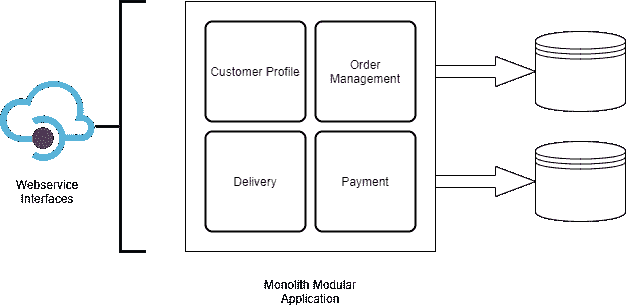
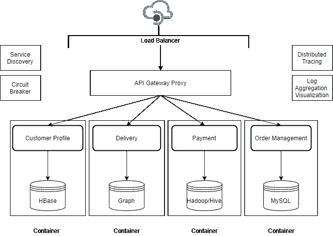

# 系统设计的演变，从 web 服务到微服务

> 原文：<https://blog.devgenius.io/evolution-of-system-design-web-services-to-microservices-9d660506c93f?source=collection_archive---------0----------------------->

在之前的[文章](https://medium.com/dev-genius/evolution-of-system-design-from-micro-functions-to-micro-services-53cdf8e276ac)中，我们讨论了“系统设计”在寻求独立涅槃过程中的许多可能旅程之一，即开发、技术、可部署性、可伸缩性和团队结构(自治)的独立。

如果我们编织到目前为止的整个旅程，很明显，努力和方向总是为了实现系统设计的以下目标:

*   保持实现的整洁、可读性，以便于维护和扩展— **更小的尺寸**，SPR，使用命名约定的清晰意图，正确的包/项目结构，重用代码(DRY)
*   **模块化结构，领域驱动**——小型自包含代码单元，可以由自治的小型团队独立开发
*   **独立发布** —代码、数据无交叉依赖地捆绑在一起
*   **可独立扩展&容错-** 轻松扩展任何特定的实施单元
*   **自由使用任何技术** **&通信协议** —技术中立的接口和发现机制，因此单个单元的实现可以是技术不可知的。

# 什么是微服务

‘微服务’，时下人们谈论最多的实现上述目标的灵丹妙药之一。

让我们明白什么是微服务。

*   顾名思义**微**服务一定比小服务小。
*   而且应该是一种服务。

> 服务的意思是“为某人做事的行为”。

类似于任何其他面向服务的模式(EJB、Rest、Webservice ),哪一个对于微服务是正确的..).

“微”(小)有点不明确，因为没有定义大小的参数。它类似于函数或类的大小，正如我们在以前的一篇文章中所讨论的。

> 正确的规模参数应该是明确的意图，并结合单一责任原则。

因此，与任何其他服务模式类似，微服务也应该有明确的界限，以包含单一责任和清晰的意图。

> *代码行数不是尺寸的正确参数。尽管它可以作为导轨。*

但是以上两个属性确实适用于每一个服务，而不仅仅是微服务。那微服务有什么特别的。

为了理解这一点，让我们超越名称。

# 深入了解微服务

以下是我们在[上一篇文章](https://medium.com/dev-genius/evolution-of-system-design-from-micro-functions-to-micro-services-53cdf8e276ac)中讨论的系统设计演进的几个目标:

*   模块化结构，干净的代码，清晰的意图，单一的责任
*   易于维护，易于理解
*   代码单元的独立所有权(这里是服务)
*   独立部署，独立发布
*   独立可扩展
*   技术不可知

除了上面的最后三点，其余的都可以用整体式设计来满足。

其余的点可能'**可以'**用 webservices(或其他任何面向服务的模式)来满足。

***web 服务*** *可独立部署、可伸缩，并且与技术无关。使用 WSDL 公开接口。通信是通过任何带有 XML 的开放标准(主要是 HTTP 上的 SOAP)进行的。此外，还可以使用服务注册中心和协议(例如:UDDI)发现这些服务。*

> 如果 webservices 满足了所有需求，那么我们为什么还需要微服务呢？

这个“微”字与服务之间的细微差别对意向产生了重大影响。

web 服务主要用作一个应用程序与另一个应用程序的接口。它并不关注细粒度的小型实现，而是主要遵循粗粒度的结构([会话外观模式](http://www.corej2eepatterns.com/SessionFacade.htm))。它更注重性能和隐藏复杂性。

区别在于模式的动机。

webservice 的目的是实现设备到设备、系统到系统的通信。这是为系统公开接口的方法之一。这就是 web 服务的用途。

> Webservice 是一种技术中立的方式来公开(monolith)应用程序的接口。

然而，微服务模式的动机是促进支持松散耦合服务集合的结构，这些服务是小型的、细粒度的和轻量级的。

微服务模式推荐我们上面讨论过的意图明确、独立开发和部署的所有目标。

因此，自然地，整个微服务生态系统和所有框架都支持更小的实现、轻量级交互协议(如 REST)、独立开发/部署/发布等。

规模(微观)和意图拥有具有单一责任和明确意图的可独立部署的服务，在设置设计应用程序的方向和整个思考过程中起着主要作用。

下图显示了微服务的图示视图。

从技术角度来看，Webservice(以及许多类似的服务)可以具备满足上述目标的所有要素。但是，作为一种模式，‘微服务’就是为了推广这些而设计的。

简而言之，微服务架构促进了:

*   较小规模的松散耦合服务
*   可以独立开发，主要是由自治的小团队开发
*   能够独立部署(和发布)
*   独立可扩展、容错
*   可以使用任何技术和技术中立通信来构建

这是 webservice 和微服务的关键区别。

# 微服务，灵丹妙药？

这看起来太棒了，就像是解决我们面临的所有问题的灵丹妙药。这就像一张去梦乡的票，在那里不会有任何问题...

但是，啊..这个世界上没有十全十美的东西，也没有适用于所有用例的微服务。

微服务也有各种缺点和挑战(类似于任何分布式系统模式)。在为应用选择微服务架构之前，考虑这些因素非常重要。

我们将在接下来的文章中讨论各种微服务挑战和可能的解决方案。

在那之前，请继续关注，快乐学习...

*如果你有什么建议，随时联系我****Linkedin****:*[*莫希特·古普塔*](https://www.linkedin.com/in/mohitkgupta/)