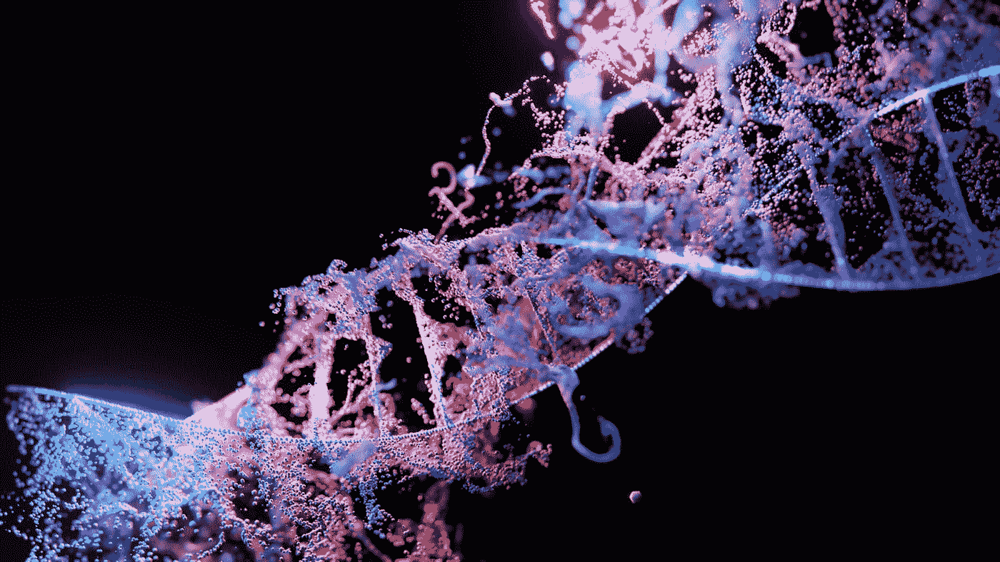

# 进化算法:进化的理论方面

> 原文：<https://blog.devgenius.io/evolutionary-algorithms-theoretical-aspects-of-evolution-c7dd021d8bd3?source=collection_archive---------15----------------------->


安妮·尼加德在 [Unsplash](https://unsplash.com?utm_source=medium&utm_medium=referral) 上拍摄的照片

我们正在通过参观我一直最喜欢的:进化算法来开始我们对人工智能的入侵。上次我们谈了一点[关于实现人工智能意味着什么。我们看到这不是关于游戏角色如何避开你的目标，也不是如何解决一个迷宫。使用确定性算法，这两件事都可以做得很好。根据计算机科学的定义，人工智能是指将生物特征和行为借用到程序中来解决给定的任务。](/entering-the-artificial-intelligence-maze-d58fb6eb5554)

进化算法试图通过直接执行生物有机体的进化过程来找到解决方案。也就是说，从一个随机的解决方案开始，用进化行为来改进它，直到这个解决方案能够解决我们的问题。当然，为了实现这一点，科学家们必须对进化进行分割和标记，并将其转化为一种算法，使其符合我们目前对世界如何运转的假设。结果呢？四个步骤。

## 第一步:选择父母


照片由[维多利亚诺·伊斯基耶多](https://unsplash.com/@victoriano?utm_source=medium&utm_medium=referral)在 [Unsplash](https://unsplash.com?utm_source=medium&utm_medium=referral) 上拍摄

我们都相信真正自发的爱，但在生物学中，这只是自然选择的副产品:从长远来看，倾向于更好的父母。更好是什么意思？这取决于需要解决的问题:也许是冰河时期，污染，人口过剩，每种情况都需要某些适应良好的父母，他们能够创造出适应更好的孩子。当然，这不会在一夜之间发生，而是跨越几代人，为我们称之为爱的随机产物留下空间。

如果我们想在代码中实现这一点，我们需要通过测量所有可用的解决方案，从一组解决方案中选择两个，并找到最好的两个。他们也不一定是两个。这是我们的算法，所以我们可以选择尽可能多的父母，但我们仍然必须实现一些倾向于选择更好的。这很简单。我将在这里使用一种随机的 javascript 语法来解释:

```
let population = [a, b, c, d, e];
let parent1 = pickParent(population);
let parent2 = pickParent(population);
```

因此，我们有了一个给定问题的解决方案群体(我们一会儿会看到它们是什么样子的)，我们需要选择两个父母。我们可以随机挑选:

```
function pickParent(population) {
  let populationSize = population.length();
  let index = Math.random() * populationSize; return population[index];
}
```

上面将简单地从群体中选择一个随机的解决方案，通过使用`Math.random()`，它给我们一个在 0 和 1 之间的随机数，并设置结果扩展到我们的群体大小。但这并不是对最好的父母的迫切要求，也没有增加任何生物智能。这只是一个随机选择器。要做到这一点，我们必须检查我们想要返回的解决方案，只有当它是更好的解决方案之一时才将其返回:

```
function pickParent(population) {
  let populationSize = population.length();
  let index = Math.random() * populationSize; if (fitness(population[index]) < 0.3) {
    return population[index];
  else {
    return pickParent(population);
  }
}
```

上面我们正在使用一个我们马上会谈到的秘密函数，叫做`fitness`。该函数将返回一个介于 0 和 1 之间的数字，表示我们的解决方案有多接近完美。零表示解决方案是完美的，一表示是最差的。上面的`pickParent`函数将只返回接近完美的解(`fitness < 0.3`)。但这公平吗？一点也不，它没有实现爱情的随机侥幸。任何两个个体都应该至少有一次“谈恋爱”的机会。所以让我们稍微改变一下:

```
function pickParent(population) {
  let populationSize = population.length();
  let index = Math.random() * populationSize; if (fitness(population[index]) < 0.3 || Math.random() < 0.5) {
    return population[index];
  else {
    return pickParent(population);
  }
}
```

那里。如果健身效果不好，我们将进行一次额外的掷硬币，几率为 50%。这样，即使适应度不会很好，被选中的个体仍然有随机的机会。当然，我们可以根据自己的意愿设定几率:`Math.random() < 0.3`将提供 30%的几率，这意味着更倾向于更好的解决方案。

## 第二步:混合父母来生产孩子


[Bilal O.](https://unsplash.com/@lightcircle?utm_source=medium&utm_medium=referral) 在 [Unsplash](https://unsplash.com?utm_source=medium&utm_medium=referral) 上拍摄的照片

我们的两个父母是通过更好的适应性或机会选择的，这并不意味着最终会有太大的影响。我们仍然在谈论一个跨越几十万代人的过程。但是我们如何把生殖变成一个算法呢？再说一次，科学家们喜欢把一切简化到最核心的地方，所以这里出现了一个明显令人恼火的算法:取父母一方的一部分，取另一方的另一部分。

所以，在这一点上，我们并不关心父母在我们程序中的样子。我们只有这个指令:从`parent1`拿一部分，从`parent2`拿一部分组成`child`。这是它在近似 javascript 中的样子:

```
let population = [a, b, c, d, e];
let parent1 = pickParent(population);
let parent2 = pickParent(population);
let child = mix(parent1, parent2); 
```

同样，我们可以考虑想要多少个父母，但在我们的情况下，我们将坚持两个。那么让我们定义一下`mix`函数:

```
function mix(parent1, parent2) {
  let part1 = selectRandomPart(parent1);
  let part2 = selectRandomPart(parent2);

  return combine(part1, part2);
}
```

正如你所看到的，我们完全按照食谱所说的去做:从一个双亲中挑选一部分，从另一个中挑选一部分，然后将这些部分组合起来创造出孩子。我们将在下一篇文章中看到这在实际问题中的表现。作为一个偷窥，它可以意味着任何事情，但有一些形式和表现，使它更容易工作。现在我们坚持这个理论。

## 第三步:安排随机突变



照片由[桑哈什·洛哈卡](https://unsplash.com/@sangharsh_l?utm_source=medium&utm_medium=referral)在 [Unsplash](https://unsplash.com?utm_source=medium&utm_medium=referral) 上拍摄

继续进化过程，不时会发生突变，所以我们需要适应我们的算法。突变可能发生在一个人生活的许多地方。例如，你在有生之年受到辐射，或者在出生前，在父母基因结合的过程中发生了一些事情。但结果总是一样的:有些事情发生了变化，而且与任何事情都无关，只是随机的。如果双亲的结合需要我们已知有效的已知和已证实的部分，那么突变就更加模糊了。它可能会更好地发挥作用，也可能会完全破坏基因的完美组合。所以让我们把它加入我们的算法:

```
let population = [a, b, c, d, e];
let parent1 = pickParent(population);
let parent2 = pickParent(population);
let child = mix(parent1, parent2);
let mutant = mutate(child);
```

那么 mutate 看起来如何呢:

```
function mutate(child) {
  let doesMutationOccur = Math.random();
  if (doesMutationOccur < 0.5) return child; let childProperties = Object.keys(child);
  let randomIndex = Math.random() * childProperties.length();
  let randomProperty = childProperties[randomIndex]; child[randomValue] = getRandomValue(randomProperty);
  return child;
}
```

同样，上述算法并不力求正确，它只是一个原型，所以我们明白什么是突变的意思。基本上，如果孩子是一个类似于`dog`的对象，具有类似于`dog.breed`和`dog.age`的一些属性，那么突变意味着我们随机选择一个属性，例如`age`，然后给它一个新的随机值。注意，随机值必须对给定的属性有意义，这就是为什么我们求助于一个接受属性作为参数的`getRandomValue`函数。

基本上，如果随机属性是`age`，那么`getRandomValue(age)`的结果将类似于`3`。如果属性是`breed`，那么结果将是`husky`。当然，在现实生活中，变异不会随机改变狗的品种，但这只是一个原型算法，所以我们知道变异是如何工作的。下次当我们谈到遗传算法时，我们会看到，培育一个新的孩子，并使其突变，会更好地与生物有机体相匹配。

## 第四步:健身功能


照片由[维克多·弗雷塔斯](https://unsplash.com/@victorfreitas?utm_source=medium&utm_medium=referral)在 [Unsplash](https://unsplash.com?utm_source=medium&utm_medium=referral) 上拍摄

我们在这里创建了一些函数，帮助我们以一种对计算机程序有意义的方式解释进化，但我们方便地忽略了最重要的部分，即每个解决方案的适应性。在这种情况下，适应性意味着它有多好，它有多好地匹配和解决了我们的问题。你看，我们的算法是基于适应度函数的。没有它，它就无法工作，它将永远创造孩子并使他们变异，但不会有任何力量推动更好的结果。让我们完成我们的算法:

```
let population = [a, b, c, d, e];
let parent1 = pickParent(population);
let parent2 = pickParent(population);
let child = mix(parent1, parent2);
let mutant = mutate(child);if (fitness(mutant) < fitness(child)) {
  nextGeneration.push(mutant);
} else {
  nextGeneration.push(child);
}
```

该算法应该接收一个群体，对其应用一些进化函数，并产生下一代。下一代会包含什么？父母肯定会死，尽管我们可以在一段时间内包括他们(同样，这是我们的*算法，我们做我们认为合适的事情)。但是在上面的例子中，我们只做一件事:在孩子和突变体之间选择。我们检查他们的健康状况，挑选最好的。那是下一代。我们可以对群体中的每一个个体都这样做，这样我们就有了新一代相同大小的个体:*

```
function createNextGeneration(population) {
  let result = []; for (let i = 0; i < population.length(); i++) {
    let parent1 = pickParent(population);
    let parent2 = pickParent(population);
    let child = mix(parent1, parent2);
    let mutant = mutate(child); if (fitness(mutant) < fitness(child)) {
      result.push(mutant);
    } else {
      result.push(child);
    }  
  } return result;
}
```

上面的函数将随机抽取一个人口，并给我们相同大小的下一代。十个人进去，十个人出来。这使得我们可以永远重复这个过程。但是，健身功能是什么？

这就是诀窍:这取决于我们想要解决的问题。没有通用的健身功能。我们正在努力取得越来越好的结果，但不可能有一种通用的方法来解决所有问题。如果我们的计划是繁殖更好的狗，那么适应度函数可能是这样的:

```
function fitness(dog) {
  let result = dog.age + dog.pastIllnesses.length() + dog.temper + dog.visionMeasurement + dog.speed; return sigma(result);
}
```

上述函数将把一个`dog`的所有特征加起来，并作为一个适应度值返回。请记住，适合度应该是一个介于 0 和 1 之间的数字，越低越好，因此我将结果传递给一个`sigma`转换函数，该函数接受接收到的任何整数，并返回一个介于 0 和 1 之间的加权值。javascript 中没有这样的函数，所以我们需要自己编写。但是同样，这与`dog`对象中的属性值密切相关，所以它不能是泛型的。这里有一个例子:

```
function sigma(raw) {
  return 1 / (1 + Math.exp(-1 * raw));
}
```

上面的函数将任何整数映射到 0 到 1 之间的一个数。这取决于我们，以确保我们添加的数字是正确的，所以较低的适应度更好。

## 把所有东西加起来


照片由[威龙 A](https://unsplash.com/@wyron?utm_source=medium&utm_medium=referral) 在 [Unsplash](https://unsplash.com?utm_source=medium&utm_medium=referral) 上拍摄

我们的节目准备好了。我们已经拥有了创建一个进化算法所需的所有构件，该算法每一代都会增加压力，以找到更好的结果。什么是更好的结果？正如我们所见，这完全取决于适应度函数:这是决定个体之间的函数。寻找完美的狗是一回事，但我们可能在寻找实际解决商业问题的东西，比如送货卡车的最佳路线。我们将在下一篇文章中看到进化算法的实际应用，但现在让我们结束我们的程序:

```
var population = getRandomPopulation();for (let i = 0; i < 100; i++) {
  population = createNextGeneration(population);
}population = sortByFitness(population)
console.log(population[0]);
```

我们又错过了一些函数，但我不会在这里花时间写它们。下一篇文章将更加实用，因为我们将尝试创建一个有用的应用程序来解决实际问题。对于理论来说，以上就足够了。我们创建了一个随机群体:我们从什么开始并不重要，因为我们会对系统施加压力以改善它。然后 100 次，我们在上一代的基础上创造下一代。在 100 代之后，我们停下来，按照适应度对最终群体进行排序，并显示第一个群体，即适应度最接近于零的个体:最佳群体。

我们不难看出，这个算法基本上可以永远运行下去。如果我们对结果不满意，我们可以再运行 100 代算法，以此类推。我们还可以注意到，该算法是*启发式*，这意味着对于给定的输入，我们不会得到相同的输出。基于我们为每个函数应用的许多随机方面，输出总是不同的。但有一点是不变的:每一代都会比上一代更好，我们有某些触发因素来控制一切收敛到最佳解决方案的速度，比如突变概率和从父母中选择的随机部分来组成孩子。

如果你认为以上所有的可能永远不会工作，进化算法背后有一个完整的统计理论，它深入到使其工作的所有方面。如果你仔细想想，这基本上是在一个巨大的解决方案空间中进行搜索。但是，即使它每次都从随机的点开始，它推动自己寻找更好的解决方案的方式也不是随机的。是的，要找到完美的答案需要很多代人，但这就是生物智能的工作方式。有什么问题吗？进化几百万年做的事，计算机几秒钟就能运行模拟。

进化算法的理论部分到此结束。下一次我们将讨论一种叫做遗传算法的应用变体，它的解决方案是一组我们称之为基因的数字。遗传算法在工业水平上是有效的，并且用于解决极其困难的问题，这些问题要么没有直接的数学解决方案，要么现有的数学解决方案将需要不合理的时间量。

然后，遗传算法解决了另一类问题:如果尝试直接的数学解决方案，这些问题通常会使任何计算机崩溃。我希望我引起了你的注意！下次见！