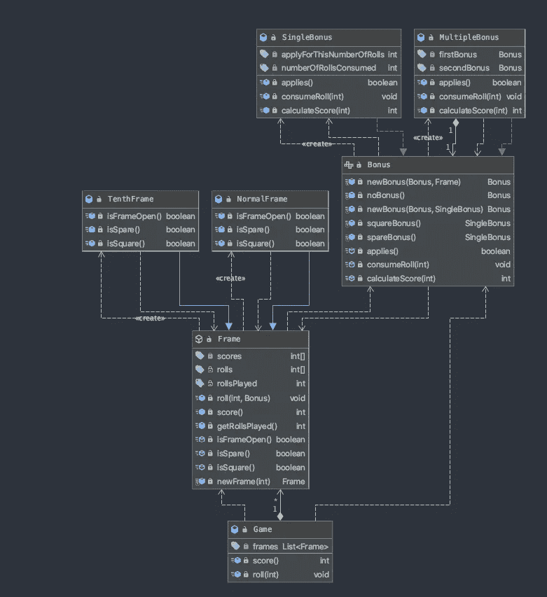

# 进化设计:一个例子

> 原文：<https://blog.devgenius.io/evolutionary-design-an-example-d9889a262e3d?source=collection_archive---------2----------------------->

进化设计和 TDD 为什么是相关的？。


一旦我发表了我的[进化设计](https://medium.com/dev-genius/evolutionary-design-cfb1795e8f81?sk=b32e3f4396a3576ea88726d8ce8fc73b)博文，我就收到了一些关于为什么 TDD 与它相关的反馈。诚然，当我们谈论进化设计(紧急设计)时，有不同的层次。如今，敏捷公司在他们引入的每个特性中改变他们的软件设计。这通常以预先设计的方式完成，所以在编码之前要考虑如何解决整个特性。
事实上，当你必须实现一个特性时，有两种情况:

*   你知道如何实现一个特性，因为你过去做过很多次，所以你不需要推断什么是正确的设计。
*   你不知道怎么解决问题，也不知道设计会怎么样。

以我的经验来看，第一件事时有发生，而第二件事是常事。进化设计可以帮助你在第二种情况下，基本上进化设计是试图找到你的系统的设计，而你正在努力找到你的系统如何运作。

因此，我们拥有比功能更多的粒度级别:

*   用户故事
*   用户情景中的场景
*   任务

## 有没有可能通过场景做进化设计？。

为了解决整个特性，我们需要解决所有的用户故事，为了解决它们，我们需要解决它们的所有场景。如果我们能够一个接一个地解决每个场景，我们就能更频繁地改进设计。小步骤总是更好，因为风险更小，我们可以从中获得早期反馈。
总之，很明显，要一直改变事物，你需要一种快速的方法来知道你是否引入了错误。你会说，等等，但是做这个测试已经足够了，我同意。所以我们需要测试来发展，对我们的改变有信心。

我们仍然需要计划下一个场景，所以为了理解要计划什么，我们首先需要理解要做什么。通常用户故事的场景都带有一些验收标准，事实上这些验收标准描述了我们可以用来知道我们的软件是否实现了问题的解决方案的测试。因此，编写测试是一种了解我们是否理解问题的方法(这是计划如何解决问题之前的一步)。

最后一件事是计划如何解决它。但是等等，如果场景足够小，并且我选择了正确的顺序，我需要计划什么呢？。我只需要为下一个场景调整我的代码。

我所描述的正是 [TDD](https://medium.com/dev-genius/inverted-scientist-method-aka-tdd-e7848c3fd982?sk=b6234b6d1a4170a8939d9aebcea25157) 试图解决的问题:

*   思考下一个要解决的更简单的问题是什么
*   创建一个测试来理解要解决的问题
*   创建通过测试的代码
*   改进您的设计
*   重新开始

你不需要 [TDD](https://medium.com/dev-genius/inverted-scientist-method-aka-tdd-e7848c3fd982?sk=b6234b6d1a4170a8939d9aebcea25157) 来浮现你的设计，但是你需要解决这些问题，否则你会有一个混乱的代码库。TDD 解决了我描述的问题，这就是为什么我认为它是实现进化设计的最简单的方法。

## 问题是

在这个例子中，我们将使用[保龄球形](https://kata-log.rocks/bowling-game-kata)，我们将在 TDD 之后用 Java 来做:

> 这个游戏由 10 帧组成。在每一局中，玩家有两次机会击倒 10 个球瓶。这一局的分数是击倒的球瓶总数，加上好球和空球的奖励。
> 
> 备用球是指球员在两轮比赛中击倒所有 10 个球瓶。该帧的奖励是下一次掷骰子击倒的瓶数。
> 
> 好球是指玩家在第一次掷骰子时击倒所有 10 个球瓶。然后用一个辊就完成了框架。该帧的奖金是接下来两次掷骰的价值。
> 
> 在第十局中，掷出备用球或全中球的玩家可以掷出多余的球来完成这一局。然而，在第十帧中最多只能滚动三个球。
> 
> 要求
> 
> 编写一个有两个方法的类`Game`
> 
> `void roll(int)`在玩家每次滚动一个球时被调用。争论点是击倒的球瓶数量。
> 
> `int score()`返回该游戏的总分。

好的，明白了。现在第一件事应该是找到更小的问题来指导我们解决整个事情。试图编写一个测试来解决整个问题是没有任何价值的，因为这样我们需要在第一次尝试时找到正确的解决方案，这非常困难。

很明显你不需要打十帧来问分数。所以我可以要求我们已经玩过的每一帧的分数。这是增加问题的一种方式，我们的第一个测试可能是:

```
@Test
*public void* noFrame(){
    Game bowling = *new* Game();
    *assertThat*(bowling.score(), *is*(0));
}*public class* Game {
    *private int* totalScore = 0;
    *public int* score() {
        *return* totalScore;
    }

    *public void* roll(*int* pins) {
        totalScore = pins;
    }
}
```

要通过这个测试，我需要创建游戏类和评分方法。到目前为止，返回 0 就足以解决这个问题。

接下来要做的应该是一帧打一个滚，看结果。

```
@Test
*public void* oneFrameOneRoll(){
    Game bowling = *new* Game();
    bowling.roll(1);
    *assertThat*(bowling.score(), *is*(1));
}
```

现在，游戏将需要改变，以返回被撞倒的瓶。

```
*public class* Game {
    *private int* totalScore = 0;
    *public int* score() {
        *return* totalScore;
    }

    *public void* roll(*int* pins) {
        totalScore = pins;
    }
}
```

但是一个框架有两个卷，让我们尝试一下那个场景，看看如何解决它。

```
@Test
*public void* oneFrameTwoRolls(){
    Game bowling = *new* Game();
    bowling.roll(1);
    bowling.roll(1);
    *assertThat*(bowling.score(), *is*(2));
}
```

现在我们需要将击倒的瓶加入到最终得分中。

```
*public class* Game {
    *private int* totalScore = 0;
    *public int* score() {
        *return* totalScore;
    }

    *public void* roll(*int* pins) {
        totalScore += pins;
    }
}
```

好了，让我们强制创建一个管理备件的方法，这将是我们下一个要解决的小问题。如果我们在第一帧做了备用，我们需要在下一次掷骰子时增加一个奖励。

```
@Test
*public void* twoFramesFirsIsSpare(){
    Game bowling = *new* Game();
    bowling.roll(9);
    bowling.roll(1);

    bowling.roll(1);
    bowling.roll(1);
    *assertThat*(bowling.score(), *is*(13));
}
```

为了管理备件，我们需要创建一些东西，我想到了一个框架(它在问题的描述中)。

```
*public class* Game {
    *private* Frame frame0 = *new* Frame();
    *private* Frame frame1 = *new* Frame();
    *public int* score() {
        *return* frame0.score()+frame1.score();
    }

    *public void* roll(*int* pins) {
        *if*(frame0.isFrameOpen()){
            frame0.roll(pins, *false*);
        }*else*{
            frame1.roll(pins, frame0.isSpare());
        }
    }
}*public class* **Frame** {
    *private int* roll0 = 0;
    *private int* roll1 = 0;
    *private int* rollsPlayed = 0;

    *public void* roll(*int* pins, *boolean* previousFrameIsSpare) {
        *if* (rollsPlayed == 0) {
            roll0 = previousFrameIsSpare ? 2*pins : pins;
        } *else* {
            roll1 = pins;
        }
        rollsPlayed++;
    }

    *public int* score() {
        *return* roll0 + roll1;
    }

    *public boolean* isFrameOpen() {
        *return* rollsPlayed < 2;
    }

    *public boolean* isSpare() {
        *return* roll0 + roll1 == 10 && rollsPlayed==2;
    }
}
```

我需要创建 Frame 类来支持播放两个帧，并且在第一个帧是备用帧时有一个额外的奖励。这是很大的一步，因为一旦我们能够创建帧类，我们就需要管理备用的额外逻辑。所以更容易的是先重构游戏类，轻松地创建框架概念，然后引入新特性(当我们处于绿色状态时重构)。

很明显，每一帧我们都需要一个变量。因此，让我们重构代码，使用一个数组而不是两个变量来表示帧。

```
*public class* Game {
    *private* Frame frames[] = *IntStream*.*range*(0, 2).mapToObj(i -> *new* Frame()).toArray(Frame[]::*new*);

    *public int* score() {
        *return* Arrays.*stream*(frames).mapToInt(Frame::score).sum();
    }

    *public void* roll(*int* pins) {
        Frame previousFrame = *new* Frame();
        *for* (Frame frame : frames) {
            *if* (frame.isFrameOpen()) {
                frame.roll(pins, previousFrame.isSpare());
                *return*;
            }
            previousFrame = frame;
        }
    }
}
```

现在我们的游戏只支持两帧，让我们允许十帧没有奖金。

```
@Test
*public void* tenFrames() {
    Game bowling = *new* Game();
    *for*(*int* i=0; i<20; i++){
        bowling.roll(1);
    }
    *assertThat*(bowling.score(), *is*(20));
}*public class* Game {
    *private final* Frame[] frames = *IntStream*.*range*(0, **10**).mapToObj(i -> *new* Frame()).toArray(Frame[]::*new*);

    *public int* score() {
        *int* result = 0;
        *boolean* isSpare = *false*;
        *for* (Frame frame : frames) {
            result += frame.score(isSpare);
            isSpare = frame.isSpare();
        }
        *return* result;
    }

    *public void* roll(*int* pins) {
        *for* (Frame frame : frames) {
            *if* (frame.isOpen()) {
                frame.roll(pins);
                *return*;
            }
        }
    }
}
```

因此，我们改变了创建的帧数，现在我们需要迭代数组，直到我们找到一个开放的帧来播放一卷。分数将是分数的总和，如果前一帧是备用帧以增加奖金，我们将通过。

比起数组，我更喜欢列表，所以让我们在这里做一个小的重构。

```
*public class* Game {
    *private final* ***List*<Frame>** frames = *IntStream*.*range*(0, 10).mapToObj(i -> *new* Frame()).collect(Collectors.*toList*());

    *public int* score() {
        *return* frames.stream().mapToInt(Frame::score).sum();
    }

    *public void* roll(*int* pins) {
        Frame previousFrame = *new* Frame();
        *for* (Frame frame : frames) {
            *if* (frame.isFrameOpen()) {
                frame.roll(pins, previousFrame.isSpare());
                *return*;
            }
            previousFrame = frame;
        }
    }
}
```

我们有备件，但没有正方形，所以让我们尝试引入两个框架和一个正方形，以获得奖金。

```
@Test
*public void* twoFramesFirstOneIsSquare() {
    Game bowling = *new* Game();
    bowling.roll(10);
    bowling.roll(1);
    bowling.roll(1);
    *assertThat*(bowling.score(), *is*(14));
}
```

所以我们可以像处理备用轮胎一样处理，但是要处理方形轮胎。

```
*public class* Game {
    *private final List*<Frame> frames = *IntStream*.*range*(0, 10).mapToObj(i -> *new* Frame()).collect(Collectors.*toList*());

    *public int* score() {
        *return* frames.stream().mapToInt(Frame::score).sum();
    }

    *public void* roll(*int* pins) {
        Frame previousFrame = *new* Frame();
        *for* (Frame frame : frames) {
            *if* (frame.isFrameOpen()) {
                frame.roll(pins, previousFrame.isSpare(), **previousFrame.isSquare()**);
                *return*;
            }
            previousFrame = frame;
        }
    }
}
```

我们使用前一帧来了解是否需要在当前帧中应用奖金。

```
*public class* Frame {
    *private int* roll0 = 0;
    *private int* roll1 = 0;
    *private int* rollsPlayed = 0;

    *public void* roll(*int* pins, *boolean* previousFrameIsSpare, *boolean* previousFrameIsSquare) {
        *if* (rollsPlayed == 0) {
            roll0 = **(previousFrameIsSpare ||  previousFrameIsSquare) ? 2*pins : pins;**
        } *else* {
            roll1 = **previousFrameIsSquare ? 2*pins : pins;**
        }
        rollsPlayed++;
    }

    *public int* score() {
        *return* roll0 + roll1;
    }

    *public boolean* isFrameOpen() {
        *return* rollsPlayed < 2 && (roll0<10);
    }

    *public boolean* isSpare() {
        *return* roll0 + roll1 == 10 && rollsPlayed==2;
    }

    ***public boolean* isSquare() {
        *return* roll0  == 10 && rollsPlayed==1;
    }**
}
```

看一下代码，很明显，这对于连续的几个方格是行不通的，因为我们需要记住最后两个，如果我们有两个奖金要申请，这也是行不通的。但是我们需要改进当前的设计来简化下一步，也许是时候引入奖金的概念了。

我们可以开始在游戏中引入奖金，这样我们就可以用它来计算何时需要应用奖金。

```
*public class* Game {
    *private final List*<Frame> frames = *IntStream*.*range*(0, 10).mapToObj(i -> i < 9 ? *new* NormalFrame() : *new* TenthFrame()).collect(Collectors.*toList*());
    ***private Bonus* bonus = *new* Bonus(0);**

    *public int* score() {
        *return* frames.stream().mapToInt(Frame::score).sum();
    }

    *public void* roll(*int* pins) {
        *for* (Frame frame : frames) {
            *if* (frame.isFrameOpen()) {
                frame.roll(pins, bonus);
                **bonus = *Bonus*.*newBonus*(bonus, frame);**
                *return*;
            }
        }
    }
}*public class Frame* *implements* Frame {
    *private int* roll0 = 0;
    *private int* roll1 = 0;
    *private int* rollsPlayed = 0;

    @Override
    *public void* roll(*int* pins, *Bonus* bonus) {
        *if* (rollsPlayed == 0) {
            roll0 = **calculateScore(pins, bonus);**
        } *else* {
            roll1 = **calculateScore(pins, bonus);**
        }
        rollsPlayed++;
    }

    ***private int* calculateScore(*int* pins, *Bonus* bonus) {
        *return* bonus.applies() ? 2 * pins : pins;
    }**

    @Override
    *public int* score() {
        *return* roll0 + roll1;
    }

    @Override
    *public boolean* isFrameOpen() {
        *return* rollsPlayed < 2 && (roll0 < 10);
    }

    @Override
    *public boolean* isSpare() {
        *return* roll0 + roll1 == 10 && rollsPlayed == 2;
    }

    @Override
    *public boolean* isSquare() {
        *return* roll0 == 10 && rollsPlayed == 1;
    }
}
```

我们从零奖金开始，这就像没有奖金，并移动所有的逻辑，以了解我们是否需要将奖金应用到奖金类。在这里，我注意到 roll0 和 roll1 不足以计算框架是备用的还是方形的，也不足以计算该 roll 的分数，这超出了我们当前的步骤，但我们可以考虑接下来的功能。

```
***public class* Bonus** {
    *private int* applyForThisNumberOfRolls;
    *private int* numberOfRollsConsumed;

    *public* Bonus(*int* applyForThisNumberOfRolls) {
        *this*.applyForThisNumberOfRolls = applyForThisNumberOfRolls;
        *this*.numberOfRollsConsumed = 0;
    }

    *public boolean* applies() {
        *return* numberOfRollsConsumed < applyForThisNumberOfRolls;
    }

    *public void* consumeRoll() {
        *this*.numberOfRollsConsumed++;
    }

    *public static* Bonus newBonus(Bonus currentBonus, Frame frame){
        Bonus bonus = currentBonus;
        bonus.consumeRoll();
        *if* (frame.isSpare()) {
            bonus = *new* Bonus(1);
        } *else if* (frame.isSquare()) {
            bonus = *new* Bonus(2);
        }
        *return* bonus;
    }
}
```

奖励取决于应用的掷骰数和激活奖励时的掷骰数，因此我们可以使用它来代替 isSpare isSquare 参数。

现在，让我们用三个连续的方块来试一试。

```
@Test
*public void* threeFramewWithSquaresInAllOfThem() {
    Game bowling = *new* Game();
    *for* (*int* i = 0; i < 3; i++) {
        bowling.roll(10);
    }
    *assertThat*(bowling.score(), *is*(60));
}
```

我们的担心现在出现了，我们需要有一种方法来记住击倒的掷骰子(实现 isSpare、isSquare 方法)和那些带有奖金的掷骰子的分数，以便能够计算总分。

```
*public class* Frame {
    ***private final int*[] scores;**
    ***protected final int*[] rolls;**
    *protected int* rollsPlayed = 0;

    *public* Frame() {
        scores = *new int*[2];
        rolls = *new int*[2];
        *for* (*int* i = 0; i < 2; i++) {
            scores[i] = 0;
            rolls[i] = 0;
        }
        *this*.rollsPlayed = 0;
    }

    *public void* roll(*int* pins, *Bonus* bonus) {
        rolls[rollsPlayed] = pins;
        scores[rollsPlayed] = bonus.calculateScore(pins);
        rollsPlayed++;
    }

    *public int* score() {
        *return stream*(scores).sum();
    }

    *public boolean* isFrameOpen() {
        *return* rollsPlayed < 2 && (rolls[0] < 10);
    }

    *public boolean* isSpare() {
        *return* rolls[0] + rolls[1] == 10 && rollsPlayed == 2;
    }

    *public boolean* isSquare() {
        *return* rolls[0] == 10 && rollsPlayed == 1;
    }

    *public int* getRollsPlayed() {
        *return* rollsPlayed;
    }
}
```

在这一步的重构阶段，我们还通过一个数组改变了 roll0 和 roll1，我们对 scores 数组采用了相同的方法。以前分数和卷占据相同的概念，现在在这一步之后他们被一分为二。

但是测试没有通过，因为我们需要在第三步应用两个加成。这迫使我们创造另一个概念——多重奖金。

```
***public class* MultipleBonus *implements Bonus* {**
    *private final Bonus* firstBonus;
    *private final Bonus* secondBonus;

    *public* MultipleBonus(*Bonus* firstBonus, *Bonus* secondBonus) {
        *this*.firstBonus = firstBonus;
        *this*.secondBonus = secondBonus;
    }

    @Override
    *public boolean* applies() {
        *return* firstBonus.applies() || secondBonus.applies();
    }

    @Override
    *public void* consumeRoll(*int* rollsPlayed) {
        *if* (firstBonus.applies()) {
            firstBonus.consumeRoll(rollsPlayed);
        }
        *if* (secondBonus.applies()) {
            secondBonus.consumeRoll(rollsPlayed);
        }
    }

    *public int* calculateScore(*int* pins) {
        *int* result = 0;
        *if* (firstBonus.applies()) {
            result = firstBonus.calculateScore(pins);
        }
        *if* (secondBonus.applies()) {
            result += secondBonus.calculateScore(pins) - pins;
        }
        *return* result;
    }
}
```

但是为了在我们的程序中引入这个新概念，我们需要从 Bonus 中提取一个接口，并将 Bonus 类改为 SingleBonus。

```
***public interface Bonus***{
    ***static Bonus* newBonus(*Bonus* currentBonus, Frame frame) {
        *Bonus* bonus = currentBonus;
        *if* (frame.isSpare()) {
            bonus = *newBonus*(currentBonus, *spareBonus*());
        } *else if* (frame.isSquare()) {
            bonus = *newBonus*(currentBonus, *squareBonus*());
        }
        *return* bonus;
    }

    *static Bonus* newBonus(*Bonus* currentBonus, SingleBonus singleBonus) {
        *return* currentBonus.applies() ? *new* MultipleBonus(currentBonus, singleBonus) : singleBonus;
    }**

    *static* SingleBonus squareBonus() {
        *return new* SingleBonus(2);
    }

    *static* SingleBonus spareBonus() {
        *return new* SingleBonus(1);
    }

    *boolean* applies();

    *void* consumeRoll(*int* rollsPlayed);

    *int* calculateScore(*int* pins);
}***public class* SingleBonus *implements Bonus***{
    *private int* applyForThisNumberOfRolls;
    *private int* numberOfRollsConsumed;

    *public* SingleBonus(*int* applyForThisNumberOfRolls) {
        *this*.applyForThisNumberOfRolls = applyForThisNumberOfRolls;
        *this*.numberOfRollsConsumed = 0;
    }

    @Override
    *public boolean* applies() {
        *return* numberOfRollsConsumed < applyForThisNumberOfRolls;
    }

    @Override
    *public void* consumeRoll(*int* rollsPlayed) {
        *this*.numberOfRollsConsumed += rollsPlayed;
    }

    @Override
    *public int* calculateScore(*int* pins) {
        *return this*.applies() ? 2 * pins : pins;
    }
}*public class* Game {
    *private final List*<Frame> frames = *IntStream*.*range*(0, 10).mapToObj(i -> i < 9 ? *new* Frame(2) : *new* TenthFrame()).collect(Collectors.*toList*());

    *public int* score() {
        *return* frames.stream().mapToInt(Frame::score).sum();
    }

    *public void* roll(*int* pins) {
        ***Bonus* bonus = *new* SingleBonus(0);**
        *for* (Frame frame : frames) {
            **bonus.consumeRoll(frame.getRollsPlayed());**
            *if* (frame.isFrameOpen()) {
                frame.roll(pins, bonus);
                *return*;
            }
            **bonus = *Bonus*.*newBonus*(bonus, frame);**
        }
    }
}
```

我意识到像全局属性这样的奖励不是一个好主意，我们也需要一种方法来消耗我们正在工作的帧所应用的滚动。因此，计算适用于开放帧的奖金是一个迭代过程，消耗先前封闭帧的所有掷骰子加上在开放帧中玩的掷骰子。这就是为什么奖金被移动到滚动方法中，并在每次迭代中计算，根据它创建的帧，一个新的奖金。如果在最后一帧中没有方块或备用方块，那么我们继续之前的奖励。

我在 bonus 中应用了工厂模式，将逻辑放在这里，以决定我们是需要创建多个还是单个 Bonus 实例。

我在想，画四个正方形很好，但是不行。

```
@Test
*public void* fourFramesWithSquaresInAllOfThem() {
    Game bowling = *new* Game();
    *for* (*int* i = 0; i < 4; i++) {
        bowling.roll(10);
    }
    *assertThat*(bowling.score(), *is*(90));
}
```

我的多重奖金没有考虑到，如果我们不应用第一个奖金，第二个奖金必须应用，我不能减去第一个奖金的分数计算的引脚，因为它没有计算。

```
*public class* MultipleBonus *implements Bonus* {
    *private final Bonus* firstBonus;
    *private final Bonus* secondBonus;

    *public* MultipleBonus(*Bonus* firstBonus, *Bonus* secondBonus) {
        *this*.firstBonus = firstBonus;
        *this*.secondBonus = secondBonus;
    }

    @Override
    *public boolean* applies() {
        *return* firstBonus.applies() || secondBonus.applies();
    }

    @Override
    *public void* consumeRoll(*int* rollsPlayed) {
        *if* (firstBonus.applies()) {
            firstBonus.consumeRoll(rollsPlayed);
        }
        *if* (secondBonus.applies()) {
            secondBonus.consumeRoll(rollsPlayed);
        }
    }

    *public int* calculateScore(*int* pins) {
        *int* result = 0;
        *if* (firstBonus.applies()) {
            result = firstBonus.calculateScore(pins);
        }
        *if* (secondBonus.applies()) {
            **result += secondBonus.calculateScore(pins) - (firstBonus.applies() ? pins: 0);**
        }
        *return* result;
    }
}
```

第十帧比较特殊，大家重点关注一下，看看规律。但是在我们需要一种方法来扩展框架以具有不同的行为之前，在不添加任何行为的情况下，我们可以重构框架以遵循模板模式，从而有两个实现

```
***public abstract class* Frame {**
    *private final int*[] scores;
    *protected final int*[] rolls;
    *protected int* rollsPlayed = 0;

    *public* Frame(*int* numberOfRollsAllowed) {
        scores = *new int*[numberOfRollsAllowed];
        rolls = *new int*[numberOfRollsAllowed];
        *for* (*int* i = 0; i < numberOfRollsAllowed; i++) {
            scores[i] = 0;
            rolls[i] = 0;
        }
        *this*.rollsPlayed = 0;
    }

    *public void* roll(*int* pins, *Bonus* bonus) {
        rolls[rollsPlayed] = pins;
        scores[rollsPlayed] = bonus.calculateScore(pins);
        rollsPlayed++;
    }

    *public int* score() {
        *return stream*(scores).sum();
    }

    *public int* getRollsPlayed() {
        *return* rollsPlayed;
    }

    *public abstract boolean* isFrameOpen();

    *public abstract boolean* isSpare();

    *public abstract boolean* isSquare();
}***public class* NormalFrame *extends* Frame{**
    *public* NormalFrame() {
        *super*(2);
    }
    @Override
    *public boolean* isFrameOpen() {
        *return* rollsPlayed < 2 && (rolls[0] < 10);
    }
    @Override
    *public boolean* isSpare() {
        *return* rolls[0] + rolls[1] == 10 && rollsPlayed == 2;
    }
    @Override
    *public boolean* isSquare() {
        *return* rolls[0] == 10 && rollsPlayed == 1;
    }
}
```

现在解决这个新问题就容易了

```
@Test
*public void* tenFramesOneSpareTenthFrame() {
    Game bowling = *new* Game();
    *for*(*int* i=0; i<18; i++){
        bowling.roll(1);
    }
    bowling.roll(9);
    bowling.roll(1);
    bowling.roll(1);
    *assertThat*(bowling.score(), *is*(29));
}
```

第十帧类似于帧，但根据某些情况允许 3 次滚动。

```
*public class* TenthFrame *extends* Frame {
    *public* TenthFrame() {
        *super*(3);
    }

    @Override
    *public boolean* isFrameOpen() {
        *return* (rollsPlayed == 2 && (rolls[0] + rolls[1] >= 10)) || rollsPlayed < 2;
    }

    @Override
    *public boolean* isSpare() {
        *return false*;
    }

    @Override
    *public boolean* isSquare() {
        *return false*;
    }
}
```

有了这个扩展，我们只需要改变游戏，用我们的新实现创建第十帧。

```
*public class* Game {
    *private final List*<Frame> frames = *IntStream*.*range*(0, 10).mapToObj(**i -> i < 9 ? *new* NormalFrame() : *new* TenthFrame()**).collect(Collectors.*toList*());

    *public int* score() {
        *return* frames.stream().mapToInt(Frame::score).sum();
    }

    *public void* roll(*int* pins) {
        *Bonus* bonus = *new* SingleBonus(0);
        *for* (Frame frame : frames) {
            bonus.consumeRoll(frame.getRollsPlayed());
            *if* (frame.isFrameOpen()) {
                frame.roll(pins, bonus);
                *return*;
            }
            bonus = *Bonus*.*newBonus*(bonus, frame);
        }
    }
}
```

我们可以使用与上面相同的方法对此进行重构。我们可以将决定创建什么框架的逻辑移到抽象框架类中的工厂方法中。

```
*public abstract class* Frame {
    *private final int*[] scores;
    *protected final int*[] rolls;
    *protected int* rollsPlayed = 0;

    *public* Frame(*int* numberOfRollsAllowed) {
        scores = *new int*[numberOfRollsAllowed];
        rolls = *new int*[numberOfRollsAllowed];
        *for* (*int* i = 0; i < numberOfRollsAllowed; i++) {
            scores[i] = 0;
            rolls[i] = 0;
        }
        *this*.rollsPlayed = 0;
    }

    *public void* roll(*int* pins, *Bonus* bonus) {
        rolls[rollsPlayed] = pins;
        scores[rollsPlayed] = bonus.calculateScore(pins);
        rollsPlayed++;
    }

    *public int* score() {
        *return stream*(scores).sum();
    }

    *public int* getRollsPlayed() {
        *return* rollsPlayed;
    }

    *public abstract boolean* isFrameOpen();

    *public abstract boolean* isSpare();

    *public abstract boolean* isSquare();

    ***public static* Frame newFrame(*int* framePosition) {
         *return* framePosition < 9 ? *new* NormalFrame() : *new* TenthFrame();
    }**
}*public class* Game {
    ***private final List*<Frame> frames = *IntStream*.*range*(0, 10).mapToObj(Frame::*newFrame*).collect(Collectors.*toList*());**

    *public int* score() {
        *return* frames.stream().mapToInt(Frame::score).sum();
    }

    *public void* roll(*int* pins) {
        *Bonus* bonus = *new* SingleBonus(0);
        *for* (Frame frame : frames) {
            bonus.consumeRoll(frame.getRollsPlayed());
            *if* (frame.isFrameOpen()) {
                frame.roll(pins, bonus);
                *return*;
            }
            bonus = *Bonus*.*newBonus*(bonus, frame);
        }
    }
}
```

最后一件事是验证我们能够计算一个完美的游戏。

```
@Test
*public void* perfectGame() {
    Game bowling = *new* Game();
    *for* (*int* i = 0; i < 12; i++) {
        bowling.roll(10);
    }
    *assertThat*(bowling.score(), *is*(300));
}
```

我们设计的最终照片:

