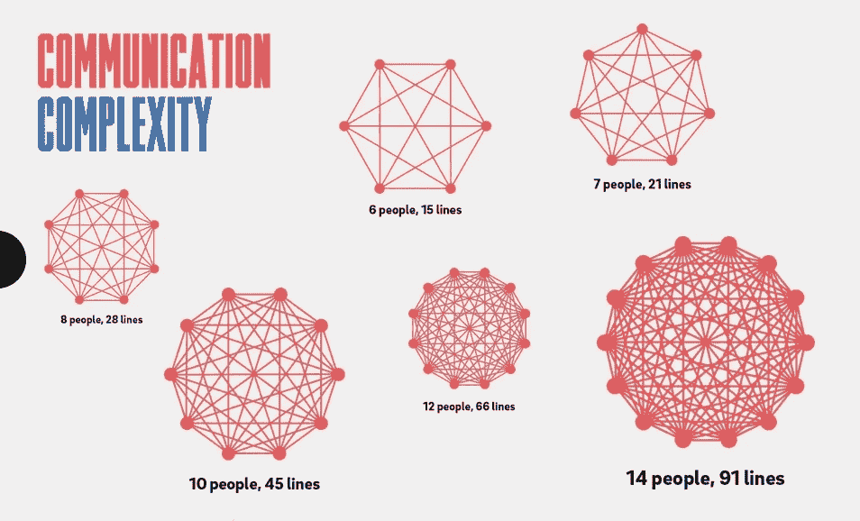
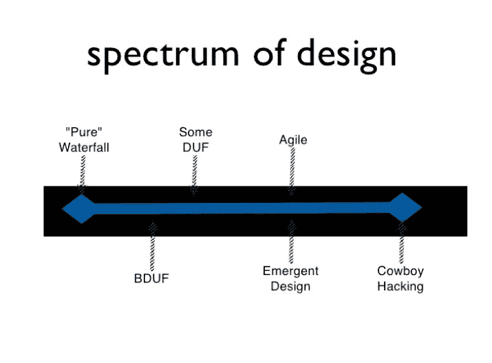

# 进化设计

> 原文：<https://blog.devgenius.io/evolutionary-design-cfb1795e8f81?source=collection_archive---------2----------------------->

软件系统进化时如何控制复杂度？

物种的进化遵循一些简单的规则。我们可以将其概括为“自然选择”:

> 如果在漫长的岁月中，在不同的生活条件下，有机生物在其组织的几个部分有所不同，我认为这是无可争议的；如果有，由于每个物种增长的高几何功率，在某个年龄，季节，或一年，一个严重的生活斗争，这当然不能有争议；然后，考虑到所有有机生物相互之间的关系及其生存条件的无限复杂性，导致结构、体质和习惯的无限多样性，对它们有利，我认为如果没有任何变化对每个生物自身的福利有用，就像如此多的变化对人类有用一样，这将是一个最不寻常的事实。但是，如果对任何有机生物有用的变异确实发生了，那么具有这种特征的个体肯定会有最好的机会在生存斗争中被保存下来；从强有力的遗传原则，他们将倾向于产生类似特征的后代。为了简洁起见，我把这种保存原则称为自然选择。
> 
> *——达尔文《物种起源》第四章中的*

*所以变异发生了，其中一些变异使他们的生命有更多的可能性有后代。通过继承法，这些新特征将会传给下一代。*

*由于新的需求，大多数软件系统在它们的生命周期中一直在变化，正如达尔文所说的，反过来应该是一个非同寻常的事实。科技公司依赖软件，如果他们的系统不发展，你认为会发生什么？(他们会死)。*

*所以进化设计总是在发生，你要引入新的功能，改变事物以保持活力。*

## *偶然复杂性*

*当你开始死亡时，问题就来了，但你并没有意识到这一点。你可以称之为“科技债务”，我更喜欢这个术语[偶然的复杂性](https://youtu.be/WSes_PexXcA)。
但是在你死之前你会看到一些信号，团队需要多得多的时间来添加新功能。当你把一些东西投入生产时，发现大量的 bug 是正常的。这些是糟糕的代码库、糟糕的设计的最初迹象。*

> *热力学第二定律指出，任何孤立系统的熵总是增加的。*

*这适用于任何复杂的系统，在软件中，这意味着将要发生的自然的事情将是混乱。如果你不认真工作来减少系统内部的熵(偶然的复杂性),结果将是混乱。熵是在你添加到代码中的任何变化中引入的，任何特性都会增加熵，这是事实。开发人员的大脑能够控制某种程度的熵，我能够记住在代码的某些部分我能做或不能做的事情，但我有一个极限([认知负荷](https://en.wikipedia.org/wiki/Cognitive_load))。*

*你可能认为团队中更多的人意味着更多的认知负荷，问题是团队的规模也有限制([邓巴的数字](https://en.wikipedia.org/wiki/Dunbar%27s_number))。这是一种理解为什么团队不能永远成长的图形化方式:*

**

*[哑铃数量](https://www.rolandberger.com/en/Insights/Publications/Achieve-efficiency-in-groups-using-Dunbar%E2%80%99s-number.html)*

*因此，如果我不能增加人们和团队的认知负荷，我生存的唯一可能性就是减少我的系统的熵。因此，每个系统都需要由一个小团队拥有(让不同的团队在同一个系统中工作与扩大团队是一样的),能够控制意外的复杂性。团队的有效性依赖于信任，你不能信任 60 个人，要有高绩效的团队，他们必须是小团队。*

## *怎样才能降低偶然复杂度(熵)？*

*答案是重构，重构你的代码是控制意外复杂性要考虑的第一件事。但是重构有一些要求，没有测试就不能重构。这就是这句话的原因“如果有效，不要改变它”，有这种想法的团队没有测试，因为如果他们改变了一些东西，他们就会引入 bug。*

> *重构是一种改进现有代码库设计的受控技术。它的本质是应用一系列保持行为的小转换，每一个都“太小而不值得做”。然而，这些转变的累积效应是相当显著的。通过一小步一小步地做，你减少了引入错误的风险。您还可以避免在进行重构时系统崩溃——这允许您在一段较长的时间内逐步重构系统。
> [https://martinfowler.com/books/refactoring.html](https://martinfowler.com/books/refactoring.html)*

*所以重构只是为了减少意外的复杂性，当你添加新的行为时，你不是重构。你只能重构有效的东西。当你重构的时候，你总是有引入新错误的风险，这就是为什么要一步一步来，并且在每一步中验证一切都保持不变。重构时，小步骤非常重要。当你处于绿色状态时，当你知道你的代码正在做你的测试所要求的事情时，你重构你的代码。当我们处于“通过测试阶段”时，我们不能重构，让我们先把它做好。*

## *我们能用重构来设计吗？*

**

*[紧急设计尼尔·福特](https://www.slideshare.net/ThoughtWorks/neal-ford-emergent-design-and-evolutionary-architecture)*

> **BDUF，以其最优秀的稻草人形式，体现了象牙塔中的架构师创建设计工件，将它们放入地板上的一个洞，让倒霉的编码人员不加修改地实现。在非实体的形式中，这种设计方法在编码开始之前努力尝试发现一切有趣的东西。这是一个设计软件的预测性、主动性模型。**
> 
> **紧急设计不是二元状态。你不能肯定地说你的设计是 100%敏捷或者 0%敏捷；它存在于一个谱上* [*尼尔·福特*](https://www.ibm.com/developerworks/library/j-eaed19/index.html) *BDUF =大设计前期
> DUF =设计前期**

*紧急设计是最便宜的设计方式，因为它应用[最后负责的时刻](https://medium.com/dev-genius/to-decide-or-not-to-decide-thats-the-question-f186d5858aba?sk=e688678f0ab5896dcb6bbcfbaf46d7d6)来创建你的结构。*

*为了控制混乱，你需要重构(简化你的代码)，而重构需要测试。但这还不够，我们可以尝试创建系统来解决我们将来会遇到的问题。这给你的系统增加了意外的复杂性， [YAGNI](https://en.wikipedia.org/wiki/You_aren%27t_gonna_need_it) 原则试图对抗这一点。试图解决一个比你现有的问题更复杂的问题总是要付出更高的代价。所有这些都是在 XP 中引入的，目的是让紧急设计成为比 BDUF 或 DUF 更好的选择，来创建易于发展的产品。*

## *如何练习应急设计？*

*TDD 是实现紧急设计最简单的方法。我喜欢鲍勃·艾伦的这些问答:*

> *我总是收到关于 TDD 的三个问题(包括如何开始):*
> 
> *问:我如何知道从哪里开始？答:从可能有效的最简单的事情开始(TSTTCPW)。*
> 
> *问:我如何知道接下来要测试什么？答:下一个测试应该总是要求被测代码做一些它还不知道如何做的事情。这就是测试驱动新代码的本质。如果您已经穷尽了不同的案例，那么添加第二个案例来验证现有的行为也无妨，以防您第一次做了一个非常愚蠢的实现。例:给定三个期望“嘶嘶”，运行绿色的实现是如果给定== 3 则返回“嘶嘶”。像 given 99 这样的第二次测试会发现这一点。*
> 
> *问:我如何知道我什么时候完成了？答:当你确信在你的逻辑中涵盖了每个不同路径的 2 个例子时。如果你以一种合乎逻辑的方式对测试进行分组，那么就更容易直观地识别出你是否覆盖了所有的案例。记住:TDD 本质上是一个渐进的探索过程。*
> 
> *[https://www . LinkedIn . com/posts/boballenagilist _ TDD-testdrivingcode-activity-6766379546817179648-DJTv](https://www.linkedin.com/posts/boballenagilist_tdd-testdrivingcode-activity-6766379546817179648-DJTv)*

*这意味着将你的大问题分解成小问题(可行的案例),从你能想象的小问题开始:*

*   *转换测试中的小问题。*
*   *编写通过测试所需的最少代码。*
*   *重构代码。*

> *对于每个想要的改变，让改变变得容易(警告:这可能很难)，然后让改变变得容易
> 【https://twitter.com/KentBeck/status/250733358307500032?s=20】T4*

*在重构阶段，你可以使用你在代码中看到的味道来重构和创建新的类，新的模块，无论你需要什么来消除你的代码的问题，但是不要添加代码来修复你已经有的另一个问题。不要在这三个阶段之外创建你的类结构或者任何你需要的东西，不要在你修复测试的时候重构，只需要听代码和你的测试。*

*一旦你这样做了，选择下一个小问题( [TPP](https://blog.cleancoder.com/uncle-bob/2013/05/27/TheTransformationPriorityPremise.html) 可以帮助你)，然后重新开始，直到你找到解决方案。
您的设计将在您解决问题的同时创建。*