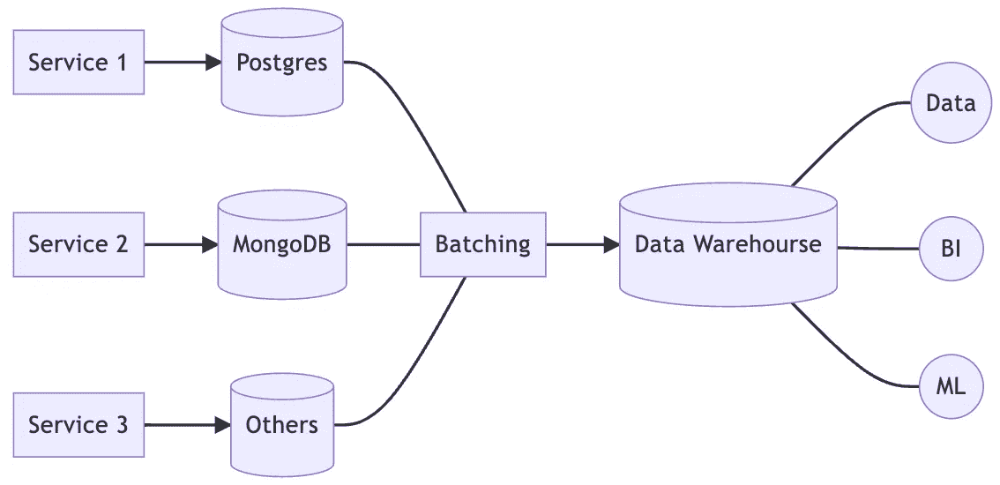
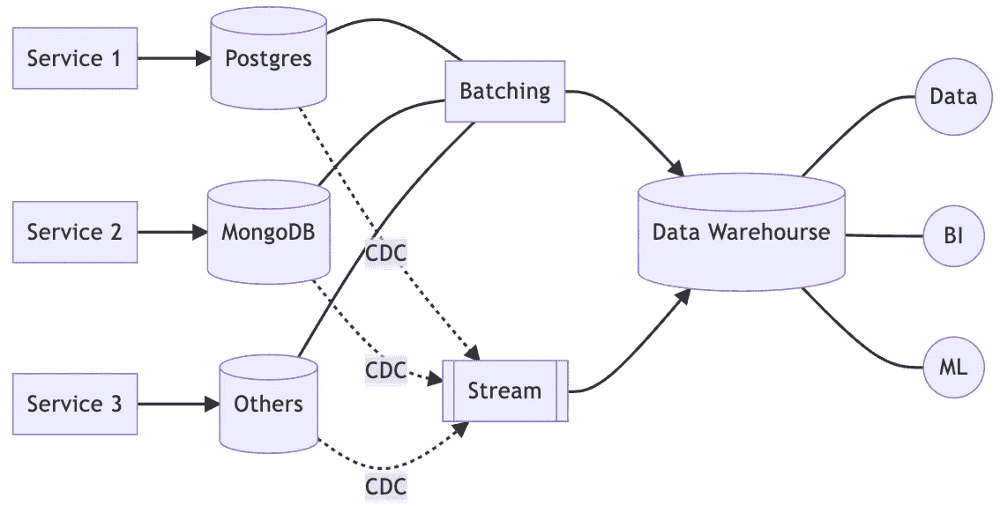
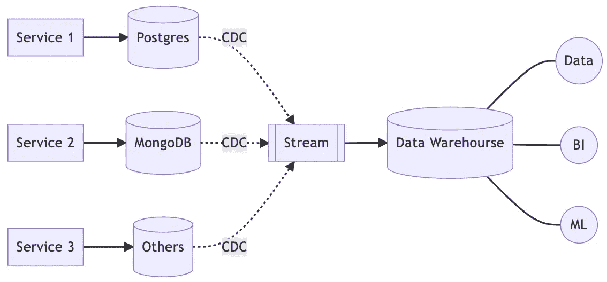

# 从批处理到流处理的演变

> 原文：<https://blog.devgenius.io/evolutionary-from-batching-to-streaming-7a9a7942922?source=collection_archive---------9----------------------->

## 从一小步开始

Jukan Tateisi 在 [Unsplash](https://unsplash.com/photos/bJhT_8nbUA0) 上拍摄的照片

上次我们谈到了数据基础设施的[演进，整个演进过程如下。](https://lazypro.medium.com/evolutionary-data-infrastructure-4ddce2ec8a7e)

*   阶段 0:无
*   阶段 1:配料
*   第二阶段:流式传输
*   第三阶段:整合
*   第四阶段:自动化
*   第五阶段:权力下放

但是记得吗？从阶段 1 到阶段 2 的演变有点奇怪，因为我们只是放弃了正在使用的批处理，并构建了一个新的流处理。

事实上，已经在生产环境中的产品不会做出如此剧烈的改变，而是会选择增量迁移过程。

因此，在本文中，我们将详细解释从阶段 1 到阶段 2 的迁移在实践中是如何工作的。

# 阶段 1:配料

让我们再次回顾一下批处理架构。

在这个架构下，我们有一个批处理角色，负责将来自各种服务的数据归档到数据仓库。批处理还执行数据预处理，以生成用于加速分析目的的结构化数据。

然而，为了支持实时分析，我们从上一篇文章中了解到，我们必须引入一个流架构，但同时我们希望保留原有的分析功能。

换句话说，在保持现有架构和功能的同时，有必要添加额外的实时分析功能。

所以，让我们开始尝试添加流架构。

# 阶段 1.5:分批+分流

在上一篇文章中，我们采取了一种激进的方法，简单地放弃批处理，代之以流式处理。这将使体系结构变得简单，但代价是要完全重写所有的分析，因为来自流的数据与来自批处理的数据格式不同。

因此，我们添加了一个额外的 1.5 阶段，以允许批处理和流式处理共存一段时间，直到我们可以更改分析框架，将流式数据源用于所有后续分析。

这样做的好处当然是我们不需要做大爆炸。

> 据报道，正如马丁·福勒所说，“生活大爆炸重写唯一能保证的就是生活大爆炸！”。

然而，缺点是显而易见的，当有任何修改需求时，我们必须同时实现批处理和流处理，这大大增加了维护的难度。

因此，虽然有 1.5 阶段，但重要的是要认识到这只是一个过渡期，不应被视为解决方案。

# 第二阶段:流式传输

一旦我们有了一个过渡期，我们就可以更顺利地从批处理发展到流处理。在前一阶段，我们将逐步将所有功能从批处理转移到流处理。

最后，去掉批处理就更容易了。

但是正如我在[我的上一篇文章](https://lazypro.medium.com/evolutionary-data-infrastructure-4ddce2ec8a7e)中所说的，批处理仍然有它的价值，所以即使它被从主数据管道中取出，我们仍然会在那里进行批处理。

它只是从主要的数据生产者转变为次要的生产者，定期重组数据仓库中的数据以提高数据利用率。当然，批处理也可以用于将过时的数据从数据仓库转移到冷存储，从而进一步节省存储成本。

# 结论

整个进化过程应该是平稳渐进的。

为了避免大爆炸，从一种架构转移到另一种架构是一个艰难的选择。每次迁移的影响要尽可能小，但同时也不能太小，使阵痛期太长。

总的来说，每个组织都有不同的节奏。对于一个拥有充足人力资源的组织来说，这种前进可以是积极的和快速的，或者相反，是有节制的。

但无论如何，重要的是要了解困境，并提出一个足够合理的方法，更重要的是，一个完整的迁移计划。

这个规划过程实际上与架构变更一样重要。