# 让我们深入研究如何设置带有 ETL 作业的 AWS Glue，然后通过 AWS Athena 查询数据

> 原文：<https://blog.devgenius.io/example-of-an-etl-job-in-aws-glue-and-query-in-aws-athena-383d9ec89400?source=collection_archive---------0----------------------->

让我们来看一个简单的端到端流程，使用 AWS Glue 将数据从一种格式转换为更容易查询的格式，然后使用 AWS Athena 查询它。我们将只通过控制台来研究这个问题，在以后的文章中，我们将更多地关注如何使用 terraform 来自动化这个问题。

本帖所有数据均来自 apache 日志，可从 [Github](https://github.com/elastic/examples/blob/master/Common%20Data%20Formats/apache_logs/apache_logs) 下载。数据被分成 5 部分，以模拟日志是在 5 个不同的时间上传的。

你可以在这里下载拆分:[日志 1](https://craig.goddenpayne.co.uk/assets/img/glue-athena-1/log1.log) [日志 2](https://craig.goddenpayne.co.uk/assets/img/glue-athena-1/log2.log) [日志 3](https://craig.goddenpayne.co.uk/assets/img/glue-athena-1/log3.log) [日志 4](https://craig.goddenpayne.co.uk/assets/img/glue-athena-1/log4.log) [日志 5](https://craig.goddenpayne.co.uk/assets/img/glue-athena-1/log5.log)

# 上传数据

为了在 AWS 中查询数据，您需要将数据文件上传到 S3 存储桶中，您可以使用上面的示例文件，或者只是一些随机的 apache 日志文件。

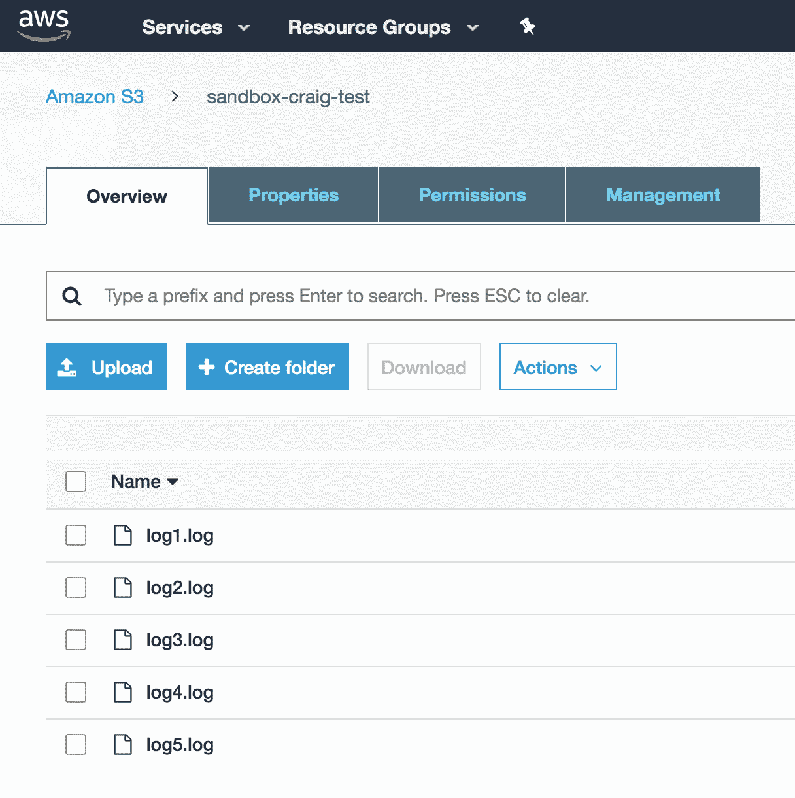

S3 水桶

# 设置 AWS 粘合作业

在 AWS 控制台中，搜索 Glue。打开后，导航到数据库选项卡。创建一个新数据库，我创建了一个名为 craig-test 的数据库。该数据库用作数据目录，存储关于模式信息的信息，而不是实际数据。

 [## 数据驱动的投资者|微软比 Chrome 有“优势”

### 简史我从来不是浏览器的粉丝，确切地说，我只是一个浏览器的粉丝，Chrome。这是我的…

www.datadriveninvestor.com](https://www.datadriveninvestor.com/2020/03/29/microsoft-having-an-edge-over-chrome/) 

检查 tables 部分，您将看到一条消息，表明在数据目录中没有定义表。接下来要做的是创建一个爬虫，它将收集关于数据的元数据。

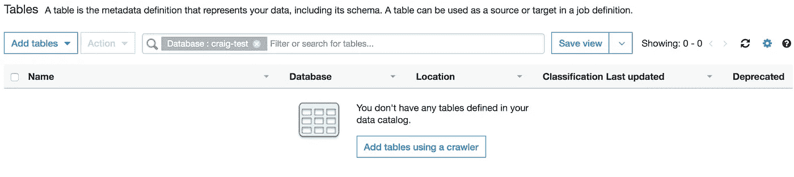

数据图表视图

# 创建爬虫

在胶水中，创造一个爬虫。

让爬虫查看 S3 存储桶，并将其设置为写入之前创建的数据库数据目录。

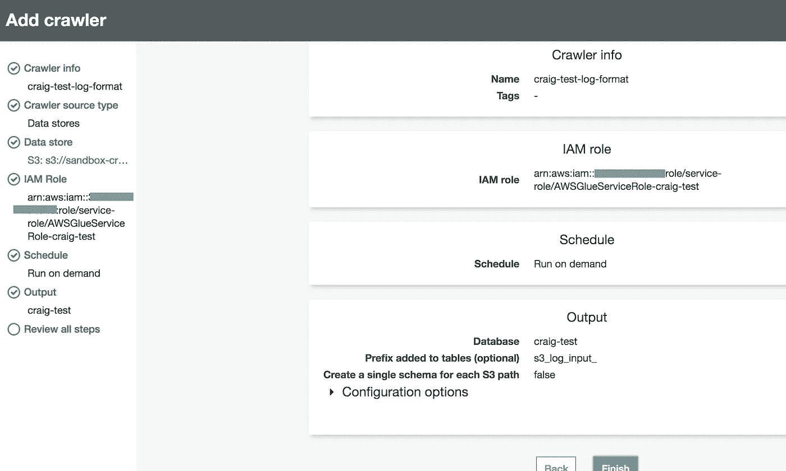

添加爬网程序

如果您将 crawler 设置为按需，则需要在创建完 crawler 后运行它。

Glue 将非常快速地爬行并确定日志文件的格式。对于我的例子，它提到数据看起来像是 apache 格式，并且它详细描述了模式看起来像什么。

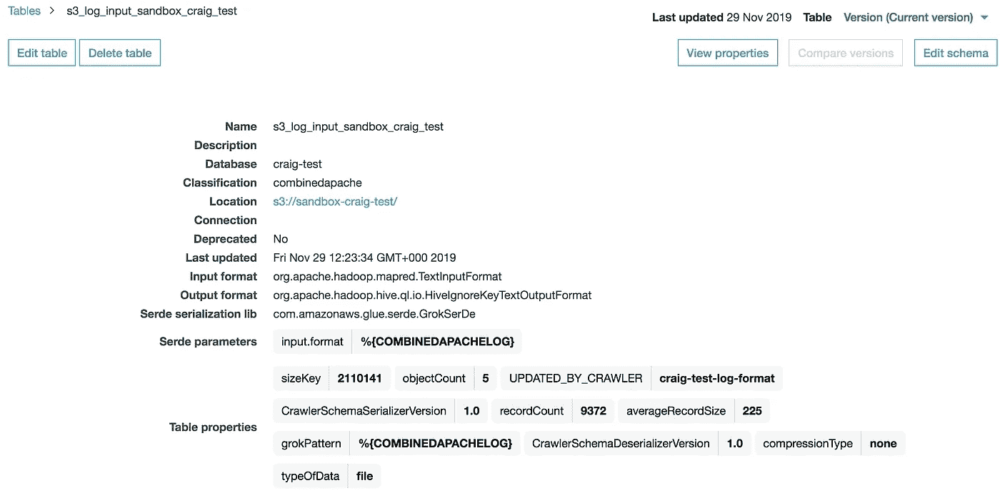

模式外观的示例

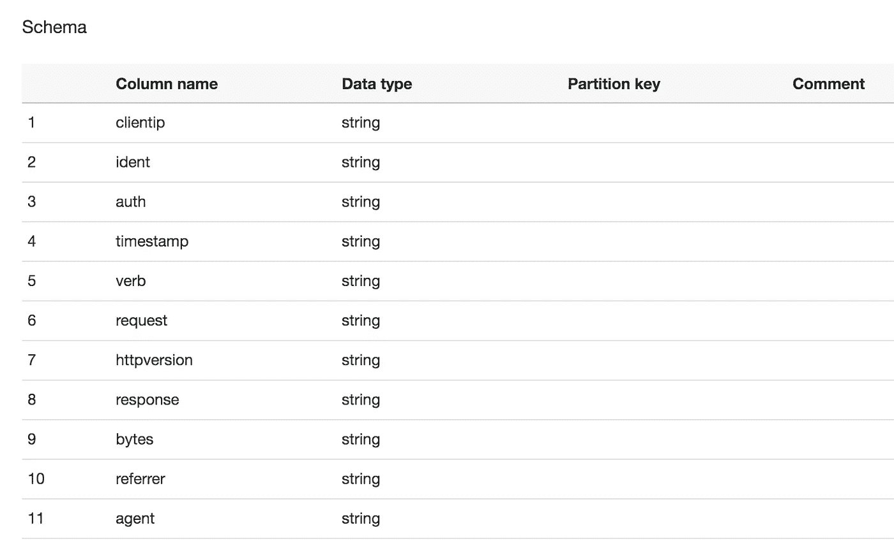

模式的更多细节

# 创建 ETL 作业

下一步是创建一个 ETL 作业，它将获取日志，并将它们从 apache 日志格式转换成 parquet 格式的列数据。

在 Athena 中使用诸如 parquet 之类的格式进行查询要比每次都扫描整个数据更加高效和经济。

创建了 n Glue job，并添加了一个数据源，我使用了 craig-test bucket。设置目标桶，我使用 craig-test-processed 桶。

选择您想要的拼花格式的目的地。点击 next，apache spark 代码将会自动生成，但是很容易阅读并在需要时进行修改。

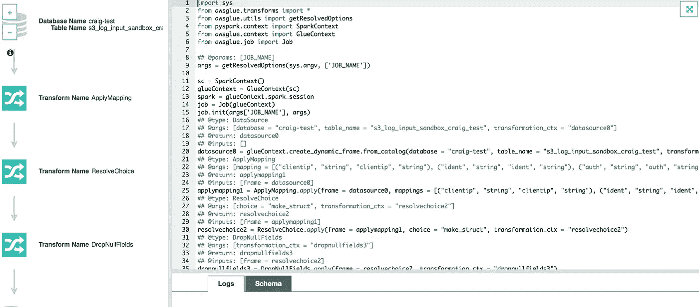

自动生成的代码

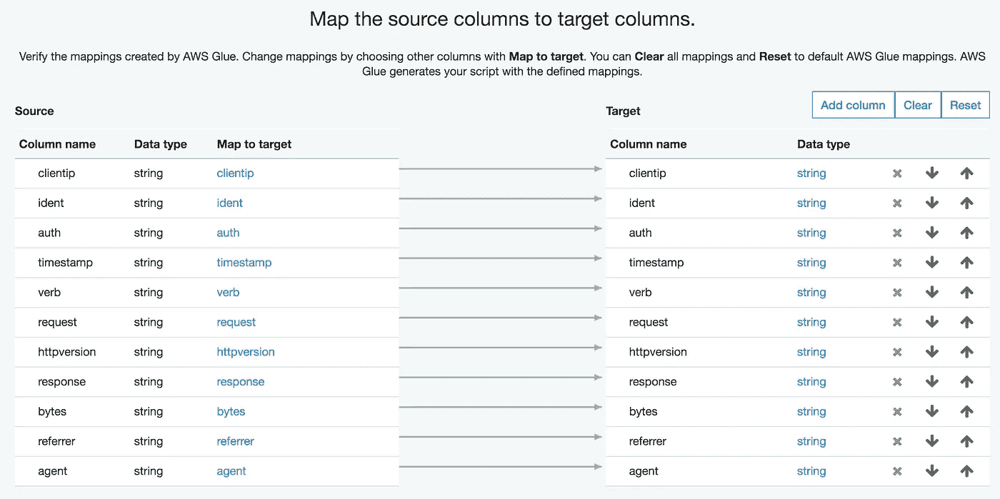

自动映射的列

完成创建作业后，运行该作业。几分钟后这项工作就完成了。

# 问题或故障

在我第一次运行时，我忘记了权限，但是如果您遇到任何问题，通过查看 Cloudwatch 很容易诊断出来。

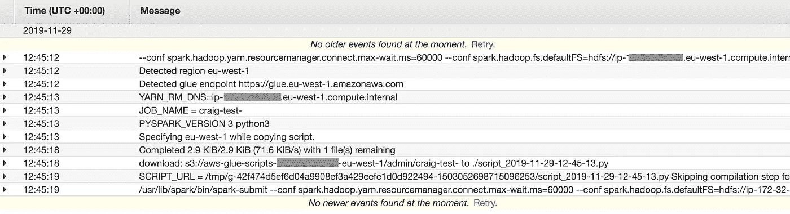

云观察

在我的情况下，这是由于 IAM 权限。我忘了允许 glue 角色访问我的输出桶。

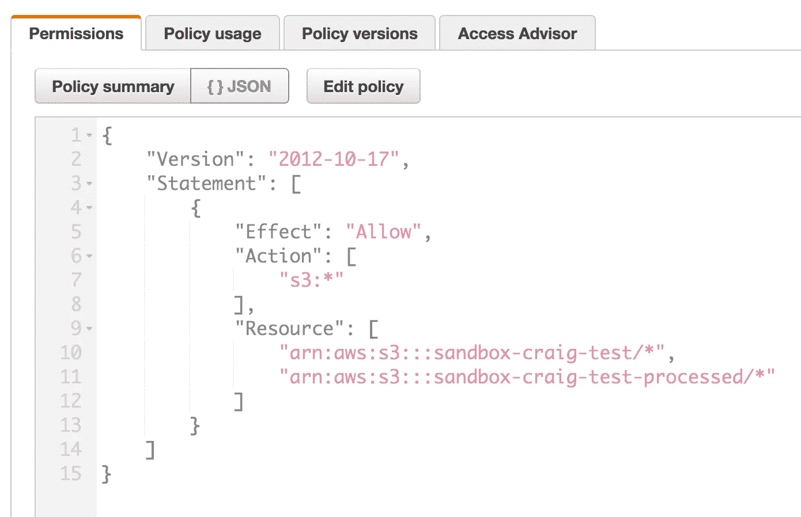

木桶策略

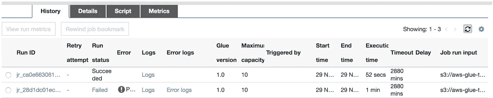

作业运行

# 重建模式

检查 s3 处理的存储桶，您应该会发现 parquet 文件已经准备好，可以让我使用 AWS Athena 进行查询。

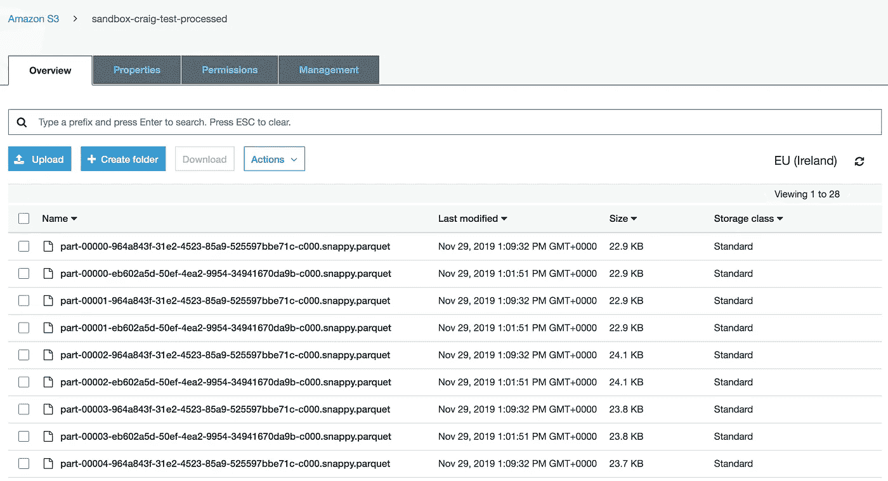

S3 产量

您需要重新构建模式以包含新的数据集。在我的例子中，我更新了包括转换的柱状拼花地板格式。

这一次，创建一个新的爬行器，并爬行包含已处理文件的 S3 桶。

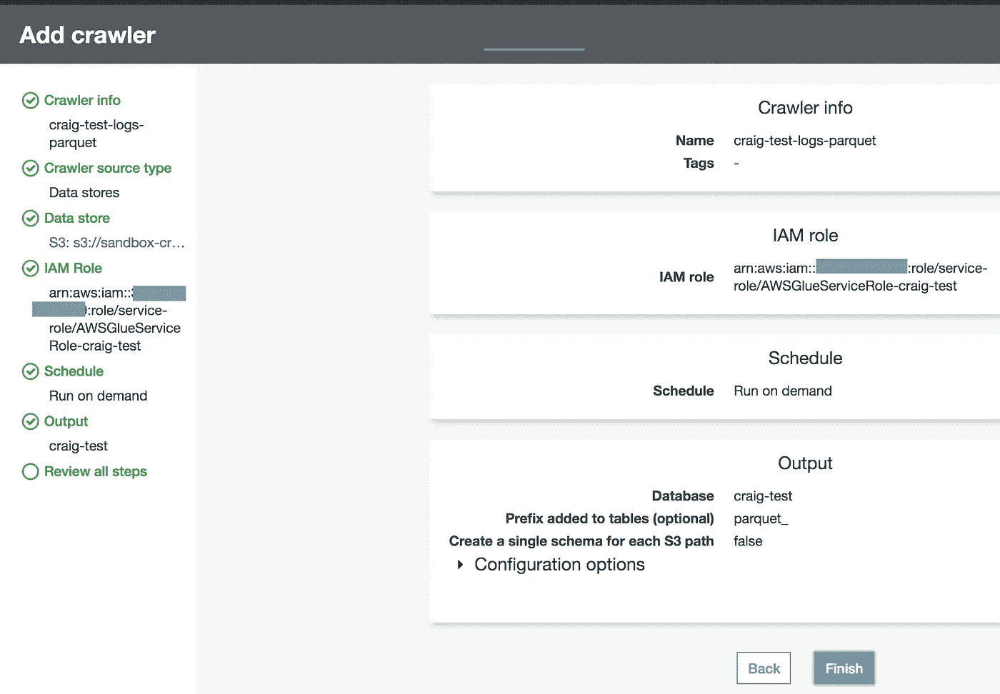

添加爬网程序

一旦运行了它，并且模式已经被添加到数据目录中，就该进行查询了。

# 使用 AWS Athena 进行查询

一旦进入 Athena，您就可以从日志中查询数据。查询拼花地板日志既经济又快捷。而查询原始数据既昂贵又缓慢。

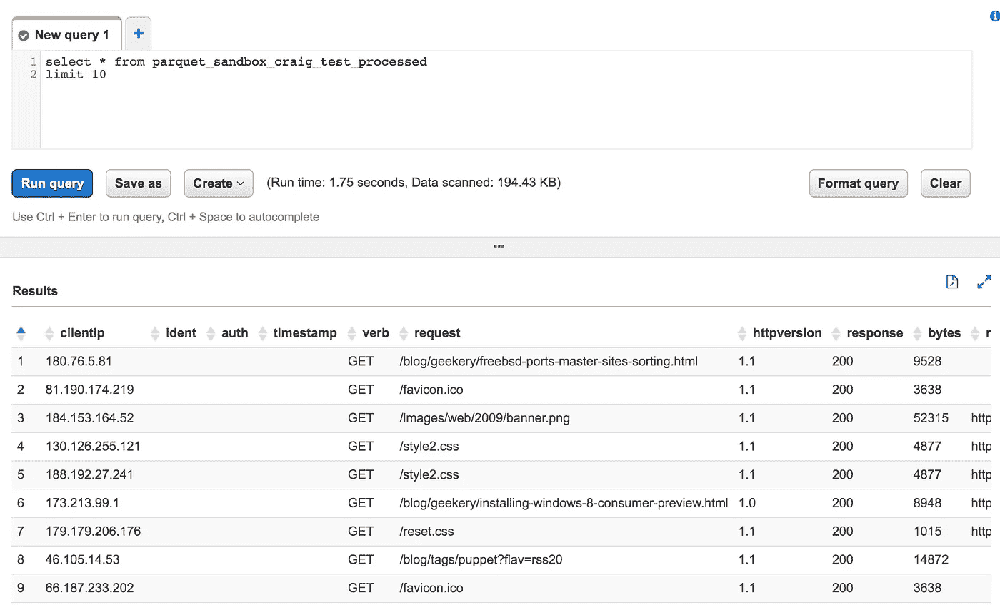

AWS 雅典娜

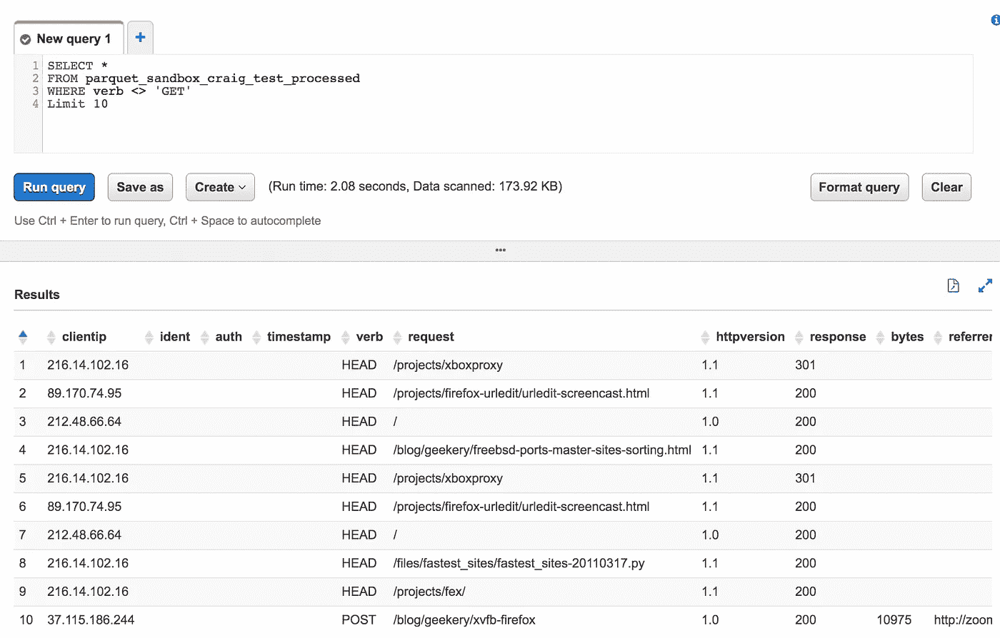

雅典娜查询

这个简单查询的不同之处在于拼花地板数据。如果你看看处理的数据量，你会发现它会贵多少

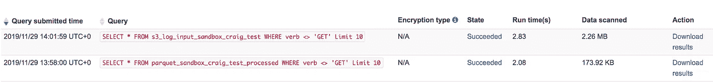

# 结论

尽可能以结构化格式查询数据