# 使用 AWS Cognito 进行 Spring Boot 应用程序身份验证的示例

> 原文：<https://blog.devgenius.io/example-of-spring-boot-application-authentication-with-aws-cognito-55ce34fa53dc?source=collection_archive---------2----------------------->

在本文中，我计划展示一个使用 AWS Cognito 的 Spring Boot 应用程序认证的例子。我将展示两个流程 1) OIDC 认证 2) SAML 认证。

# AWS Cognito

[AWS Cognito](https://aws.amazon.com/cognito/) 是来自 AWS 的一个 web 服务。Cognito 是一个用户目录以及一个认证机制服务。在企业行业中，从用户角度来看，每个应用程序都有两个需求。

1.  用户目录和同步
2.  用户认证

Cognito 通过允许创建用户池或身份池使这变得更容易。一旦有了池，就可以用各种身份验证设置来配置应用程序。Cognito 的另一个主要优势是它提供了行业标准的安全认证协议，如 OAuth 2.0、OpenID Connect、SAML。

还有其他类似用户访问处理的特性，但是我们不会在这篇文章中详细讨论。在这篇文章中，我将进一步展示我们如何创建一个用户池并配置一个应用程序来使用这个用户池。

# Spring Boot 应用

我们将使用一个简单的 Spring Boot 程序。我们将把这个应用程序与 AWS Cognito 集成起来进行身份验证。

# Spring Boot 设置

在 Gradle 文件中添加以下依赖项

```
implementation 'org.springframework.boot:spring-boot-starter-security' implementation 'org.springframework.boot:spring-boot-starter-thymeleaf' implementation 'org.springframework.boot:spring-boot-starter-web' implementation 'org.springframework.security:spring-security-oauth2-client' implementation 'org.springframework.security:spring-security-oauth2-jose'
```

而`application.properties`将需要 oauth2 配置属性:

```
# ==================================================================================== ## SSL Keystore for HTTPS # ==================================================================================== 
#security.require-ssl=true 
server.port=8743 
server.ssl.key-store-password=****** 
server.ssl.key-store=classpath:sssstore.p12 
server.ssl.key-store-type=PKCS12 
server.ssl.key-alias=selfsigned_localhost # ===================================================================================== spring.security.oauth2.client.registration.cognito.clientId=7mtivo8jobdtd6dvocldkmu6qk spring.security.oauth2.client.registration.cognito.clientSecret=********* spring.security.oauth2.client.registration.cognito.scope=openid spring.security.oauth2.client.registration.cognito.redirect-uri=https://localhost:8743/login/oauth2/code/cognito spring.security.oauth2.client.registration.cognito.clientName=SpringBootCognitoDemo spring.security.oauth2.client.registration.cognito.authorization-grant-type=authorization_code spring.security.oauth2.client.provider.cognito.issueUri=https://cognito-idp.{awszone}.amazonaws.com/{userPoolId} spring.security.oauth2.client.provider.cognito.authorization-uri=https://{customDomain}.auth.{awszone}.amazoncognito.com/oauth2/authorize spring.security.oauth2.client.provider.cognito.token-uri=https://{customDomain}.auth.{awszone}.amazoncognito.com/oauth2/token spring.security.oauth2.client.provider.cognito.jwk-set-uri=https://cognito-idp.{awszone}.amazonaws.com/{userPoolId}/.well-known/jwks.json spring.security.oauth2.client.provider.cognito.user-name-attribute= cognito:username
```

# 安全配置

我们的主控制器类如下所示:

```
@Controller
public class MainController
{
    @GetMapping("/")
    public String home(Model model, Principal principal)
    {
        model.addAttribute("username", principal.getName());
        return "index";
    }
}
```

因此，当我们访问我们的应用程序时，它将重定向到 AWS Cognito UI 进行身份验证。基于选定的流 OIDC 或 SAML，将进行身份验证。

安全配置如下所示:

```
@Configuration
public class SecurityConfig extends WebSecurityConfigurerAdapter
{
    @Autowired
    public CustomLogoutSuccessHandler customLogoutSuccessHandler;

    @Override
    protected void configure(HttpSecurity httpSecurity) throws Exception
    {
        httpSecurity.csrf()
                .and()
                .authorizeRequests()
                .anyRequest()
                .authenticated()
                .and()
                .oauth2Login()
                .and()
                .logout()
                .logoutUrl("/logout")
                .logoutSuccessHandler(customLogoutSuccessHandler)
                ;

    }
}
```

我们的简单索引模板如下所示:

```
<!DOCTYPE html>
<html 
      xmlns:th="http://www.thymeleaf.org">
<head>
    <meta charset="utf-8">
    <meta content="width=device-width, initial-scale=1" name="viewport">
    <title>Cognito Demo</title>
</head>
<body>
<div class="container">
    <h1 class="title">OAuth 2.0 Spring Security Cognito Demo</h1>
    <div>
        <div class="box">
            Hello, <strong th:text="${username}"></strong>!
        </div>
        <a th:href="@{/logout}" class="btn btn-primary">Logout</a>
    </div>
</div>
</body>
</html>
```

# 创建用户池

登录 AWS 控制台后，选择 Cognito 作为 AWS 服务。第一个屏幕将向您显示两个选项—创建用户池和创建身份池。

我们将选择创建用户池。

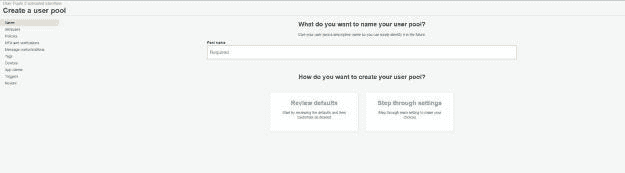

为您的用户池输入一个合适的名称，然后选择逐步设置。这将允许我们修改任何我们不想在我们的用例中使用的设置。

现在为用户选择用户池属性。这些属性允许我们识别用户以及用户在身份验证期间可以输入的内容。

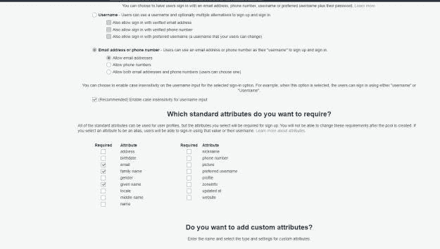

对于我们的演示，我们选择了电子邮件地址、姓氏和名字作为属性。因此，用户将使用电子邮件地址登录应用程序。

对于密码策略，我们设置了密码最小长度为 8，应该是字母数字，包含大写和小写字符。

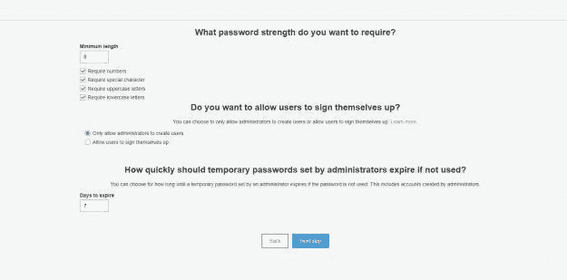

大多数其他设置我们将选择为默认设置。对于应用程序客户端步骤，我们将选择基于用户名和密码的身份验证进行身份验证流。

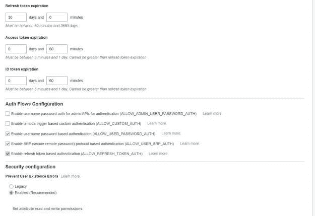

# 应用程序客户端配置

创建用户池后，我们将继续进行下一组配置，其中包括应用程序客户端。在这个配置中，我们配置将使用用户池的应用程序。

我们需要启用身份提供者和认知用户池。

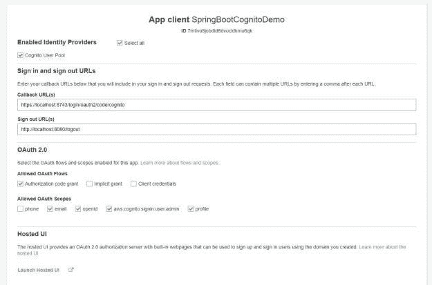

# 配置联盟身份提供者

如前所述，我们还将为身份验证配置一个 SAML 身份提供者。在这种情况下，流程将是 application-> AWS cogn ITO-> SAML Identity Provider。

# 在 Okta 中配置应用程序

对于这个演示，我们将使用 Okta 作为 SAML 身份提供者。登录 [Okta 管理员控制台](https://developer.okta.com/signup/)，配置一个新的 SAML 集成应用，如下图:

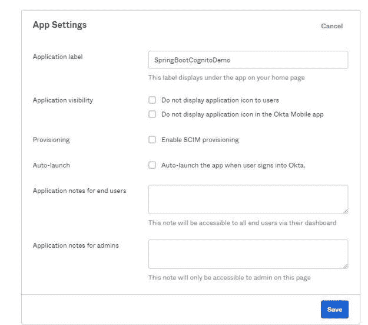

下一步，提供单点登录 URL，这将是`https://{yourcustomdomainfromcognito}.auth.{awszone}.amazoncognito.com`。我们还需要提供观众 URI (SP 实体 ID)。在这种情况下，Cognito 将作为 Okta 的服务提供商。

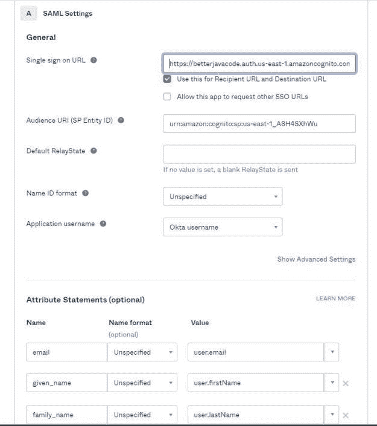

我们还需要如上图所示配置`Attribute Statements`。这些是我们在 Cognito 用户属性中配置的属性——电子邮件、名、姓。

确保您计划使用的用户在 Okta 用户目录中。这将是同一个用户，我们将需要在 Cognito 用户池配置或通过注册创建。

# 在 Cognito 中配置联合身份提供者

*   在我们的用户池配置中，选择联合身份提供者。
*   选择 SAML 选项，Cognito 将显示为身份提供者上传元数据文件或元数据 URL。在我们这里会是[***https://dev-19753289 . okta . com/app/exk mt 322 Q1 KL 15 rsk 5d 6/SSO/SAML/metadata****。*](https://dev-19753289.okta.com/app/exkmt322q1Kl15Rsk5d6/sso/saml/metadata.)
*   键入联合身份提供者的名称并保存更改。

因此，如果我们返回到应用程序客户端设置，我们应该会看到一个选择联合身份提供者的选项。使用新的配置，我们的设置如下所示:

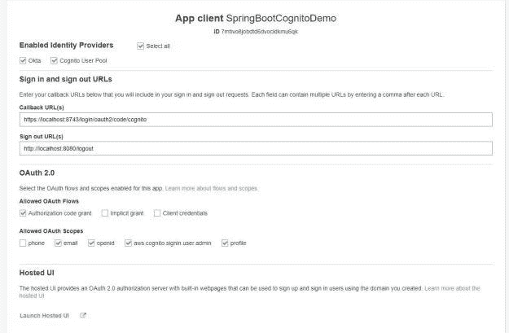

无论如何，确保 Cognito 中的用户属性(名、姓和电子邮件)是可编辑的。

但是，我们已经完成了配置。现在我们可以展示演示了。

# 使用 AWS Cognito 进行 Spring Boot 应用程序身份验证的演示

现在，如果我运行我的应用程序并在`https://localhost:8743/`访问它，我将看到以下屏幕，选择要验证的身份提供商:

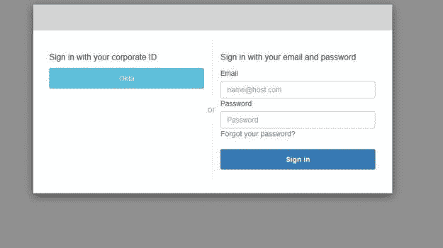

所以我们可以用 Okta 或者 Cognito 用户池来登录。

# 抽样流程

1.  用户访问向 Cognito 发送授权代码流 OAuth 请求的应用程序
2.  Cognito 向 Okta 发送 SAML 请求。
3.  用户在 okta 登录屏幕上输入凭证。
4.  Okta 在端点`[https://{customdomain}.auth.{awszone}.amazoncognito.com/saml2/idpresponse](https://{customdomain}.auth.{awszone}.amazoncognito.com/saml2/idpresponse)`将 SAML 响应发送回 Cognito
5.  Cognito 处理 saml 响应，并生成授权代码和返回给应用程序的响应。
6.  应用程序使用授权代码从 Cognito 获取令牌，并在验证令牌时对用户进行身份验证。

最重要的是，成功认证后，用户将看到

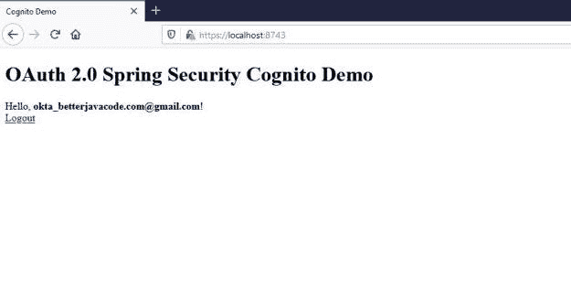

如果我们没有选择 Okta，而是在同一个 Home Realm Discovery 屏幕上选择了 Cognito 登录，我们将在成功认证后看到以下内容:

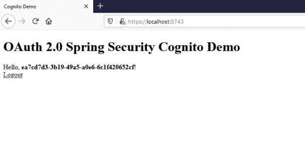

# 结论

在这篇文章中，我展示了如何使用 AWS Cognito 对 Spring Boot 应用程序进行身份验证。此外，Cognito 有助于配置用户以及删除安全流的样板代码。

总之，如果你还没有买我的电子书《简化 Spring 安全》,可以在这里找到。

*原载于 2021 年 4 月 23 日*[*【https://betterjavacode.com】*](https://betterjavacode.com/programming/example-of-spring-boot-application-authentication-with-aws-cognito)*。*