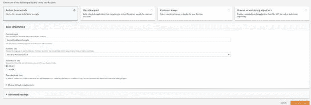
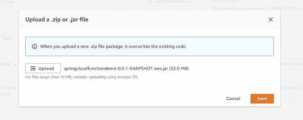

# 使用 AWS Lambda 的 Spring 云函数示例

> 原文：<https://blog.devgenius.io/example-of-spring-cloud-function-with-aws-lambda-25af76c82916?source=collection_archive---------10----------------------->

在这篇文章中，我们将学习 Spring Cloud 函数，并将在 AWS Lambda 上部署一个 Spring Cloud 函数的示例。在这篇文章的结尾，我们将对无服务器功能有更多的了解。如果你想了解更多关于无服务器架构的知识，这篇文章将带你开始。

# 什么是春云函数？

春云功能是[春云](https://betterjavacode.com/spring-boot/spring-cloud-tutorial-for-beginners)的特色之一。它允许开发人员编写具有 Spring 特性的云无关函数。这些函数可以是独立的类，可以很容易地部署在任何云平台上来构建一个无服务器的框架。Spring Cloud 提供了一个库[*Spring-Cloud-starter-function-web*](https://search.maven.org/classic/#search%7Cga%7C1%7Cg%3A%22org.springframework.cloud%22%20AND%20a%3A%22spring-cloud-starter-function-web%22)允许构建具有 Spring 特性的函数，它带来了所有必要的依赖。

# 为什么要用 Spring Cloud 函数？

这个问题更多的是什么时候使用 Spring Cloud 功能。基本上，Spring Cloud 函数库允许创建可以在 AWS Lambda 上轻松部署的功能应用程序。这些函数遵循 Java 8 的模式`Supplier`、`Consumer`和`Function`。

`spring-cloud-starter-function-web`该库为处理请求、流提供了本地交互。

# 弹簧云函数的特征

Spring Cloud 功能的主要优势是它提供了 Spring Boot 的所有功能，如`autoconfiguration`、`dependency injection`。但是还有更多的功能:

*   输入和输出的透明类型转换
*   POJO 函数
*   REST 支持将函数公开为 HTTP 端点
*   通过 Spring Cloud Stream 框架向/从函数传输数据
*   将函数部署为独立的 jar 文件
*   AWS Lambda、谷歌云平台、微软 Azure 的适配器

# 演示

作为这篇文章的一部分，我们将创建 Spring Cloud 函数并将其部署在 AWS Lambda 中。一旦我们创建了一个常规的 spring boot 应用程序，在您的 Gradle 文件中添加以下依赖项:

```
dependencies {
	implementation 'org.springframework.boot:spring-boot-starter'
	implementation 'org.springframework.boot:spring-boot-starter-data-jpa'
	implementation 'org.springframework.cloud:spring-cloud-function-adapter-aws:3.2.1'
	implementation "com.amazonaws:aws-lambda-java-events:${awsLambdaEventsVersion}"
	implementation "com.amazonaws:aws-lambda-java-core:${awsLambdaCoreVersion}"
	runtimeOnly 'com.h2database:h2'
	testImplementation 'org.springframework.boot:spring-boot-starter-test'
}
```

注意依赖关系`spring-cloud-function-adapter-aws`允许我们将 Spring Cloud 函数与 [AWS Lambda](https://aws.amazon.com/lambda/) 集成。

应用程序的一个主类如下所示:

```
package com.betterjavacode.springcloudfunctiondemo;

import org.springframework.boot.autoconfigure.SpringBootApplication;
import org.springframework.cloud.function.context.FunctionalSpringApplication;

@SpringBootApplication
public class SpringcloudfunctiondemoApplication {

	public static void main(String[] args) {
		FunctionalSpringApplication.run(SpringcloudfunctiondemoApplication.class, args);
	}

}
```

与常规的 Spring Boot 应用程序相比，有一点不同。我们使用`FunctionalSpringApplication` it 作为切入点。这是一种编写 beans 的函数式方法，有助于启动时间。

现在，我们可以编写三种类型的函数`Function`、`Consumer`或`Supplier`。作为演示的一部分，我们将了解每个函数的作用以及如何使用它。

此外，让我们创建一个 POJO 模型类`Customer`。

```
package com.betterjavacode.springcloudfunctiondemo.models;

import javax.persistence.Entity;
import javax.persistence.GeneratedValue;
import javax.persistence.Id;
import javax.persistence.Table;

@Entity
@Table(name= "customer")
public class Customer
{
    @Id
    @GeneratedValue(generator = "UUID")
    private Long id;

    private String name;

    private int customerIdentifier;

    private String email;

    private String contactPerson;

    public Customer(String name, int customerIdentifier, String email, String contactPerson)
    {
        this.name = name;
        this.customerIdentifier = customerIdentifier;
        this.email = email;
        this.contactPerson = contactPerson;
    }

    public String getName ()
    {
        return name;
    }

    public void setName (String name)
    {
        this.name = name;
    }

    public int getCustomerIdentifier ()
    {
        return customerIdentifier;
    }

    public void setCustomerIdentifier (int customerIdentifier)
    {
        this.customerIdentifier = customerIdentifier;
    }

    public String getEmail ()
    {
        return email;
    }

    public void setEmail (String email)
    {
        this.email = email;
    }

    public String getContactPerson ()
    {
        return contactPerson;
    }

    public void setContactPerson (String contactPerson)
    {
        this.contactPerson = contactPerson;
    }

    public Long getId ()
    {
        return id;
    }

    public void setId (Long id)
    {
        this.id = id;
    }
}
```

当然，我们的 spring cloud 函数将执行一些与这个模型相关的业务逻辑`Customer`。

# 消费者功能

让我们创建一个`Consumer`函数。`Consumer`函数通常接受输入，并执行一些对数据有副作用的业务逻辑。它不会产生任何输出。所以更像是一个`void`的方法。

对于我们的演示，它将如下所示:

```
package com.betterjavacode.springcloudfunctiondemo.functions;

import com.betterjavacode.springcloudfunctiondemo.models.Customer;
import com.betterjavacode.springcloudfunctiondemo.repositories.CustomerRepository;
import org.slf4j.Logger;
import org.slf4j.LoggerFactory;
import org.springframework.beans.factory.annotation.Autowired;
import org.springframework.stereotype.Component;
import java.util.Map;
import java.util.function.Consumer;

@Component
public class CustomerConsumer implements Consumer<Map<String, String>>
{
    public static final Logger LOGGER = LoggerFactory.getLogger(CustomerConsumer.class);

    @Autowired
    private CustomerRepository customerRepository;

    @Override
    public void accept (Map<String, String> map)
    {
        LOGGER.info("Creating the customer", map);
        Customer customer = new Customer(map.get("name"), Integer.parseInt(map.get(
                "customerIdentifier")), map.get("email"), map.get("contactPerson"));
        customerRepository.save(customer);
    }

}
```

这个`CustomerConsumer`函数实现`Consumer`函数类型，并接受类型`Map<String, String>`的输入。作为接口契约的一部分，需要实现方法`accept`。该方法将接受`map`输入并执行一些业务逻辑。需要理解的一点是，Spring Cloud 函数将处理来自原始输入流的类型转换和函数声明的类型。如果该函数不能推断类型信息，它将转换为通用类型`map`。

该函数为客户获取 DTO 对象的地图，并将其保存在数据库中。对于数据库，我们使用 H2 内存数据库。人们总是可以添加更多的业务逻辑，但是出于演示的目的，我们展示一个简单的例子。

# 供应商职能

supplier 函数的作用类似于 GET 端点。该函数不接受输入，但返回数据。

```
package com.betterjavacode.springcloudfunctiondemo.functions;

import com.betterjavacode.springcloudfunctiondemo.models.Customer;
import com.betterjavacode.springcloudfunctiondemo.repositories.CustomerRepository;
import org.slf4j.Logger;
import org.slf4j.LoggerFactory;
import org.springframework.beans.factory.annotation.Autowired;
import org.springframework.stereotype.Component;

import java.util.List;
import java.util.function.Supplier;

@Component
public class CustomerSupplier implements Supplier
{
    public static final Logger LOGGER = LoggerFactory.getLogger(CustomerSupplier.class);

    @Autowired
    private CustomerRepository customerRepository;

    @Override
    public Customer get ()
    {
        List customers = customerRepository.findAll();
        LOGGER.info("Getting the customer of our choice - ", customers);
        return customers.get(0);
    }
}
```

# 用 AWS Lambda 配置 Spring Cloud 函数

一个 AWS Lambda 将只执行一个函数。如果有多个 Spring Cloud 函数 beans，可以通过 lambda 配置执行哪个函数。添加`application.properties`中的属性如下:

`spring.cloud.function.definition=customerConsumer`

人们可以使用 AWS Lambda 轻松部署单个 jar 文件，并使用`Spring Profiles`在`application.properties`中传递不同的函数。

# 建筑遮阳罐

要在具有 Spring Cloud 功能的 AWS Lambda 中部署应用程序，您将需要一个带阴影的 jar。为了构建这个 jar，我们将使用 [gradle shadow 插件](https://github.com/johnrengelman/shadow)。构建文件将如下所示:

```
buildscript {
	ext {
		springBootVersion = '2.6.2'
		wrapperVersion = '1.0.17.RELEASE'
		shadowVersion = '5.1.0'
	}
	repositories {
		mavenLocal()
		jcenter()
		mavenCentral()
		maven { url "https://repo.spring.io/snapshot" }
		maven { url "https://repo.spring.io/milestone" }
	}
	dependencies {
		classpath "com.github.jengelman.gradle.plugins:shadow:${shadowVersion}"
		classpath("org.springframework.boot.experimental:spring-boot-thin-gradle-plugin:${wrapperVersion}")
		classpath("org.springframework.boot:spring-boot-gradle-plugin:${springBootVersion}")
		classpath("io.spring.gradle:dependency-management-plugin:1.0.8.RELEASE")
	}
}
apply plugin: 'java'
apply plugin: 'maven-publish'
apply plugin: 'eclipse'
apply plugin: 'com.github.johnrengelman.shadow'
apply plugin: 'org.springframework.boot'
apply plugin: 'io.spring.dependency-management'

group = 'com.betterjavacode'
version = '0.0.1-SNAPSHOT'
sourceCompatibility = '1.8'
targetCompatibility = '1.8'

repositories {
	mavenLocal()
	mavenCentral()
	maven { url "https://repo.spring.io/snapshot" }
	maven { url "https://repo.spring.io/milestone" }
}

ext {
	springCloudFunctionVersion = "3.2.1"
	awsLambdaEventsVersion = "2.0.2"
	awsLambdaCoreVersion = "1.2.1"
}

assemble.dependsOn = [shadowJar]

jar {
	manifest {
		attributes 'Main-Class': 'com.betterjavacode.springcloudfunctiondemo.SpringcloudfunctiondemoApplication'
	}
}

import com.github.jengelman.gradle.plugins.shadow.transformers.*

shadowJar {
	classifier = 'aws'
	dependencies {
		exclude(
				dependency("org.springframework.cloud:spring-cloud-function-web:${springCloudFunctionVersion}"))
	}
	// Required for Spring
	mergeServiceFiles()
	append 'META-INF/spring.handlers'
	append 'META-INF/spring.schemas'
	append 'META-INF/spring.tooling'
	transform(PropertiesFileTransformer) {
		paths = ['META-INF/spring.factories']
		mergeStrategy = "append"
	}
}

dependencyManagement {
	imports {
		mavenBom "org.springframework.cloud:spring-cloud-function-dependencies:${springCloudFunctionVersion}"
	}
}

dependencies {
	implementation 'org.springframework.boot:spring-boot-starter'
	implementation 'org.springframework.boot:spring-boot-starter-data-jpa'
	implementation 'org.springframework.cloud:spring-cloud-function-adapter-aws:3.2.1'
	implementation "com.amazonaws:aws-lambda-java-events:${awsLambdaEventsVersion}"
	implementation "com.amazonaws:aws-lambda-java-core:${awsLambdaCoreVersion}"
	runtimeOnly 'com.h2database:h2'
	testImplementation 'org.springframework.boot:spring-boot-starter-test'
}

test {
	useJUnitPlatform()
}
```

运行命令`./gradlew clean build`，它将构建一个阴影罐子。一个优步 Jar 包含来自依赖关系的多个 Jar 的内容。阴影 jar 提供了一种创建超级 jar 和重命名来自优步 Jar 的包的方法。现在要在 AWS Lambda 中部署我们的 jar，我们必须确保包含一个依赖项`com.amazonaws:aws-lambda-java-core`。

# 在 AWS 中创建 AWS Lambda

不管怎样，让我们在 AWS 中创建一个 AWS Lambda。



提供一个描述性的名称— `SpringCloudFunctionDemo`。

上传阴影罐子。



现在更新 AWS Lambda 中的运行时设置，以指示 Lambda 将如何调用我们的函数。Spring 提供了一个带有泛型方法`handleRequest`的类`FunctionInvoker`，作为库`spring-cloud-function-aws-adapter`的一部分。


现在，如果我们运行 AWS Lambda，我们将看到我们的`consumer`函数的执行。我们将使用 JSON 数据加载测试我们的`consumer`函数:

```
{
  "name": "ABC Company",
  "customerIdentifier": "1",
  "email": "support@abccompany.com",
  "contactPerson": "John Doe"
}Log from Lambda Execution2022-01-23 06:45:08.987  INFO 9 --- [           main] com.zaxxer.hikari.HikariDataSource       : HikariPool-1 - Starting...
2022-01-23 06:45:09.391  INFO 9 --- [           main] com.zaxxer.hikari.HikariDataSource       : HikariPool-1 - Start completed.
2022-01-23 06:45:09.455  INFO 9 --- [           main] org.hibernate.dialect.Dialect            : HHH000400: Using dialect: org.hibernate.dialect.H2Dialect
2022-01-23 06:45:10.289  INFO 9 --- [           main] org.hibernate.tuple.PojoInstantiator     : HHH000182: No default (no-argument) constructor for class: com.betterjavacode.springcloudfunctiondemo.models.Customer (class must be instantiated by Interceptor)
2022-01-23 06:45:10.777  INFO 9 --- [           main] o.h.e.t.j.p.i.JtaPlatformInitiator       : HHH000490: Using JtaPlatform implementation: [org.hibernate.engine.transaction.jta.platform.internal.NoJtaPlatform]
2022-01-23 06:45:10.800  INFO 9 --- [           main] j.LocalContainerEntityManagerFactoryBean : Initialized JPA EntityManagerFactory for persistence unit 'default'
2022-01-23 06:45:12.832  INFO 9 --- [           main] lambdainternal.LambdaRTEntry             : Started LambdaRTEntry in 8.239 seconds (JVM running for 8.868)
2022-01-23 06:45:12.919  INFO 9 --- [           main] o.s.c.f.adapter.aws.FunctionInvoker      : Locating function: 'customerConsumer'
2022-01-23 06:45:12.931  INFO 9 --- [           main] o.s.c.f.adapter.aws.FunctionInvoker      : Located function: 'customerConsumer'
2022-01-23 06:45:12.940  INFO 9 --- [           main] o.s.c.f.adapter.aws.FunctionInvoker      : Received: {"name":"ABC Company","customerIdentifier":"1","email":"support@abccompany.com","contactPerson":"John Doe"}
2022-01-23 06:45:13.146  INFO 9 --- [           main] o.s.c.f.adapter.aws.AWSLambdaUtils       : Incoming JSON Event: {"name":"ABC Company","customerIdentifier":"1","email":"support@abccompany.com","contactPerson":"John Doe"}
2022-01-23 06:45:13.146  INFO 9 --- [           main] o.s.c.f.adapter.aws.AWSLambdaUtils       : Incoming MAP: {name=ABC Company, customerIdentifier=1, email=support@abccompany.com, contactPerson=John Doe}
2022-01-23 06:45:13.166  INFO 9 --- [           main] o.s.c.f.adapter.aws.AWSLambdaUtils       : Incoming request headers: {id=042ab9bc-211d-fa47-839c-888720ec35d4, timestamp=1642920313144}
2022-01-23 06:45:13.184  INFO 9 --- [           main] c.b.s.functions.CustomerConsumer         : Creating the customer
END RequestId: b8352114-77f6-414c-a2dc-63d522a9eef4
REPORT RequestId: b8352114-77f6-414c-a2dc-63d522a9eef4	Duration: 710.53 ms	Billed Duration: 711 ms	Memory Size: 512 MB	Max Memory Used: 251 MB	Init Duration: 8986.65 ms
```

正如你在上面的日志中看到的，有一个日志`Creating the customer`来自我们的代码。此外，您将看到 Lambda 执行的响应为`Ok`。

此演示的代码可从[这里](https://github.com/yogsma/betterjavacode)获得。

# 结论

AWS Lambda 是构建无服务器框架的非常强大的服务。通过 Spring Cloud 和 AWS 的结合，人们可以利用多种特性构建更简单的服务来处理复杂的业务需求。这是另一个关于连接 [Spring Boot 应用程序和 AWS Dynamo DB](https://betterjavacode.com/programming/spring-boot-connect-aws-dynamo-db) 的帖子。

*原载于 2022 年 1 月 23 日 https://betterjavacode.com**T21*[。](https://betterjavacode.com/programming/example-spring-cloud-function-aws-lambda)