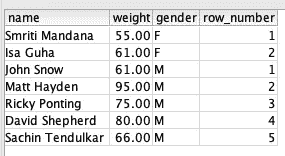
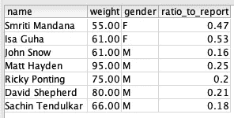
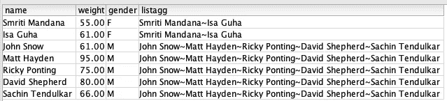
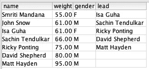
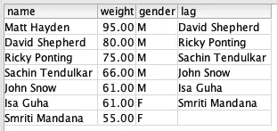

# 数据仓库中的分析 SQL 函数示例(第 1 部分)

> 原文：<https://blog.devgenius.io/examples-of-analytical-sql-functions-in-data-warehouse-part-1-99794e0273d9?source=collection_archive---------11----------------------->

行动中的事物！！

我们已经在之前的[文章](https://medium.com/dev-genius/important-sql-clauses-functions-in-data-engineering-and-analytics-85d8d84c2d78)中讨论了最有用的分析性 SQL 函数，所以在这篇文章和接下来的几篇文章中将会研究这些函数。我将尝试在 AWS 红移表中的一个小数据集上运行每篇文章中的几个函数。下面是我将使用的表模式和一些示例记录:

```
create table users(
 userid integer not null,
 name varchar(255) not null,
 gender varchar(1) not null,
 weight decimal(8,2) encode delta32k,
 age integer not null,
 primary key(userid))
distkey(gender)
sortkey(age);

insert into users (userid, name, gender, age, weight) values (1, 'John Snow', 'M', 35, 61);
insert into users (userid, name, gender, age, weight) values (2, 'Matt Hayden', 'M', 55, 95);
insert into users (userid, name, gender, age, weight) values (3, 'Ricky Ponting', 'M', 49, 75);
insert into users (userid, name, gender, age, weight) values (4, 'David Shepherd', 'M', 90, 80);
insert into users (userid, name, gender, age, weight) values (5, 'Smriti Mandana', 'F', 26, 55);
insert into users (userid, name, gender, age, weight) values (6, 'Sachin Tendulkar', 'M', 51, 66);
insert into users (userid, name, gender, age, weight) values (7, 'Isa Guha', 'F', 41, 61);
```


在 [Unsplash](https://unsplash.com?utm_source=medium&utm_medium=referral) 上 [Anoushka P](https://unsplash.com/@_purianoushka?utm_source=medium&utm_medium=referral) 拍摄的照片

**OVER，PARTITION BY，ORBER BY 和 ROWS:**

尽管这些实际上不是函数，但它们是重要的关键字，表明 SQL 查询将以分析的方式执行。通过组合使用这些关键字的函数，使分析查询更加有效。分析查询通常在数据集窗口上执行，而不是在整个数据集本身上执行。窗口是使用窗口规范(OVER 子句)定义的，它基于三个主要概念:

*   *窗口分区，*形成多组行(PARTITION 子句)
*   *窗口排序*，它定义了每个分区中行的顺序或序列(ORDER BY 子句)
*   *窗口框架*，相对于每一行定义，进一步限制行的集合(行规范)

现在我们已经有了表、数据并知道了以分析方式使用查询的重要关键字，我们将看看一些函数:

**ROW_NUMBER:** 创建一个从 1 开始递增的整数值，后续行获得下一个更高的值。跨越分区边界时复位为 1。

所以从上面的数据来看，如果我们想根据性别对所有用户进行排名，我们可以使用 ROW_NUMBER()，如下所示:

```
SELECT name, weight, gender, ROW_NUMBER() OVER (PARTITION BY gender) FROM users;
```



**RATIO_TO_REPORT:** 计算值与组内合计的比率，这不是百分比，比率之和等于 1。

如果我们想计算用户的体重占其性别总体重的比例，我们可以如下进行:

```
SELECT name, weight, gender, RATIO_TO_REPORT(weight) OVER (PARTITION BY gender) FROM users;
```



**LISTAGG:** 连接出现在单个列中的值，返回分隔值的字符串。也可以对列中的数据进行排序。

有了上面的数据，如果我们想根据用户的性别将他们的名字连接起来，那么我们可以在性别分区上使用 LISTAGG 函数中的名字，如下所示。

```
SELECT name, weight, gender, LISTAGG(name,'~') OVER (PARTITION BY gender) FROM users;
```



**LEAD:** 根据当前行向前查看若干行，可以访问该行。

例如，在用户表中，如果我们希望第二个用户的名字比另一个用户更重要，可以使用 LEAD 函数中行的名称和位置。为了使它工作，我们需要 ORDER BY 子句与 weight 一起使用，因为行应该按照它工作的顺序排列。请注意，最后 2 行没有销售线索值，因为在该顺序中，它们下面没有第二个用户。

```
SELECT name, weight, gender, LEAD(name,2) OVER (ORDER BY weight) FROM users;
```



**LAG:** 基于当前行回看若干行，可以访问该行。

示例:类似于 LEAD 函数，如果我们需要查看比其他用户少的用户，那么我们可以使用 LAG 函数。请注意，最后一个用户没有任何值，因为没有其他用户的权重更低。

```
SELECT name, weight, gender, LAG(name,1) OVER (ORDER BY weight) FROM users;
```



希望您已经对这些函数有了一些基本的了解，知道如何以及何时使用，以及在给定的数据集上使用时的结果。我们将在接下来的几篇文章中讨论这个列表中的其他函数。谢了。

参考资料:

[https://www . plural sight . com/courses/adv-SQL-queries-Oracle-SQL-server](https://www.pluralsight.com/courses/adv-sql-queries-oracle-sql-server)

[https://docs . AWS . Amazon . com/redshift/latest/DG/c _ Window _ functions . html](https://docs.aws.amazon.com/redshift/latest/dg/c_Window_functions.html)。

[](https://medium.com/membership/@guru.nie) [## 通过我的推荐链接加入媒体

### 阅读 Gururaj Kulkarni(以及媒体上成千上万的其他作家)的每一个故事。您的会员费直接…

medium.com](https://medium.com/membership/@guru.nie)