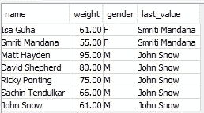

# 数据仓库中的分析 SQL 函数示例(第 2 部分)

> 原文：<https://blog.devgenius.io/examples-of-analytical-sql-functions-in-data-warehouse-part-2-baeaacca1b71?source=collection_archive---------8----------------------->

使用示例数据进行操作！！

在本系列的第 1 部分的[中，我们已经查看了](/examples-of-analytical-sql-functions-in-data-warehouse-part-1-99794e0273d9)[文章](https://medium.com/dev-genius/important-sql-clauses-functions-in-data-engineering-and-analytics-85d8d84c2d78)中列出的函数。在本文中，我们将介绍更多正在运行的函数。我在 Redshift 上创建的表上执行这些查询，我将把模式和一些示例 insert 语句放在下面:

```
create table users(
userid integer not null,
name varchar(255) not null,
gender varchar(1) not null,
weight decimal(8,2) encode delta32k,
age integer not null,
primary key(userid))
distkey(gender)
sortkey(age);

insert into users (userid, name, gender, age, weight) values (1, 'John Snow', 'M', 35, 61);
insert into users (userid, name, gender, age, weight) values (2, 'Matt Hayden', 'M', 55, 95);
insert into users (userid, name, gender, age, weight) values (3, 'Ricky Ponting', 'M', 49, 75);
insert into users (userid, name, gender, age, weight) values (4, 'David Shepherd', 'M', 90, 80);
insert into users (userid, name, gender, age, weight) values (5, 'Smriti Mandana', 'F', 26, 55);
insert into users (userid, name, gender, age, weight) values (6, 'Sachin Tendulkar', 'M', 51, 66);
insert into users (userid, name, gender, age, weight) values (7, 'Isa Guha', 'F', 41, 61);
```


照片由[乔治·托马塞蒂](https://unsplash.com/@gtomassetti?utm_source=medium&utm_medium=referral)在 [Unsplash](https://unsplash.com?utm_source=medium&utm_medium=referral) 上拍摄

**OVER，PARTITION BY，ORBER BY 和 ROWS:**

虽然我在上一篇文章中已经提到了这一点，但我还是要把这一部分包括进来，为新读者提供一个背景。这些实际上并不是函数，而是表示 SQL 查询将以分析方式执行的重要关键字。通过组合使用这些关键字的函数，使分析查询更加有效。分析查询通常在数据集窗口上执行，而不是在整个数据集本身上执行。窗口是使用窗口规范(OVER 子句)定义的，它基于三个主要概念:

*   *窗口分区，*形成多组行(PARTITION 子句)
*   *窗口排序*，它定义了每个分区中行的顺序或序列(ORDER BY 子句)
*   *窗口框架*，相对于每一行定义，进一步限制行的集合(行规范)

现在我们已经有了表、数据并知道了以分析方式使用查询的重要关键字，我们将看看一些函数:

**等级:**根据列的顺序提供等级。如果有并列的排名，那么它跳过这些数字。例:1、2、2、4、5 等。

例如:在上表中，如果我们想对所有用户的体重进行排名，那么我们可以看到用户 John 和 Isa 得到相同的排名，排名 3 被跳过。

```
SELECT name, weight, gender, RANK() OVER (ORDER BY weight) FROM users;
```


**DENSE_RANK:** 类似于 RANK 但是如果有平局它不会跳过 RANK。例:1、2、2、3、4 等。

例如:同样从上表中，如果我们想使用密集排名函数对所有用户的权重进行排名，那么我们可以看到用户 John 和 Isa 获得相同的排名，下一个用户排名为 3，因为该函数没有跳过数字。

```
SELECT name, weight, gender, DENSE_RANK() OVER (ORDER BY weight) FROM users;
```


**FIRST_VALUE** :检索符合分区边界的列中的第一个值。应与 ORDER BY 一起使用。

例:从上面的数据中，我们可以找到性别分区中权重最高的第一个用户，如下所示。请注意，在 redshift 中，我们不得不使用 rows between 子句提到窗口框架。

```
SELECT name, weight, gender, FIRST_VALUE(name) OVER (PARTITION BY gender ORDER BY weight desc rows between UNBOUNDED PRECEDING and UNBOUNDED FOLLOWING) FROM users;
```


**LAST_VALUE** :检索符合分区边界的列中的最后一个值。应与 ORDER BY 一起使用。

例:从上面的数据中，我们可以找到性别分区中权重最低的最后一个用户，如下所示。请注意，在 redshift 中，我们不得不使用 rows between 子句提到窗口框架。

```
SELECT name, weight, gender, LAST_VALUE(name) OVER (PARTITION BY gender ORDER BY weight desc rows between UNBOUNDED PRECEDING and UNBOUNDED FOLLOWING) FROM users;
```



**第 n 个值**:返回分区中需要的行，需要 ORDER BY 子句。可以从表格的顶部或底部检索数据。

例:从上面的数据中，我们可以根据他们的体重在性别分区中找到第二个用户，如下所示。请注意，在 redshift 中，我们不得不使用 rows between 子句提到窗口框架。

```
SELECT name, weight, gender, NTH_VALUE(name, 2) OVER (PARTITION BY gender ORDER BY weight desc rows between UNBOUNDED PRECEDING and UNBOUNDED FOLLOWING) FROM users;
```


希望您已经对这些函数有了一些基本的了解，知道如何以及何时使用，以及在给定的数据集上使用时的结果。在接下来的几篇文章中，我们将从这个[列表](https://medium.com/dev-genius/important-sql-clauses-functions-in-data-engineering-and-analytics-85d8d84c2d78)中介绍更多的函数。谢了。

参考资料:

[https://www . plural sight . com/courses/adv-SQL-queries-Oracle-SQL-server](https://www.pluralsight.com/courses/adv-sql-queries-oracle-sql-server)

[https://docs . AWS . Amazon . com/redshift/latest/DG/c _ Window _ functions . html](https://docs.aws.amazon.com/redshift/latest/dg/c_Window_functions.html)。

[](https://medium.com/membership/@guru.nie) [## 通过我的推荐链接加入媒体

### 阅读 Gururaj Kulkarni(以及媒体上成千上万的其他作家)的每一个故事。您的会员费直接…

medium.com](https://medium.com/membership/@guru.nie)