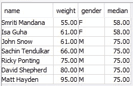
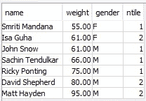
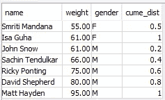
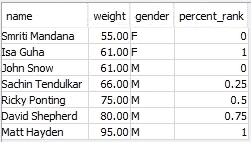
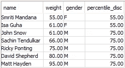
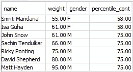

# 数据仓库中的分析 SQL 函数示例(第 3 部分)

> 原文：<https://blog.devgenius.io/examples-of-analytical-sql-functions-in-data-warehouse-part-3-54faf976d452?source=collection_archive---------4----------------------->

多几个功能！！

在本系列的第 2 部分中，我们已经查看了这个[列表](https://medium.com/dev-genius/important-sql-clauses-functions-in-data-engineering-and-analytics-85d8d84c2d78)中的一些函数。在本文中，我们将介绍更多正在运行的函数。我在 Redshift 上创建的表上执行这些查询，我将把模式和一些示例 insert 语句放在下面:

```
create table users(
userid integer not null,
name varchar(255) not null,
gender varchar(1) not null,
weight decimal(8,2) encode delta32k,
age integer not null,
primary key(userid))
distkey(gender)
sortkey(age);

insert into users (userid, name, gender, age, weight) values (1, 'John Snow', 'M', 35, 61);
insert into users (userid, name, gender, age, weight) values (2, 'Matt Hayden', 'M', 55, 95);
insert into users (userid, name, gender, age, weight) values (3, 'Ricky Ponting', 'M', 49, 75);
insert into users (userid, name, gender, age, weight) values (4, 'David Shepherd', 'M', 90, 80);
insert into users (userid, name, gender, age, weight) values (5, 'Smriti Mandana', 'F', 26, 55);
insert into users (userid, name, gender, age, weight) values (6, 'Sachin Tendulkar', 'M', 51, 66);
insert into users (userid, name, gender, age, weight) values (7, 'Isa Guha', 'F', 41, 61);
```


照片由[米利安·杰西耶](https://unsplash.com/@mjessier?utm_source=medium&utm_medium=referral)在 [Unsplash](https://unsplash.com?utm_source=medium&utm_medium=referral) 拍摄

**OVER，PARTITION BY，ORBER BY 和 ROWS:**

虽然我在上一篇文章中已经提到了这一点，但我还是要把这一部分包括进来，为新读者提供一个背景。这些实际上并不是函数，而是表示 SQL 查询将以分析方式执行的重要关键字。通过组合使用这些关键字的函数，使分析查询更加有效。分析查询通常在数据集窗口上执行，而不是在整个数据集本身上执行。窗口是使用窗口规范(OVER 子句)定义的，它基于三个主要概念:

*   *窗口分区，*形成多组行(PARTITION 子句)
*   *窗口排序*，它定义了每个分区中行的顺序或序列(ORDER BY 子句)
*   *窗口框架*，相对于每一行定义，进一步限制行的集合(行规范)

现在我们已经有了表、数据并知道了以分析方式使用查询的重要关键字，我们将看看一些函数:

**中位数**:有序数据的中间值。如果行数为偶数，则取 2 个中间值的平均值。

在上面的数据中，如果我们可以根据性别找到所有用户的中值权重，我们将得到女性的平均值，因为只有 2 条记录，而男性用户的平均值为 75，因为按此顺序有 5 行。

```
SELECT name, weight, gender, MEDIAN(weight) OVER (PARTITION BY gender) FROM users;
```



**NTILE** :单参数表示期望的桶数。返回一个整数，表示每一行的组包含。

我们可以使用 ntile (2)函数根据用户的性别对用户进行分组，如下所示，每个性别对应 2 个存储桶。此外，由于只有 2 名女性用户，她们被放在不同的桶中。

```
SELECT name, weight, gender, NTILE(2) OVER (PARTITION BY gender ORDER BY weight) FROM users;
```



**CUME_DIST** :数值小于或等于该行数值除以总行数的行数。

在上面的数据中，如果我们能找到按体重排序的相同性别的累积分布，我们会得到下面的结果。(女性为 1/2 和 2/2，男性为 1/5、2/5、3/5、4/5 和 5/5)。

```
SELECT name, weight, gender, cume_dist() OVER (PARTITION BY gender ORDER BY weight) FROM users;
```



**PERCENT_RANK** :使用列上的 RANK 函数计算排名，减去 1，然后除以行数减 1。

我们可以根据按体重排序的性别划分来计算上述数据中的百分比排名，结果如下:((1–1)/(2–1)，(2–1)/(2–1)对于女性，((1–1)/(5–1)，(2–1)/(5–1)，(3–1)/(5–1)，(4–1)/(5–1)和(5–1)/5–1)对于男性。

```
SELECT name, weight, gender, PERCENT_RANK() OVER (PARTITION BY gender ORDER BY weight) FROM users;
```



**PERCENTILE_DISC** :将所需百分点值与 CUME_DIST 函数值进行比较，返回与 CUME_DIST 相关联的等于或高于所需百分点值的列值。

在上述数据中，我们可以找到基于性别划分的第 50 百分位值，并可以得到以下结果。

```
SELECT name, weight, gender, percentile_disc(0.50) WITHIN GROUP (ORDER BY weight) OVER (PARTITION BY gender) FROM users;
```



**PERCENTILE_CONT** :与 PERCENTILE_DISC 类似，只是执行线性插值，返回值不一定来自表格。

在上述数据中，我们可以找到基于性别划分的第 50 百分位计数，并得到以下结果。

```
SELECT name, weight, gender, PERCENTILE_CONT(0.50) WITHIN GROUP (ORDER BY weight) OVER (PARTITION BY gender) FROM users;
```



希望您已经对这些函数有了一些基本的了解，知道如何以及何时使用，以及在给定的数据集上使用时的结果。我们将在下一篇文章中讨论这个[列表](https://medium.com/dev-genius/important-sql-clauses-functions-in-data-engineering-and-analytics-85d8d84c2d78)中剩余的最后一组函数。谢了。

参考资料:

[https://www . plural sight . com/courses/adv-SQL-queries-Oracle-SQL-server](https://www.pluralsight.com/courses/adv-sql-queries-oracle-sql-server)

[https://docs . AWS . Amazon . com/redshift/latest/DG/c _ Window _ functions . html](https://docs.aws.amazon.com/redshift/latest/dg/c_Window_functions.html)。

[](https://medium.com/membership/@guru.nie) [## 通过我的推荐链接加入媒体

### 阅读 Gururaj Kulkarni(以及媒体上成千上万的其他作家)的每一个故事。您的会员费直接…

medium.com](https://medium.com/membership/@guru.nie)