# 作为数据科学家，您应该了解的 Excel 函数

> 原文：<https://blog.devgenius.io/excel-functions-you-should-know-as-data-scientist-62c1fe69c134?source=collection_archive---------13----------------------->

## 不要忘记，作为一名数据科学家，Excel 是你的工具之一。


照片拍摄于 [quixy](https://quixy.com/blog/top-digital-transformation-statistics-trends-forecasts/)

很可能您在工作时使用过 Excel。Excel 是一个灵活且用户友好的电子表格程序。它学习起来相对简单，可以帮助您生成优秀的分析，并便于进行小的编辑。然而，对于较大的数据集，Excel 开始滞后和冻结，阻碍了工作流的顺利进行。在这里，一点 Python 知识和熊猫来救场，化险为夷。Python 编程语言有一个名为 Pandas 的数据分析库。它为更大的数据集提供了所有你喜欢的 Excel 函数，并且功能强大，速度快。

不可否认的是，使用 Python 结合熊猫在执行数据分析方面是非常强大的。但是，如果有像 Excel 这样更简单、更高效的东西，还是坚持使用的好。

在这篇文章中，我将讨论一些你应该知道的 Ms. Excel，以便更容易地做数据分析。在每个函数中，我将解释语法、基本公式以及它们的用法示例。事不宜迟，我们开始吧！

## **COUNTBLANK**

Microsoft Excel COUNTBLANK 函数计算一个区域中的空单元格数。

COUNTBLANK 函数是 Excel 中的内置函数，被归类为统计函数。它可以用作 Excel 中的工作表函数(WS)。作为工作表函数，COUNTBLANK 函数可以作为公式的一部分输入到工作表的单元格中。它属于统计函数的范畴，在 Excel for Office 365、Excel 2019、Excel 2016、Excel 2013、Excel 2010、Excel 2007 的所有版本中都有。

1.  **语法**

Microsoft Excel 中 COUNTBLANK 函数的语法是

```
COUNTBLANK ( range )
```

其中 range 是要计算空白的单元格区域。

**2。示例**

以下是 Excel 中最简单的 COUNTBLANK 公式示例:

```
=COUNTBLANK ( A2:D2 )
```

在 E2 中输入并向下复制到 E7 的公式确定了 A 列到 D 列中每一行的空单元格数，并返回以下结果:

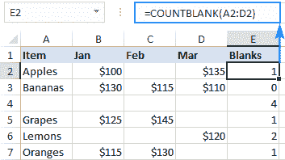

从 A2 到 D2 统计 Excel 中的空白单元格

要有效地使用 Excel 公式计算空白单元格，了解 COUNTBLANK 函数将哪些单元格视为“空白”非常重要。

1.  包含任何文本、数字、日期、逻辑值、空格和错误的单元格不计算在内。
2.  包含零的单元格被视为非空白，因此不进行计数。
3.  包含返回空字符串(" ")的公式的单元格被视为空白并被计算在内。

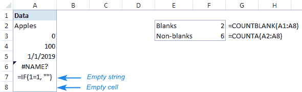

COUNTBLANK 和 COUNTA 如何工作的示例

请看上面的屏幕截图，请注意单元格 A7 包含一个返回空字符串的公式，它被计算了两次:

*   COUNTBLANK 将长度为零的字符串视为空单元格，因为它显示为空。
*   COUNTA 将零长度字符串视为非空单元格，因为它实际上包含一个公式。

## **VLOOKUP**

什么是 VLOOKUP？它搜索您指定的值，并从另一列返回匹配值。更专业地说，VLOOKUP 函数在给定范围的第一列中查找值，并从另一列返回同一行中的值。

通常情况下，Excel VLOOKUP 会根据唯一标识符搜索您的数据集，并为您提供一条与该唯一标识符相关的信息。

字母“V”代表“垂直”，用于区分 VLOOKUP 和 HLOOKUP 函数，HLOOKUP 函数在行中而不是在列中查找值(H 代表“水平”)。该函数在 Excel 365 到 Excel 2007 的所有版本中都可用。

1.  **语法**

VLOOKUP 函数的语法如下:

```
VLOOKUP(lookup_value, table_array, col_index_num, [range_lookup])
```

其中:

*   Lookup_value(必选)-要搜索的值。
*   这可以是一个值(数字、日期或文本)、单元格引用(对包含查阅值的单元格的引用)或由其他函数返回的值。与数字和单元格引用不同，文本值应该始终用“双引号”括起来。
*   Table_array(必选)-要在其中搜索查找值并从中检索匹配项的单元格区域。VLOOKUP 函数总是在表数组的第一列中搜索，表数组可能包含各种文本值、数字、日期和逻辑值。
*   Col_index_num(必选)-要从中返回值的列的编号。计数从表数组中最左边的列开始，即 1。
*   Range_lookup(可选)—确定是搜索近似匹配还是精确匹配:
*   TRUE 或省略(默认)-近似匹配。如果找不到完全匹配，公式将搜索小于查找值的最大值。要求按升序对查阅列进行排序。
*   FALSE 完全匹配。该公式搜索与查找值完全相等的值。如果没有找到完全匹配，则返回一个#N/A 值。

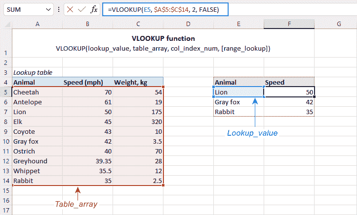

表格数组在左侧，查找值在右侧

**2。基本公式**

下面是一个最简单的 Excel VLOOKUP 公式示例。请看看下面的公式，并尝试将其“翻译”成英语:

```
=VLOOKUP(“lion”, A2:B11, 2, FALSE)
```

*   1ˢᵗ参数(lookup_value)清楚地表明该公式查找单词“lion”。
*   2ⁿᵈ参数(table_array)是 A2:B11。请记住，搜索是在最左边的列中执行的，您可以进一步阅读上面的公式:在 A2:A11 范围内搜索“lion”。到目前为止，一切顺利，对吧？
*   3ʳᵈ参数 col_index_num 为 2。也就是说，我们希望从 B 列返回一个匹配值，B 列是表数组中的第二列。
*   4ᵗʰ参数 range_lookup 为 FALSE，这表明我们正在寻找精确匹配。

建立了所有参数后，阅读整个公式应该没有问题:在 A2:A11 中搜索“lion ”,找到一个精确匹配，并从同一行的 B 列返回一个值。

为了方便起见，您可以在某个单元格(比如 E1)中键入感兴趣的值，用单元格引用替换“硬编码”文本，并获得公式来查找您在 E1 输入的任何值:

```
=VLOOKUP(E1, A2:B11, 2, FALSE)
```

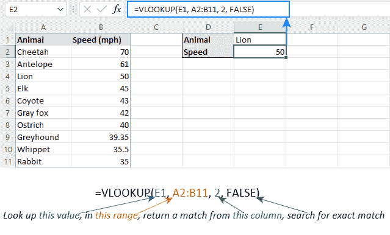

**3。例子**

在现实生活的工作表中使用 VLOOKUP 公式时，主要的经验法则是:使用绝对单元格引用(如$A$2:$C$11)锁定表格数组，以防止它在将公式复制到其他单元格时发生变化。

大多数情况下，查找值应该是相对引用(如 E2)，或者您可以只锁定列坐标($E2)。当公式被复制到下一列时，引用将自动调整每一行。

要了解它在实践中是如何工作的，请考虑下面的例子。在我们的示例表中，我们又添加了一个按速度对动物进行排名的列(列 A ),并希望找到世界上第一、第五和第十快的短跑运动员。为此，在一些单元格中输入查找等级(下面截图中的 E2:E4)，并使用以下公式:

要从 B 列中提取动物名称:

```
=VLOOKUP($E2, $A$2:$C$11, 2, FALSE)
```

要从列 C 中提取速度:

```
=VLOOKUP($E2, $A$2:$C$11, 3, FALSE)
```

在单元格 F2 和 G2 中输入上述公式，选择这些单元格，并将公式拖到下面的行中:

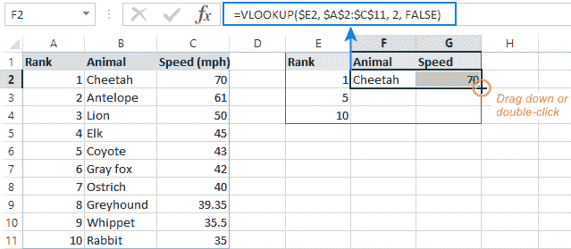

VLOOKUP 示例

如果研究下一行中的公式，您会注意到查找值引用已针对该特定行进行了调整，而表格数组保持不变:

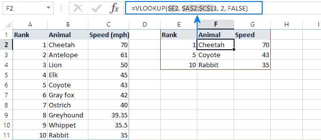

请注意，标识符位于左侧位置

## 等级/等级。情商

RANK 函数被归类为 Excel 统计函数。该函数返回给定值在所提供的值数组中的统计排名。因此，它决定了特定值在数组中的位置。

在我们继续之前，我们需要知道 RANK 函数已经被 RANK 代替了。情商和排名。AVG，这可能会提供更好的效用。等级。EQ 是 Excel 2010 中引入的 RANK 函数的改进版本。它具有与 RANK 相同的语法和相同的逻辑。但是不用担心，RANK 函数仍然可以向后兼容。

1.  **语法**

RANK 函数的语法如下:

```
=RANK.EQ(number, ref, [order])
```

其中:

*   number(必选)-要计算其排名的数字
*   ref(必需)-数组或引用
*   order(可选)-指定如何对数字进行排名的数字

`order`注意事项:

*   如果 order 为 0(零)或省略，等级将按降序排序
*   如果 order 为任何非零值，等级将按升序排序。

**2。基本公式**

等级可以作为公式的一部分输入到工作表的单元格中。为了理解函数的用法，让我们考虑一个例子:

```
=RANK(B2, $B$2:$B$7, 1)
```

*   1ˢᵗ参数(number)显示公式采用 B2 单元格数值进行排序。
*   2ⁿᵈ参数(ref)是$B$2:$B$7。使用绝对单元格引用($)，这样当公式沿列向下复制时引用不会改变。
*   3ʳᵈ参数顺序是 1。我们希望以升序返回排名

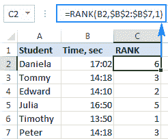

秩的基本公式

**3。示例**

RANK 函数的一个问题是，它对相同价值的项目返回相同的等级。大多数时候，我们并不期待这样的结果。因此，为了唯一地排列每个数字，可以应用这个公式。

```
=RANK.EQ(B2, $B$2:$B$7, 1) + COUNTIF($B$2:B2,B2)-1
```

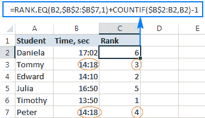

使用数据进行排名的示例

简而言之，您可以使用 COUNTIF 来找出被排序的数字在上面的单元格中出现了多少次，包括该数字所在的单元格。在输入公式的最上面一行，范围由一个单元格组成($B$2:B2)。但是，因为您只锁定了第一个引用($B$2)，所以最后一个相对引用(B2)会根据公式被复制到的行发生变化。因此，对于第 7 行，范围扩展到＄B＄2:B7，并将 B7 的值与上面的每个单元格进行比较。

## 苏米夫

SUMIF 函数用于对满足条件的一组单元格中的值求和。

1.  **语法**

SUMIF 函数的语法如下:

```
=SUMIF(range,criteria,sum_range)
```

这些论点是:

*   范围:测试*标准*的单元格范围
*   标准:在*范围*上测试的条件。
*   sum_range:(可选)要进行求和运算的*范围*对应的单元格范围。如果没有给出， *sum_range* 与 *range* 相同。

请注意，SUMIF**不**区分大小写。

**2。基本公式**

让我们来看看 SUMIF 的基本形式:

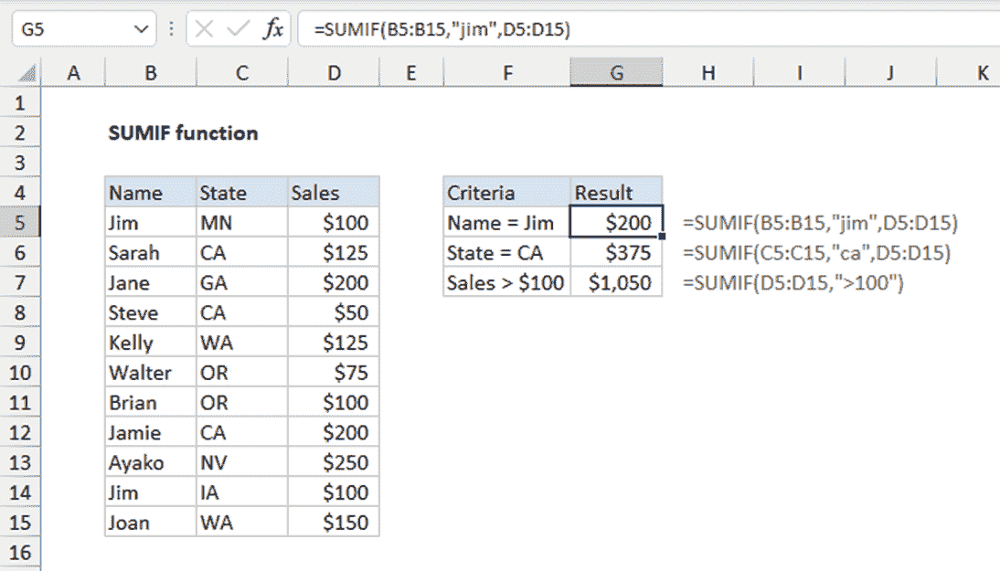

SUMIF 的基本公式

*   G5 中的 SUMIF 公式被设置为测试*名称*列(B5:B15)上的条件。被测试的标准是“吉姆”。当*销售*列(D5:D15)作为参数中的 *sum_range* 时，该函数在 B5 和 B14 上测试为正，返回 D5 和 D14 的总和。
*   G6 中的 SUMIF 公式设置为测试*状态*列(C5:C15)上的标准。正在测试的标准是“CA”。将*销售*列作为 *sum_range* ，该函数返回 D6、D8 和 D12 的总和。

G7 中的 SUMIF 公式设置为测试*销售*列(D5:D15)的条件。被测试的标准是“> 100”。如果参数中没有 *sum_range* ，函数将在 *Sales* 列上设置 *sum_range* 。该函数在 B5 和 B14 上测试为阳性，返回 D6、D7、D9、D12、D13 和 D15 的总和，并返回这些单元格的总和。

**3。示例**

可以设定更详细的标准。例如，如果条件是与另一个单元格进行比较:

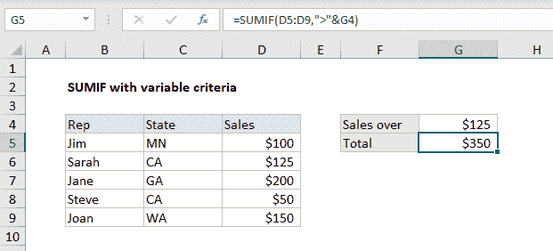

比较 SUMIF 和另一个单元格

在本例中，SUMIF 函数 *criteria* 调用与单元格 G4 中的值进行比较。

## 索引匹配

索引公式用于通过定位特定单元格的相对水平索引和垂直索引来调用该单元格。我说的相对是指，由于公式事先需要一个数组，所以索引从数组本身内部开始。

匹配公式用于找出某个值存在于哪个相对索引中，但 MATCH 只能返回一个值，因此要么是垂直索引，要么是水平索引。这必须由阵列本身决定。

1.  **语法**

```
INDEX(array, MATCH(lookup_value, lookup_array, [match_type]), MATCH(lookup_value, lookup_array, [match_type]))
```

*   Array:必需。单元格或数组常量的范围。
*   lookup_value:必需。lookup_array 中要匹配的值。
*   lookup_array:必需。搜索的单元格区域。
*   match_type:可选。数字-1、0 或 1。match_type 参数指定 Excel 如何将 lookup_value 与 lookup_array 中的值进行匹配。该参数的默认值为 1。
*   第一个匹配公式用于位置行号，第二个匹配用于列号。

正如我们所见，索引匹配基本上只是索引函数内部的匹配。这里的匹配公式用于返回位置 row_num 和 column_num。

**2。基本公式**

```
INDEX(B2:D7,MATCH(A13,B2:B7,0),MATCH(A14,B2:D2,0))
```

如果我们看下面的例子，我们可以看到有 3 个数组突出显示，蓝色的是索引数组，绿色的是匹配行，紫色的是匹配列。

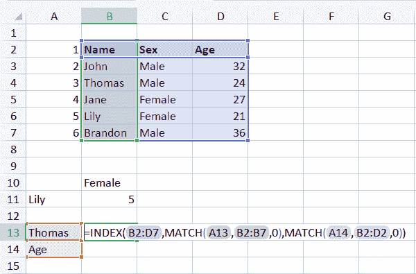

**3。示例**

假设我们想要找到 Thomas 的年龄，那么我们首先为 Thomas 和 age 设置一个单元格，这样我们的公式就有一个与之匹配的单元格。然后，我们对行和列使用带有 MATCH 的索引公式，我们可以看到返回的值与原始单元格完全相同。

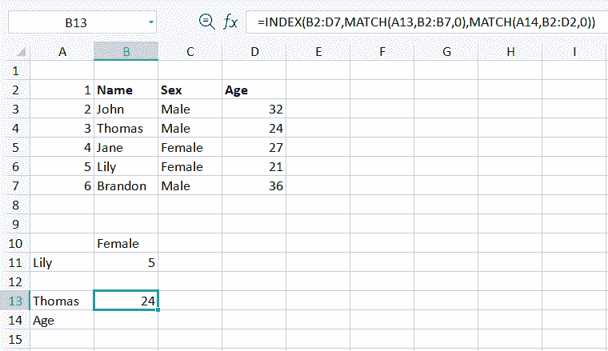

这只是如何使用索引匹配的一个例子，我们也可以只使用一个位置匹配参数只搜索行或列，就像我们如何使用索引函数一样。

# 最后几点

我们已经讨论了一些主要函数，这些函数通常用于我们的数据科学任务。当我们必须处理数据可视化时，这些是许多方便的 excel 函数，我们必须从主数据源中获取子数据。此外，在数据科学访谈中，这些也是 excel 中常见的话题。

好了，暂时就这样了。我希望这篇文章对你有用，继续享受数据科学。

参考资料:

[https://www.ablebits.com/](https://www.ablebits.com/)