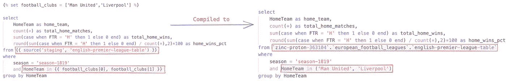
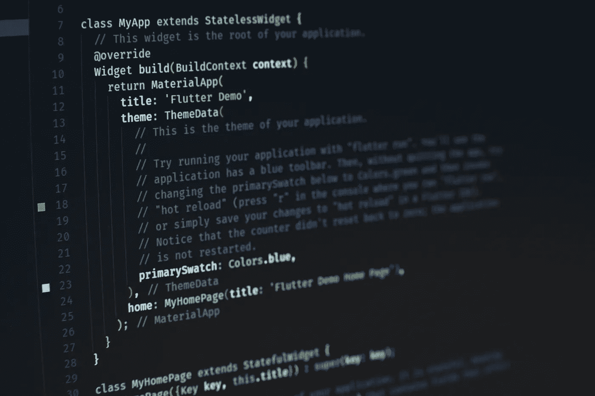
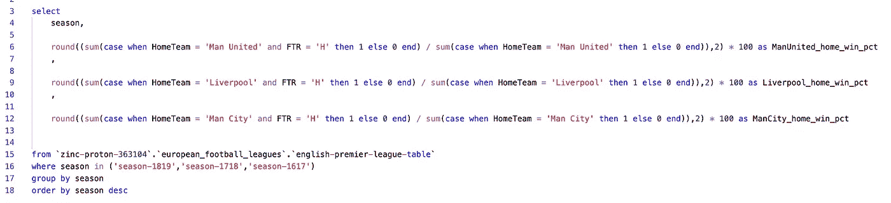

# 卓越的 dbt: Jinja &用于模块化和更简洁的 SQL 查询的宏—第 1/2 部分

> 原文：<https://blog.devgenius.io/excelling-at-dbt-jinja-macros-for-modular-and-cleaner-sql-queries-part-1-2-55e29d4b29e2?source=collection_archive---------0----------------------->

## 理解 Jinja 分隔符、变量、过滤器、注释和空白控制


图片来自 Unsplash，作者 Shahadat Rahman

到目前为止，我们大多数在日常工作中使用编程语言的人，一定已经理解了在代码中拥有可重用函数的重要性，尤其是程序员。可重复使用的功能允许程序员:

*   重用相同的代码来解决类似的问题。
*   减少开发新解决方案或产品的时间。
*   促进工作各个方面的自动化，而不是重新发明轮子。

然而，这不仅适用于我们在软件工程或计算机科学领域工作的朋友，也适用于我们正在与数据打交道的人，无论是数据分析师、数据工程师还是数据科学家。

对于大多数数据人员来说，SQL 是我们的面包和黄油。虽然 SQL 在从数据库中获取数据方面很棒，但它并不适合可重用性和共享能力，这有时会影响我们的生产率。

我们举个例子。作为一名数据分析师，您经常花费太多时间反复编写聚合、连接、数据清理和指标的相同逻辑，这导致您没有足够的时间从数据中提取洞察力(这是您的主要任务！).由此可见，我们需要的不仅仅是 SQL 来提高我们的生产力。为了帮助我们获得更高的生产率(尤其是在编写 SQL 时)，我们可以将 SQL 查询与 Jinja 和宏结合起来。Jinja 和宏可以帮助我们实现 SQL 的可重用性。

在这篇文章和下一篇文章中，我将分享我对 Jinja & Macros 的理解，并提供一些关于如何将它们与 SQL 和 dbt 结合使用的例子。为什么是 dbt？dbt 是一个围绕 SQL 和 Jinja 构建的数据转换工具，因此我认为展示如何在 dbt 中将 Jinja 和宏与 SQL 结合使用是一个好主意。这篇文章对那些渴望成为分析工程师的人也很有用。当您计划用 dbt 转换/建模和清理数据时，Jinja 和宏肯定会派上用场。

我将在示例中使用的数据集是从 [datahub.io](https://datahub.io/) 中提取的足球统计数据。如果你想跟随例子，请阅读[我以前的帖子，下载数据集](https://medium.com/@baluramachandra90/extract-and-load-football-statistics-to-google-cloud-storage-bigquery-with-airflow-1a217227dbd1)并安装 dbt。本文假设您对 SQL 和 dbt 有所了解。这篇文章的代码可以在我的 GitHub repo 上找到。


## 金贾

Jinja 是一种用 Python 编写的模板语言。它经常在 Python web 框架中用于定义和重用常见的 Python 代码片段。

但是我所说的模板语言是什么意思呢？如果你曾经收到如下营销文本，那么你可能已经看到了模板语言或者 Jinja 本身。

> 您好{ {您的名字}}，我们为您提供了一份工作。

Jinja 使我们能够执行跨语言操作(充当桥梁)，例如在 SQL 中使用 Python 函数。这允许我们向 SQL 查询中添加更多的*“动态性”，比如在 SQL 查询中使用 for 循环和变量。*

*在 dbt 中，Jinja 是其编译过程的主要部分。它允许 dbt 构建和理解您的数据模型之间的关系，测试您的 DAG 并正确地建模您的表和模式之间的关系。由于 dbt 依赖并理解 Jinja，所以我们可以在数据建模过程中采用 Jinja，使我们的代码更加强大、模块化和高效。在我们深入研究之前，让我们先了解一下 Jinja 中一些基本的语法交互。*

## *分隔符*

**

*图片来自 Unspalsh，作者 Jorge Rosal*

*Jinja 分隔符有三种基本形式:*

*   *用于打印输出、引用变量和调用宏的表达式*
*   *``为报表。通常用于定义控制流(for 循环和条件语句)和宏。*
*   *`{#....#}`用于输出中未包含的注释。*

*让我们更深入地研究 Jinja 可以为我们提供的一些基本组件/功能，以构建模块化和更简洁的 SQL 查询。*

## *变量、列表和字典*

*Jinja 支持使用基本的 Python 数据对象，比如变量、列表和字典。如果您正在使用 Python 进行开发，那么您可以与这些对象进行非常相似的交互。例如，可以通过索引访问列表值，通过键访问字典。*

*为了创建变量、列表和字典，我们在 Jinja 块``中使用了`set`标签。在下面的例子中，我创建了两个变量`my_name`和`my_var`，最后我将这些模板组合在一起，得到一个字符串。我使用 Jinja `{{...}}`表达式块来引用和生成变量的输出。如果您在 dbt 中运行这些代码，您将得到如下所示的输出。*

```
*


Hi, My name is {{ my_name }} and my favorite food is {{ my_food }}

Output:
--> Hi, My name is John and my favorite food is Ramen*
```

*在 Jinja 中，我们可以像在 Python 中一样创建和访问列表和字典。*

```
*# Create and access a list in Jinja


# Use {{ }} to reference the variable and generate the output/value of the variables
{{ football_clubs[0] }}
{{ football_clubs[1] }}

Output:
--> lazio
--> borrusia dortmund

# Create and access a dictionary in Jinja


{{ favorite_player.lazio }}
{{ favorite_player.lyon }}

Output:
--> alessandro nesta
--> juninho pernambucano*
```

*让我们看一个如何在 SQL 查询中使用 list 的应用程序。在下面的例子中，我创建了一个列表`football_clubs`，并将其插入到`where`子句中，以获取表中与列表中的值相匹配的相关记录。在引擎盖下，dbt 将把`HomeTeam in {{ football_clubs[0], football_clubs[1] }}`编译成`HomeTeam in ('Man United','Liverpool)`。在这个例子中，你也可以看到我使用了另一个 Jinja 语法，一个用于`{{ source() }}`函数的表达式。`{{ source() }}`是一个内置的 Jinja 函数，用于创建数据源和数据模型之间的依赖关系。*

**

*作者图片:dbt 的查询编译*

```
*

select 
    HomeTeam as home_team, 
    count(*) as total_home_matches,
    sum(case when FTR = 'H' then 1 else 0 end) as total_home_wins,
    round(sum(case when FTR = 'H' then 1 else 0 end) / count(*),2)*100 as home_wins_pct
from {{ source('staging', 'english-premier-league-table') }}
where 
    season = 'season-1819'
    and HomeTeam in {{ football_clubs[0], football_clubs[1] }}
group by HomeTeam

Output:

| home_team  | total_home_matches | total_home_wins | home_wins_pct |
|------------|--------------------|-----------------|---------------|
| Man United | 19                 | 10              | 53            |
| Liverpool  | 19                 | 17              | 89            |*
```

## *评论*

**

*图片来自 Artur Shamsutdin*

*注释是用来让你的代码更容易被你自己和其他人理解。它们还用于注释掉部分代码，以便进行调试。您可以在`{#....#}`块中编写注释，它们不会出现在您的输出或 dbt 中编译的 SQL 代码中。*

```
*{# You can write comments here, and it won't show up in compiled sql #}

{# note: commented-out code because we no longer use this
    
        ...
    
#}*
```

## *过滤*

*Jinja 还提供了一种使用过滤器来修改变量的方法。您可以在带有管道符号`|`的变量中使用过滤器。有关这方面的更多信息，您可以访问本[指南](https://jinja.palletsprojects.com/en/3.1.x/templates/#list-of-builtin-filters)。*

```
*

# replace: remove unwanted objects or strings.
{{ my_club | replace('man','manchester') }}

Output:
-->  manchester united
--------------------------------------------------------

# trim: remove leading and trailing characters.
{{ my_club | trim() }}

Output:
--> man united
--------------------------------------------------------

# title: return titlecased strings, words will start with uppercase letters and the rest will remain lowercase.
{{ my_club | trim() }}

Output:
--> Man United
--------------------------------------------------------

# upper: return uppercased strings.
{{ my_club | trim() }}

Output:
--> MAN UNITED
--------------------------------------------------------

# multiple filters
{{ my_club | replace('man','manchester') | trim() | upper() }}

Output:
--> MANCHESTER UNITED*
```

## *空白控制*

*如果到目前为止您一直在跟踪这些代码，并且看到您在 dbt 中编译的代码有如下所示的空白，那么您需要空白控制。空白控制是我们在 Jinja 中用来移除块中的空白。添加一个减号(`-`)告诉 Jinja 去掉一个块前后的尾随空格和换行符。*

**

*作者图片:使用换行符编译查询*

*   *在开始块的开头添加``添加到开始块的末尾意味着当前行的上方将有一个空行。在上面的例子中，它删除了 for 循环中的前导空格。*
*   *添加``将删除当前行前后的空白。*

*你可以尝试使用 [Jinja live parser](http://jinja.quantprogramming.com/) 。*

*这篇文章是下一篇文章的基础。在下一篇文章中，我将讨论更高级的话题，比如控制结构和宏。如果你有任何反馈，请随时写在评论区。我很感谢你花时间阅读这篇文章，并关注本系列的第二篇文章。谢谢你。*

## *其他资源:*

*   *Przemek Rogala 的 Jinja2 教程。*
*   *[dbt +金佳小抄](https://github.com/zsombor-flds/dbt-jinja-cheatsheet)。*

## *参考资料:*

*   *[金佳模板设计器文档](https://jinja.palletsprojects.com/en/3.1.x/templates/)。*
*   *[关于 Jinja &宏](https://docs.getdbt.com/docs/build/jinja-macros)的 dbt 指南。*