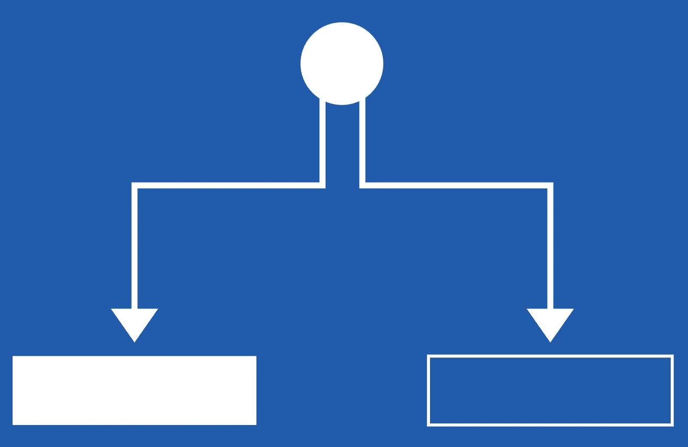
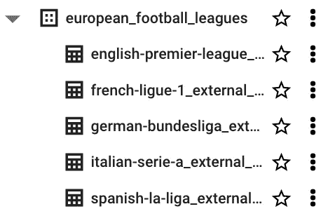

# 擅长 dbt: Jinja 和宏，用于模块化和更简洁的 SQL 查询—第 2/2 部分

> 原文：<https://blog.devgenius.io/excelling-at-dbt-jinja-macros-for-modular-and-cleaner-sql-queries-part-2-2-88949c1af46c?source=collection_archive---------0----------------------->

## 了解控制结构和宏


图片来自 Unsplash，作者 Shahadat Rahman

这是理解如何利用 Jinja 和宏编写更好的 SQL 查询的系列文章的第二篇。[在之前的帖子](https://medium.com/@baluramachandra90/excelling-at-dbt-jinja-macros-for-modular-and-cleaner-sql-queries-part-1-2-55e29d4b29e2)中，我们讨论了 Jinja 中的一些基本构建块如分隔符、变量、列表、字典、过滤器等。在这篇文章中，我们将进一步加强我们对控制结构和宏的了解。提醒一下，在这篇文章中，你会看到一些使用足球统计数据集的 SQL 示例，请[下载数据集](https://medium.com/@baluramachandra90/extract-and-load-football-statistics-to-google-cloud-storage-bigquery-with-airflow-1a217227dbd1)并[安装数据库](https://docs.getdbt.com/docs/get-started/installation) t。

## 控制结构


图片来自 Jordan Ladikos 的 Unsplash

在 Jinja 中，控制结构使我们能够控制代码/程序执行的流程。它允许我们用`conditions`和`loops`组合 SQL 代码。控制结构出现在``块中。有了控制结构，我们可以创建更多的动态查询，避免大量的代码重复。

## 条件语句



图片来自 ictshore

为了让条件语句(`if/else`)起作用，需要一个开始``标签和一个结束``标签。我们在开始标记中定义我们的条件，然后在满足条件时执行查询。请参见下面的示例。

```
# Set the condition parameter as a variable


# Define the condition in the opening block

    It's a Spanish Football Club

    It's not a Spanish Football Club


Output:
--> It's a Spanish Football Club
```

现在，让我们把 SQL 和条件语句结合起来。在下面的例子中，不是调整整个查询，我们可以通过调整参数`wins`的值，简单地获取由特定条件参数化的记录。如果`wins`参数等于`Home`，则满足 if 条件(`True`)。当它评估为`True`时，查询将获取主队在他们的场地上赢得比赛的记录。但如果不是，将触发`else`条款，并获取客场球队在对手场地获胜的记录。

```
--Set the condition parameter as a variable


--This query tries to fetch records based on team status (Home or Away)
select *
from {{ source('staging', 'english-premier-league-table') }}

    where FTR = 'H'

    where FTR = 'A'

```

为了增加复杂性和灵活性，您还可以在条件语句中添加``子句。这将为您提供一个选项，在退回到默认的``子句之前询问更多的条件。

## For 循环


图片来自 Tite Ivanic 的 Unsplash

我们使用 for-loop 迭代一系列项目，例如显示一个名为`payment_methods`的列表中提供的支付方式列表。我们可以用与条件语句(`if/else`)完全相同的方式在 Jinja 中创建 for 循环，条件语句在``块中。

要创建一个 for 循环，需要有开始``和结束``标签。在下面的例子中，我循环遍历一个字典，并像我们通常在 Python 中那样列出。

```
# An example of using for-loop to iterate over a dictionary.


# Loop over favorite player dictionary and convert each key and value to uppercase letter.

My favorite football player from {{ club | title() }} is {{ player | title() }}


Output:
--> My favorite football player from Lazio is Alessandro Nesta
--> My favorite football player from Dortmund is Tomáš Rosický
--> My favorite football player from Lyon is Juninho Pernambucano
--> My favorite football player from Valencia is Pablo Aimar
--> My favorite football player from Man United is Paul Scholes

-----------------------------------------------------------------------------
# An example of using for-loop with conditional statement to iterate over a list.


# Loop over the list and print the output based on the specified conditions.

    
        
    
        
    

    {{ item }} is {{ item_type }}


```

让我们举一个例子来说明如何在 Jinja 的 SQL 中使用 for-loop。以下查询的目的是计算 2016-2019 赛季 3 个足球俱乐部的主场胜率(以透视表格式)。如果您希望添加另一个俱乐部/物品，您可以简单地将其添加到`football_clubs`列表中。如果没有 Jinja 和 for-loop，我们将有 3 行`case when`语句用于这 3 个不同的俱乐部。想象一下，如果我们有 10 个甚至 20 个俱乐部/项目，那么我们的查询会非常长，可读性差，难以维护。这就是金佳来拯救我们的地方。

```
-- List to iterate over, you can add more clubs/items in the list.


-- Loop over the list and use conditional statement to ensure there isn't a trailing comma at end of the loop.
select
    season, 
    
    round((sum(case when HomeTeam = '{{ club }}' and FTR = 'H' then 1 else 0 end) / sum(case when HomeTeam = '{{ club }}' then 1 else 0 end)),2) * 100 as {{ club | replace(' ', '')}}_home_win_pct
    , 
    
from {{ source('staging', 'english-premier-league-table') }}
where season in ('season-1819','season-1718','season-1617')
group by season
order by season desc

Output:

| season      | ManUnited_home_win_pct | Liverpool_home_win_pct | ManCity_home_win_pct |
|-------------|------------------------|------------------------|----------------------|
| season-1819 | 53                     | 89                     | 95                   |
| season-1718 | 79                     | 63                     | 84                   |
| season-1617 | 42                     | 63                     | 58                   |
```

你可能注意到我在上面的例子中使用了`, `。这是一个条件语句，我用它来确保循环末尾没有尾随逗号，这会中断查询。

下面是另一个更复杂的 for-loop 和 if/else 计算 2018/19 赛季各俱乐部总积分(`football_clubs`)的例子。[数据集是“旋转的”格式](https://datahub.io/sports-data/english-premier-league#resource-season-1819)，所以我需要先将它分成每个俱乐部的主场和客场统计数据，然后再将它们组合起来(垂直)计算总积分(主场+客场)。

```
-- A for-loop that first breaks the datasets and unions them back to calculate total points received



with summary as (

    
    select 
        {{ st }} as team,
        
                case 
                    when FTR = 'H' then 3
                    when FTR = 'D' then 1
                    else 0 end points
        
                case 
                    when FTR = 'A' then 3
                    when FTR = 'D' then 1
                    else 0 end points
        
    from {{ source('staging', 'english-premier-league-table') }}
    where season = 'season-1819'
        and {{ st }} = '{{ club }}'
         union all 
    
     union all 

)

-- Calculate the points (aggregation)
select 
    team, 
    sum(points) as total_points
from summary
group by team
order by total_points desc

Output:

| team       | total_points |
|------------|--------------|
| Man City   | 98           |
| Liverpool  | 97           |
| Man United | 66           |
```

## 宏指令


图片来自 Unsplash，作者 Danil Shostak

对于那些有过使用 VBA (Visual Basic for Application)经验的人来说，宏可能并不陌生。我们在 VBA 使用宏，通过在函数中自动处理来加速手工任务。宏类似于 Python 和 Javascript 等其他编程语言中的函数。

我们使用宏来使我们的代码变得干巴巴的(不要重复自己)，这意味着模块化和可重用。使用宏也会提高我们的开发速度。金贾的一个特点就是宏。要定义宏，您需要具备以下组件:

*   开始标签``和结束标签``
*   宏的名字(在开始标签中)后面跟着一个圆括号`()`，你将在这里放置你的参数。
*   开始和结束标记内部/之间的实际代码(逻辑)。

在 dbt 中，您可以在 sql 文件中定义宏，并将其放在 macros 目录中。以下示例显示了一个宏，该宏标准化了`Date`列中的日期格式(值)。在这个例子中，我创建了一个名为`new_date_format`的宏。

如果您继续操作，您应该会看到`english-premier-league-table`表中的`Date`列有多种日期格式(11/08/2018，2018–08–20&29/12/12)。我们需要标准化格式，以便`Date`列可以正确地用于下游分析。一旦定义了宏，就可以在查询中使用它，方法是在`{{...}}`表达式块中调用它(指定宏名)。

```
-- Macro to standardize date format with BigQuery SQL --> new_date_format.sql

coalesce(safe.parse_date('%Y-%m-%d', {{ dt }}), 
          safe.parse_date('%d/%m/%y', {{ dt }}), 
          safe.parse_date('%d/%m/%Y', {{ dt }}))


-- Call the macro inside the SQL query
select 
    HomeTeam, 
    Date as old_date_format,
    {{ new_date_format('Date') }} as new_date_format
from {{ source('staging', 'english-premier-league-table') }}
where season = 'season-1819'

Output:

| HomeTeam     | old_match_date | new_match_date |
|--------------|----------------|----------------|
| Fulham       | 11/08/2018     | 2018-08-11     |
| Huddersfield | 29/12/12       | 2012-12-29     |
| Arsenal      | 20/08/2018     | 2018-08-20     |
```

但是，您可能会想，为什么只为那个单一的任务创建宏呢？难道它不是为了解决多个类似的问题而被重用的吗？是的，我明白你的意思。在我的模式中，有 5 个表(如下)有类似的问题，在这种情况下，我可以将`new_date_format`宏应用到这些表中的每个`Date`列，以标准化日期格式。



图片来自作者

以下是我从不同来源收集的一些宏观例子。

```
-- Source: Data Engineering Zoomcamp course

{# This macro returns the description of the payment_type. #}



    case {{ payment_type }}
        when 1 then 'Credit card'
        when 2 then 'Cash'
        when 3 then 'No charge'
        when 4 then 'Dispute'
        when 5 then 'Unknown'
        when 6 then 'Voided trip'
    end


-------------------------------------------------------------------------------

-- Source: course.getdbt.com

{# A macro that creates multiple case when statements based on values submitted. #}



  
    sum(case when {{ column }} = '{{ value }}' then {{ then_val }} else {{ else_val}} end) as {{ column }}_amount
  



-------------------------------------------------------------------------------

-- Source: course.getdbt.com

{# A macro that drops any database objects that are older than 7 days by default. #}



    
        select
            case 
                when table_type = 'VIEW'
                    then table_type
                else 
                    'TABLE'
            end as drop_type, 
            'DROP ' || drop_type || ' {{ database | upper }}.' || table_schema || '.' || table_name || ';'
        from {{ database }}.information_schema.tables 
        where table_schema = upper('{{ schema }}')
        and last_altered <= current_date - {{ days }} 
    

    {{ log('\nGenerating cleanup queries...\n', info=True) }}
    

    
        
            {{ log(query, info=True) }}
        
            {{ log('Dropping object with command: ' ~ query, info=True) }}
             
               
    


```

到目前为止，我们已经看到了宏的强大功能，但是在使用宏时有一些重要的权衡需要注意:

*   您可能会尝试将一长串 SQL 代码重写为宏。虽然它确实遵循 DRY 范式，但是将所有东西都转换为宏会使人们难以理解代码实际上在做什么。
*   当你写代码的时候，你应该努力在枯燥和可读性之间取得平衡，这样当你和其他人在一个项目中一起工作的时候，他们可以很好地理解你的代码，并继续以一种富有成效的方式工作。

我希望我在这些 Jinja & Macros 系列中所介绍的内容对您未来的工作有所帮助。如果你有任何反馈，请写在评论区。谢谢你。

## 其他资源:

*   在创建任何宏之前，我建议您查看一下 [dbt 包](https://hub.getdbt.com/)。dbt 中的包包含一些宏，您可以将它们导入到您的 dbt 项目中，以便您可以利用它们，例如 [dbt_utils](https://github.com/dbt-labs/dbt-utils/tree/1.0.0/#macros) 。
*   如果你想了解更多关于 Jinja 和宏以及如何在 dbt 中使用它们，我强烈推荐你注册并学习免费的 [dbt 课程](https://courses.getdbt.com/collections)。