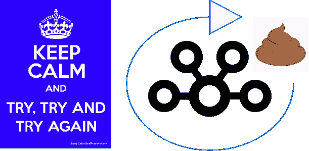
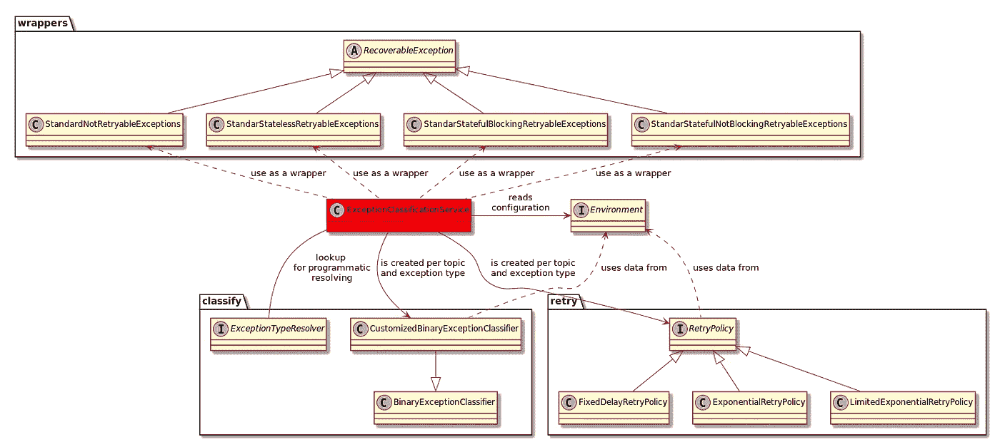
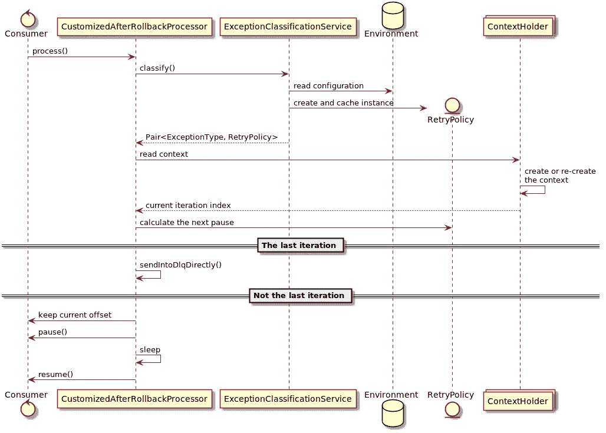
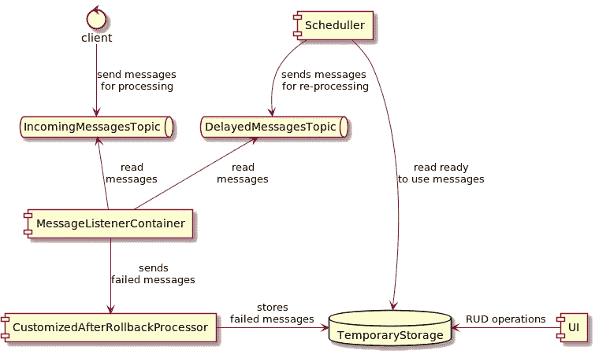
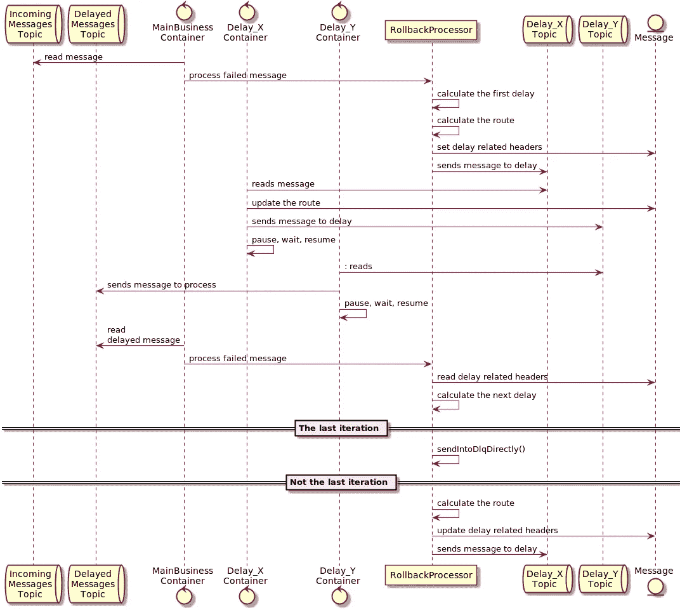

# 卡夫卡中的例外和重试策略

> 原文：<https://blog.devgenius.io/exceptions-and-retry-policy-in-kafka-6f0d3cf2c330?source=collection_archive---------0----------------------->

> “凡是可能出错的，都会一直出错。如果你认为事情进展顺利，那么你就错过了一些东西。”

曾几何时，当程序很小，计算机显示器让猫很开心的时候，我们主要处理单块的应用程序，从用户的角度来看，这是一个重大的失败点。该应用程序要么有效，要么无效。最多，用户可以重新加载整个页面。这通常是有帮助的；在其他情况下，不言而喻的是，任何事情都不会很快有所帮助。重放策略很简单，并且是在用户端实现的。错误是由意外损坏的东西引起的问题，需要尽快修复。

今天，我们主要处理分布式应用程序，其中错误不是恼人的事故，而是典型的甚至是预期的事件。实际上一切都可能出错:请求甚至响应可能会丢失，同步调用的服务可能会突然重启或移动，完成请求所需的数据可能还不可用，等等。这导致两个基本结论:呼叫方必须能够在必要时重复呼叫，接收方必须能够提供幂等处理。让我们今天在 Kafka 和 Spring 云基础设施和事务处理消息的上下文中更详细地讨论第一个方面。

# 一般异常管理

本章将从消息重试、不同的重试执行策略以及配置应用程序这一方面的可能架构的角度来研究异常。

## 例外的分类

首先，我们需要将可能的错误分成几组，每组都需要其特定的重试方法。应用于异常处理过程的术语有状态和无状态的含义应该事先澄清。

*   **在这种情况下，“无状态”意味着由应用程序来实现顺序处理尝试的过程。我们从主题中读取一次信息，并尝试处理几次。在这种情况下，数据存储的状态(组在 Kafka 分区内的偏移量)不会改变。**
*   **相反，在**“有状态”**处理期间，迭代的实现留给了数据存储。一次又一次，我们“丢弃”已经收到的信息，把它放回去，迫使消费者重读它。这种丢弃可以通过操纵 Kafka 分区中的组偏移量来实现。**

****可能的例外类型:****

*   ****不可重试的异常(NRE)** —是最有可能总是与错误一起处理的错误。在这种情况下，尝试重新执行请求将不允许我们修复这种情况。在绝大多数情况下，我们只能记录一个事实，即出现了一个异常，表明我们的应用程序中有一个 bug，然后将消息发送到死信队列(DLQ)中以供将来分析。此类异常的典型示例有 **NullPointerException、ClassCastException、NoSuchMethodException、反序列化 Exception、MessageConversionException、methoargumentresolutionexception**等。这类例外还包括非等幂业务操作中不应自动重复且不能自动撤销的错误。**
*   ****无状态可重试异常(SLE)** —表示可以通过重新调用来修复的问题，并且很可能很快就会修复。大多数业务级别的异常都属于这种类型。在这种情况下，关键因素是预期的修复速度，允许在为处理单个消息分配的超时时间内进行一系列重试。在消息处理尝试的整个列表完成之前，服务不会从分区中提取下一个请求。在一系列几次不成功的尝试之后，这样的信息通常也被发送到 DLQ。**
*   ****有状态阻塞可重试异常(SBE)** —对于这种异常，我们不知道要尝试多少次，消息才会得到适当的处理。因此，我们不能在内存中迭代，必须周期性地从分区中重复读取消息，以便进行下一次尝试。同时，识别出的问题对应用程序来说是非常重要的，很可能会阻塞所有后续请求的执行。因此，我们必须暂停传入消息的流动，直到我们安全地处理完这一个。此类异常的典型示例有: **SocketTimeoutException、ConnectException、TransactionTimedOutException、UnknownHostException** 。在这种情况下，我们永远不能向 DLQ 发送失败的消息，因为应用程序无疑是不可操作的，必须停止处理一般的消息。**
*   ****有状态不阻塞可重试异常(SNBE)** —与上一个类似，不同之处在于检测到的问题仅影响此消息的处理。应用程序最有可能安全地处理后续消息。通常，这种情况与执行请求所需的数据尚不可用有关。我们必须等待一段时间，让它被交付到适当的存储库。是否向 DLQ 发送其处理导致此类异常的消息取决于业务需求，最重要的是取决于 SLA 和指定的事件处理策略。**

**enum **ExceptionType** 可以用下一个成员来表达这个分类: **NRE，SLE，SBE，SNBE** 。**

**一般来说，用于对异常进行分类的不是异常本身，而是在其原因链中出现的某个特定异常(或某个特定异常的后续情况)。Spring 以**binary exception classifier**类的形式为我们的分类器提供了一个极其方便的模板。为了方便起见，建议在后继者中添加以下方法: **addException(class，defaultValue)** 和 **addException(className，defaultValue)** 。当例外列表是外部配置的或者必要的例外类型仅在运行时可用时，使用最后一个。**

**在某些情况下，同一个类的异常可能只在某些其他方面有所不同，比如消息文本。举例来说，当我们只遇到一种类型的异常时，我们可以考虑使用 PostgreSQL，这种异常包含不同的文本消息。SBE 异常仅包括包含以下消息片段的异常:“由于语句超时而取消语句”、“由于用户请求而取消语句”或“连接尝试失败”。因此，也建议实现基于接口 **ExceptionTypeResolver** 的编程异常分类策略。该接口只能包含一个方法**exception type classifier(consumer record，consumer，throwable)** 。**

**我们还需要能够用其他异常来掩盖一些异常。例如，在某些情况下，当在某个存储库中找不到某个对象时，遗留代码会使用 **NullPointerException** 。因此，事实上，我们不是与 NRE 打交道，而是与 SNBE 打交道。幸运的是，**binary exception classifier**检查原因链，并在它知道的第一个异常处停止。因此，如果我们将 **NullPointerException** 包装在**StatefulBlockingRetryException**中，我们的异常将被正确分类。因此，有必要为上述每种异常类型准备一种包装器。**

## **重试策略**

**为了实现一系列的执行尝试，Spring 提供了标准的 **spring-retry** 模块，包含以下主要的实用程序和注释:**

*   **配置上的 **@EnableRetry****
*   **方法上的 **@Retryable** ，需要自动调用几次**
*   ****RetryTemplate** 用于重复执行一些代码片段**
*   ****回退策略**用于迭代的定义参数——尝试次数、暂停次数等**

**Kafka Spring 使用了所有这些工具，但是有一个问题:它们都太智能了，并且暗示了正在执行的代码的外部迭代。对于 NRE 和 SLE 处理来说，这就足够了，但是我们需要计算对于最后两种类型的异常，我们应该将下一次处理消息的尝试延迟多长时间。我们还需要一种方便的方式来全局地或者在特定的主题级别上配置这个策略。最好是基于某个配置参数的单个字符串值。**

**因此，我们需要一个接口 **RetryPolicy** 和一组大致相似的方法:**

*   ****静态 retry policy parse policy(String strArgs)****
*   ****int getNext(int current)****
*   ****int getMaxInterval()****
*   ****void parse(String strArgs)****

**实践表明，以下策略足以奏效:**

*   **带参数的无限指数重试策略: **initialDelay，maxDelay，multiplier** 。**
*   **带参数的有限指数重试策略: **initialDelay，maxDelay，multiplier，maxDelayCount** 。**
*   **延迟直接枚举的任意策略: **5000x3，10000x5，30000x10，60000x20** 。**

## **配置**

**正如我们从两个不同的章节中所看到的，处理来自不同主题的消息的两个方面都可以是配置的主题:可能的异常的分类和为每个异常定义重试策略。**

**因此，配置的下一个片段可以在两个级别上应用:每个主题级别和作为默认配置的全局级别:**

**我们可以将与配置相关的执行的所有方面隐藏在**ExceptionClassificationService**服务之后。它提供了唯一的操作— **对<异常类型，返回策略>分类(记录，消费者，异常)**。**

**该服务可以通过下一个主要体系结构来实现:**

****

# **Spring 提供的基础设施**

**当在 Kafka 和 Spring 之间使用简单的标准集成时，一切都是透明的，可以定制。**

**当我们实现非事务性处理时，我们可以将定制的**concurrentkaflistenercontainerfactory**作为一个 bean 提供，只有两个额外的选项。**

*   **首先，让我们添加**seektocurrenterrotherhandler**，它为每条被错误处理的消息实现一个重试策略。**
*   **其次，我们需要通过**deadletterpublishingrecover**对其进行定制，在几次尝试失败后，它会将包装好的原始消息发送到 DLQ。**

**按照上面的代码，Kafka 消费者在 SLE 错误的情况下重试处理消息三次，并将其发送到 **< originalTopicName >。DLT** 话题。**

**使用事务时，默认情况下不配置错误处理程序，因此异常将回滚事务。对于事务容器的错误处理必须通过实现**afterrollbackoprocessor**接口来处理，而不是通过实现**seektocurrenterrandhandler**来处理。它的主要方法是 **void process(consumerRecords，consumer，exception，recoverable)** ，关于它我们可以在源代码中读到以下内容:**

> ***"处理剩余的记录。如果容器正在处理单个记录，Recoverable 将为 true 这允许处理器恢复(跳过)失败的记录，而不是重新寻找它。这对于批处理侦听器是不可能的，因为只有侦听器自己知道批处理中的哪条记录一直失败。重要提示:如果在使用单个记录调用侦听器时在事务中调用，事务 id 将基于失败记录的容器 group.id 和主题/分区，以避免僵尸防护问题。因此，一般来说，只有它的偏移量应该被发送到事务。对于其他行为，流程方法应该管理自己的事务。***

**这个接口的默认实现是**defaultaferrollbackprocessor**，本文的其余部分将讨论我们如何在不同的情况下定制它的行为。**

**不幸的是，如果我们使用 Spring Kafka 云集成，我们的情况就可悲多了。当然，我们可以提供我们对**concurrentkaflistenercontainerfactory**的实现，但是不会考虑它。Spring Kafka 云集成类的 keystone**KafkaMessageChannelBinder**通过方法**createkafconsumerfactory()**创建该类的实例，并通过方法**createConsumerEndpoint()**配置所有容器(它包含大约 150 行硬结构化代码)。这两种方法都因合法定制而关闭。**

**我们唯一能做的是定制已经创建的**ConcurrentMessageListenerContainer**的实例。可以通过发布类型为**ListenerContainerCustomizer**的 bean 来实现，该构造函数只接受一个参数 **BinderFactory** 。在方法 **void configure(container，destinationName，group)** 中，我们可以访问**ConcurrentMessageListenerContainer**的“准备使用”实例，该实例的属性 **afterRollbackProcessor** 用**defaultafterrollbacprocessor**的实例初始化。回滚处理器的这个实例又使用了另外两个组件:**

*   ****bi consumer<consumer record，Exception>**recover lambda，用于向 DLQ 发送最后一条禁止消息(当然，如果配置了的话)**
*   ****回退**用于处理导致 SLE 异常的消息。这种情况变得更加复杂，因为两个依赖项都不能通过 getters 获得。**

**所以这个**DefaultAfterRollbackProcessor**的实例也不允许通过继承进行定制——我们不能为构造函数提供在**KafkaMessageChannelBinder**内部初始化的必要依赖项。情况是一个死胡同，所以你必须执行肮脏的黑客奇迹。**

*   **通过 Apache Jakarta**field utils . read field**我们可以从**defaultaferrollbackprocessor**的可用实例中读取类型为 **FailedRecordTracker** 的私有属性 **failureTracker** 。**
*   **我们需要的恢复可以作为**failed recordtracker . get recover er()**获得。**
*   **为了获得**回退**策略，我们需要重复这个肮脏的攻击，并读取**故障跟踪程序**的私有属性**回退**。**

**之后，我们可以自由地从标准的**defaultaferrollbacprocessor**类继承，并用方法**concurrentmessagelistenercontainer . setafterrollbacprocessor()**替换它的标准实现。进一步改进的大门已经打开！**

**最后一个棘手的细节——类 **FailedRecordTracker** 是包私有的，所以函数 **getInstalledRecover** 和 **getInstalledBackOff** 必须在包**org . spring framework . Kafka . listener**内实现。**

# **基本设置和定制**

**至少，在我们正确配置 DLQ 处理之前。这并不复杂，下一个 YAML 的例子证明了这一点:**

## **DLQ 中的分区计数**

**但是，有一个细节并不明显——默认情况下，死信记录被发送到与原始记录相同的分区。这是一个完全合理的默认限制:如果我们想以某种方式继续处理挂起的 DLQ 消息，保持它们的原始分区有助于我们保持它们的相互处理顺序。**

**因此，死信主题必须至少有与原始主题一样多的分区。如果错误地没有执行，我们可以在日志中看到下一条乍一看不太清楚的消息:**

*   **向主题 some-topic-error 和分区<x>发送 key='{… } '和 payload='{… } '的消息时抛出 _ exception</x>**
*   ***超时异常:60000 毫秒后元数据中不存在主题 some-Topic-error。***

**因此，消费线程在 60000 毫秒内被阻塞，此后，执行将继续，不会引发任何异常。令人难以置信的是，很难将这些异常与试图将消息转发给 DLQ 的原始异常联系起来。感觉就像在卡夫卡深处的某个地方，超时异常只是被吞掉了，执行继续，没有试图继续发送消息。**

**顺便说一下，Kafka 通常非常喜欢吞下她认为用户无法处理的异常，或者她希望以某种方式补偿的异常。一个很好的例子是**consumer interceptor/producer interceptor**中的异常，这些异常只被记录，但不能被应用程序代码捕获。**

**因此，原始信息完全丢失，并且在没有任何明显症状的情况下无法进入 DLQ。不幸的是，我还没有找到任何方法来设置超时以获取主题的元数据。纠正这种错误的最好方法是使用正确的主题配置，或者通过提供**DlqPartitionFunction**bean 来手动管理这个过程。**

**此外，还可以围绕恢复 lambda 实现一个包装器— **CustomizedRecover** 。**

*   **这个由定时器执行的高级恢复将通过**sendingtodlqthread . interrupt()**中断发送过程。**
*   **从包装的方法返回后的发送进程可以验证 **Thread.interrupted()** 并且自身抛出超时异常。**
*   **收到该异常后，**DefaultAfterRollbackProcessor**将丢弃当前消息的接收，该接收将由下一个 **poll()** 调用再次接受。**

**这种方法相当卑鄙，因为不可能确保没有竞争条件，而且总是有中断错误的危险。但是它很容易实现，有效，并防止在错误的意外错误配置的情况下丢失消息。**

**一般来说，使用 DLQ 需要和使用主引入主题一样仔细的配置。例如，如果我们想要处理大消息(默认情况下超过 1048576 字节)，我们必须通过 **max.request.size** 配置属性同时扩展这两个主题的限制。否则，我们将面临一个“有毒”的消息，服务将停止。**

## **默认未提交偏移量**

**下一个小问题是**defaultafertorllbackprocessor**的一个奇怪的“默认”配置。**

**在不成功地处理消息并将其发送到 DLQ 之后，处理器不会提交 Kafka 的下一个偏移量。**

*   **通常，这不是一个问题，因为在读取并成功处理下面的消息后，将提交下一个偏移量，有问题的消息不会被接收两次。**
*   **但是，如果我们在此之后立即停止并启动该服务，或者如果发生了重新平衡，将会再次接收并处理该消息。**

**以这种方式检索和处理单个消息当然不成问题。但是，如果有成千上万条这样的消息，并且在另一次随机重新平衡之后，我们重新开始处理它们，这可能已经成为一个问题。**

**这个问题可以通过调用**defaultafterrollbacprocessor**:**setCommitRecovered(true)**和**setKafkaOperations(Kafka template)**的下一个方法来修复。唯一的问题是从哪里获得 **KafkaTemplate** 的实例。**

**通常，我们从 **ProducerFactory** 实例中创建它，但是它在 Spring Kafka 云集成中不可用(惊喜！！！).幸运的是，我们可以通过**KafkaMessageChannelBinder)binders . get binder(null，message channel . class . gettransactionalproducerfactory()**无反射地得到它。**

# **处理 NRE、系统性红斑狼疮和未认可的例外情况**

**默认情况下，**DefaultAfterRollbackProcessor**可以通过**binary exception classifier**的嵌入式实例正确识别 NRE 异常。但是因为我们想完全控制这个过程，我们可以清除这个列表。从那一刻起，从处理器的角度来看，所有的异常都是无状态可重试的。因此，我们只需过滤 NRE 例外，并手动将它们发送到 DLQ。**

**对付 SLE 就更容易了。所有被识别为 SLE 的异常都可以传递给默认实现。之后，将执行三次标准的执行尝试，在第三次失败后，失败的消息将被自动发送到 DLQ。**

**所以我们的**customizedafterrollbacrocessor**类的实现看起来像这样:**

**在这一节(以及接下来的几节)中，上面的源代码被稍微简化了，假设“记录”列表只包含一个记录或者只属于某个主题的一个分区的记录。如果侦听器只为一个分区中的一个主题服务，或者专用线程的数量等于分区的数量，则可能会出现这种罕见的情况。经验表明，在这种情况下，分配是根据“每个线程专用分区”的原则进行的，没有任何问题。**

**但是通常情况下情况更复杂，这个列表将包含属于不同分区和主题的记录。我们将不得不使处理算法变得非常复杂，因为我们只需要为一个分区提交一个新的偏移量。相反，对于其他分区，我们必须移回当前偏移量来再次处理记录。**

# **处理状态阻塞可重试异常**

**处理有状态阻塞可重试异常稍微复杂一些。我们必须一遍又一遍地处理这些信息。如果失败，我们将偏移量向后移动，并等待一段时间，然后再次尝试。**

**我们无限期地重复这个过程，直到消息最终被成功处理。当然，分区中的所有其他消息都被阻塞，等待接收。事实上，要处理的消息是一条有害的消息，或者以某种方式接近于有害的消息。**

**主要问题是存储流程上下文:**

*   **正常情况下，我们希望成倍地延迟消息。**
*   **因此，我们需要将迭代次数保存在某个地方，以便我们可以使用它来计算下一个延迟。**
*   **因为我们不能改变已经存储在 Kafka 主题中的消息，所以我们必须将消息的上下文存储在服务的内存中。**

**我们可以转向下面的权衡方法，它看起来相当正确:**

*   **该消息的重试上下文仅由两个字段组成:**偏移**和**当前操作 Idx****
*   **要存储上下文，您可以使用一个静态结构 **ContextHolder** ，实现为 **Map < String，Context >** ，其中类似于**"<message . topic>_<message . partition>"**的内容被用作键。每个服务的这种组合的数量很少且有限，因此我们不需要使用复杂的缓存实现— **ConcurrentHashMap** 就足够了。**
*   **当我们从缓存中查询上下文时，我们可以得到 null**或一个过时的上下文。对于过时的上下文 **message.offset！= context.offset** 。在这两种情况下，我们假设这是当前消息的第一次迭代，并使用相应的**偏移量**和 **currentIterationIdx = 0** 重新创建上下文。****
*   **在以下两种情况下，上下文可能会过时。这是第一次尝试处理该消息，并且上下文是先前已经处理过的 SBE 消息遗留下来的。或者发生了重新分区，消息处理转移到另一个集群节点。在这两种情况下，“从头开始”都是可以接受的策略。**

**因此，我们知道当前消息的下一次迭代，并可以通过实现全局配置或特定主题级别配置的 **RetryPolicy** 来计算下一次迭代的延迟。**

**现在，我们要做的就是决定如何利用这些知识。**

****如果不是最后一次迭代，我们必须应用延迟****

*   **通过**consumer . seek(record . partition()、record.offset())** 保持当前偏移量。**
*   **通过**consumer . pause(collections . singletonlist(record . partition))**让消费者暂停**
*   **等待之前计算的延迟。当用户暂停时，我们不会冒因 **max.poll.interval.ms** 超时而导致重新分区的风险。也可以使用方法**container . pause()/container . resume()**来应用暂停。我们能够处理来自一个分区的消息而不能处理来自另一个分区的消息，这是非常令人怀疑的。**
*   **通过**消费者恢复状态(collections . singletonlist(partition))****

****如果是最后一次迭代，我们有****

*   **直接将失败消息发送到 DLQ，就像我们之前为 NRE 例外执行的操作一样**
*   **值得注意的是，对于这种类型的异常，停止迭代并将消息重定向到 DLQ 并不常见。**

**下图可以说明所描述的方法:**

****

# **处理有状态不阻塞可重试异常**

**在这种情况下，我们不是在处理应用程序的全局问题，而是无法处理特定的消息。但是，我们期望这种情况将在未来由开发人员修复，并且该消息可能被成功处理。**

****此类问题的典型原因:****

*   **处理所需的数据尚不可用。**
*   **使用流程尚未到达可以使用此消息的相应步骤**
*   **处理消息需要一些非常具体的功能，目前还不可用。**
*   **在多功能主题的情况下(不推荐)，目前不可能只处理这种类型的消息**

**解决方案的想法很明显——暂时将消息推迟到某个存储区，过一段时间再处理它。主要问题是使用什么类型的存储。**

## **基于数据库的存储**

**首先想到的是一个基于关系数据库的存储库，延迟的消息被写入其中。**

**与消息一起发布的还有必要的元数据:原因、原始主题/关键字、延迟值。基于**“select for update skip locked”**请求，调度程序进程读取准备就绪的待处理消息，并将它们发送回服务主题以继续标准处理。由于发送 Kafka 消息的过程足够快，我们可以预计企业架构的吞吐量足够高——大约每秒 1000 条消息。**

**为了确保重复消息不会与原始消息竞争，并且服务能够尽快地获取它们，建议组织两个输入队列—标准消息和重复消息。**

****基于数据库存储的优势****

*   **这个存储库是高度可观察和可审计的。在任何时候，我们都可以找到一个未决的消息，了解它何时将被处理，立即手动开始重新处理，等等。**
*   **实现用户界面非常简单。**
*   **这种存储也非常适合用作有保证的事务性消息传递的网关。**

****基于数据库存储的缺点****

*   **如果业务流程涉及同时处理数百万条未决消息，数据库性能是不够的。**
*   **即使存储库中没有未决的消息，我们仍然有一个持续轮询的过程，并给基础增加了负担。**
*   **这种存储库的自我实现并不总是微不足道的。例如，可能会一次读取几条消息并传递给线程池进行发送。如果它们之间的消息顺序很重要，那么这种划分应该得到这样一个调度器逻辑的支持。**

**我可以建议使用类似于 **Yandex** **db-queue** 的东西作为这种存储库实现的基础。一个令人印象深刻的解决方案是**PgQ**——一个由 Skype 实现的极高性能队列。**

**下图可以简要说明上述过程:**

****

## **基于卡夫卡的存储**

**如果我们想建立一个真正的事件驱动系统，我们可以使用漏桶模式。这种方法的基本思想很简单:如果同一主题中的所有消息都具有相同的“delay”属性值，那么它们都可以被顺序处理。**

****因此，该解决方案的基本架构如下所示:****

*   **有一组标准主题，每个主题负责实现特定长度的消息处理延迟。比如一分钟、十分钟、半小时、一小时等等。**
*   **对于每个主题，我们都有一个标准的个人消费者来执行以下相对简单的操作。它读取下一条消息，并查看相对于消息被添加到主题的时间，预期的延迟是否已经过期。**
*   **如果没有，它会暂停并等待满足所需的延迟(我们已经在 SBE 处理的上下文中实现了这个操作)。之后，它在下一个主题中发送消息，由标准头定义，并恢复消费。**

**任意时段的整个消息处理延迟是通过将该值分解成一系列固定延迟来实现的。然后，主题的路由被添加为某个消息头，该消息头在每次后续传输时更新。比如我们要安排 17 分钟的执行延迟，那么路由看起来会是“delay_10，delay_5，delay_1，delay_1，DelayedMessagesTopic”。最后，消息被发送到实现固定延迟的第一个队列；在我们的例子中，它是“delay_10”。最后,“delay_1”的专用使用者将消息发送到“DelayedMessagesTopic ”,供应用程序重新处理。**

**由于应用程序可以用一组延迟相关的头来丰富消息，所以我们不必将迭代过程上下文存储在内存中，并且可以将其与消息一起传递。至少，我们需要下一个头:“X_DELAY_ROUTE”(延迟主题的列表)、“X_DELAY_COUNTER”(当前迭代的编号)、“X_DELAY_REASON”(用于日志记录)，等等。**

**下图可以说明操作的结果:**

****

**重要提示:因为我们需要保持消息的相互顺序，所以在主题之间传递时，我们必须使用与原始主题中的分区编号相同的分区。**

**如果消息包含大量数据，我们可以显著减少传递延迟消息的流量。如果我们不在“延迟”消息中包含整个原始消息，而只是以<topic name="" partition="" number="" offset="">的形式包含一个指向它的指针，这样的减少是可能的。在这种情况下，最后阶段的调度程序必须:从消息中提取对原始消息的引用，读取原始消息，克隆它，并将结果副本发送给服务进行处理，而不是将消息本身转发给传入的服务主题。在这种情况下，原始主题的保留设置应该允许消息保留到延迟过程结束。这个技巧将在稍后的“如何处理 DLQ”一节中详细讨论。</topic>**

**这种技术在实现方面稍微复杂一些，但是有几个基本的优点:完全事件驱动的架构和无限的水平可伸缩性。主要的问题是可管理性:当一个挂起的消息在主题之间传递时，我们没有一个点来获取关于它的信息或立即重新处理它。**

## **部署:本地存储与专用服务**

**在使用关系数据库作为存储的情况下，专用服务根本不是一个选项，因为只使用一个数据库实例会显著降低吞吐量。**

*   **此外，如果其中一个服务开始生成太多的“延迟”消息，它将降低其他服务的类似功能。**
*   **在最好的情况下，服务不会是独立于运行时的；在最坏的情况下，可以实现负反馈循环。**

**尽管这是一个很有吸引力的想法——它允许您有一个中心控制点，并监视所有重新处理的邮件。**

**在卡夫卡的例子中，我们在两种可能性之间有一个真正的选择。各有利弊。**

****本地存储:****

*   **系统中的主题数量显著增加，因为我们必须为每个新服务创建一组不同的“延迟”主题。**
*   **这些服务相互之间保持完全独立。**
*   **每个服务必须有大量的代码和线程来实现调度程序的逻辑。**

****专门的服务****

*   **系统中的主题总数要少得多。**
*   **安全问题—该服务成为一个高漏洞点，允许对所有其他服务的攻击。可以通过让每个服务对发送给 scheduler 服务的消息进行签名来修复此漏洞。在这种情况下，签名/加密密钥可以是对称的、随机的、由每个服务定期重新生成的，并存储在其数据库中。**
*   **每个服务上剩余的调度逻辑可能非常少——将消息转发到调度程序的标准队列，并为其添加标准头。**

# **相互依赖的信息问题**

**只要消息是相互独立的，一切都可以正常工作。但不幸的是，在许多情况下，我们面临着一个消息的成功处理依赖于前一个消息的处理的情况。一个令人困扰的问题出现了:如果在处理某个消息的过程中，我们得到了一个 SNBE 异常，并将这个消息发送到专用的主题进行非阻塞的重新执行，我们该如何处理后续的相关消息呢？**

**有时，如果不处理前一条消息，就不可能处理后面的消息。例如，当业务流程还没有到达正确的点时。在这种情况下，情况没有那么糟糕——我们可以接收到一个异常，基于这个异常，我们还可以发送一个后续消息进行延迟的重新处理。当后续消息只是为了响应处理前一个消息的通知而发送时，我们也可以忽略这种依赖性。**

**不幸的是，有些情况下，跟进消息在技术上可以应用，但从业务角度来看，这是完全不正确的。例如，在 CQRS 模式中，“跳过”一条消息不会导致技术问题。但是作为这种吞咽的结果，在源端和目的端的数据集合的状态是不同的。**

****可能的解决方案****

*   **我们可以向每个消息的元数据添加一个特定的字段——“唯一业务流程标识符”。它可能是实际 BPMN 进程的 UID，也可能是数据聚合的 ID。**
*   **在服务的数据存储中创建一个用于存储这些标识符和相关细节的专用表。如果我们沿着某个延迟执行的路由发送了一条消息，那么带有计算出的路由的业务流程标识符将被添加到这个表中。**
*   **此后，具有该标识符的所有其他消息将自动沿着指定的路由发送，而不会尝试进行处理。在这种情况下，原则是我们不应该为这些后续消息计算新的路由(因为从第一个消息开始经过的时间，配置可能会改变),而是使用原来的路由。**
*   **必须考虑到所有这些消息将在将来某个时间被正常处理。因此，除了每个 UID 路由之外，还必须存储已经延迟的消息的数量。如果延迟的消息被适当地处理，则该计数器被减少，或者该记录被从存储器中移除。**

**该算法不是线程安全的，但是当我们在转发时保留分区号时，一个业务流程上下文中的所有消息将严格按顺序处理。**

**我们在转发消息到 DLQ 主题时遇到了类似的问题。几乎所有类型的例外都会发生这种情况，也许除了 SBE。此外，可能会有混合案例。例如，我们开始处理一个 SNBE 异常，在下一次重试时得到一个 NRE，并向 DLQ 发送一条消息。随后的消息也必须分别发送到 DLQ。**

**识别相互依赖的消息的任务只能在业务级别有效地解决。因此，我们需要一些机制来通知应用程序一些消息已经被发送到 DLQ。我们还需要一种简单的方法将当前处理的消息重定向到 DLQ，而不需要再次处理它。由于这个原因，建议引入以下两个组件:**

*   **一个接口**用下面两个左右的方法定制了 recoverlistener**:**void before(consumer record，initialEx，route)** 和 **void after(consumerRecord，initialEx，route，recoverEx)** 。在发送到 DLQ 的情况下，参数 **route** 为空。如果恢复过程中出现错误，参数 **recoverEx** 不为空。**
*   **异常**previous message 被恢复**并带有下一个参数:**消息**和**路由**。在之前发送到 DLQ 的消息中，参数 **route** 为空。**

# **如何处置 DLQ？**

**DLQ 类似于中间状态，来自中间状态的消息必须由管理员选择并手动分析。如果应用程序没有提供执行该操作的 UI，那么消息实际上就被丢弃了。**

**必要功能的最小集合:**

*   **获取有关问题的信息:时间戳、服务名、类名、异常相关信息(类、消息、堆栈跟踪)、来源、位置(主题/分区/偏移)、有效负载类型和数据(或其中的一些重要片段)、唯一的请求和业务流程标识符，等等。**
*   **获取事件周围相应服务的日志片段。**
*   **获取可能与失败消息相关联的其他消息的列表。**
*   **获取发送到 DLQ 的邮件列表，因为这封邮件在其中。**
*   **手动发送消息(及其追随者)进行重新处理。只有在阻止正确消息处理的问题在处理服务端得到解决之后，才能完成此操作。作为一个基本原则，我们不希望在重新发送失败的消息之前编辑它们，因为理论上原始的消息流可以由相同的服务再次处理。在这种情况下，我们不希望原始消息再次出现在 DLQ。**
*   **获取发送到 DLQ 的不同类型邮件的统计信息**

**如果我们不想为此编写一个专用的应用程序，我们可以从 Elasticsearch 和 Kibana 的组合中获得几乎所有我们需要的东西。**

*   **一个特殊的“收集器”从所有 DLQ 队列中读取消息，用元数据/一些业务数据丰富它们，然后将它们作为文档发送给 Elasticsearch。如果您不打算发布任何特定的属性，您可以使用标准的 Kafka Elasticsearch 连接器，但是它对于定制是关闭的，如下所述。**
*   **从根本上说，我们没有在文档中包含有效载荷本身。相反，我们只保存主题名称、分区和偏移量作为有效负载引用。这样，保存的文档不会比日志行占用更多的空间，我们不仅可以节省磁盘资源，还可以节省服务器吞吐量。**
*   **通过 Kibana 提供的“字符串字段格式器”,我们可以将一些文档属性转换成 HTTP 链接，实现我们需要的功能。例如，我们可以将包含消息在 Kafka 集群中的位置的 payload reference 属性呈现为收集器端点的 GET 链接。收集器只需从请求中选择位置，读取 Kafka 主题的消息，将其存档并作为文件返回给用户。其他链接可以指向 Kibana / Jaeger，并将 UI 切换到不同的模式，以提供“围绕”该问题的必要相关信息。**

**所提出的解决方案的优点无疑是实施成本低，并且在失败消息的分析方法方面具有特别的灵活性。理论上，这种方法可以扩展到其他一些应用程序主题，我们可以使用 Kibana 作为应用程序内部数据流量分析器。例如，通过这种方式，我们可以在调度程序的主题中搜索延迟的消息，并立即发送它们进行重新处理。**

**以下代码片段说明了一个要点:使用指针从集群中读取消息:**

**除了 Elasticsearch，我们还可以使用传统的关系数据库。但是我们必须考虑到，当我们必须处理单个表中的上亿条记录时，其中许多记录的性能会显著下降。这就是为什么我们需要分片，最好是自动分片。在这种情况下，自动化意味着新表被自动添加到模式中，并且 SQL 查询被自动重写以一次从许多这样的表中选择数据。例如，在 PostgreSQL 生态系统中，这种功能是由 **TimescaleDB** 扩展提供的。然而，如果我们只想分析和管理来自 DLQ 主题的消息，我们很可能不必处理大量的消息，一个常规的数据库就足够了。**

# **结论**

**我希望我展示了分布式系统中的异常处理是一个相当复杂的挑战。一个更困难的任务是测试应该实现这个功能的代码。**

**我故意留下了许多有趣的问题，超出了本文的范围。例如，我没有考虑为处理 Kafka 消息而定义的重试策略和 BPMN 引擎任务之间的交互。**

**当然，如此复杂的机制本身就是引人注目的 bug 的来源，开发者将不得不花费数周甚至数月的时间来研究这些 bug。像**KafkaMessageChannelBinder**这样的神奇工具给项目增加了很多额外的复杂性，这些工具旨在尽可能地让开发人员的生活变得简单，并让每个初学者都可以使用这项技术。因此，只有一个非常有经验的专家，带着一个裸露的调试器和一组肮脏的黑客，才能让这些神奇的工具不只是以任何方式工作，而是完全按照需求工作。**

**几年前，当我不得不大量使用 JMS 时，我围绕**DefaultMessageListenerContainer**手工构建了所有必要的基础设施。诚然，我非常后悔在卡夫卡的案例中，我屈服于诱惑，尝试了一种“跳出框框”的解决方案。就可靠性和灵活性而言，它确实不亚于 Oracle、IBM 和其他备受尊敬的供应商提供的令人钦佩的企业级就绪解决方案。**

**因此，在开发分布式系统时，在项目启动价格、其功能的正确性和使其达到理想状态的成本之间找到一个最佳平衡是至关重要的。别忘了知名政治人物的定义:*“痛苦是蛋白质体的存在方式”*。**