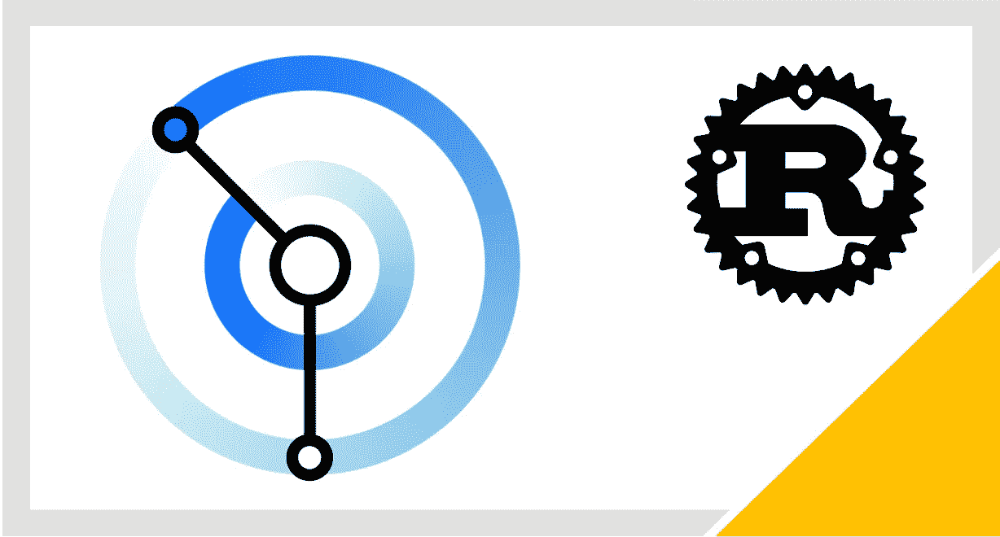
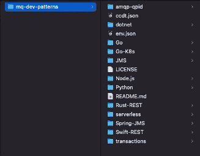
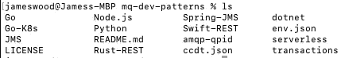
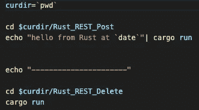
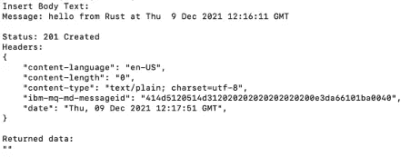
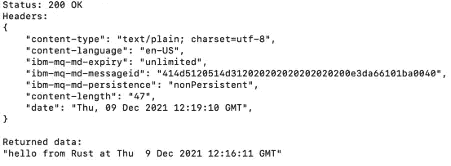
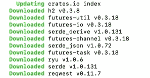
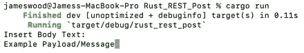
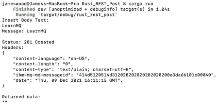
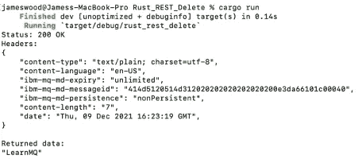

# 使用 Rust 与 IBM MQ 交换消息

> 原文：<https://blog.devgenius.io/exchange-messages-with-ibm-mq-using-rust-50984e568d76?source=collection_archive---------7----------------------->

# 简介:

在本教程中，您将学习如何使用带有 Rust 的 IBM MQ Rest API 来与 IBM MQ 队列交换消息。

本教程使用 [Cargo](https://doc.rust-lang.org/cargo/index.html) 作为 Rust 的构建系统和包管理器。Cargo 通过动态下载应用程序运行所需的依赖包，简化了 Rust 应用程序的构建。

下载完依赖 Rust 包后，Cargo 会编译该包，并将编译单元存储为 Cargo“Crate”。这确保了一旦 Cargo 第一次发现了新的依赖项，相同项目的后续执行会更快，因为依赖项箱在 Cargo 的缓存存储中是可用的。

# 认证警告:

此示例允许使用自签名证书，允许 web 服务器提供的任何证书。参见[‘danger _ accept _ invalid _ certs’](https://docs.rs/reqwest/0.11.9/reqwest/blocking/struct.ClientBuilder.html#method.danger_accept_invalid_certs)函数的使用。

这种做法对于代码示例来说是可以接受的，但对于一般的或实际的使用来说是不可以接受的。使用无效的证书会增加攻击和病毒的可能性，同时会使您的加密和相互身份验证面临风险。

**先决条件:**

要完成本教程，您需要以下内容:

- [生锈](https://www.rust-lang.org/tools/install)

- [卷曲](https://curl.se/download.html)

- [Git](https://github.com/git-guides/install-git)

# **步骤:**

## **步骤 1:设置&配置您的队列管理器**

在我们开始使用 Rust 之前，我们首先需要设置一个队列管理器。下面的链接包含了详细的操作说明。

本教程中的步骤 1 和 2 将帮助您设置队列管理器:[https://developer.ibm.com/series/mq-ready-set-connect/](https://developer.ibm.com/series/mq-ready-set-connect/)

## **第二步:创造一个可靠的防锈环境**

一旦您的队列管理器被设置和配置好，让我们获取代码并开始使用 Rust。

**储存库:**

这个存储库包含 IBM MQ 的所有当前示例。通过克隆它，您将可以访问其他几种不同语言的样本，以供测试和使用。

在本教程中，我们主要关注这个库的/Rust-REST/部分。

点击此链接后，点击屏幕上显示的代码按钮。在这里，您可以使用三种不同的方法克隆这个存储库。(插入截图)

现在，我们将使用代码中的 HTTPS 选项卡来克隆存储库。

打开命令行界面，导航到您的桌面，这是我们将要克隆存储库的目录。

git 克隆[https://github.com/ibm-messaging/mq-dev-patterns.git](https://github.com/ibm-messaging/mq-dev-patterns.git)

使用 Finder 或其他文件浏览工具导航到您的 mq-dev-patterns 目录，在完成克隆后，您应该会看到类似如下的列表:

显示克隆的 GitHub 存储库

太好了！您已经完成了将存储库克隆到桌面上的第一步。现在是时候使用前面的终端窗口导航到 Rust-REST 文件夹了。

在终端窗口中，通过发出 cd 命令将目录更改为克隆的存储库目录。

一旦进入存储库目录，在 macOS 上运行' ls '命令或在 Windows 上运行' dir ',您应该会看到如下所示的列表。

在开始执行一些代码之前，我们的最终任务是找到它！

运行以下命令:

' cd 生锈-休息'

您已经成功地在桌面上为克隆的存储库创建了一个目录，并使用命令行找到了正确的示例。现在是时候运行这个文件夹中的 Rust 示例程序了。

***认证更改为连接到一个已经存在的 IBM MQ 队列管理器:***

如果您想使用这个 Rust 示例连接到任何预先存在的 IBM MQ 队列管理器，首先需要做一些更改。

Rust-REST 目录包含一个名为 envrest.json 的 JSON 文件，用于连接到您的队列管理器。其中包含 APP_USER 和 APP_PASSWORD，以及您希望示例使用的主机和端口。

如果你在 IBM Cloud 上使用队列管理器，你可以在这里找到一些说明。

*现在您已经准备好通过 IBM MQ REST API 发送带有 Rust 示例的 MQ 消息。*

## 步骤 3:理解和运行脚本文件

脚本文件将连续执行在克隆的存储库中找到的发送者和接收者示例。

该文件本身包含以下代码:

RUNME.sh

可以运行 RUNME.sh 来检查您的队列管理器是否成功地处理了消息。但是，您可以自己手动使用这些示例，如何使用的细节将在步骤 4 和 5 中解释。

要运行脚本文件，请在克隆的存储库的 Rust-REST 部分中，在命令行界面上执行该命令。

Mac/Linux:

。/RUNME.sh

窗口:

bash RUNME.sh

POST 示例将向队列管理器发送消息，而 DELETE 示例从队列管理器获取消息并使用它。

运行这个脚本文件的结果可以在下面看到。

*运行 Rust_REST_POST (Post)*

*运行 Rust_REST_Delete(获取)*

在成功执行两个 POST/GET 程序后，将为 POST 示例显示 HTTP 状态代码 201，为 DELETE 示例显示 200。这些是基于请求的结果。

**第四步:把你自己的信息放到你的队列中**

当仍然在 Rust-REST 中时，将目录切换到 Rust-REST-Post 并发出运行程序的命令

Mac/Linux:

*   CD/防锈支架/防锈支架柱
*   货物运输

窗口:

*   cd \锈托\锈托-柱\
*   货物运输

在执行时，Cargo 将开始处理 Cargo.toml 文件中的所有依赖项。

Cargo 通过访问依赖库(如 crates.io)下载运行您的程序所需的 crates 来实现这一点。您选择的依赖库存储在 Cargo 目录下的 Cargo.lock 文件中。

第一次执行程序时，Crates.io 索引将开始更新。

应用程序将提示用户输入文本，如下图所示。

一旦板条箱被下载，程序将开始编译和运行。此后，程序将输出一个 HTTP 状态代码，显示请求的状态。对于成功的 POST 请求，返回的状态代码应该是 201。

有效负载学习的 POST 请求的成功结果

恭喜你！如果您返回的状态代码是 201，那么您已经成功地使用 Rust 和 Cargo 向您的队列发送了一条消息。如果没有，也不要慌。Rust 出色的错误处理会在输出控制台中通知您问题。

现在，我们将看看您是否可以通过使用 DELETE 程序从队列中获得相同的消息。

**解题:**

运行时的常见错误有:

-您的容器没有运行

-不正确地修改 envrest.json 变量

控制台也可能返回完全不同的 HTTP 状态代码。有关如何理解和识别状态代码问题的信息，请单击[此处](https://www.ibm.com/docs/en/ibm-mq/8.0?topic=transfer-http-respo%E2%80%A6)。

## **第五步:从队列中获取自己的消息**

首先，导航到目录中的 Delete 文件夹，发出 run 命令。

*   CD MQ-开发-模式/Rust-REST/Rust-REST-删除
*   货物运输

将打印一个状态代码，显示当前请求的状态以及响应返回的标题。对于 GET 请求，消息体将打印在“返回的数据”部分。

您已经成功地获得了使用 Rust 通过 IBM MQ REST API 发送和接收消息的示例。恭喜你！

**总结和后续步骤:**

在本教程中，您使用了一个脚本文件来初步运行程序、特性和功能，并通过自己运行程序、在队列管理器中输入和检索您自己的有效负载，采取了一种更实际的方法。

现在您应该明白在 MQ 中使用 Rust 需要采取什么步骤。使用这里学到的知识，您可以在您的克隆存储库中使用我们的其他语言样本，在您的队列管理器中实现相同的结果。

为什么不看看我们使用 IBM MQ API 的其他语言示例呢，它们可以在同一个存储库中找到。