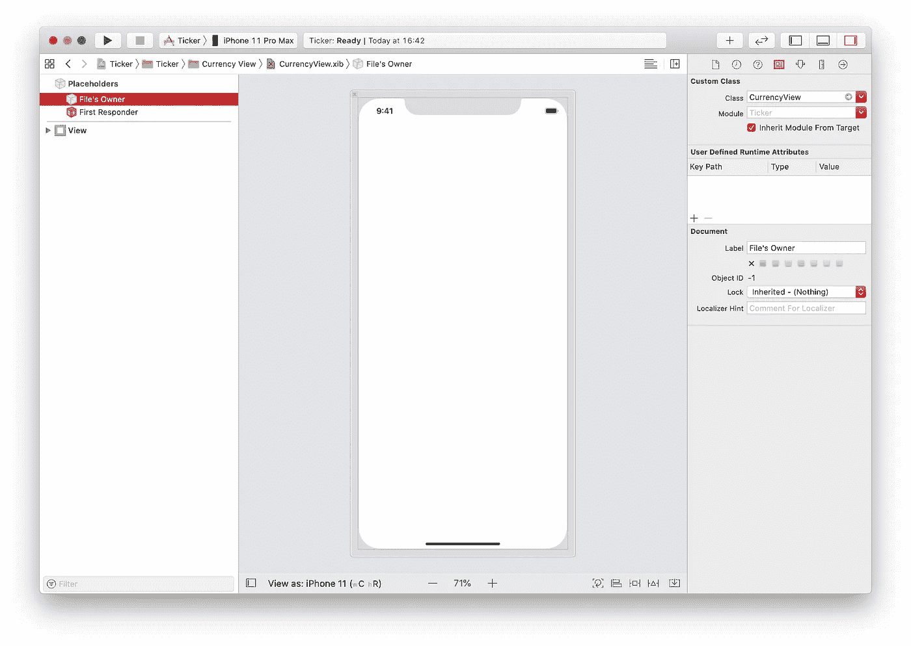

# iOS 的汇率报价机

> 原文：<https://blog.devgenius.io/exchange-rate-ticker-for-ios-b7e279b35c8f?source=collection_archive---------10----------------------->

设计和开发一个简单的 iOS 汇率报价器。

在我之前的[文章](https://medium.com/dev-genius/how-to-create-an-apple-card-payment-dial-bdbae4017c21)中，我提到我的项目文件夹中有一些代码积满了灰尘。这就是一个这样的项目，我现在想和你们分享一下。

我每天都使用 iOS 的股票应用。我真的很喜欢顶部的股票代码。它启发我做了一个汇率报价器。

本文将分为两部分:

*   第 1 部分—股票行情
*   第 2 部分—使滚动条具有可访问性

滚动条是一组货币视图。如果货币视图的宽度之和超过了滚动条的宽度，滚动条将显示视图，以便用户可以看到所有的货币。

现在让我们从货币的角度开始。

# 货币视图

使用**单视图应用**模板创建一个新的 Xcode 项目。称之为*跑马灯*，设置*用户界面*为*故事板*。

在**项目导航器**中，选择*股票行情*组，添加一个新组，命名为**货币视图**。我们将添加两个新文件。第一个是 **Cocoa Touch 类**，将其命名为 **CurrencyView.swift** ，并使其成为`UIView`的子类。第二，一个**视图**用户界面文件。称之为 **CurrencyView** 。

打开 **CurrencyView.xib** 文件。在左侧的**文档轮廓**窗格中，选择**文件的所有者**。

> 如果看不到**文档轮廓**，在 Xcode 中打开*编辑器*菜单，选择*文档轮廓*。

打开右侧**检查器**窗格中的**身份检查器**。在**自定义类别**部分，将*类别*更改为`CurrencyView`。

> 如果看不到**检查员** *窗格，打开* *查看*菜单，然后转到*检查员*子菜单，选择*显示检查员*。

在右侧的**检查器**窗格中，选择**视图**并打开**属性检查器**。在**模拟矩阵**部分，将*尺寸*更改为*自由形式*。

在右侧的**检查器**窗格中选择**尺寸检查器**，将视图的宽度更改为 64，高度更改为 90。

在**检查器**窗格中选择**文件检查器**，取消勾选*使用安全区域布局指南。*

给视图添加一个图像视图，将其命名为*标志图像视图*，在**尺寸检查器**中将其宽度和高度设置为 30。我们正在手动设置大小，以便长宽比将是一。添加一个前导和尾随约束 17，一个顶部约束 8，并勾选*纵横比*复选框。

我们的货币视图需要两个标签，一个用于货币代码，另一个用于汇率。让我们从货币代码开始。
在*旗帜图像视图*下给我们的视图添加一个文本标签，命名为*货币代码*。在右侧的**检查器**窗格的**属性检查器**中，设置字体的**样式**为**粗**，大小为 16。将文本对齐设置为**居中**。

将*货币代码*标签的顶部固定到*标志图像视图*的底部，并将值设置为 4。添加值为 8 的前导和尾随约束。

这就是我们的货币代码标签。让我们来看看价格标签。在*货币代码*标签下添加另一个标签，命名为*汇率*。将字体大小设置为 14。将文本对齐设置为**居中**。将*汇率*的顶部固定到*货币代码*的底部，并将其值设置为 8。针对其值为 8 的超级视图设置前导和尾随约束。最后将底部固定到其超级视图的底部。

在 **CurrencyView.swift** 中创建以下三个插座，并在*界面构建器*中连接它们:

为了在类被实例化时加载 nib，创建一个公共初始化器`commonInit()`，每当调用`UIView`的一个初始化器时，就会调用这个初始化器。

我们的`CurrencyView`现在已经完成，让我们继续关注股票本身。

# 滚动条视图控制器

在 Xcode 中创建一个新的视图控制器，将其命名为 **TickerViewController** ，并确保选择*同时创建 XIB 文件*。

打开**tickerviewcontroller . xib**文件。选择左侧**文档轮廓**窗格中的**视图**，然后打开右侧**检查器**窗格中的**属性检查器**。在**模拟度量**部分，将*尺寸*更改为*自由形式*。

现在让我们设置滚动条的大小，转到右边**检查器**窗格中的**大小检查器**。将视图的宽度设为 414，高度设为 90。

给我们的视图添加一个滚动视图，设置它的宽度为 414，高度为 90。注意**尺寸检查器**中的**自动调整尺寸**部分。我们将让操作系统将我们的自动调整大小遮罩转换为自动布局约束。如果我们自己在滚动视图上设置约束，*界面构建器*将显示一个警告*滚动内容大小对于“滚动视图”*不明确。因为我们的滚动视图的内容将通过编程来设置，所以模糊性将会保留。使用自动调整大小屏蔽防止错误出现在*界面生成器*中。

现在在**tickerviewcontroller . swift**中，为滚动视图创建一个 *IBOutlet* 并连接它。

让我们将 TickerViewController.swift 设为滚动视图的代表，我们稍后会用到它。在文件的底部，为**ticker viewcontroller . swift**添加一个扩展名。

回到*界面构建器*中，或者控制从滚动视图拖动到*文件的所有者*，或者右键单击滚动视图并将**代理**出口连接到*文件的所有者*。

现在让我们让`tickerViewController`在启动时加载笔尖。转到**ticker viewcontroller . swift**并添加以下内容:

以上允许视图控制器加载它的 nib 文件，或者使用*接口生成器*或者用代码编程。

运行项目将导致一个空视图。为了让我们的 ticker“滴答”作响，首先，我们需要将它作为子视图控制器添加到假设的主视图控制器中，其次，我们需要用数据填充它。

将我们的 ticker 视图控制器作为子视图控制器添加到由项目模板创建的主视图控制器中。转到 **Main.storyboard** 应该只有一个**视图控制器场景**，打开**库**并添加一个**容器视图**到视图中。将视图居中，并将其前导和尾随约束固定到其超级视图的前导和尾随约束，将其高度约束设置为 90。打开*对齐*约束面板，在容器中水平选择**，在**容器中垂直选择**。**

*界面生成器*将在**文档轮廓**面板中添加一个新的视图控制器场景。将视图控制器自定义类更改为`TickerViewController`。

# 数据

关于用数据填充它，我希望找到一个免费的开放外汇 API，每秒或每分钟更新它的价格，但失败了。相反，我找到了 openexchangerates.org。他们提供了一个免费的计划，每小时更新一次货币对美元的价格。这将不得不做这个教程。
我们将添加一个简单的服务对象，它从 API 中获取最新的价格，解析并准备数据供我们的 ticker 使用。
创建一个名为**foreservice . swift**的新 swift 文件和一个名为`ForexService`的类。

`appid`由[openexchangerates.org](https://docs.openexchangerates.org/docs/authentication)提供。这里唯一的公共方法是`latestPrices()`。它使用一个`URLSession`获取最新价格，将响应传递给一个名为`parse()`的函数。从它的名字来看，`parse()`解析我们的 json 响应并返回一个`Currency`类型的数组，这是我们的数据模型。

在`TickerViewController`中添加一个`viewDidLoad()`方法，该方法将在视图加载时获取最新价格。这个方法的完成块传入的数据被分配给一个名为`currencies`的实例变量。

当`currencies`被设置时，属性的观察者调用`configureCurrencyViews()`。openexchangerates.org 的[API 返回了超过 170 种货币。出于本教程的目的，我从 countryflags.com 下载了 10 张圆形旗帜图片，并且只展示了有图片的货币。这里是`configureCurrencyViews()`。](http://openexchangerates.org)

> 我们可以尝试找到另一个提供国旗的 API，但是我会把它作为一个练习留给你。

我们循环遍历货币，只添加那些有匹配图像的货币。使用自动布局将视图添加到滚动视图中。我们将视图的顶部和底部约束分别固定到滚动视图的顶部和底部，然后根据滚动视图是否已经有货币视图，我们将视图的前导约束固定到滚动视图的前导约束或最后一个视图的尾随约束。

最后，我们将添加到滚动视图的尾部约束的最后一个视图的尾部约束固定。因此，我们创建了一个连续的约束线，连接滚动视图的前导和尾随，允许滚动视图计算其内容大小并启用滚动。

如果所有货币视图的总宽度超过了滚动视图的宽度，我们就激活滚动视图。

为了动画化滚动视图，我们设置了一个`CADisplayLink`计时器，它调用一个叫做`update()`的方法。所有`update()`做的就是增加滚动视图的内容偏移量。

不幸的是，上面的内容不会让滚动视图在货币间循环！之前我们将`tickerViewController`设置为滚动视图的代表。只有当我们实现了委托方法`func scrollViewDidScroll(_:)`时，委托才会在滚动视图已经滚动时通知我们。

我们不知道滚动的方向，为了找出原因，我们存储了最后的水平内容偏移位置，并将其与当前的水平内容偏移进行比较，并相应地重新排列视图。

在上面的方法中，如果最左边的视图已经滚出屏幕，我们将其从滚动视图中移除，并更新新的最左边视图的约束，然后我们将移除的视图添加到滚动视图的末尾，并相应地更新其约束。

类似地，如果用户向右拖动，最后一个视图已经滚动到屏幕之外，我们从滚动视图中删除它，并更新位于它之前的视图的约束。然后，我们将删除的视图添加到滚动视图的开头，并向其添加新的约束。

我们应该能够与滚动视图进行交互，所以当用户开始在滚动视图上拖动时，我们将停止计时器，一旦拖动停止，我们将重新启动计时器。

最后，我们可以很容易地改变`tickerViewController`的用途，这样它就可以通过使用协议而不是像`currencyView`这样的具体类型来显示任何类型的内容。我亲爱的读者，我将把它作为你的一篇摘抄。

像往常一样，你可以从 [github](https://github.com/h4yder/ExchangeRateTicker) 下载代码。

在你身上看到[第 2 部分](https://medium.com/@hayder_41070/making-an-accessible-exchange-rate-ticker-1645a9671ece)我们将使我们的 ticker 可访问。