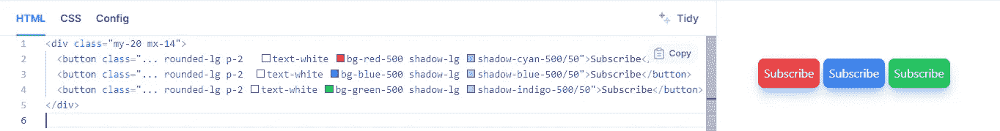
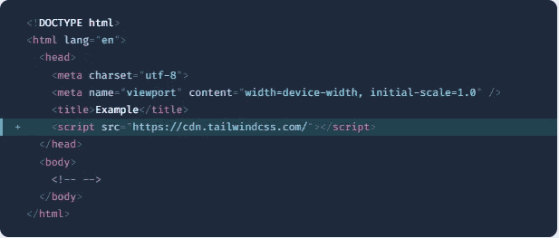

# Tailwind CSS v3.0 中令人兴奋的特性？

> 原文：<https://blog.devgenius.io/exciting-features-in-tailwind-css-v3-0-36260571db26?source=collection_archive---------6----------------------->


Tailwind CSS v3.0 就在这里——带来了难以置信的性能提升，巨大的工作流程改进，以及大量荒谬的新特性。

有了这个版本，Tailwind 修正了以前版本的一些问题，比如受限的颜色支持和 Tailwind 设计约束的限制。

然而，在 3.0 版中，Tailwind CSS 将新的准时制(JIT)引擎作为默认引擎和唯一模式。这使它能够出厂时就支持更多的颜色，包括五种深浅的灰色和任意的属性。因此，这使开发人员能够使用未在 Tailwind 设计约束中定义的任意值和属性来应用样式。

1.  **每种颜色出盒**
2.  **彩盒阴影**
3.  **滚动快照 API**
4.  **多栏布局**
5.  **原生形态控制**
6.  **打印修改器**
7.  **现代纵横比 API**
8.  **任意属性**
9.  **花式下划线样式**
10.  **打 CDN**

# **1。**各种颜色的盒子

在此之前，其他版本的 Tailwind 有一个受限的调色板。因为开发者担心这些功能的大小。现在有了新的 Tailwind 3.0，他们可以使用多种颜色。当您升级到 tailwind 3.0 时，默认情况下将启用此调色板。

# 2.彩色框阴影

多年来，人们一直要求我们提供彩色阴影，但以一种实际上有意义的可组合方式来支持它比我想象的要困难得多。

经过大约五次错误的开始，我们终于找到了一个我们喜欢的方法，现在 Tailwind CSS v3.0 包含了彩色阴影:



# **3 .滚动 API**

# 滚动应用编程接口

Scroll Snap API 已经有了不错的支持:大约 95%。Tailwind 团队通过提供一系列实用程序使其可用。

您可以使用:

*   **滚动锁点对齐**:将锁点对齐起点、终点或中心。
*   **滚动捕捉停止:**控制用户是否可以跳过一些捕捉位置。
*   **滚动捕捉类型:**控制在两个轴上执行捕捉点的严格程度。
*   **滚动填充:**控制捕捉容器内元素的滚动偏移。
*   **滚动边距:**控制快照容器中元素的边距。

还添加了一个使用新滚动行为的实用程序:

*   **滚动行为**:控制是指你想让一个元素平滑滚动。

# 4.**多栏布局**

Tailwind 现在提供多栏/报纸样的布局！

这种布局很容易实现，只需提供您需要的列数，或者只需将它设置为 auto，让浏览器根据大小决定使用多少列。

要控制装订线间距，您可以简单地提供类似 **gap-x-5** 的类，它将提供 1.25rem 的装订线间距。您可以根据需要更改这些值。

这将是它的样子:


# 5.本机表单控件

我们添加了对新的 accent-color 属性的支持，以及一个用于设计文件输入按钮样式的修饰符，使您比以往任何时候都更容易在本机表单控件上添加自己的风格:


# 6.打印修改器

这个特性添加了一个`print`修饰符，使我们能够添加样式来决定我们的文档在打印时的外观。

考虑下面的代码:

```
...
<section>
  <header class="print:hidden">
    <!-- Some naviagation markup -->
  </header>
  ...
</section>
...
```

上面的代码会在打印站点时隐藏导航。使用`print`修饰符将我们的代码包装在一个`[[print]](https://developer.mozilla.org/en-US/docs/Web/CSS/@media)` [媒体查询](https://developer.mozilla.org/en-US/docs/Web/CSS/@media)中，如下所示:

```
@media print { ... }
```

因此，上面的`print`修饰符将是:

```
@media print {
  .print\:hidden {
    display: none;
  }
}
```

# 7.播放 CDN

没有办法为 Tailwind CSS v3.0 版构建一个明智的基于 CSS 的 CDN，所以我们必须做一些不同的事情——我们构建了一个 JavaScript 库。



将脚本标签添加到任何 HTML 文档中，就可以在浏览器中使用所有的 Tailwind 特性。这只是为了开发的目的，但它确实是一种有趣的方式来构建小的演示或破解一个新的想法。

# 8.花式下划线

Tailwind 3.0 增加了新的文本装饰工具类:`[text decoration color](https://tailwindcss.com/docs/text-decoration-color)`、`[text decoration style](https://tailwindcss.com/docs/text-decoration-style)`、`[text decoration thickness](https://tailwindcss.com/docs/text-decoration-thickness)`、`[text underline offset](https://tailwindcss.com/docs/text-underline-offset)`。这些用于扩展文本的装饰，如下面所示:

