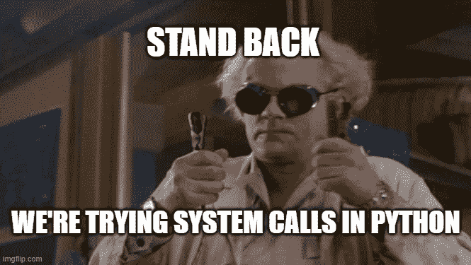

# Python 中的“execvp”系统调用:你需要知道的一切！

> 原文：<https://blog.devgenius.io/execvp-system-call-in-python-everything-you-need-to-know-c402fe6886eb?source=collection_archive---------3----------------------->



系统调用的 exec 系列用于在新进程中运行命令或代码文件。在`Linux`中，这个新进程是通过替换发出`exec`调用的进程而创建的，但是在`Windows`中，事情有点不同。在这篇博客中，我们将报道`Python`的`execvp`系统调用。我们也将利用在这个博客中学到的东西来解决一个有趣的问题！

# 问题陈述和动机

我最近被分配了一个关于`Operating Systems`的任务，其中有一个关于`execvp`系统调用的有趣问题。现在，互联网上有一些这个问题的实现，但都是用`C`写的。在追求一个`pythonic`实现的过程中，我踏上了探索之旅，在这里我将把它作为动力！我们将在博客的最后应用`execvp`的理论知识来解决这个特殊的问题！问题是-

> 编写程序 p1、p2 和 p3 的集合，使它们以相同的 PID 顺序执行，并且每个程序还应该打印其 PID。用户应该能够调用这些程序的任意组合来实现所需的功能。例如，考虑三个程序 twice、half 和 square，它们只接受一个整数作为参数，并执行一些特定的操作。这些操作可能就像-
> 
> $twice 10 打印 20 和某个数字，这是它的 PID
> $half 10 打印 5 和某个数字，这是它的 PID
> $square 10 打印 100 和某个数字，这是它的 PID
> 现在用户应该能够以任何组合组合组合这些程序，以实现所需的结果。
> 
> 比如-
> $ twice square half twice half 10
> 要计算*half(twice(half(square(twice(10))))))*并打印 **200** 作为结果。它还应该在执行时打印每个程序的进程 id。**注意，在这种情况下，每个程序打印的进程 id 应该是相同的。**
> 
> $square twice 2
> 要计算两次(square(2))并打印 **8** 作为结果，square 和 twice 的进程 id，应该是一样的。
> 
> 评估顺序是从左到右
> 
> 注意最后一个参数是整数，剩下的参数是要调用的程序。
> 
> 这个应该一般适用于任意 n 个进程，都是你写的。

# 文档！

让我们从浏览`execvp`的文档开始-

```
os.execvp(file, args)These functions all execute a new program, replacing the current process; they do not return. On Unix, the new executable is loaded into the current process, and will have the same process id as the caller. Errors will be reported as OSError exceptions.
```

关键要点-

1.  所有的`exec`调用都在`os`库中实现。
2.  `os.execvp`接受两个参数，`file`和`args`。
3.  新进程不是子进程，而是替代当前进程的新进程。
4.  没有返回值。
5.  在`UNIX`系统上，进程 ID ( `PID`)与调用者保持一致。
6.  为了节省您的时间，我发现`file`应该是一个可执行文件，而`args`也应该有可执行文件的名称。我们将在下面更详细地探讨这个问题！

# 一个最小的例子

现在我们知道了一些关于`execvp`的东西，让我们试着在我们的代码中使用它。传统是以“你好，世界”节目开始，我们不能违背传统。此外，我们将需要 2 个`Python`文件、一个调用者和一个打印“Hello world”的文件

## caller.py

## hello.py

注意`caller.py`中的`execvp`是如何将可执行文件的名称(`python`)作为第一个参数，将完整的命令(包括可执行文件的名称)作为第二个参数。奔跑`caller.py`给了我们《Hello world》，一切如预期！

# execvp 的内部机制和处理进程 id

根据文档，`execvp`应该用新流程替换调用者流程，而不是在`UNIX`系统中创建一个`subprocess`。这意味着当进行系统调用时，进程 ID 不应该改变。让我们尝试一下，但是首先，让我们为 3 个不同的函数创建 3 个不同的文件— `square`、`half`和`double`

这些文件中唯一的新东西是`os.getpid()`，它将返回运行这些文件的进程的进程 ID。让我们也修改我们的`caller`来执行其中一个文件——

我们现在也检查调用者中的进程 ID。此外，为了避免在可执行文件的名称上出错，我们现在将使用`sys.executable`！在`Windows`中执行`caller.py`会产生以下输出-

```
CALLER PID: 3156DOUBLE PID: 20940 | RESULT: 20
```

结果肯定很奇怪，因为进程 id 不一样。让我们在`WSL`(Linux 的 Windows 子系统)中尝试相同的代码

```
CALLER PID: 34
DOUBLE PID: 34 | RESULT: 20
```

结果与文档相符！由于进程 id 是相同的，调用方进程一定已经通过`execvp`系统调用被替换为新的进程。请注意，我们不必将可执行文件的名称从`python`改为`python3`，因为`sys.executable`会自动选择它！

因此，`os.execvp`在`Windows`和`UNIX`系统上表现不同。在`Windows`上，它产生或创建一个新进程(子进程或子进程)，而在`UNIX`系统上，它用一个新进程替换原来的进程！

# 开发 CLI

现在我们知道了如何在`Python`中使用`execvp`，让我们继续我们最初的问题！让我们创建一个文件，通过命令行控制一切—

该文件在执行时接受一个 CLI 参数列表，这些参数是函数名和一个数字。最后一个 CLI 参数必须是一个必须通过各种操作进行处理的数字。该文件的一个使用示例是—

```
python cli.py -l twice square half twice half 10
```

这应该在内部转化为—

```
half(twice(half(square(twice(10)))))
```

并且应该打印所有的结果和相关的进程 id。

记住，`os.execvp`不返回任何东西。因此，一旦新的`python`文件被调用执行，控制流就不会回到我们的 CLI 文件。为了解决这个问题，我们必须在我们的操作函数中添加额外的代码，这些代码将调用下一个文件而不返回到`cli.py`。

# 修改操作文件

每个操作文件中的代码都应该修改，添加—

其中`operation`为`double`、`half`或`square`。

代码使用`sys.argv[-1]`接受最后一个 CLI 参数，并将其传递给相关的操作函数。然后，最后一个参数被替换为获得的结果，除了第一个以外的所有 CLI 参数都被传递到`os.execvp`，它调用下一个操作文件！

在这两者之间，我们还需要添加一个条件，以便在到达最后一个参数(一个数字)时退出。这最后一个参数将是最终结果，因为在此之前我们已经处理了所有的参数(函数名)!

让我们修改每个操作文件—

这些文件现在会重复地互相调用，整个系统将会工作而不会返回到以前的文件！

# 决赛成绩

运行以下程序—

```
python cli.py -l double square half double half 10
```

在`Windows`的结果是—

```
CLI PID: 7376
['double', 'square', 'half', 'double', 'half', '10']DOUBLE PID: 32496 | RESULT: 20.0
SQUARE PID: 15144 | RESULT: 400.0
HALF PID: 4860 | RESULT: 200.0
DOUBLE PID: 24928 | RESULT: 400.0
HALF PID: 27868 | RESULT: 200.0FINAL PID: 27868 | FINAL RESULT: 200.0
```

有用！程序给出了我们想要的输出！注意这些`PID`是如何不一样的，这在上面已经详细讨论过了。

运行以下程序—

```
python3 cli.py -l double square half double half 10
```

在`Windows Subsystem for Linux`上的结果是—

```
CLI PID: 33
['double', 'square', 'half', 'double', 'half', '10']DOUBLE PID: 33 | RESULT: 20.0
SQUARE PID: 33 | RESULT: 400.0
HALF PID: 33 | RESULT: 200.0
DOUBLE PID: 33 | RESULT: 400.0
HALF PID: 33 | RESULT: 200.0FINAL PID: 33 | FINAL RESULT: 200.0
```

这个也行！程序再次给出了我们想要的输出！这一次`PID`号保持原样，没有`subprocesses`号被制造出来！

# 摘要

在上面的博客中，我们了解了如何使用属于 exec 系统调用家族的系统调用。我们进一步看到了 execvp 的行为在 Windows 和 UNIX 系统中的不同。最终我们解决了一个网上没有 Pythonic 解的问题！:)