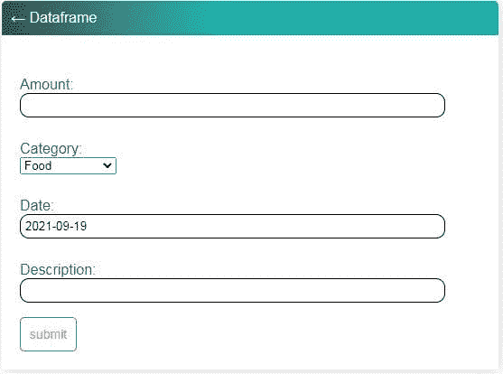
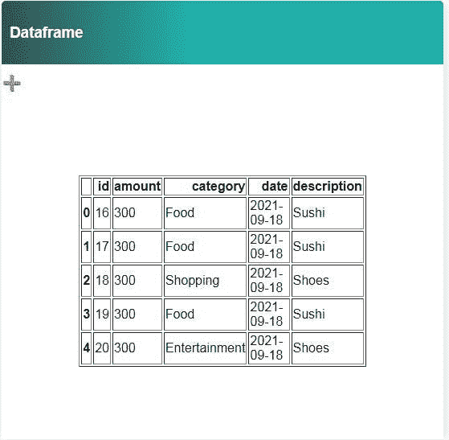

# 使用 Django 和 Pandas 的费用跟踪应用程序。

> 原文：<https://blog.devgenius.io/expenses-tracker-app-using-django-and-pandas-c6ecfdf55e1d?source=collection_archive---------9----------------------->

在这个 python 项目中，我们需要安装 Django 和 Pandas 库，我们将制作一个包含四个字段的表单:金额、类别(食品、旅游、购物……)、日期和描述。这些信息将会显示在熊猫的数据框中。

我们需要做的第一件事是安装 Django 和 pandas 库:

```
pip install django 
pip install pandas
```

Django 和 pandas 安装到您的环境中后，就该开始项目了。

```
Django-admin startproject expenses_tracker
```

当项目的目录创建后，您必须移动到“expenses_tracker ”,并在您的终端中编写以下代码:

```
py manage.py startapp tracker
```

现在你必须转到“ [settings.py](http://settings.py) ”并向下滚动，直到你看到“INSTALLED_APPS”并写下“tracker”，就像这样:

```
INSTALLED_APPS = [ 
'django.contrib.admin', 
'django.contrib.auth', 
'django.contrib.contenttypes', 
'django.contrib.sessions', 
'django.contrib.messages', 
'django.contrib.staticfiles', 
'tracker', 
]
```

然后在终端中编写以下代码:

```
py manage.py makemigrations
 py manage.py migrate
 py manage.py runserver
```

[Models.py](http://models.py/) :

```
from django.db import models
     from django.utils.timezone import now

     # Create your models here.
     CATEGORY_CHOICES = [
                ("Food","Food"),
                ("Travel","Travel"),
                ("Shopping","Shopping"),
                ("Necessities","Necessities"),
                ("Entertainment","Entertainment"),
                ("Other","Other")]

   class Expense_data(models.Model):
            amount=models.CharField(max_length=10)
            category=models.CharField(max_length=20,choices=CATEGORY_CHOICES,default='Food')
            date=models.DateField(default=now)
            description=models.CharField(max_length=200, blank=True)

             def __str__(self):
                   return self.category
```

在 [models.py](http://models.py) 中，创建了数据库，只有一个名为“Expense_data”的表，该表有四个字段，这些字段需要填写表单，CATEGORY_CHOICES 是一个常量列表，其中的选项显示在类别字段中。

[form.py](http://form.py/)

```
from django import forms
   from django.forms import ModelForm

  from .models import *

 class ExpenseForm(forms.ModelForm):
          amount = models.CharField(max_length=10)
          category = models.CharField(max_length=20, choices=CATEGORY_CHOICES, default='Food')
          date = models.DateField(default=now)
          description = models.CharField(max_length=200, blank=True)

          class Meta:
                  model=Expense_data
                  fields='__all__'
```

我们需要在 expenses_app 目录中创建一个名为" [form.py](http://form.py) "的新文件，并从 django 模块中导入模型和表单。在这个文件中，我们创建了一个名为“ExpenseForm”的类，并从我们的模型中复制粘贴信息。

[views.py](http://views.py)

```
from django.shortcuts import render, redirect
 from .models import Expense_data
 from .forms import *
 import pandas as pd

  def expenses_form(request):
        expenses=Expense_data.objects.all()
        form=ExpenseForm()

         if request.method == 'POST':
               form = ExpenseForm(request.POST)
               if form.is_valid():
                    form.save()
               return redirect("expenses-dataframe")
         context={'expenses': expenses, 'form':form}
         return render(request,'tracker/tracker_form.html',context)

  def expenses_dataframe(request):
        data=Expense_data.objects.all().values()
        df=pd.DataFrame(data)
        context={'df':df.to_html()}
        return render(request, 'tracker/tracker_data.html', context)
```

在 [views.py](http://views.py) 中，我们创建了一个函数来处理 POST 请求。变量“expenses”被分配给模型的所有对象，在变量“form”中分配给表单。下面的代码可以，如果从我们的表单请求一个 POST，并且是有效的，它被保存，我们被重定向到“expenses-dataframe”页面，来自模型和表单的所有对象被分配给上下文变量，在“tracker_form.html”中呈现。

在“def expenses_dataframe”中，我们从数据库中取出所有模型，并将它们分配给变量“data”。“df”变量为数据框分配了将要显示的模型对象。然后，我们将数据帧分配给一个上下文，将它转换成一个 HTML 对象，最后的代码将它呈现到 HTML 文件中。

在项目的目录(expenses_tracker)中，有一个 [urls.py](http://urls.py) ，我们复制下一段代码:

```
from django.contrib import admin
 from django.urls import path,include

 urlpatterns = [
      path('',include('tracker.urls')),
      path('admin/', admin.site.urls),
      ]
```

之后，我们创建一个 [urls.py](http://urls.py) 文件，但是在应用程序的目录(tracker)中，代码如下:

```
from django.contrib import admin
   from django.urls import path
   from .views import *
   from . import views

   urlpatterns = [
        path('',views.expenses_form,name='expense-tracker'),
        path('/dataframe', views.expenses_dataframe, name='expenses-dataframe'),

         ]
```

在 [admin.py](http://admin.py) 中，我们将模型注册到管理员帐户中。

```
from django.contrib import admin
from .models import Expense_data

 # Register your models here.
 admin.site.register(Expense_data)
```

我们需要执行代码来迁移我们的模型。

```
py manage.py makemigrations
py manage.py migrate
py manage.py createsuperuser
```

您必须创建一个用户名和密码才能访问管理员帐户。

我们需要在名为“templates”的 app 文件夹内创建一个模板目录文件夹:在 templates 文件夹内，我们创建另一个名为“tracker”的文件夹；在里面，我们放了所有的 HTML 文件。

tracker_form.html

```




<div class="header-bar">
        <a href="">&#8592; Dataframe</a>

</div>

<div class="card-body">
       <form method= "POST" action ="">
                
                {{form.as_p}}
                <input class="button" type="submit" value="submit">
       </form>

 </div>


```

tracker_data.html

```



<div class="header-bar">
      <h3>Dataframe</h3>
 </div>

 <div id="expenses-add-wrapper">
       <a id="add-link" href="">&#x2b;</a>
 </div>

 <body>

       <div class="table">{{df|safe}}</div>

 </body>

 
```

这里是 base.html 的[文件。](https://github.com/carlosm27/expense_tracker/blob/main/tracker/templates/tracker/base.html)



[源代码](https://github.com/carlosm27/expense_tracker)

感谢您阅读这篇文章。如果您有任何问题或反馈，请在评论区或通过我的 [Twitter](https://twitter.com/Carlos_marcv) 和 [LinkedIn](https://www.linkedin.com/in/carlos-armando-marcano-vargas-a2135a134/) 账户告诉我。

*原发布于*[*https://Carlos mv . hash node . dev*](https://carlosmv.hashnode.dev/expenses-tracker-app-using-django-and-pandas)*。*