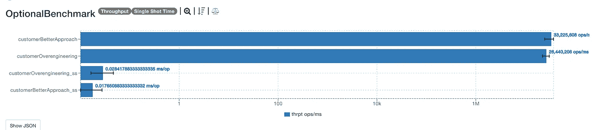
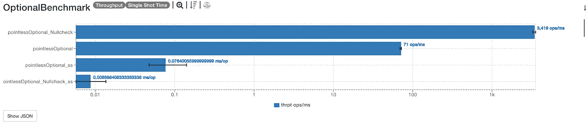
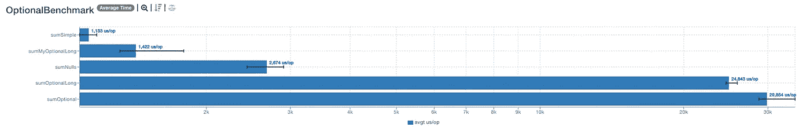

# 有经验的开发人员对这 5 个糟糕的可选实践过敏

> 原文：<https://blog.devgenius.io/experienced-developers-are-allergic-to-these-5-bad-optional-practices-ee1014940198?source=collection_archive---------4----------------------->

## **随意滥用的隐性成本是什么？**


照片由 [Niklas Hamann](https://unsplash.com/@niklas_hamann?utm_source=unsplash&utm_medium=referral&utm_content=creditCopyText) 在 [Unsplash](https://unsplash.com/s/photos/lack?utm_source=unsplash&utm_medium=referral&utm_content=creditCopyText) 上拍摄

*部分开发者滥用* `*Optional*` *。有些甚至不知道* [*什么是*](https://www.reddit.com/r/java/comments/t1ev7h/comment/hyfmdt0/?utm_source=share&utm_medium=web2x&context=3) `[*Optional*](https://www.reddit.com/r/java/comments/t1ev7h/comment/hyfmdt0/?utm_source=share&utm_medium=web2x&context=3)` *。*

他们仍然不明白`Optional`的目的。他们工程过度。这个过度工程的成本是多少？

让我们看看下面的例子。

# 1.不要过度使用`Optional`

Optional 有一个很酷的、吸引人的、可滥用的 API。它们链接到无穷大，而这只是一个简单的空值检查。这里有一个例子。

[来源](https://www.govnokod.ru/24731)

通过一点点的重构，你可以得到这样的东西。更少的包装，更少的链接，更惯用的解决方案。

通过更好的方法，我们得到了以下结果:



[详情](https://jmh.morethan.io/?gist=98fd37eda2ddcc819ac8c485ce5d7c35)

`Optional`过度工程的成本是显而易见的。这对吞吐量有一点小影响，对单次触发时间也有明显影响。*更好的方法比过度设计的无意义的* `*Optional*` *快两倍。*

# 2.不使用`Optional`进行`null`检查

我在 Reddit 上的某个地方发现了这个，并被震撼到了。还有开发者这样滥用 Optional。

你应该这样做。一个简单的空值检查应该可以解决这个问题。

以下是这些基准测试的结果。Null check 比这种无意义的包装好几个数量级。*按预期使用* `*Optional*` *，不是为了提高可读性，或者根除空检查。*



[详情](https://jmh.morethan.io/?gist=fbb55449ecca9fdd8f198476d6cbd546)

# 3.`Optional` sum 的成本是多少？

这是我从 [Piotr](https://pkolaczk.github.io/overhead-of-optional/) 得到的一个基准。这个基准侧重于总和。

总和被测试为多种类型。Optional、OptionalLong 和常规 sum。还有从`Optional`提炼出来的`MyOptionalLong`，就像这个 [Redditor](https://www.reddit.com/r/rust/comments/q99eqe/rust_option_30x_more_efficient_to_return_than/hgynrll/?utm_source=share&utm_medium=web2x&context=3) 建议的那样。

简单求和是对数字求和的最简单的方法，我们应该把它作为基线。Sum nulls 沿途有一些 null。其他人使用可选的总和。

`MyOptionalLong`为`isPresent`增加了一点改进。这使用引用相等来查看 Optional 是否有值。区别就在这里。


这消除了对`isPresent`布尔变量的需要。因此，这个方法是一个很好的内联候选方法。*小改进，值得思考！*



[详情](https://jmh.morethan.io/?gist=7a9da3ea312be8fc6f5716e63caeb6eb)

自定义`MyOptionalLong`效果最好。由于内联缓存、热度和引用检查，这种可选类型更好。如果你想挤压可选的性能，`[MyOptionalLong](https://gist.github.com/xfix/34b8c8717191c191e577a843cfc9e15b)` [可以帮助](https://gist.github.com/xfix/34b8c8717191c191e577a843cfc9e15b)。

对于其他人来说，纯粹的凡人，最好用`OptionalLong`而不是普通的`Optional`。

# 4.学习`Optional`的方法

```
if (a==null) {
	return Optional.empty();
} 
else {
	return Optional.of(a);
}
```

这就是`ofNullable`的作用。您可以查看它的源代码。

这里不做任何基准测试。无知的代价显而易见。先学习`Optional`再使用。

# 5.getters 返回的`Optional`的成本是多少？

我们可以使用`Optionals`作为字段。我们可以，但我们不应该。这增加了更多的复杂性，样板文件，并且不是`Optional`的意图。

正如布莱恩·戈茨所说:人们用`Optional`做他们想做的事情。有些人甚至把它们当作田地。

尼科莱举了一个这样的例子。检查这些并跟踪所有的东西是相当麻烦的。将`Optional`添加到字段中会带来很多麻烦。

你可能认为龙目岛的人已经解决了这个问题。是什么阻止我们在 getters 中返回选项。[他们也根本不支持](https://stackoverflow.com/a/31674917/5999670) `[Optional](https://stackoverflow.com/a/31674917/5999670)` [作为 getters 的返回类型](https://stackoverflow.com/a/31674917/5999670)。

使用`Optional`作为 getters 的返回类型的代价是什么？根据[我的愚测](https://gist.github.com/zivce/77510f4c37fd6a23066a1d478a8b52a8)，慢了 3 倍。包括单次注射时间和产量。

[详情](https://jmh.morethan.io/?gist=bfddaa4e577569efb0a418acfb23cacf)

# 外卖食品

慢慢找`Optional`虐。洒`Optional`之前先问问自己用例是什么。

`Optional`只解决一个空用例——值缺失。

> 当然，人会做自己想做的事。但是当我们添加这个特性时，我们有一个明确的意图，它不是一个通用的类型，尽管很多人希望我们这样做。我们的目的是为库方法返回类型提供一种有限的机制，在这种情况下，需要有一种明确的方式来表示“没有结果”，对此使用 null 极有可能导致错误。— [布莱恩·戈茨](https://stackoverflow.com/questions/26327957/should-java-8-getters-return-optional-type/26328555#26328555)