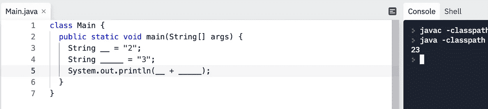
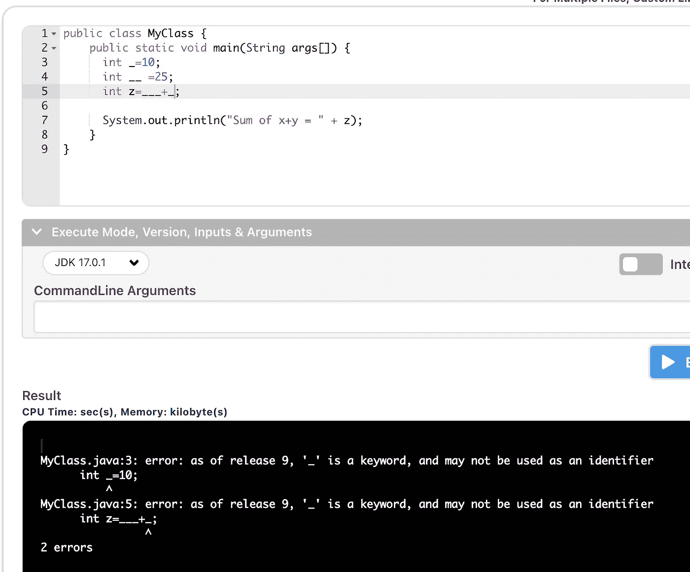
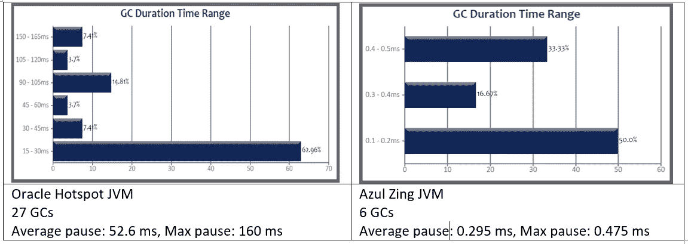

# 有经验的开发人员知道这 7 个奇怪的 Java 怪癖

> 原文：<https://blog.devgenius.io/experienced-developers-know-these-7-weird-java-quirks-db5dcb3076bd?source=collection_archive---------3----------------------->

## 6.您可以关闭 GC


[亚娜拉·www.freepik.com 创作的商业照片](https://www.freepik.com/photos/business)

***“超过 30 亿台设备运行在 Java 上。”***——不是这个怪癖。

***“龙目岛是爪哇附近的一个岛屿。”***——也不是这个。

即使现在设备数量是 560 亿，我们也不会谈论数字。

我们甚至不会去探究为什么龙目岛是爪哇旁边的一个岛。

*有经验的开发者更懂。有经验的开发人员知道 Java 的怪癖。所以让我们更深入地探究 Java 的怪癖。*

# 1.Java const 在哪里？

`const`和`goto`是保留关键字。它们背后没有任何语义。

从 Java 1.0 开始，它们就被保留了。我们可以理解为什么不使用`goto`。但是为什么`const`没有实现呢？我们用什么代替常量？

*Java 没有* `*const*` *—而是有* `*final*` *，可以应用于局部“变量”声明，应用于* *标识符，* *非类型。它对对象成员有不同的面向对象的用法，这就是名字的由来。* —在维基百科上保持正确性

[const 的“bug”已于 2005 年关闭](https://bugs.java.com/bugdatabase/view_bug.do?bug_id=4211070)。因为没有办法以向后兼容的方式添加它。

`final`是否作为`const`工作？`const`为什么被抛弃？

`final`有什么故事？只能给`final`变量赋值一次。即使被引用对象是`final`，您也可以更改它。

对于 C++，`const`创建一个常量指针。这将确保这个指针不被用来改变对象。但是非常数指针会使对象变异。

对于一些开发人员来说，`const`可能意味着不可变的对象。尽管 Java 不是这样。为什么 const 不会在 Java 中创建一个不可变的对象？

要构造不可变对象:

*   没有 setters
*   没有公共字段
*   为突变制作副本
*   这门课必须是期末考试。

或者你可以使用`Records`。您可以看到 const 会导致对不可变对象的误用、混淆和不良实践。

潜在的误用、功能蔓延和混淆导致放弃 const 关键字。

那`goto`呢？

[根据一些消息来源](https://stackoverflow.com/a/4547764/5999670)，goto 在最初的 JVM 中。后来因为没用就被撤了。

# 2.您的 Java 类以`CAFEBABE`开始

高斯林需要一个神奇的十六进制数来启动类文件。他最亲近的是什么？ ***咖啡馆死了*** 。任何一个计算机系毕业生都会看出这是一个十六进制数。

James 使用`**CAFEDEAD**`作为对象文件格式，使用`[**CAFEBABE**](https://en.wikipedia.org/wiki/Java_class_file#Magic_Number)`作为类文件格式。

# 3.`Unicode`翻译成`ASCII`来烦你

这段代码会显示“1 是 2”。

[来源](https://bmuskalla.github.io/blog/2021-01-04-java-syntax-puzzle/)

在编译之前，Unicode [被替换为正确的字符。这里正确的代码是这个。](https://docs.oracle.com/javase/specs/jls/se8/html/jls-3.html#jls-3.3)

[来源](https://bmuskalla.github.io/blog/2021-01-04-java-syntax-puzzle/)

这是另一个谜题。这个解决方案不需要 ASCII 计算。正确答案是 2。

[来源](http://what-when-how.com/Tutorial/topic-90315a/Java-Puzzlers-Traps-Pitfalls-and-Corner-Cases-44.html)

引号在执行前被替换。这里正确的代码是`“a”.length() + “b”.length()`

你认为这是你能看到的最坏的情况吗？这是被诅咒的 hello world 程序。


尽管这些看起来无害，但它们可能会让你丢掉工作。如果这些困惑在面试中出现，你应该知道这种行为。

甚至全能的[乔恩·斯基特](https://stackoverflow.com/questions/35901247/unicode-escape-behavior-in-java-programs/35901294#35901294)也认为这是一个错误。一个可能会在面试中困扰我们的错误。

# 4.您可以只使用下划线来声明变量

这违背了任何命名约定，但是这是一个有效的 Java 代码。



但是你不能只用一个下划线。从 Java 9 开始，一个下划线作为变量名是无效的。



# 5.您可以在数值中使用下划线

[数字中允许使用下划线作为分隔符。](https://docs.oracle.com/javase/7/docs/technotes/guides/language/underscores-literals.html)

以下所有定义都是有效的。

```
long creditCardNumber = 1234_5678_9012_3456L;
long socialSecurityNumber = 999_99_9999L;
float pi = 	3.14_15F;
long hexBytes = 0xFF_EC_DE_5E;
long hexWords = 0xCAFE_BABE;
long maxLong = 0x7fff_ffff_ffff_ffffL;
byte nybbles = 0b0010_0101;
long bytes = 0b11010010_01101001_10010100_10010010;
```

# 6.您可以关闭垃圾收集

可以，[可以关闭 GC。](https://openjdk.java.net/jeps/318)

一些应用程序可能会受到 GC 的影响。性能至关重要的应用。[交易应用举例](https://medium.com/@jadsarmo/why-we-chose-java-for-our-high-frequency-trading-application-600f7c04da94)。

有问题的交易 app 用的是 Zing JVM。这个 JVM 优化了 GC，所以没有线程暂停。这可以让你的应用速度提高 180 倍。



[来源](https://medium.com/@jadsarmo/why-we-chose-java-for-our-high-frequency-trading-application-600f7c04da94)

*如何避免 GC？*

您可以使用 [sun.misc.Unsafe](https://www.baeldung.com/java-unsafe) 。您可以在堆外创建一个对象，填充它，并避免 GC。你要负责清理。

或者你可以使用 DirectByteBuffers。这些缓冲区在堆外分配内存。虽然你可以用它来加速你的应用程序，[但是你可能会遇到内存不足的情况](https://stackoverflow.com/questions/59631145/direct-buffer-memory)。

# 7.你知道“向下”运算符吗？

```
int x = 10;while (x --> 0) { System.out.println(x);}
```

→是操作员。这不是一元运算符。

首先评估 x 是否大于零，然后递减该数字。人们可以使用`x ++> 0`得到相反的效果。

## *今天就加入 Medium！*

***为什么你*要** [***亡国***](https://zivce.medium.com/membership?source=responses-----f49b64432202---------------------respond_sidebar-----------) ***？*** 率先抛弃微服 Chrome 模式。其次，你会接触到很多精彩的故事。你可以从实用程序员的书架上读到大约 [100 本书。你可以看到障碍、非常有用的提示和来自 Pinterest 团队的伟大建议。你可以阅读谷歌云的最新发展。](https://medium.com/pragmatic-programmers/directory-of-pragmatic-programmer-books-on-medium-6a5cbadbd4b4?source=responses-----f49b64432202---------------------respond_sidebar-----------)

**这就是你每月**[**【5 美元(两杯咖啡)**](https://zivce.medium.com/membership?source=responses-----f49b64432202---------------------respond_sidebar-----------) **所得到的。你可以花 5 美元阅读整个实用程序员库。**

免责声明:$2 出 [$5](https://zivce.medium.com/membership?source=responses-----f49b64432202---------------------respond_sidebar-----------) 将直接支持我，为你传递精彩话题。