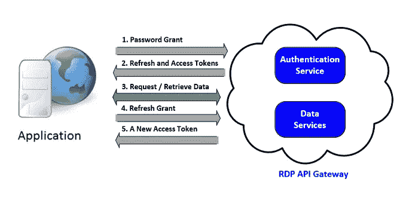
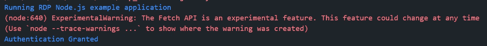
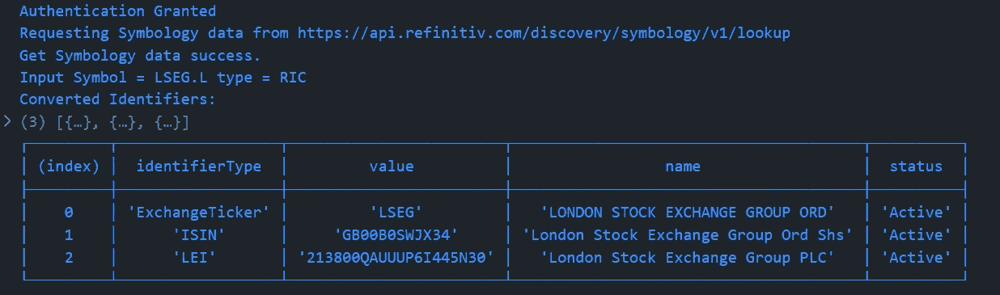
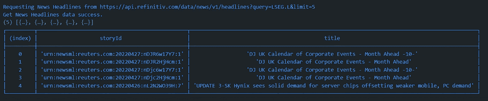
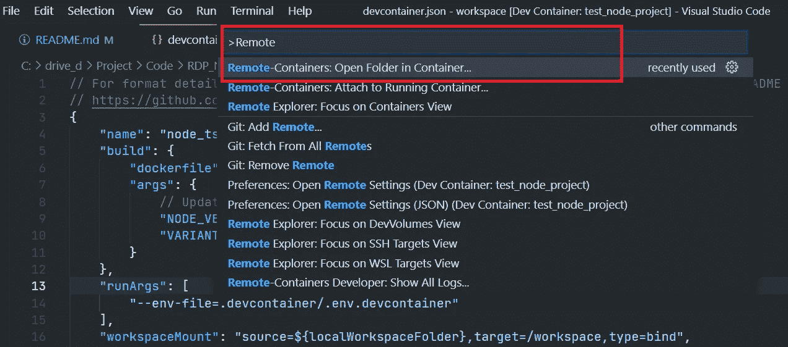
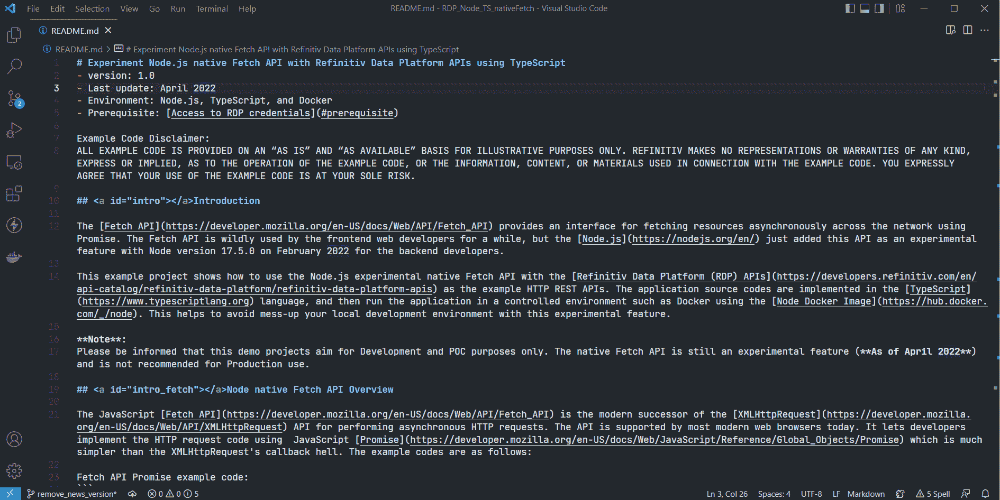

# 使用 TypeScript 试验 Node.js 原生提取 API

> 原文：<https://blog.devgenius.io/experimenting-node-js-native-fetch-api-using-typescript-c5275f8a7592?source=collection_archive---------1----------------------->

如何使用 TypeScript 使用节点原生 Fetch API？

# 介绍

关于[路孚特开发者社区](https://developers.refinitiv.com/)的原始文章可从[这里](https://developers.refinitiv.com/en/article-catalog/article/testing-node-native-fetch-api-with-rdp-tyepscript)获得。

[获取 API](https://developer.mozilla.org/en-US/docs/Web/API/Fetch_API) 提供了一个使用 Promise 跨网络异步获取资源的接口。Fetch API 被前端 web 开发人员广泛使用了一段时间，但 [Node.js](https://nodejs.org/en/) 只是在 2022 年 2 月 Node 版本 17.5.0 中为后端开发人员添加了这个 API 作为实验性功能。

这个示例项目展示了如何使用 Node.js 实验性原生获取 API 和作为示例 HTTP REST APIs 的[路孚特数据平台(RDP)API](https://developers.refinitiv.com/en/api-catalog/refinitiv-data-platform/refinitiv-data-platform-apis)。应用程序源代码用[类型脚本](https://www.typescriptlang.org)语言实现，然后使用[节点 Docker 映像](https://hub.docker.com/_/node)在 [Docker](https://www.docker.com/) 和 [devcontainer](https://code.visualstudio.com/docs/remote/containers) 等受控环境中运行应用程序。这有助于避免在试验这个特性时搞乱您的本地开发环境。


**注意**:请注意，此演示项目仅用于开发和概念验证。原生获取 API 仍是一项实验性功能(**截至 2022 年 5 月**)，不建议用于生产。

# 节点本机获取 API 概述

JavaScript [Fetch API](https://developer.mozilla.org/en-US/docs/Web/API/Fetch_API) 是用于执行异步 HTTP 请求的 [XMLHttpRequest](https://developer.mozilla.org/en-US/docs/Web/API/XMLHttpRequest) API 的现代继承者。如今，大多数现代 web 浏览器都支持该 API。它让开发人员使用 JavaScript [Promise](https://developer.mozilla.org/en-US/docs/Web/JavaScript/Reference/Global_Objects/Promise) 实现 HTTP 请求代码，这比 XMLHttpRequest 的回调地狱要简单得多。示例代码如下:

获取 API 示例代码:

虽然前端 JavaScript web 开发人员自 2015 年以来一直在使用 Fetch API，但该 API 尚未包含在 [Node.js](https://nodejs.org/en/) 运行时环境中。后端 JavaScript 开发人员需要使用其他库，如[弃用的请求模块](https://www.npmjs.com/package/request)、 [postman-request](https://www.npmjs.com/package/postman-request) 、 [Axios](https://www.npmjs.com/package/axios) 、 [Node Fetch 模块](https://www.npmjs.com/package/node-fetch)等，在节点服务器环境下发出带有承诺的 HTTP 请求。

简介在[节点版本 17.5.0](https://nodejs.org/en/blog/release/v17.5.0/) 中，**原生获取 API** 现在作为**实验特性**可用(感谢 [Undici](https://undici.nodejs.org/#/) )。默认情况下，[节点版本 18.0.0](https://nodejs.org/en/blog/release/v18.0.0/) 也在全局范围内启用这个实验性的获取 API。后端 JavaScript 开发人员不再需要安装额外的类似 fetch 的模块。前端开发人员将熟悉 Node.js 中的服务器端 HTTP 请求代码。

来自[节点官方页面](https://nodejs.org/en/blog/release/v18.0.0/)的示例代码:

要运行这个内置 API，您可以运行本机 Fetch 代码，如下例所示:

节点版本 18.0.0:

```
$> node app.js
```

节点版本 17 . 5 . 0–17.9 . x:

```
$> node --experimental-fetch app.js
```

这个示例项目主要关注节点版本 18.0.0。

# 什么是路孚特数据平台(RDP)API？

继续我们的例子 HTTP REST APIs，[路孚特数据平台(RDP)API](https://developers.refinitiv.com/en/api-catalog/refinitiv-data-platform/refinitiv-data-platform-apis)。RDP API 通过易于使用的基于 Web 的 API 为开发人员提供各种路孚特数据和内容。

RDP API 使开发人员能够无缝、全面地访问所有路孚特内容，如历史定价、环境、社会和治理(ESG)、新闻、研究等，并与他们的内容混合，通过单一界面丰富、集成和分发数据，随时随地提供给他们需要的地方。RDP API 交付机制如下:

*   请求—响应:RESTful web 服务(HTTP GET、POST、PUT 或 DELETE)
*   警报:传递是一种接收订阅的异步更新(警报)的机制。
*   批量:交付大量有效负载，如整个场馆的日终定价数据。
*   流式传输:实时传递消息。


这个示例项目只关注请求-响应:RESTful web 服务交付方法。

有关路孚特数据平台的更多详细信息，请参见以下 API 资源:

*   [快速启动](https://developers.refinitiv.com/en/api-catalog/refinitiv-data-platform/refinitiv-data-platform-apis/quick-start)页面。
*   [教程](https://developers.refinitiv.com/en/api-catalog/refinitiv-data-platform/refinitiv-data-platform-apis/tutorials)页面。
*   [RDP API:请求-响应 API 简介](https://developers.refinitiv.com/en/api-catalog/refinitiv-data-platform/refinitiv-data-platform-apis/tutorials#introduction-to-the-request-response-api)页面。
*   [RDP API:授权—关于令牌的所有信息](https://developers.refinitiv.com/en/api-catalog/refinitiv-data-platform/refinitiv-data-platform-apis/tutorials#authorization-all-about-tokens)页面。

# 应用程序开发细节示例

示例应用程序源代码分为两个类型脚本文件:

*   主文件`rdp_nodefetch.ts`:该文件包含应用主和连接逻辑。
*   类型别名文件`rdp_types.ts`:该文件包含 RDP 授权、新闻和发现符号服务 JSON 消息的所有类型别名。

# RDP API 应用工作流

路孚特数据平台授权检查基于 OAuth 2.0 规范。应用程序工作流的第一步是从 RDP 身份验证服务获取令牌，这将允许访问受保护的资源，即数据休息 API。

API 需要以下访问凭据信息:

*   用户名:用户名。
*   密码:与用户名关联的密码。
*   客户端 ID:这也称为`AppKey`，它是使用 App 密钥生成器生成的。这个唯一标识符是为用户或应用程序定义的，并且被认为是机密的(不在用户之间共享)。client_id 参数可以在请求正文中传递，也可以作为编码为 base64 的“授权”请求头传递。

接下来，在应用程序从 RDP 身份验证服务收到访问令牌(和授权令牌)后，所有后续的 REST API 调用都将使用这个令牌来获取数据。请在以下资源中找到有关 RDP API 工作流程的更多详细信息:

*   [RDP API:请求-响应 API 简介](https://developers.refinitiv.com/en/api-catalog/refinitiv-data-platform/refinitiv-data-platform-apis/tutorials#introduction-to-the-request-response-api)页面。
*   [RDP API:授权——关于令牌的所有信息](https://developers.refinitiv.com/en/api-catalog/refinitiv-data-platform/refinitiv-data-platform-apis/tutorials#authorization-all-about-tokens)页面。



# 代码类型别名示例

Type Aliases 是 [TypeScript 对象类型](https://www.typescriptlang.org/docs/handbook/2/objects.html)的一种，它帮助开发人员在实现时对他们的变量和数据进行类型检查，以避免最终 JavaScript 应用程序中的数据类型错误。

这个示例项目定义了 RDP API 的 JSON 请求消息(用于身份验证和符号发现服务)的所有类型别名，以及应用程序在`rdp_types.ts`文件中使用的对象。

# RDP API 认证

## RDP API 验证类型别名

首先，我们在主应用程序`rdp_nodefetch.ts`文件中导入和创建 API 端点和凭证所需的所有类型、对象和变量。

请注意，API 端点和凭证将在运行时通过环境变量分配给应用程序。

## 使用获取 API 发送身份验证请求

然后，我们创建一个名为`authenRDP`的函数，向 RDP 身份验证令牌服务发送登录请求消息。该函数从`RDP_AuthToken_Type`类型创建 JSON 请求消息，然后通过节点本地获取 API 将其作为 HTTP POST 消息发送到 RDP。

一旦身份验证成功，该函数将获得 RDP 身份验证服务响应消息，并将以下 RDP 令牌信息保存在变量中。

*   **access_token** :用于调用 REST 数据 API 调用的令牌，如上所述。应用程序必须保留此凭据，以备 RDP API 进一步请求。
*   **refresh_token** :刷新令牌，用于在到期前获取更新后的访问令牌。应用程序必须保留此凭据以进行访问令牌续订。
*   **expires_in** :访问令牌有效时间，以秒为单位。

请注意 Node.js 可能会显示**experimental warning:Fetch API 是一个实验性的特性。此功能可能会随时改变**警告消息，因为应用程序当前正在使用实验功能。



## RDP 代币更新

在会话到期之前，应用程序需要发送刷新授权请求消息来获取新的访问令牌。让我们修改`authenRDP()`函数来支持刷新授权请求。

现在，示例应用程序用一个`authenRDP()`函数支持 RDP API 的密码授权和刷新授权场景。您可以在下一篇文章中找到关于密码和刷新授权限制的更多详细信息。

*   [RDP 认证服务的限制和指南](https://developers.refinitiv.com/en/article-catalog/article/limitations-and-guidelines-for-the-rdp-authentication-service)文章。

这包括了认证部分。

# 请求 RDP 原料药数据

这让我们需要 RDP 原料药的数据。所有后续的 REST API 调用都通过如下所示的*授权* HTTP 请求消息头使用访问令牌来获取数据。

*   标题:
*   授权= `Bearer <RDP Access Token>`

请注意`Bearer`和`RDP Access Token`值之间的间距*。*

然后，应用程序根据感兴趣的服务创建 JSON 消息格式或 URL 查询参数的请求消息，并将其作为 HTTP 请求消息发送给服务端点。开发人员可以从路孚特数据平台的 [API 游乐场页面](https://api.refinitiv.com/)获得 RDP API 服务端点、HTTP 操作和参数——这是一个交互式文档网站，开发人员一旦拥有有效的路孚特数据平台帐户就可以访问。

此项目涵盖以下 RDP API 服务:

*   在标识符之间导航的发现符号服务`/lookup`端点。
*   新闻服务`/headlines`操作。

# RDP API 符号发现服务

## 使用获取 API 发送符号系统请求

本示例使用发现符号系统服务将符号从代码标识符转换为标识符、标识符和。我将首先为符号 JSON 请求消息导入`PDP_Symbology_Req_Type`类型别名，并在主`rdp_nodefetch.ts`文件中创建一个名为`requestSymbol()`的函数。该函数创建 JSON 请求消息，通过节点本地获取 API 将其发送到 RDP，然后以 JSON 消息格式返回响应数据。

## 显示符号系统数据

下一步是以可读格式显示输入的符号系统数据。应用程序使用 [console.table()](https://nodejs.org/docs/latest-v18.x/api/console.html#consoletabletabulardata-properties) 函数以表格格式将数据打印到控制台。

让我们首先为名为`symbologyTable`的符号表对象创建新的类型别名。该对象保存必要的输出数据，这些数据是来自响应 JSON 消息的`identifierType`、`value`、`name`和`status`字段。

最后，我们创建一个`displaySymbology()`函数来构造`symbologyTable`对象，然后将它传递给`console.table()`函数。

使用`symbologyTable`对象的`console.table()`结果如下:



这包括了符号数据转换部分。

# RDP 新闻通讯社

## 使用获取 API 发送新闻请求

现在我们来看 RDP 新闻服务代码。让我首先创建一个名为`getNewsHeadlines`的函数，用本地获取 API 向 RDP 新闻服务发送 HTTP GET 请求消息。一旦该函数接收到来自 RDP 的响应数据，它将以 JSON 消息格式返回该数据。

## 显示新闻标题数据

转而以可读表格格式显示输入的新闻标题数据。首先，我将为名为`newsHeadlinesTable`的新闻标题表对象创建新的类型别名。该对象保存来自响应 JSON 消息的必要输出数据，即`storyId`和`title`(标题文本)字段。

最后，我们创建一个`displayNewsHeadlines()`函数来构造`newsHeadlinesTable`对象，然后将它传递给`console.table()`函数。

使用`newsHeadlineData`对象的`console.table()`结果如下:



这涵盖了所有的节点原生 Fetch API 与 RDP HTTP REST API 应用程序开发使用 TypeScript。

# 先决条件

此演示项目需要以下依赖软件。

1.  RDP 访问凭据。
2.  [Visual Studio 代码](https://code.visualstudio.com/)编辑器。
3.  [Docker 桌面/引擎](https://docs.docker.com/get-docker/)应用。
4.  [VS 代码—远程开发扩展包](https://aka.ms/vscode-remote/download/extension)
5.  互联网连接。

请联系您的路孚特代表，以帮助您访问 RDP 帐户和服务。您可以找到关于从租约设置的 RDP 访问凭证的更多详细信息，请参见[路孚特数据平台](https://developers.refinitiv.com/en/article-catalog/article/getting-start-with-refinitiv-data-platform)文章的*用户 ID* 部分。

# 如何运行示例

第一步是将示例项目文件夹从 [GitHub 库](https://github.com/Refinitiv-API-Samples/Article.RDP.TypeScript.Node.FetchAPI)解压或下载到您选择的目录中，然后按照下面的步骤操作。

# 作为 VS 代码 DevContainer 运行

首先，进入项目的*。devcontainer* 文件夹，并用以下内容创建一个文件名`.env.devcontainer`。

```
RDP_BASE_URL=https://api.refinitiv.com
RDP_AUTH_URL=/auth/oauth2/v1/token
RDP_AUTH_REVOKE_URL=/auth/oauth2/v1/revoke
RDP_SYMBOLOGY_URL=/discovery/symbology/v1/lookupRDP_USERNAME=<RDP UserName>
RDP_PASSWORD=<RDP Password>
RDP_APP_KEY=<RDP Client_ID>
```

接下来，在您的机器上启动 Docker 桌面或 Docker 引擎。

进入下一步，安装 [VS 代码—远程开发扩展包](https://aka.ms/vscode-remote/download/extension)。

然后用 VS 代码打开项目文件夹，按`F1`键选择 **Remote-Containers:在容器中重新打开**命令。



一旦构建完成，VS 代码自动连接到容器，automatics 为开发人员初始化项目。

现在，VS 代码已经为 devcontainer 中的 RDP 类型脚本原生获取 API 示例做好了准备。开发人员可以通过按下`F5`按钮或者从 VS 代码菜单中选择*运行*然后*开始调试*选项来构建和运行该示例。



如果您想手动运行 Docker 容器的例子，请遵循 [GitHub 仓库](https://github.com/Refinitiv-API-Samples/Article.RDP.TypeScript.Node.FetchAPI#running-as-a-manual-docker-container)上的步骤。

# 摘要

Node.js 上的原生 Fetch API 的出现对所有开发人员来说都是好消息。这个内置的 API 提高了 JavaScript/TypeScript 开发人员的跨平台熟悉度，他们不再需要对前端(web 浏览器)和后端(Node.js) HTTP 请求代码使用不同的方法。这有助于简化项目并降低管理第三方 HTTP 请求/获取模块的复杂性。

同时，[路孚特数据平台(RDP)API](https://developers.refinitiv.com/en/api-catalog/refinitiv-data-platform/refinitiv-data-platform-apis)通过一个易于使用的基于网络的 API 为开发者提供各种路孚特数据和内容。这些 API 很容易集成到任何支持 HTTP 协议和 JSON 消息格式的应用程序和平台中。

让我再次提醒你，这个演示项目旨在开发和概念验证的目的。原生获取 API 仍是一项实验性功能(截至 2022 年 4 月的**，不建议**用于生产**。**

# 参考

有关详细信息，请查看以下资源:

*   [路孚特开发者社区](https://developers.refinitiv.com/en/api-catalog/refinitiv-data-platform/refinitiv-data-platform-apis)网站上的路孚特数据平台 API 页面。
*   [路孚特数据平台 API 游乐场页面](https://api.refinitiv.com)。
*   [路孚特数据平台 API:请求-响应 API 简介](https://developers.refinitiv.com/en/api-catalog/refinitiv-data-platform/refinitiv-data-platform-apis/tutorials#introduction-to-the-request-response-api)。
*   [路孚特数据平台 API:授权——关于令牌的一切](https://developers.refinitiv.com/en/api-catalog/refinitiv-data-platform/refinitiv-data-platform-apis/tutorials#authorization-all-about-tokens)。
*   [RDP 认证服务的限制和指南](https://developers.refinitiv.com/en/article-catalog/article/limitations-and-guidelines-for-the-rdp-authentication-service)文章。
*   [路孚特数据平台入门](https://developers.refinitiv.com/en/article-catalog/article/getting-start-with-refinitiv-data-platform)文章。
*   [节点版本 18.0.0](https://nodejs.org/en/blog/release/v18.0.0/) 页面。
*   [打字稿 TSC](https://www.typescriptlang.org/docs/handbook/compiler-options.html) 页。
*   [打字手册](https://www.typescriptlang.org/docs/handbook/intro.html)页。
*   [Fetch API 终于要来 Node.js](https://blog.logrocket.com/fetch-api-node-js/) 博文了。
*   [Node.js 18 默认启用 Fetch API 可用](https://sdtimes.com/softwaredev/node-js-18-available-with-fetch-api-enabled-by-default/)新闻。
*   [VS 代码:在容器内部开发](https://code.visualstudio.com/docs/remote/containers)页面。
*   [VS 代码:容器中的远程开发教程](https://code.visualstudio.com/docs/remote/containers-tutorial)页面。

有关路孚特数据平台 API 的任何问题，请使用[开发者社区 Q & A 页面](https://community.developers.refinitiv.com/)上的[RDP API 论坛](https://community.developers.refinitiv.com/spaces/231/index.html)。

# 开源代码库

[路孚特-API-样品/物品。RDP . typescript . node . fetchapi](https://github.com/Refinitiv-API-Samples/Article.RDP.TypeScript.Node.FetchAPI)