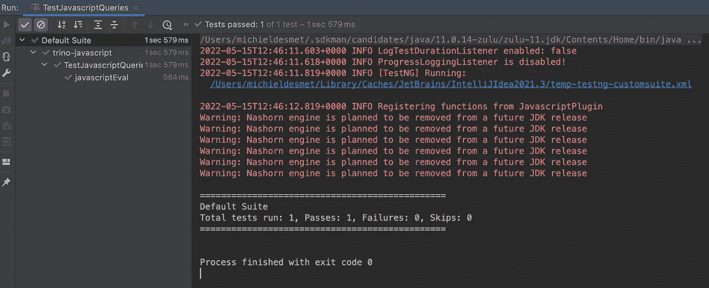

# 在 Trino 上试验 Javascript 用户定义函数

> 原文：<https://blog.devgenius.io/experimenting-with-javascript-user-defined-functions-on-trino-ecce32359da4?source=collection_archive---------6----------------------->

在本教程中，我们将构建一个简单的 Trino 连接器，它可以对整个数据世界执行任意 Javascript。这是个好主意还是搬起石头砸自己的脚？一起来了解一下吧！

将 Javascript 引入数据，而不是将数据引入 Javascript，这多酷啊？

# Trino 是什么？


Trino ，一个以可笑的速度运行的查询引擎。它是用于大数据分析的快速分布式 SQL 查询引擎，可帮助您探索您的数据世界。

[Trino](https://trino.io/) 让你无需将数据复制到一个统一的存储层，就可以连接并查询你所有的数据。

# 什么是用户自定义函数？


> **用户定义函数** ( **UDF** )是由程序或环境的用户提供的函数，在这种情况下，通常的假设是函数被构建到程序或环境中。UDF 通常是根据其创建者的要求编写的。
> [维基百科](https://en.wikipedia.org/wiki/User-defined_function)

在数据库环境中，它允许用户发明和提供可重用的逻辑块，并将它们存储在数据库中。

例如，雪花从一开始就支持 [Javascript 用户自定义函数](https://docs.snowflake.com/en/developer-guide/udf/javascript/udf-javascript-introduction.html)。

# 为什么使用 Javascript 用户定义函数？

根据 statista 的统计，Javascript 是全球开发者使用最多的编程语言。


为什么开发人员喜欢 javascript:

*   易于学习，因为有大量的学习材料
*   通过[国家预防机制](https://www.npmjs.com/)形成一个成熟且充满活力的生态系统

# 简而言之，教程

我们将开发一个简单的用户定义函数，允许我们使用 JVM 11 的现成 nashorn Javascript 脚本引擎来执行 Javascript 函数。

# 会出什么问题呢？

## 安全性


请注意，JavaScript 引擎不是沙箱化的，它允许执行任何任意 Java 代码，并在活动的 Java 类加载器上加载任何类。

例如，这段代码暴露了 Trino worker 进程的所有环境变量(可能暴露了您的任何数据湖或数据库凭证)。

```
javascript_eval('function udf() { 
  return java.lang.System.getenv();
}')
```

## 表演


显然，简单的 javascript 函数在用标准的 Trino SQL 函数表达时可能会快得多，这些函数可能会被 Trino 的优化器重写，甚至被推送到底层存储的 T2。

使用为每次调用解释用户代码的脚本引擎也会带来潜在的高开销。

# 我们开始吧！


**不要在生产中使用这个代码。使用此代码完全由您自己承担风险。**

连接器代码可在 [my github](https://github.com/mdesmet/trino-javascript) 上获得。

## 如何在 JVM 上执行 Javascript？

使用 Nashorn ScriptEngine，我们可以评估 Javascript 代码并调用任何声明的函数。

```
ScriptEngine engine = new ScriptEngineManager().getEngineByName("javascript");
engine.eval("function udf(a,b){ return a + b;}");
System.out.println(((Invocable) engine).invokeFunction("udf", new Object[]{1, 1}));
```

这将应用两个参数，1 和 1。用 Javascript 将它们加在一起，并返回用 Java 自己的 System.out.println 打印的值 2.0。

## 快速设置新的 Trino 连接器

为了快速设置 Trino 连接器，我们使用了由 Jan wai 开发的[酷 maven 原型](https://github.com/nineinchnick/trino-plugin-archetype)。

请注意 Nashorn，下一步我们可以用 [GraalVM Javascript 引擎](https://www.graalvm.org/22.1/reference-manual/js/NashornMigrationGuide/)替换现有代码。潜在地也解决了上面提到的安全问题。

```
mvn archetype:generate \                                         
  -DarchetypeGroupId=pl.net.was \
  -DarchetypeArtifactId=trino-plugin-archetype \
  -DarchetypeVersion=1.5-SNAPSHOT \
  -DgroupId=io.innover.trino.plugin.javascript \
  -DartifactId=trino-javascript \
  -DclassPrefix=Javascript \
  -DconnectorNAme=trino-javascript \
  -DgithubRepo=mdesmet/trino-javascript
```

## 创建我们自己的用户定义函数

一些数据库允许使用如下语句创建 UDF

```
**CREATE** **FUNCTION** dbo.CtoF(Celsius FLOAT)
  **RETURNS** FLOAT
  **RETURN** (Celsius * 1.8) + 32
```

我们可以在 Trino 中实现这一点，但这远远超出了 Trino 连接器目前所支持的范围。

## 到底是不是瓦拉格斯？

我们想要的是这样的东西:

```
SELECT javascript_eval('function udf(a, b) { return a + b; }', 1, 1)
```

这个 API 看起来非常类似于现有的[格式](https://trino.io/docs/current/functions/conversion.html#formatting)函数，允许传递任意数量的不同类型的变量参数。

我们来看看 Github 上的[代码。](https://github.com/trinodb/trino/blob/f4878e655e4a55111497115489a559d835c69f7c/core/trino-main/src/main/java/io/trino/operator/scalar/FormatFunction.java)

```
public final class FormatFunction
        extends SqlScalarFunction
{
    private FormatFunction()
    {
        super(FunctionMetadata.scalarBuilder()
                .signature(Signature.builder()
                        .name(NAME)
                        .variadicTypeParameter("T", "row")
                        .argumentType(VARCHAR.getTypeSignature())
                        .argumentType(new TypeSignature("T"))
                        .returnType(VARCHAR.getTypeSignature())
                        .build())
                .hidden()
                .description("formats the input arguments using a format string")
                .build());
    }
```

请注意 variadicTypeParameter 为我们的函数提供了变量。

然而不幸的是，连接器目前不支持这一功能。

```
2022-05-15T12:01:16.547+0000 INFO Registering functions from JavascriptPluginjava.lang.IllegalArgumentException: Class [io.innover.trino.plugin.javascript.JavascriptEvalFunction] does not have any methods annotated with [@ScalarFunction](http://twitter.com/ScalarFunction) or [@ScalarOperator](http://twitter.com/ScalarOperator)
```

## 我们必须重新发明我们的 API…

使用行类型怎么样？

顾名思义，[行](https://trino.io/docs/current/language/types.html#row)类型类似于数据库行。那一行的每一列都可能是不同的类型，这正是我们所需要的。

```
SELECT javascript_eval('function udf(a, b) { return a + b; }', ROW(1, 1))
```

我们还需要坚持使用 Trino docs 中自定义 UDF 的 e [示例中的注释。](https://trino.io/docs/current/develop/functions.html)

```
@ScalarFunction("javascript_eval")
@TypeParameter("V")
@SqlType(StandardTypes.*VARCHAR*)
public static Slice evalWithArgs(
        @TypeParameter("V") RowType rowType,
        @SqlType(StandardTypes.*VARCHAR*) Slice slice,
        @SqlNullable @SqlType("V") Block row)
{
    Object[] args = *mapArgs*(rowType, row);
    return *executeJavascript*(slice, args);
}
```

javascript 执行正是我们在上面讨论过的，但是如何得到我们的参数，行元素？

```
private static final Set<Type> *SUPPORTED_TYPES* = ImmutableSet.*of*(*UNKNOWN*, *TINYINT*, *SMALLINT*, *INTEGER*, *BIGINT*);private static Object[] mapArgs(RowType rowType, Block block)
{
    int positionCount = block.getPositionCount();
    List<Type> types = rowType.getTypeParameters();
    Object[] output = new Object[positionCount];
    for (int position = 0; position < positionCount; position++) {
        Type type = types.get(0);
        if (!*SUPPORTED_TYPES*.contains(type)) {
            throw new TrinoException(*NOT_SUPPORTED*, "Argument of type " + type.getDisplayName() + " is not supported in javascript_eval invocation.");
        }

        if (type.equals(*UNKNOWN*)) {
            output[position] = null;
        }
        if (type.equals(*TINYINT*) || type.equals(*SMALLINT*) || type.equals(*INTEGER*) || type.equals(*BIGINT*)) {
            output[position] = type.getLong(block, position);
        }
        if (type.equals(*REAL*)) {
            output[position] = *intBitsToFloat*(*toIntExact*(type.getLong(block, position)));
        }
        if (type.equals(*DOUBLE*)) {
            output[position] = type.getDouble(block, position);
        }
    }
    return output;
}
```

现在，我们将限制对数字类型的支持。在后面的会话中，我们可能会添加对更多类型的支持，例如字符串类型或带有命名字段的嵌套行(javascript 对象？).

## 它真的有用吗？

让我们添加一个单元测试来看看它是否有效。

```
@Test
public void javascriptEval()
{
    assertFunction("javascript_eval('function udf(a,b){ return a + b;}', ROW(1, 1))", *VARCHAR*, "2.0");
}
```

测试成功完成！



## 接下来我们能做什么？

*   向 GraalVM Javascript 迁移以提高安全性和性能
*   支持更多的输入类型(如嵌套对象)
*   支持更多输出类型

请在评论中告诉我你接下来想看什么！