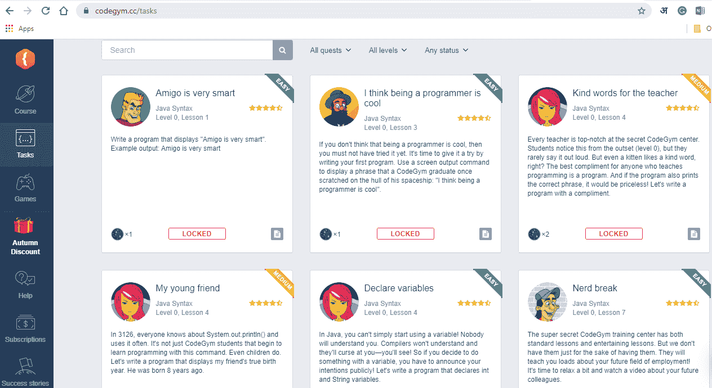
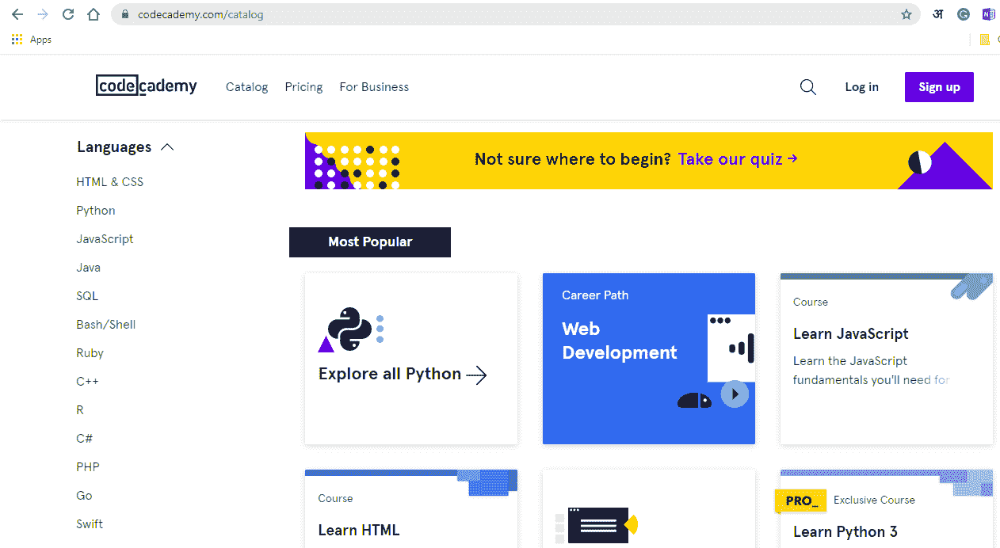
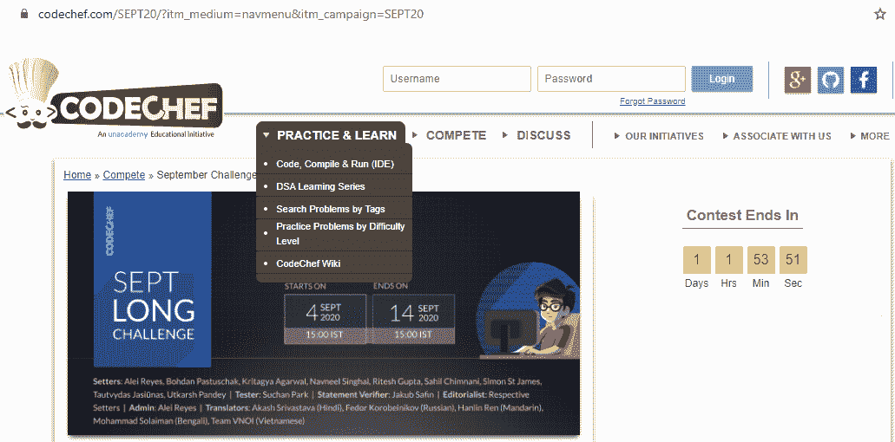

# 如何学习 Java 的程序员专家指南

> 原文：<https://blog.devgenius.io/expert-programmers-guide-on-how-to-learn-java-3c80daaae8e2?source=collection_archive---------1----------------------->

克拉克·蒂布斯在 [Unsplash](https://unsplash.com/s/photos/programming?utm_source=unsplash&utm_medium=referral&utm_content=creditCopyText) 上拍摄的照片

Java 是一种流行的编程语言，是全球软件开发人员构建 web、移动和桌面应用程序、网站、小程序、分布式模块、游戏、企业软件、云应用程序等的选择。学习 Java 的程序员发现许多途径向他们敞开，通向一个有回报的职业生涯。

我正在分享我学习 Java 并把它教给我的学生的经验。我希望这篇文章通过强调常见错误以及如何避免它们来帮助你克服对语言的先入为主的恐惧，这样你就可以享受学习的过程。

我从事编程已经几十年了，发现学习编码就像任何其他技能一样。因此，如果您不确定如何学习 Java，但完全致力于掌握这种语言，本文将通过正确的学习方法和有用的资源来指导您。

# 避免 Java 程序员的 10 个常见错误

犯错并从中吸取教训是件好事。然而，如果你想加快你的学习，走聪明的路，从别人的错误中学习。

让我们看看它们是什么。

# 练习不够

听起来可能很讽刺，学习者只是浏览理论，跳过写代码！这永远不会成功，因为你需要亲自动手，尝试不同的问题来应用你的知识。你可能有机会接触到最好的学习资源，但如果你花太多时间看教程和看书，而没有付诸实践，你的进步可能会很缓慢。

你应该尽快开始编码，最好是在涉及到每个小主题之后。不要等到你在理论上已经涵盖了所有的主题的时候再推迟。

这里有一些平台有面向实践的 Java 课程。这些对于那些害怕迈出 Java 编程第一步的初学者来说尤其有用。有许多练习和游戏可供选择，这样你可以用一种有趣的方式自由地学习。

## CodeGym

[CodeGym](https://codegym.cc/) 提供在线 Java 编程课程，80%基于实践。基于游戏化的学习之旅按照难度递增的顺序进行分级。有一个活跃的在线社区和论坛来寻求帮助，有经验的 Java 程序员定期撰写文章来收获新的想法。

## Codeсademy

Codecademy 是我极力推荐的另一个在线学习平台。它有涵盖包括 Java 在内的 12 种编程语言的互动课程。无论你是初学者还是曾经编程过，网站 300+小时的 Java 内容都会帮助你提高。无论你是求职者、学生还是在职专业人士，你都可以灵活地制定自己的学习计划。

## 厨师长

作为 unacademy 的产品， [CodeChef](https://www.codechef.com/) 帮助你将编程技能提升到一个新的水平。它有按照难度分类的练习题来应用你的知识。如果你想接受更大的挑战，就参加编码竞赛，看看如何与来自世界各地的程序员一决高下。你的努力会得到分数和星级，这是一个很好的指标，表明你在哪里。

# 没有应用 OOP(面向对象编程)概念

下一个常见的错误是学习者在学习 Java 的早期忽略了 OOP 方法。这成为了一种习惯，阻碍了他们利用概念的全部潜力，比如抽象、继承、多态和封装。Java 是一种基于 OOP 的语言，所以我强烈建议你从一开始就习惯它。

我见过一些程序员，他们试图在没有深入了解 OOP 概念的情况下获得成功，但在解决现实世界的问题时却遇到了挫折。这和一只手绑在背后试图打棒球是一样的。这些概念将您从这种约束中解放出来，因为您学会了看到全局并可视化代码的相互依赖性——哪些对象要公开，哪些要全局使用，以及如何将它们连接在一起？

# 重新发明轮子，而不是使用 Java 库

如果你试图通过从头开始开发一切来学习 Java，你可能会不知所措。采取明智的方法并利用 Java 经历的几十年发展是很重要的。有一些包含代码片段的库，您可以重用它们来简化看似复杂的任务。

这里有一个网站，上面有 [Java 文档](https://docs.oracle.com/en/java/)，像我这样的程序员经常使用它来节省时间和精力。你也可以谷歌一下“Java library for……”(添加你的请求)，你会很有可能找到它。在学习编程时，首先集中学习语言及其概念，然后尝试掌握库。还有一点:你总是可以从你的 IDE 中读取 Java 类代码。

# 同伴比较和自我怀疑

我遇到的很多学习者都是想先冲刺再学走路。如果你一直拿自己和其他程序员比较，你的注意力就会动摇。更糟糕的是，当一个编程了几周的人拿自己和编程了几十年的顶尖程序员相比时。想要成为最好的人是很好的，但是你必须设定现实的期望。

我们都有不同的学习风格，我们会花自己的时间来发展专业技能。不要让自我怀疑爬进来——今天的专家曾经是不放弃的初学者。相信自己的能力，经常练习。

# 初步成功后的过度自信

这是与前一个问题相反的问题。无论你是初学者还是专家，执行无错代码都是一种神奇的感觉。重要的是不要被它冲昏头脑，开始认为自己好像什么都知道。从最初的成功中获得自信，并以此为基础——但永远不要陷入过度自信的陷阱。

看看专家处理问题的方式(在像 [Github](https://github.com/) 这样的平台上)，看看是否有改进的空间。

如果你想掌握 Java 编程，接受这样一个事实:这是一场没有终点的马拉松。你的学习永无止境，但这是一个愉快的旅程。

# 独自学习而不寻求帮助

学习编程需要团队合作。当你遇到困难时，向同伴寻求帮助是完全可以接受的。交流是一个重要的方面，它将帮助你成长为一名程序员，并获得关于你工作的真实反馈。

有许多渠道可以寻求帮助。你的同事、老师、同学、学长是个人交往中最容易接近的人。网络世界充满了社区和论坛，程序员们在这里聚在一起交流思想，问/答问题。一些最受欢迎的是:

*   Reddit 频道
*   [r/编程](https://www.reddit.com/r/programming/)
*   [r/learn 编程](https://www.reddit.com/r/learnprogramming/)
*   [r/codetogether](https://www.reddit.com/r/codetogether/)
*   [r/编程工具](https://www.reddit.com/r/programmingtools/)
*   [r/gamedev](https://www.reddit.com/r/gamedev/)
*   [r/Prog articles](https://www.reddit.com/r/prograrticles/)
*   [r/webdev](https://www.reddit.com/r/webdev/)
*   [r/daily program](https://www.reddit.com/r/dailyprogrammer/)
*   松弛渠道
*   [斜线火箭](https://slashrocket.io/)
*   [欧洲发展探索者](https://europeandevexplorer.typeform.com/to/MC3qnG)
*   [DevOps 聊天](https://devopschat.co/)
*   [堆栈溢出](https://stackoverflow.com/)
*   [站点点](https://www.sitepoint.com/)
*   [黑客新闻](https://news.ycombinator.com/)

# 让情绪控制一切

在你学习 Java 的早期，你会遇到很多障碍。看似简单的代码会抛出错误，其中一些可能是微不足道的。不要让情绪左右你的方法。编程需要一种逻辑的而不是感性的方法。前者会帮助你清晰地思考，向前看，即使一切似乎都出错了。

错误信息不是对你的个性、资质或能力的判断。这仅仅意味着你输入了错误的文本序列，一旦你明白哪里错了，就可以纠正。

# 认为只有数学天才才能擅长编程

这个观点在几十年前或多或少是正确的。在过去，编程更低级，有时需要数学和科学的方法。使用 Java 或 Python 等语言的高级编程对于大多数编程任务来说不需要深厚的数学知识。

当然也有行业，数学思维不会是多余的。比如游戏引擎的开发。此外，如果你想通过你的程序进行复杂的科学计算和计算机绘图，你需要理解数学，你可以在需要时学习。

然而，作为 Java 开发人员，你的大部分任务只需要逻辑和基本的学校数学。因此，如果你不擅长微积分、三角学或几何学，不要折磨自己。

# 中途放弃

学习编程给你的日常能力带来了微妙的变化。每一个错误，每一行错误的代码，以及不正确的语法都会影响你的进步。犯错是自然的。不要让他们影响你的思想。振作起来，接受你的错误，改正它，掸掉身上的灰尘，当你想放弃的时候再来一次。

你所能做的最坏的事情就是在你即将收获努力的成果之前放弃。

# 摘要

即使没有编码或数学背景，你也可以擅长 Java 编程。一旦你选择了学习资源并投入固定的时间进行练习，你的努力和坚持就会让你成功。不要害怕犯错误，需要的时候寻求帮助，向你的同龄人学习。祝你好运！