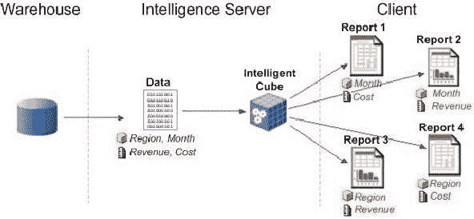

# 解释 MicroStrategy 智能和报表服务器

> 原文：<https://blog.devgenius.io/explain-microstrategy-intelligence-and-report-server-cd9459cb92bf?source=collection_archive---------20----------------------->

[斯科特·格雷厄姆](https://unsplash.com/@sctgrhm?utm_source=medium&utm_medium=referral)在 [Unsplash](https://unsplash.com?utm_source=medium&utm_medium=referral) 上拍照

如今，商业用户对其商业智能套件的要求越来越高。他们期望的不仅是高效的报告工具，还有分析能力。此外，在可能的情况下，它使用易于使用的数据挖掘系统。在现实世界中，事情从来没有看起来那么简单。不同的厂商提供不同的具体解决方案。妥协变得难以达成。那么“万能套件”很少是足够好的。MicroStrategy Report Services 是一个不同的完整仪表板和报告引擎。首先，让我们来看看微策略智能。

要深入了解 Microstrategy，您可以注册参加 [**Microstrategy 在线培训**](https://onlineitguru.com/microstrategy-online-training-placement.html) 的现场演示

**什么是微策略智能？**

MicroStrategy Platform-intelligence server 是一个针对大型商业问题的改进测试系统。它通过 windows、web 和远程界面执行报告请求。这是来自所有 MicroStrategy 商业智能客户端平台。例如，这些报告从基本的执行指标、按项目列出的季度交易。这是使用卡方检验的精确推测测试。然后调查结果会反馈给客户。此外，客户端还可以与信息交互并运行更多的测试。

通过 [**微观战略培训**](https://onlineitguru.com/microstrategy-online-training-placement.html) 将您的职业生涯推向新的成功高度

**微策略智能魔方**

当您在 MicroStrategy 中运行报告时，它们会收集仓库数据。这些数据将用于计算。然后它会生成一份报告。许多用户可能请求相同的报告，但是具有不同范围的过滤条件。那么仓库将不得不为每个报告重复类似的计算。此外，这会影响性能。

为了阻止这一点，智能使用智能立方体。智能多维数据集是位于中间层的报表和仓库之间的实体。

下图描述了智能立方体的作用。

您可以将智能多维数据集作为内存中的单个副本共享。此外，您可能会生成许多用户的各种报告。此外，您可以从数据仓库返回一个数据集。然后，您可以间接保存到智能服务器的内存中。因此，您可以构建多个从智能多维数据集中收集数据的报告。它减少了查询数据仓库的负担。

获取更多关于 [**微策略培训在线**](https://onlineitguru.com/microstrategy-online-training-placement.html) 的信息

以下是使它们对智能立方体有用的应用程序。

*   支持动态聚合。
*   你可以把它放在一边用来提神。
*   支持派生指标的创建。
*   比直接仓库查询更快的效率。

在一个仪表板中可以使用多个多维数据集。

**微战略智能功能:**

这些功能如下。

**SQL 生成动态:**

MicroStrategy 智能服务器元数据提供了有关数据库表的信息。因为元数据是一个图表，所以您可以生成这些报告、请求和审查。这可能没有任何进展。这是通过使用你当前的物理图表。

**高级缓存:**

MicroStrategy Intelligence 服务器保留所有客户请求。同样，您不仅可以存储储备，还可以存储客户的个人报告。因此，在任何一个 MicroStrategy 报告系统上都不会出现重复处理。

**内置集群和故障转移软件级别:**

MicroStrategy Intelligence Server 使您能够收集各个服务器的广泛组合。这不需要额外的编程或硬件部件。在故障转移模式下工作意味着 MicroStrategy Intelligence 服务器的故障仍然存在。如果服务器遇到系统故障，就会发生这种情况。

**综合统计研究:**

例如，Intelligence Repository 提供了对基本性能指标的直接研究。此外，最近的分析，如业务设置，营业额，并保留和脱扣调查。独特的测试包括检查假设，回归，外推和债券的测量。

当前的商业智能解决方案不仅仅需要强大和高效。它们还应该易于使用。那么组织中的每个用户都可以使用它们。此外，它不需要整个 it 部门的参与。如果是 MicroStrategy Report Services，您可以通过合理的方式解决。

**MicroStrategy reporting services**

第一个假设是在一个框架内保持报告、分析和跟踪。这是与他们所有的下列能力。因此您不需要迁移数据或更改应用程序。一旦你可以提供一种直观的方式来控制整个平台。那么用户只需要一点时间就可以获得最复杂和隐藏的功能。

学习如何使用 MicroStrategy 报告服务后，用户可以选择从交互式记分卡开始，通过通用仪表板完成报告。一旦平台对用户友好，所有稍微高级一点的用户都可以创建文档。此外，它是最令人惊讶和有用的-在微软办公套件的产品中。它可以是任何仪表板、报表或记分卡。这是报告服务的额外功能。

如果你做了这个报告，你可以很快很容易地回顾它的基本内容。然后验证数据使用的任何方面。它具有复杂的钻井能力，同时具有难以置信的多功能性。然后就很容易把注意力集中在报告结果中哪怕是最小的部分。

**功能:-**

微观策略报告的功能如下。

*   运行命令计算和报告配置
*   从根本上改进了客户端使用的查询的执行
*   有效管理大量最终客户规格。
*   完整元数据是微策略的一个重要问题

**举报服务器:**

您可以使用此服务器来报告详细信息。MicroStrategy Report Services 包含表示信息的对象。这来自至少一个报告以及附加定位和设计数据。它使用单一的显示质量。而且，这是要从很多报表中设计信息。您可以决定录制时显示的信息。此外，它还可以控制设计、组织、收集和汇总信息。然后你可以陈述分页符的位置。你也可以嵌入图片，把报道吸引到郊外。

记录中的大部分数据通常来自基本数据集。数据集是表征您检索的数据的微观策略报告。数据在情报系统里。这是从信息传递中心或储备。报告来自自由格式 SQL、查询生成器报告、MDX 实体表单报告。然后，报告利用记录中使用的数据导入突出显示作为数据集。您还可以从信息源导入信息来创建数据集。信息源可以是 Excel 电子表格、数据库、自由形式的 SQL 查询。也可以是来自 Salesforce.com 的报道。然后，您可以使用记录的传输信息作为数据集。单个记录可能有不同的数据集。

Report Services 位于 MicroStrategy 商业智能平台业务报告引擎中。Report Services 的索引包括与数据相关的项。更进一步，你可以安排和整理信息。它是在一个演示质量的展示中安排来自不同报告的数据。

**仪表板报表服务:**

RS 仪表板是一种特殊性质的文档。通常，RS 仪表板只有一页长。你可以把它设计成可以上网。它通常提供直观的突出显示，允许调整关于仪表板的信息。由于只有一页长，RS dashboard 很容易看到整个文档，没有片刻的延迟。然后你可以看到它的大部分细节。RS 仪表板支持客户智能。然后，每个客户都可以调整他或她查看信息的方式。此外，它在控制所允许的断点内。