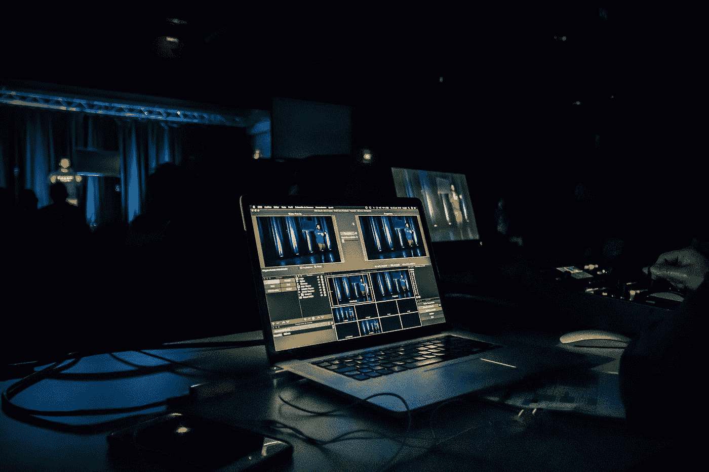

# 用简单的术语解释网络流的基础

> 原文：<https://blog.devgenius.io/explaining-basic-of-web-streaming-in-simple-term-e8aef988bca8?source=collection_archive---------20----------------------->



由 [Jametlene Reskp](https://unsplash.com/@reskp?utm_source=medium&utm_medium=referral) 在 [Unsplash](https://unsplash.com?utm_source=medium&utm_medium=referral) 上拍摄的照片

最近，我需要开发一个网络流媒体应用程序。在没有任何基本经验的情况下，我开始研究许多关于它的东西。所以在这里我将分享我对此的了解。

所以简单地说，一切都归结于 **WebRTC。**


由 WebRTC 项目作者—[https://webrtc.org/press/](https://webrtc.org/press/)，BSD，[https://commons.wikimedia.org/w/index.php?curid=60282663](https://commons.wikimedia.org/w/index.php?curid=60282663)

*那是什么？*嗯，就把它想象成互联网上**实时通信** (RTC)的标准。这一标准得到了认可，可以在所有现代浏览器上使用，开发人员可以使用普通的 Javascript API 访问它。一些基本的使用例子是你分享你的相机。如果您想亲自查看，请尝试将这段代码粘贴到您的开发人员控制台中:

```
navigator.mediaDevices.**getUserMedia**({video: true});
```

现在你可以看到你的浏览器将请求访问你的相机。接受请求后，相机数据可以用来做许多事情，如记录数据或与其他人分享。我们还可以使用以下简单代码共享我们的屏幕:

```
navigator.mediaDevices.**getDisplayMedia**();
```

权限请求与其他视频流(如 Google Meet)中的请求相同。他们会问你想与应用程序共享哪个屏幕或窗口。有了这段代码，我们可以轻松地将窗口转换成 Javascript 代码。

接下来，我们来谈谈如何玩接收到的数据。再来介绍另一个新名词:MediaStream。MediaStream 是表示媒体内容流的接口。我们之前的两个例子都将返回这个对象(技术上来说是`Promise<MediaStream>`,但是你已经知道它的要点了)。然后，我们可以选择一个目标来本地或远程传输我们的内容。

一个简单的例子是从我们的本地到我们的本地。我们已经知道如何将相机数据转换成媒体流。现在，我们应该如何在本地显示视频数据？答案是使用`<video>`标签。

`<video>`标签使用`src`属性来声明视频源的 URL。但是在我们的例子中，这里没有我们可以使用的 URL。关于`<video>`标签，很多人不知道的一件事是，我们可以将另一个属性附加到`<video>`标签上，以指示源在哪里。属性是`srcObject`。`srcObject`具有与`src`属性类似的功能。不同之处在于，我们需要为这个属性附加一个对象，而不是一个 URL。允许的对象之一是 MediaStream，这意味着我们可以使用该属性将摄像机附加到`<video>`标签上！

如果你想看看它是如何工作的，这里有一个基本的例子，你可以用它来把你的相机挂在`<video>`标签上。当打开 HTML 文件时，浏览器会询问是否允许使用您的相机。用户接受请求后，网页会实时显示你的摄像头。

这就是 WebRTC 的基础。我计划在未来发布更多与 WebRTC 相关的博客，所以请随时关注我，保持更新！