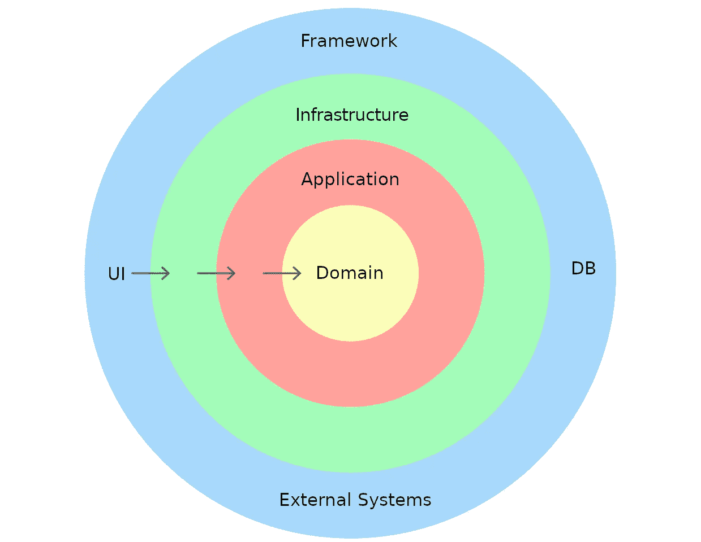
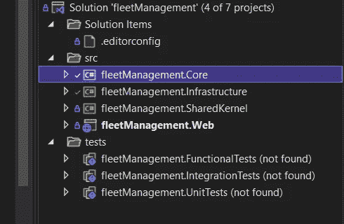
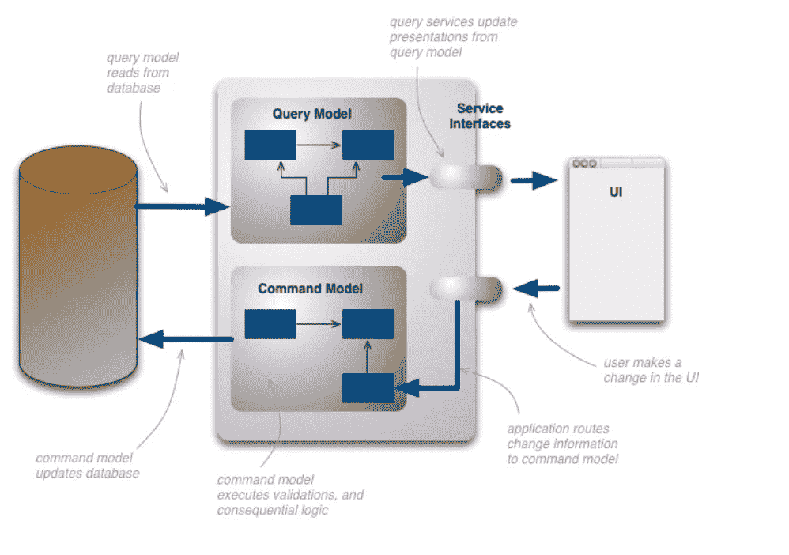
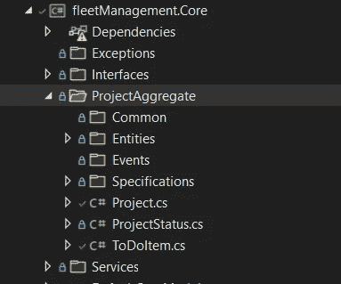
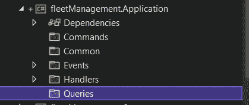
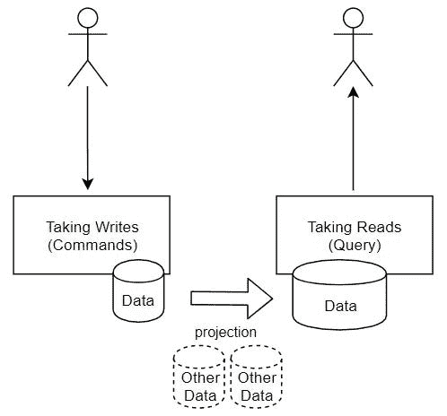
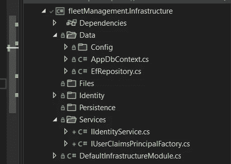
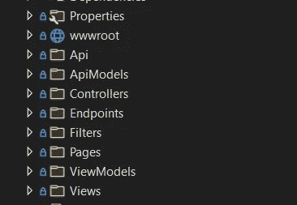
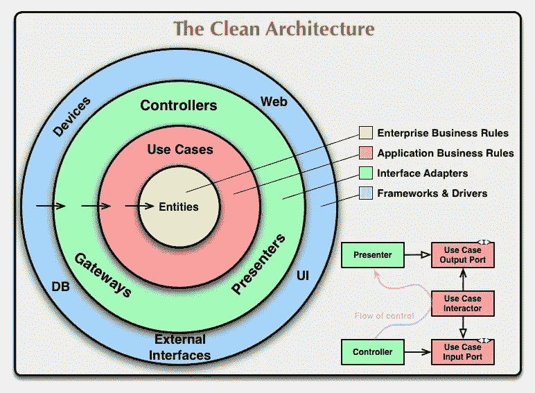

# 中解释干净的架构。核心网(细分和示例)

> 原文：<https://blog.devgenius.io/explaining-clean-architecture-in-net-core-breakdown-example-f197663964c7?source=collection_archive---------0----------------------->

## 干净的架构是关于架构抽象的:构建简单的、可维护的、灵活的、一致的软件


Frans Ruiter 在 [Unsplash](https://unsplash.com?utm_source=medium&utm_medium=referral) 上拍摄的照片

# 介绍

> “建筑师首先关心的是确保房子可用，而不是确保房子是砖造的。”——鲍勃叔叔

B 构建/维护一个需求总是变化的复杂软件应用程序是软件开发的真正目的。软件设计可以成就你的整个项目，也可以毁掉它。想象一个场景，您在两个不同的应用程序上工作。

你有一个软件应用程序，其中的*软件架构看起来像意大利面条——每一行代码都很混乱。你不能轻易分开一切的归属；你也不能做出改变，因为你可能会破坏整个事情。*

你也有一个软件项目，但看起来像千层面。每一层都漂亮地叠放在一起。你可以清楚的*了解每一层是做什么的，你可以轻松的测试一切。*

我们都同意千层面设计的软件架构更好。

这正是清洁建筑所代表的。我们以一种简单、易于理解、尤其是灵活的方式设计我们的软件结构。

**我们只关注这些 *e es* 本质——我们构建必要的东西并优化可维护性**。

这些概念也与 **YAGNI(你不会需要它)和 DRY(不要重复自己)原则**密切相关。

我们建造不是为了给人留下深刻印象。我们只想满足用户的需求/期望。这样做，我们可以避免构建不必要的功能或组件。

对于大学毕业的学生来说，清洁建筑是一种完全不同的思维方式。学校教你使用以数据库为中心的架构(UI、业务逻辑层、数据访问层)，也就是典型的 CRUD 应用。数据库是我们应用程序的中心，我们的应用程序依赖于它。

然而，在商界，我们不能僵化。顾客总是有不同的需求。相反，我们关注以领域为中心的架构或实践，以及领域驱动设计的模式。

我不会用 DDD 的所有做法和模式来烦你。相反，我想把重点放在干净的建筑上。那是 DDD 的心脏。

我们的清洁架构由不同的层组成:

*   **领域层(我们的应用程序所代表的模型)**
*   **应用层(用例或如何解决用户问题。**更俗称业务逻辑)
*   **基础设施层(具有外部依赖性的层，如存储库、**和**与服务**的集成(如外部 API、Stripe 等)。))
*   **持久层(不同类型的数据库。我们通常用 ORM 与数据库对话。**
*   **表示层。**

**重要注意事项:所有内容都指向领域层**



干净的建筑

**我们构建我们的应用程序，使领域成为核心(从根本上说，我们确保我们的核心项目没有依赖性)**

我们系统的域代表了应用程序的内容。我们关注应用程序的行为和它们周围的界限。

我们的用例(应用层)解决用户的问题。其他的都可以认为是细节。有点像你盖房子——房间是必需品，我们使用的材料是细节。

例如，表示层是一个细节。我们可以用许多不同的界面来展示我们的模型。

此外，我们的持久层是一个细节，因为我们可以实现许多其他数据库，如 NoSQL 或 SQL Server，MongoDB…

每一层都有明确的定义。

然而，干净的架构设置/构建只是第一步。企业应用程序也需要存活大约十年。

我们大部分时间都花在维护系统上。这就是为什么我们应用程序最大的**成本(60–80 %)来自维护。**

然而，尽管干净的架构如此美妙，我们并不需要在任何地方都实现它。

当我们使用干净的架构时，我们有抽象来实现松散耦合和灵活的软件。缺点是我们增加了更多的复杂性。

在软件开发中，我们不遵循严格的规则。我们会根据环境和我们的业务目标来质疑什么时候使用哪种工具、模式或实践是最好的。

最好从零的角度来问问题。例如，如果我们只是构建一个 REST API 应用程序，我们不需要有 5 个不同的层。那就太夸张了。

然而，如果我们想要构建一个功能良好的 IOS 应用程序，能够支持许多用户，那么使用一些设计模式/坚实的原则来处理复杂性是很重要的。这完全取决于上下文

如果你想了解更多的坚实的原则，我增加了一个额外的链接。

[](https://www.digitalocean.com/community/conceptual_articles/s-o-l-i-d-the-first-five-principles-of-object-oriented-design) [## 固体:面向对象设计的前 5 个原则

### SOLID 是前五个面向对象设计(OOD)原则的首字母缩写，由 Robert C. Martin(也称为大叔…

www.digitalocean.com](https://www.digitalocean.com/community/conceptual_articles/s-o-l-i-d-the-first-five-principles-of-object-oriented-design) 

现在，我将向您展示一个简单、干净的架构应用程序，当您想要构建下一个应用程序时，可以使用它来构建项目结构。

# 将它整合在一起



车队管理

我将通过一个简单的项目演示如何建立一个干净的架构。

我正在制作一个简单的 Asp.Net 核心应用程序，它有一个 ReactJs 前端，叫做车队管理应用程序。

通过车队管理应用程序，公司可以管理其车队。因此应用程序可以:
-管理车辆
-管理加油卡
-管理司机
-安排维护和修理

我采用了单一数据库 CQRS 模式。CQRS 代表**命令质问责任分离。CQRS** 将读取和写入命令(插入、更新、删除)操作分开。它主要用于性能和可伸缩性。



CQRS 模式

## 核心项目



核心项目

核心项目是所有业务规则所在的地方。实体封装了所有的业务规则。实体对其他层一无所知，并且它们不使用外层中任何其他类或组件的名称。

我将用一个司机的实体作为例子。

```
public class Drivers : BaseEntity{ public string Name { get; set; } public string Street { get;  set; } public string City { get; set; } public string PostCode { get; set; } public string StreetNumber { get; set; } public string Adres { get { return $"{Street} + {StreetNumber}, {City},       {PostCode}"; } } public Datetime Birthday { get; set; } public string License { get; set; } public string NationalRegistrationNumber { get; set; } public bool Employed { get; set; }}
```

对于我们的实体，我们应该遵循单一责任原则(任何其他类都是如此)。我们的对象应该有很高的“内聚力”方法和属性都应该与类的目的紧密相关。理解类做什么和维护它要容易得多。

例如，我们的实体没有像 Required 或 MinLength 这样的数据注释。数据注释支持验证，并帮助实体框架将实体映射到关系模型中。然而，数据注释的问题是它们聚集了你的领域。

如果我们要改变我们的数据访问技术(不同的 DB)，由于我们的数据注释，我们也必须改变我们的实体。所以这就是为什么我把数据注释排除在外。通过 Guard 子句和 Fluent 验证，我们可以验证我们的模型，并将验证分离到我们的应用层。

## 应用项目



*   应用程序接口
*   查看模型/dto
*   地图绘制者
*   应用程序例外
*   确认
*   逻辑
*   命令/查询(CQRS)

我们将用例嵌入到应用层，并拥有我们更高层次的应用逻辑或抽象。用例是与系统的交互，例如，获得所有汽车的列表，并且它是关于我们如何用我们的领域模型做事情。

在 CQRS，我们对数据库的读(查询)和写(命令)使用不同的路径。我们最终要做的是将代码组织成特性。因此，功能是一个单独的命令或查询或用例。我们不再有分层的架构。

您可以使用 Mediator([Mediator pattern](https://www.dofactory.com/net/mediator-design-pattern))为每个请求添加额外的行为，比如日志记录、缓存自动验证和性能监控。

我不会详细讨论事件采购的 CQRS 模式。如果你很好奇，你可以在这里了解更多:

[](https://www.upsolver.com/blog/cqrs-event-sourcing-build-database-architecture) [## CQRS，事件采购&如何构建数据库架构| Upsolver

### 事件流是现代组织中增长最快的数据源之一。了解如何构建高性能…

www.upsolver.com](https://www.upsolver.com/blog/cqrs-event-sourcing-build-database-architecture) 

请记住，应用层知道域，但不知道其他层。

```
public interface IApplicationDbContext 
{
      DbSet<Drivers> Drivers {get;set;}

      DbSet<FuelCards> FuelCards {get;set;}

      DbSet<Requests> Requests {get;set;} Task<int> SaveChangesAsync(CancellationToken cancellationToken); }
```

我们的控制流程从表示层到基础设施层。我们通过依赖注入来实现 IApplicationDbContext。但是 IApplicationDbContext 的实现位于基础设施持久层。如果我们要切换到不同的数据库，我们可以很容易地交换它，而不会影响应用层。应用层只使用一个抽象。

正是出于这个原因，我们使用了依赖倒置原则。较高层次的模块(应用层)不依赖于较低层次的实现(持久层)

## 基础设施项目



与 I/O 组件相关的一切都属于基础设施层。所以那就是:

*   存储库(数据访问抽象)
*   EF 数据库上下文(应用数据库上下文)
*   Web API 客户端
*   日志适配器(是域和基础设施之间的转换器。例如，他们从 GUI 中获取输入数据，并以一种方便用例及实体的形式重新打包)
*   电子邮件/短信发送
*   …

由于这一层中的内容可能会发生变化，因此它们尽可能远离更稳定的领域层。因为它们是分开保存的，所以进行更改或用一个组件替换另一个组件相对容易。

## Web 项目



*   MVC 控制器
*   Web API 控制器
*   认证/授权

从用户的角度来看，*表示层*是系统的入口点。它主要关注的是将请求路由到*应用层*，并在 IoC 容器中注册所有的依赖关系。我使用 DTO 的自动映射器(数据传输对象)来传输视图模型，并将其发送到 UI。我们可以使用一个中介来处理表示层对 dto 的请求。

对于身份验证和授权，我们可以使用 IdentityServer 实现。

# 外卖食品

以防干净的建筑还不清楚。我补充了一个小总结。



清洁建筑的基本原则是:

*   这实际上是关于关注点的**分离(还记得千层面结构吗？**每一层都与另一层分离
*   应该**独立于框架(我们可以很容易地将 ReactJs 框架替换成一个有角度的前端)**
*   它们应该是**可测试的(我们可以用单元测试快速测试代码，用集成测试测试每一个特性)，也称为** [**TDD(测试驱动开发)**](https://www.guru99.com/test-driven-development.html)
*   它们应该**独立于 UI**
*   它们应该**独立于数据库**
*   **干净的架构图** — **核心:**“企业/关键业务规则”(**实体** ) — **应用**:“应用业务规则”(**用例** ) — **下一步**:“接口适配器”(**网关、控制器、展示者** ) — **展示**:“框架和驱动”(**设备、Web、UI、外部接口、DB**
*   **最里面的圆圈**是**最高级别(我们的应用程序围绕我们的领域发展)**
*   **内圈定义接口(它们决定发生什么)**
*   **外环实现接口(应该如何做某事)**
*   **内圈不能依赖外圈(依赖规则:)**
*   **外圈不能影响内圈**

我希望你学到了一些东西。快乐编码:-)

# **资源**

[](https://blog.cleancoder.com/uncle-bob/2012/08/13/the-clean-architecture.html) [## 清洁编码器博客

### 在过去的几年里，我们已经看到了一系列关于系统架构的想法。这些包括…

blog.cleancoder.com](https://blog.cleancoder.com/uncle-bob/2012/08/13/the-clean-architecture.html)