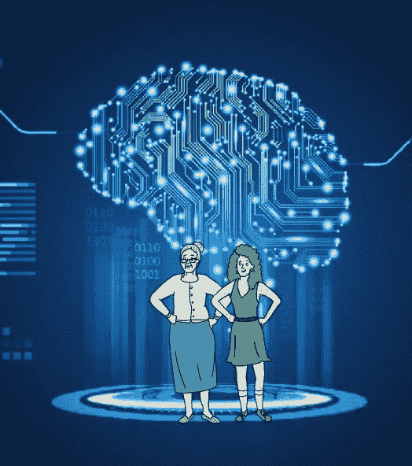
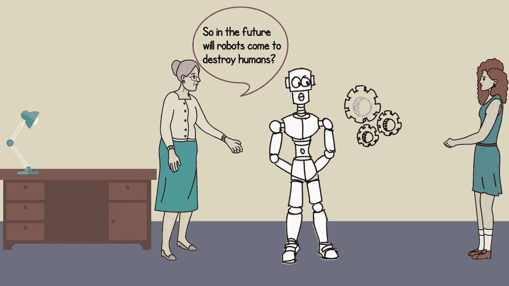
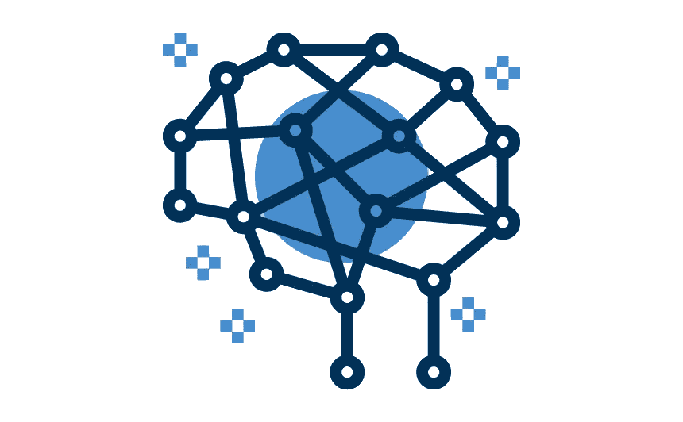
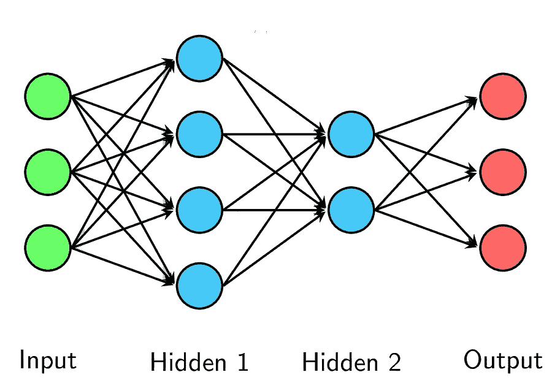
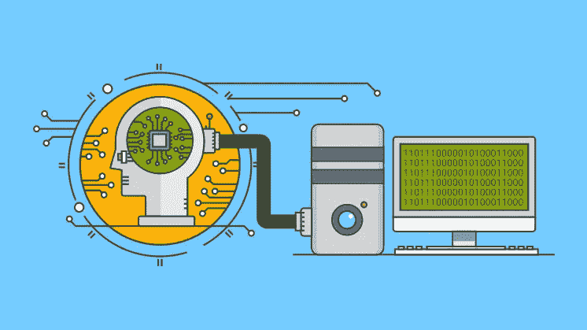
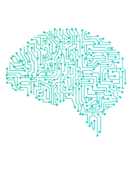
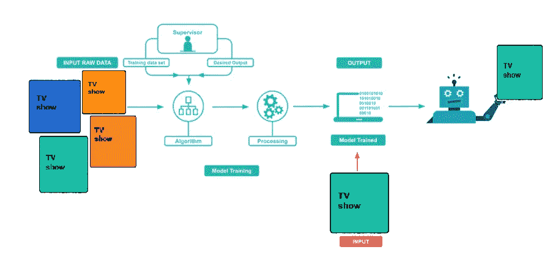
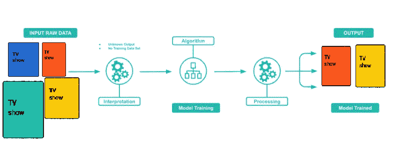
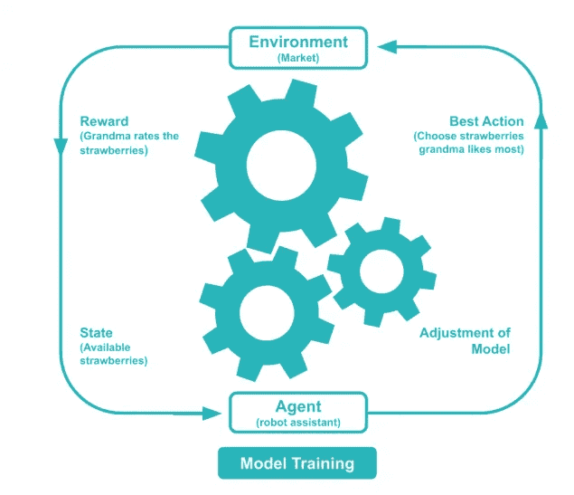

# 向我奶奶🧓解释机器学习🏻

> 原文：<https://blog.devgenius.io/explaining-machine-learning-to-my-grandma-e8342b38b9b7?source=collection_archive---------20----------------------->

很多时候，我们的祖父母对新技术表现出一定的排斥，他们经常说它们很复杂，他们不明白它们是如何工作的，那些东西不适合他们。前几天我奶奶问我**电视**怎么知道她喜欢什么，因为它总是建议她看她感兴趣的节目，我告诉她这是通过**机器学习**，所以她回答什么？所以我给自己设定了一个挑战，向我的祖母解释这个平台是如何工作的。

我澄清一下，我不会很专业，但我会很好地强调这个主题，并以简单的方式解释我认为机器学习的重要之处。

机器学习可以定义为基于经验、观察和给定数据集的模式分析自主学习和改进的能力。机器学习的目标是不断适应新数据，发现其中新的模式或规则。

在计算机的世界里，有些人负责给它们编程，这意味着它们给你做任何事情以及如何做的指令。我们必须记住，计算机是愚蠢的，我们必须指定它们的行为。我们称之为显式编程。

通过机器学习，我们可以向计算机提供一组数据，系统可以从这些数据中自行学习模式和相关性。找到的模式以数学模式存储

让我们稍微谈谈什么是人工智能 **(AI)** 人工智能是一个计算领域，旨在让计算机像人类一样思考，而不仅仅是遵循人类的指令。人工智能已经存在很长时间了:希腊神话包含了旨在模仿我们行为的机械人的故事。只要知道机器学习没有危险就好。

数学和计算算法在机器学习中有着重要的作用，有一个数学领域叫做**线性代数**，它通过组织信息的方式允许更好地处理数据，数学还允许我们更好地选择我们可以使用的算法，以便机器以最好的方式学习和做它，也有必要了解计算，统计，概率和其他事情。

让我们想一想我们大脑的功能，我们不断地接收信息，我们的神经元处理所有通过感官输入的数据，我们的大脑有超过 1000 亿个相连的神经元，为了进行正确的信息处理，每个神经元负责一个刺激

基于我们大脑的行为，神经网络的诞生是为了让计算机模仿大脑的行为，从而能够进行数据处理。

# **它是如何模拟大脑的？🧓🏻**

让我们想象一个神经网络，作为一组通过电缆连接的节点，每个节点代表一个神经元，每条电缆是它们之间的连接，在神经网络中我们发现**三个基本层**，一个**输入层**，**隐藏层**，和一个**输出层**；输入层负责接收信息，并且在这种情况下不发生处理，隐藏层不直接从外部接收信息，它们从输入层的神经元接收信息。在这些层中，信息的处理一旦一切都被处理，信息就被发送到输出层，该输出层具有提供神经网络输出的神经元。

# 他们是如何学习的？🧓🏻

机器学习过程包括两个重要阶段:训练阶段和测试阶段。

## 培训阶段

在这一阶段，一组数据或模式被发送到网络，它必须进行数据处理，以评估网络的输出值和期望值，每次网络与期望的输出相匹配时，该期望的输出馈入其机器学习算法，其中网络找到输入和输出数据之间的相关性。

## 测试阶段

在前一阶段，算法针对输入的数据调整并创建其规则，因此在训练阶段改变模式或数据非常重要，这样网络就不会失去对新情况的学习能力。

## 机器学习类型

## 监督学习:

在监督学习中，我们向算法提供输入和输出数据，算法知道预期输出的事实使算法易于学习，因为它知道返回什么值，从而允许更大的成功。
这方面的一个例子是，当我们告诉我们的剧集和视频平台我们有兴趣观看的内容时，我们就是监督者。

## 无监督学习:

在无监督学习中，我们没有输出数据，这是算法试图在输入数据中发现模式以输出的时候。
一个我们可以看到的例子，当我们不直接告诉平台我们的兴趣是什么，我们只放置我们喜欢的随机程序。

## 强化学习

强化学习包括奖励和制裁的原则，即每次成功都会得到奖励，每次错误都会受到惩罚，因此算法将理解决策是否正确。通过这种方式，机器学习做出正确的决策，以最大化长期奖励。

简而言之，神经网络允许计算机获取信息，将其分解成片段以便它能够理解，然后生成它认为最接近的结果。

 [## 机器学习解释道(就像对你的祖母一样)

### 什么是机器学习？为了理解这一点，我们首先需要了解计算机目前是如何工作的。现在，一个…

mc.ai](https://mc.ai/machine-learning-explained-as-if-to-your-grandmother/)  [## 人工智能和机器学习有什么区别？

### 毫无疑问，机器学习(ML)和人工智能(AI)是…

www.forbes.com](https://www.forbes.com/sites/bernardmarr/2016/12/06/what-is-the-difference-between-artificial-intelligence-and-machine-learning/#6c57e4442742)  [## 给你奶奶的机器学习

### 我们用一个在人类学习和机器学习之间画出平行线的故事来解释最基本的人工智能。一…

www.ml2grow.com](https://www.ml2grow.com/blog/machine-learning-basics/)