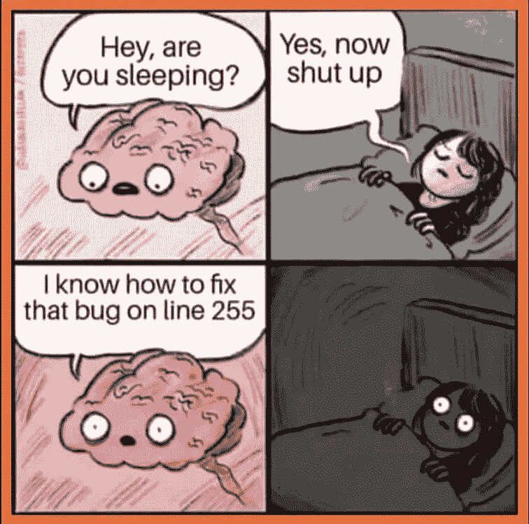
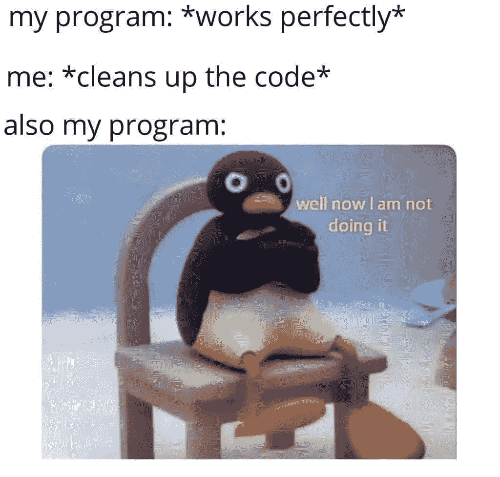

# 解释编程迷因|第 1 部分

> 原文：<https://blog.devgenius.io/explaining-programming-memes-part-1-18c505495c44?source=collection_archive---------6----------------------->

> 我们可以说，每个行业都有一种语言，只有从事该行业的人才懂，其他人都懂中文。程序员中也流传着大量的模因，既然我是程序员(理论上)，我就把其中的一些解释给那些不像我们这样的极客。

## 1.被盗代码

编程是个好工作，因为每个问题都已经被别人解决了。如今，任何一个连一克编程都没学过的人，都可以复制一个已有的脚本。每个程序员都复制其他人的代码，所以如果你在互联网的不同角落遇到几个相同的代码，这并不奇怪。我个人不建议复制粘贴，在[这篇帖子](https://link.medium.com/1X9JnW0Divb)里我会解释为什么以及最常见的错误。值得一读！

## 2.不存在的行出错

作为一名程序员，经常会发生这样的情况:你写了一段代码，比如说 10 行，运行它，在第 20 行出现了一个错误。在这种情况下，许多人只是抱着头，无法想象为什么会发生这种情况。然而，对此有几种简单的解释。首先是隐形人物。每个人都知道什么是空格或制表符，并乐于在他们的文档或代码中使用它。然而，它们实际上是作为字符代码存在于文档中的，它告诉显示文档的操作系统应该显示什么而不是代码。有时候我碰巧从 GitHub 下载了一个代码，当我试图编辑它时，它包含了所有现有的字符代码。由于我会在运行时得到一个未定义的或语法错误，我不得不一个接一个地删除它们，并用我自己的空格替换它们。你可以想象在一个 500 行的代码库中做这些是多么有趣...当库出现问题时，您也可能会遇到这个 bug。

## 3.未解决的 bug

我们经常花几个小时试图修复一个错误。编程往往需要耐心，所以你不会在愤怒中烧掉你的笔记本电脑。不管你怎么努力，当你不能解决某件事的时候，感觉总是很糟糕。在很多情况下，我倾向于使用停止整件事的技巧，做些别的事情，然后我就能及时找到解决问题的方法。很多人都这么做，我想这就是这个迷因的来源。

## 4.代码稍加修改后就不起作用了

我真的很喜欢看 Pingu，这是我童年的美好回忆之一，但这不是这里最重要的。当你只是写代码的时候，你只是专注于让它工作。有时会发生这样的情况，后来你意识到如果没有 1000 个 for 循环，这个问题本来可以更简单地解决，或者你只是试图稍微组织一下杂乱无章的代码。过了一段时间，一切都落在我身上，没有人知道谁和谁在一起，或者他们在做什么。这里有一个非常重要的规则，编程时要记住:如果你的代码有效，就不要碰它！

# 好了，第一部分到此为止！

如果你想阅读这些的更多部分，给我发个评论，这样我就知道你想要更多。如果你喜欢这篇文章，请考虑给我一个提示或者为这篇文章鼓掌。关注我，了解更多关于编程、动机和生活方式的内容！

# 编码快乐！