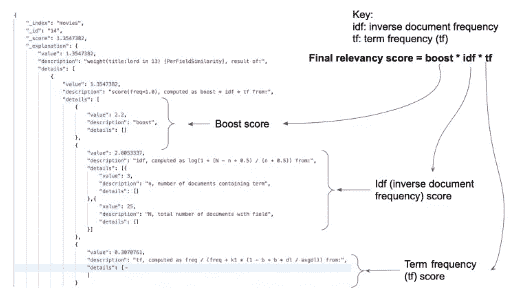

# 行动中的弹性研究:分数的解释

> 原文：<https://blog.devgenius.io/explanation-8-8-3-5f23badf7590?source=collection_archive---------7----------------------->


节选自我即将出版的书:弹性搜索在行动

在接下来的几个月里，我会将这些短小精悍的文章以迷你系列的形式呈现在大家面前。节选自我的书[*elastic search in Action，第二版*](https://www.manning.com/books/elasticsearch-in-action-second-edition?utm_source=mkonda&utm_medium=affiliate&utm_campaign=book_konda_elasticsearch_7_23_21&a_aid=mkonda&a_bid=edbc50d4) *。代码在我的*[*GitHub*](https://github.com/madhusudhankonda)*库中。您可以在存储库中找到可执行的 Kibana 脚本，这样您就可以直接在 Kibana 中运行命令。所有代码都根据 Elasticsearch 8.4 版本进行了测试。*

Elasticsearch 提供了一种了解相关性分数构成的机制。这个机制告诉我们引擎是如何计算分数的。这是通过在搜索端点上使用一个`explain`标志或一个`explain` API 来实现的。`explain` API 也用于找出文档与查询匹配或不匹配的原因。在本文中，我们将研究这两种方法，以了解它们的共性和细微差异。

# 解释标志

您可能已经注意到前面一些查询的结果中有一个正数(相关性得分值)。虽然我们知道该值是由引擎计算和设置的，但我们不知道它是如何计算的。如果我们对计算感到好奇，我们在查询中将`explain`属性设置为`true`。然后，Elasticsearch 返回结果，并详细说明它是如何得出这个分数的。换句话说，它为我们提供了一个关于引擎在幕后执行的逻辑和计算的解释。

下面给出的清单中的查询显示了一个`match`查询。因为我们想获得分数是如何计算的细节，所以我们将`explain`设置为`true`。

## 清单:要求引擎解释分数

```
GET movies/_search
{
 **"explain": true,** "_source": false,
  "query": {
   "match": {
    "title": "Lord"
  }
 }
}
```

`explain`属性设置在与查询对象相同的级别。这个查询的结果很有趣，如下图所示。



**图:Elasticsearch 如何计算相关性得分的说明**

如图所示，通过将三个部分相乘来计算相关性分数:逆文档频率( *idf* )、术语频率( *tf* )和提升因子。Elasticsearch 详细介绍了它是如何评估和衡量这些组成部分的。例如， *idf* 计算如下

```
log(1 + (N — n + 0.5) / (n + 0.5))
```

在哪里

*   *n* 是包含该术语的文档总数(图中有 3 篇文档包含*主*字样)。
*   *N* 是文档的总数(上面给出的数字显示了我们的索引中的 25 个文档)。

你可以通过查看返回响应中的描述字段来了解 *idf* 是由什么组成的(见上图)。

类似地，术语频率( *tf* )使用以下公式计算

```
freq / (freq + k1 * (1 — b + b * dl / avgdl))
```

我建议您看一下这一部分，以检查引擎生成分数的公式的应用。

# 解释 API

虽然我们使用`explain`属性来理解相关性评分的机制，但是除了提供评分计算之外，还有一个`explain` API 来提供对文档匹配(或不匹配)原因的洞察。下面清单中的查询使用一个带有文档 ID 的`_explain`端点作为参数来演示这种方法。

```
GET movies/_explain/14
{
 "query":{
  "match": {
   "title": "Lord"
  }
 }
}
```

这个查询与清单 8.20 中的查询相同，但是这一次，我们调用了`_explain`端点，而不是在`_search`端点上设置`explain`标志。前面清单中的结果提供了关于分数的解释。

最后，让我们在上面的清单中搜索*领主*(而不是*领主*)并重新运行查询。如下面的代码片段所示，Elasticsearch 提供了一个线索，说明为什么我们没有得到相同的结果

```
{
 "_index" : "movies",
 "_type" : "_doc",
 "_id" : "14",
 "matched" : false,
 "explanation" : {
  "value" : 0.0,
  **"description" : "no matching term",** "details" : [ ]
 } 
}
```

如解释对象的`description`所说， *Lords* 与索引数据不匹配。了解匹配(或不匹配)的原因有助于我们对查询的状态进行故障诊断(例如，在前面的示例中，我们知道匹配的术语不存在于我们的索引中)。

> 使用`_search` API 上的`explain`标志构建的搜索查询可以产生很多结果。在我看来，在查询级别要求对所有文档的分数进行解释纯粹是浪费计算资源。相反，选择一个文档并使用`_explain` API 请求解释

这是对`_explain`和`explain`标志的简单解释！

别忘了[跟着](https://mkonda007.medium.com)我，如果你喜欢就鼓掌:)


行动中的弹性研究