# 探索性数据分析——数据讲述技巧

> 原文：<https://blog.devgenius.io/exploratory-data-analysis-data-storytelling-skills-1c33e738d4bb?source=collection_archive---------16----------------------->

不同数据科学职位的工作薪金估算器


> 探索性数据分析是一种态度，一种灵活的状态，一种寻找我们认为不存在的东西以及我们认为可能存在的东西的意愿。

这篇文章处理我在我的 [**上一篇文章**](https://medium.com/@mathangpeddi/learn-to-build-an-end-to-end-data-science-project-c9f79692191?source=friends_link&sk=cf74f872a4c634f0595027bdfe997c3f) 中讨论过的数据集的探索性数据分析。我还将讨论两个简单但非常强大的库，它们对于数据可视化非常有用，因为它们可以在几分钟内完成所有任务，并减少我们的工作。

> 数据科学家的基本素质是讲述一个精彩的故事。

```
df = pd.read_csv('salary_data_cleaned.csv')
df.head()
```

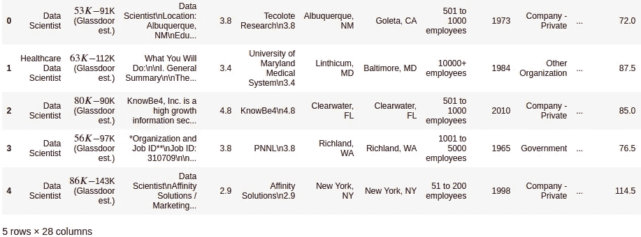

```
df.columnsIndex(['Job Title', 'Salary Estimate', 'Job Description', 'Rating',
       'Company Name', 'Location', 'Headquarters', 'Size', 'Founded',
       'Type of ownership', 'Industry', 'Sector', 'Revenue', 'Competitors',
       'hourly', 'employer_provided', 'min_salary', 'max_salary', 'avg_salary',
       'company_txt', 'job_state', 'same_state', 'age', 'python', 'r_studio',
       'spark', 'aws', 'excel'],
      dtype='object')df['Job Title'].value_counts()Data Scientist                           131
Data Engineer                             53
Senior Data Scientist                     34
Data Analyst                              15
Senior Data Engineer                      14
                                        ... 
Machine Learning Engineer (NLP)            1
Data Analyst - Asset Management            1
Data Scientist II                          1
Data Analyst, Performance Partnership      1
Data Modeler                               1
```

对于每份工作，我们得到以下信息:职称、工资估计、工作描述、评级、公司、地点、公司总部、公司规模、公司成立日期、所有权类型、行业、部门、收入、竞争对手。这里我们看到有 131 个数据科学家，53 个数据工程师，34 个数据科学家等等。让我们做一件事！让我们将所有的数据科学家归入一个类别，不考虑初级、高级、新生，而将所有的数据工程师归入另一个类别，以此类推。

```
def title_simplifier(title):
    if 'data scientist' in title.lower():
        return 'data scientist'
    elif 'data engineer' in title.lower():
        return 'data engineer'
    elif 'data analyst' in title.lower():
        return 'data analyst'
    elif 'machine learning' in title.lower():
        return 'machine learning'
    elif 'manager' in title.lower():
        return 'manager'
    elif 'director' in title.lower():
        return 'director'
    else:
        return 'na'
def seniority(title):
    if 'sr' in title.lower() or 'sr.' in title.lower() or 'senior' in title.lower() or 'lead' in title.lower() or 'principal' in title.lower():
        return 'senior'
    elif 'jr' in title.lower() or 'jr.' in title.lower():
        return 'jr'
    else:
        return 'na'
```

通过应用这两个功能，我将不同的数据科学工作组合在一起，然后将它们放在不同的类别中，还将它们分为三年级和四年级。

```
df['job_simplified'] = df['Job Title'].apply(title_simplifier)
df['job_simplified'].value_counts()data scientist      279
na                  187
data engineer       119
data analyst         99
machine learning     22
manager              22
director             14df['seniority'] = df['Job Title'].apply(seniority)
df.seniority.value_counts()na        520
senior    220
jr          2
```

现在我们可以看到有 279 个数据科学家，119 个数据工程师等等。说到资历，大多数工作的人都是年长者，他们共有 220 人。NA 表示不适用，这意味着他们没有给出他们的职称。在此之后，我还应用了一些数据清理技术，固定值，也增加了一些变量到我的数据集。

```
df.describe()
```

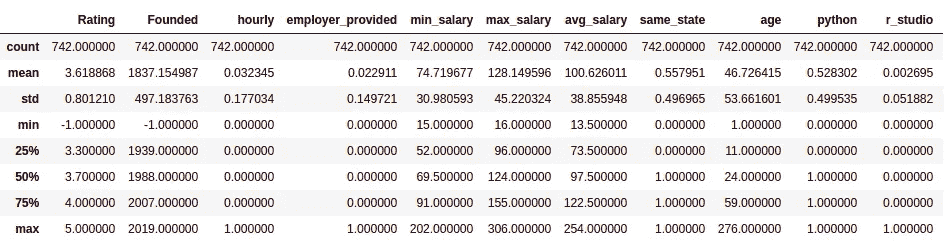

这将计算与数据集列相关的统计信息的摘要。这为我们提供了数据集数值列的计数、平均值、标准差、最小值、最大值和所有四分位数。在这里，如果我们给出 df.describe(include=all ),那么它也会给出关于分类变量的信息。

```
df['avg_salary"].hist()
```

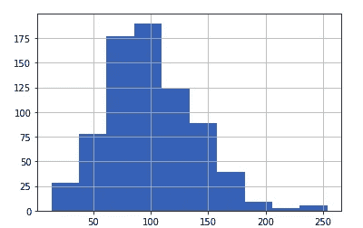

这是平均工资的直方图，它遵循正态分布。

```
df.age.hist()
```

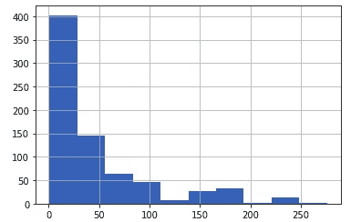

年龄的分布是左偏的，不是正态分布，所以如果我们想在以后的回归中使用它，那么我们必须对数据进行归一化。

```
log_data = np.log(df.age) 
log_data.hist()
```

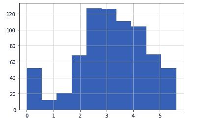

因此，我们对数据应用对数转换，并尝试将其转换为正态分布形式。

同样，我们可以检查所有数值变量的分布。

```
df.boxplot(column=['age','avg_salary','Rating'])
```

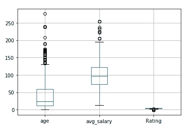

这里的箱线图没有归一化，age 和 avg_salary 的值接近 100s 和 150s，但是 Rating 接近 0。因此，如果我们想要比较 2 个特征，那么我们需要应用特征缩放，以便它们都在相同的范围内，并且可以容易地进行比较。在这种情况下，我们还可以发现大量的异常值。

让我们找出数字变量之间的相关性。

```
df[['age','avg_salary','Rating','desc_len','num_comp']].corr()
```

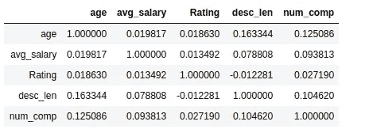

如果两个变量之间存在正相关，那么这意味着如果一个变量的值增加，那么另一个变量的值也应该增加。

```
cmap = sns.diverging_palette(220, 10, as_cmap=True)
sns.heatmap(df[['age','avg_salary1','Ratings','num_comp']].corr(),vmax=.3, center=0, cmap=cmap,
            square=True, linewidths=.5, cbar_kws={"shrink": .5})
```

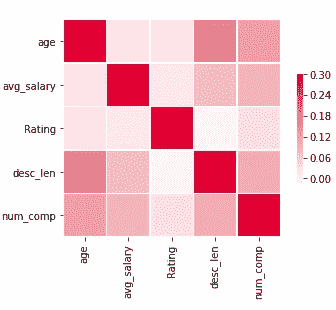

热图向我们展示了变量之间的相关性。

到目前为止，我们只看了数字变量，现在让我们处理分类变量。

```
for i in df_cat.columns:
    cat_num=df_cat[i].value_counts()
    print("graph for %s: total = %d" % (i,len(cat_num)))
    cat=sns.barplot(x=cat_num.index,y=cat_num)
    cat.set_xticklabels(cat.get_xticklabels(), rotation=90)
    plt.show()
```

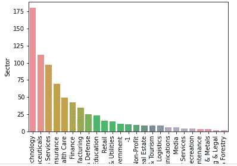

这里我们得到了所有分类列的条形图。它逐个显示每个特性的条形图，还显示每个特性中存在的值。

我们可以从地点上观察到，旧金山是最受欢迎的职位空缺城市。大多数公司都有 1000 到 5000 名员工，这在现实中并不是很大，因为也有 5000 到 10000 名员工的公司。就所有权而言，私营公司是这些职位中最常见的。因此，IT 市场显然有很大的需求，但在生物技术和制药领域也有非常好的品种，这非常令人惊讶。

```
for i in df_cat[['Location','Headquarters','company_txt']].columns:
    cat_num=df_cat[i].value_counts()[:20] #taking only the first 20 categories
    print("graph for %s: total = %d" % (i,len(cat_num)))
    cat=sns.barplot(x=cat_num.index,y=cat_num)
    cat.set_xticklabels(cat.get_xticklabels(), rotation=90)
    plt.show()
```

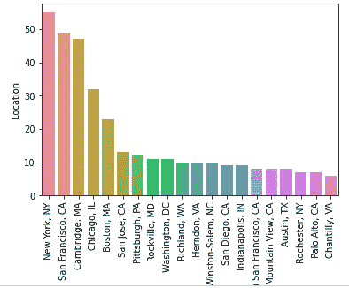

仅取前 20 个类别，我们看到纽约的职位空缺最多，其次是旧金山、剑桥和芝加哥。说到它的总部，纽约和旧金山并不奇怪，因为它们都是有很多工作机会的大城市。没有像微软、谷歌这样的超级大公司，当谈到公司时，这是相当令人惊讶的。

```
pd.pivot_table(df,index='job_simplified',values='avg_salary')
```

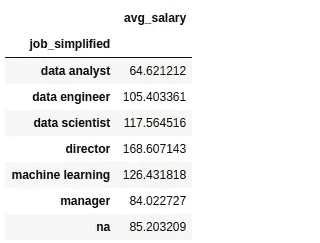

这给了我们不同数据科学职位/角色的平均工资。知道数据科学家和数据工程师比经理挣得多，机器学习工程师比数据科学家挣得多，真的很有意思。

```
pd.pivot_table(df,index=['job_simplified','seniority'],values='avg_salary')
```

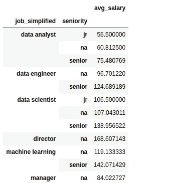

这给了我们基于资历的平均工资——初级、高级数据科学家、数据工程师等。

```
pd.pivot_table(df,index=['job_state'],values='avg_salary').sort_values('avg_salary',ascending=False)
```

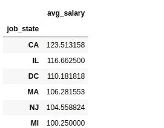

我们可以看到，加州、伊利诺伊州、DC 和马萨诸塞州的平均工资较高，但纽约州的平均工资低于所有这些州，这令人惊讶。也许数据分析师和数据工程师的数量比数据科学家和机器学习工程师多，或者也许纽约的生活成本非常高。
那么让我们来看看事实是否如此。

```
pd.pivot_table(df, index = ['job_state','job_simplified'], values = 'avg_salary',aggfunc='count').sort_values('job_state', ascending = False)
```

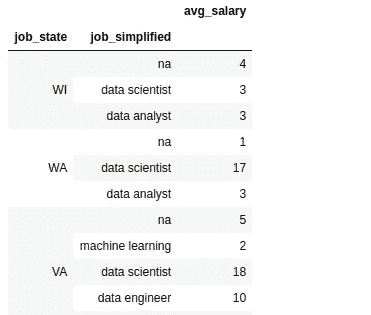

实际上，纽约的数据科学家数量更多，但在伊利诺伊州，他们雇佣了更多的主管，所以工资显然会很高。所以这真的拉低了纽约的平均工资。

```
df_pivots = df[['Rating', 'Industry', 'Sector', 'Revenue', 'num_comp', 'hourly', 'employer_provided', 'python', 'r_studio', 'spark', 'aws', 'excel', 'Type of ownership','avg_salary']]for i in df_pivots.columns:
    print(i)
    print(pd.pivot_table(df_pivots,index =i, values = 'avg_salary').sort_values('avg_salary', ascending = False))
```

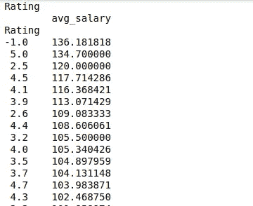

在评级中，未评级(-1)的人较多，而完美 5 的人薪水较高。来工业零售商店是昂贵的，甚至电影支付很多。说到这个领域，媒体是最重要的，这很有意思。小时工的工资显然要差很多。当描述中包括 Python 时，工资会更高，这是很明显的，因为 Python 是目前最流行的编程语言。Spark 和 AWS 也更高，是数据科学家的重要技能。但是对于 Excel 来说，要低一些，因为大部分数据科学家都不用 Excel。我们已经看到大部分的招聘信息都是私人的，但是看起来，一般来说，公共公司支付的工资是最高的，甚至大学也支付了合理的数额。

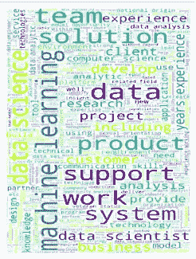

我做了一个职位描述的词云，看看哪些词用得比较普遍。所以数据科学和机器学习是涉及到的最重要的术语。单词 cloud 中的其他重要单词包括团队、支持、工作、系统。

# 强大的探索性数据分析


卢克·切瑟在 [Unsplash](https://unsplash.com?utm_source=medium&utm_medium=referral) 上的照片

在执行 EDA 之后，我开始探索并了解到有几个库可以在 5 分钟内用 2 行代码完成 EDA。！是不是很神奇？

## 熊猫简介

安装*熊猫档案*库。更多关于 pandas-profiling 的信息，点击 [**这里**](https://pypi.org/project/pandas-profiling/) **。**

这是一个非常有用的库，因为它可以在几分钟内从一个熊猫数据框生成剖面报告。

```
pip install pandas-profilingfrom pandas_profiling import ProfileReportprofile=ProfileReport(df,title='Glassdoor Salaries',explorative=True)profile.to_widgets()
```

所以首先我们需要安装库。导入之后，我们需要用我们的数据框和标题创建一个 ProfileReport。有两种方法可以生成报告，我们可以使用 to_widgets()在 Jupyter 笔记本中生成报告，或者我们可以创建一个输出 HTML 文件。

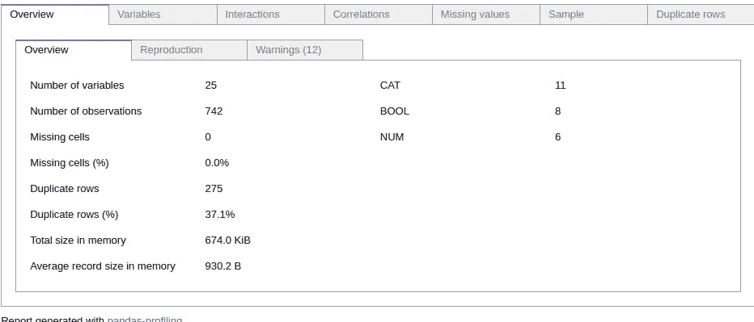

这是一个惊人的信息展示。您可以看到每个特征的变量、缺失值、信息和分布的数量。谈到相互作用，你可以看到两个变量是如何相关的，数据是如何分布的。

```
profile.to_file("output.html")
```

假设如果您希望将您的文件发送给一些利益相关者来理解它，那么您甚至可以展示这个报告。通过这个命令，您将能够在同一个目录中生成一个 HTML 文件。

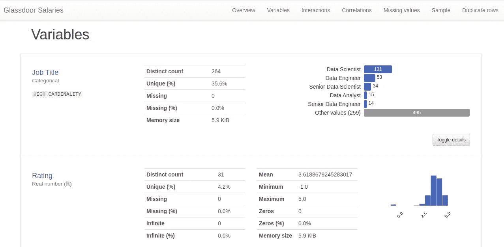

因此，您可以在浏览器中看到一个详细的报告，以有组织的方式显示数据集的所有信息！它显示了唯一的计数，最小和最大值，丢失值的数量，还向我们显示了非常有用的警告。

pandas profiling 的唯一缺点是，如果我们的数据集中有太多的特征，这个库将无法正常工作。

## Sweetviz

安装 *sweetviz* python 库。更多关于 sweetviz 的信息，点击 [**这里**](https://pypi.org/project/sweetviz/) **。**

这也是一个非常令人惊奇的库，它是建立在熊猫轮廓之上的，这甚至比熊猫轮廓更好。

```
myreport=sweetviz.analyze([df,"Dataset"],target_feat='avg_salary')
:FEATURES DONE:                    |█████████████████████| [100%]   00:13  -> (00:00 left)
:PAIRWISE DONE:                    |█████████████████████| [100%]   00:00  -> (00:00 left)
Creating Associations graph... DONE!myreport.show_html('Report.html')
```

首先，我们需要导入这个库，只需一行代码，您就可以获得对数据集中所有要素的全面分析。我们可以创建一个 HTML 文件，当你在浏览器中打开它时，它看起来像这样。Sweetviz 为我们提供了数据分布、数据统计特征(如均值、中值、众数、四分位距、偏度和峰度)以及变量间相关性的概述。

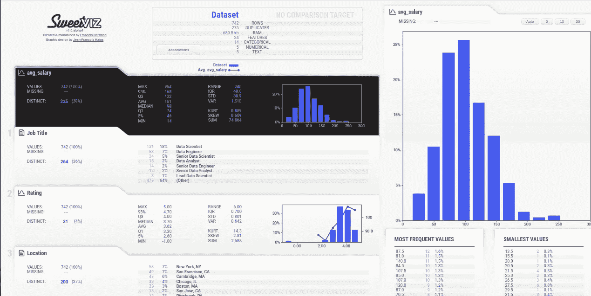

它显示的第一个特征是因变量/目标变量，当您将鼠标悬停在某个特征上时，它会在右侧显示该特征的分布和所有详细信息。甚至这份报告也向我们展示了所有的细节，如最小值、最大值、中值、平均值、IQR，还包含了许多与熊猫概况相比较的信息。你甚至可以看到不同变量之间的关联。

获得报告后，您可以进行更多的探索，因为报告显示了分布、缺失值、不同值、要素中每个值的计数以及百分比等。

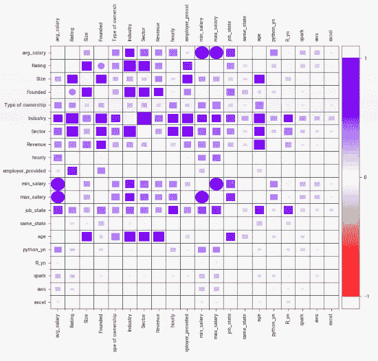

您甚至可以比较训练集和测试集，以查看缺失值的数量、分布等。将数据集转换为训练集和测试集，然后使用该库生成报告，或者您可以直接访问 Kaggle，下载特定数据集的训练集和测试集，然后在 sweetviz 库的帮助下进行比较。训练数据用蓝色表示，测试数据用橙色表示。

因此，这是快速比较所有的特点，也显示更多的细节相比，熊猫概况。这些是用于探索性数据分析的优秀库，非常方便，只需一行代码就可以执行。

在本文中，我只讨论了探索性数据分析。但是你可以随时参考我的 [**GitHub 资源库**](https://github.com/mathangpeddi/Glassdoor-Job-Salaries) 了解整个项目。

非常感谢 [Ken Jee](https://www.youtube.com/channel/UCiT9RITQ9PW6BhXK0y2jaeg) 对数据科学的惊人贡献和项目！

链接到他的回购:[**https://github.com/PlayingNumbers**](https://github.com/PlayingNumbers)

在 LinkedIn [**这里**](https://www.linkedin.com/in/mathang-peddi-23763317b/) 和我联系

> “人们听到的是统计数据，感受的却是故事。”布伦特·戴克斯

我希望你觉得这篇文章很有见地。我很乐意听到反馈，以便即兴创作，并带来更好的内容。

非常感谢您的阅读！