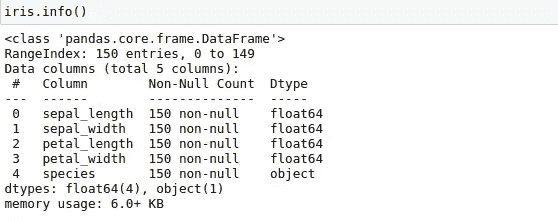

# 简而言之，探索性数据分析

> 原文：<https://blog.devgenius.io/exploratory-data-analysis-in-a-nutshell-ffdda5fcc15b?source=collection_archive---------4----------------------->

在开始探索性数据分析(EDA)的实际定义之前，让我给你一个例子，它可能会让你很好地理解 EDA。

假设你想买一部手机。首先，你在买手机之前做了什么？也许你在网上搜索了解你可能考虑的手机规格。你检查手机的外观，相机质量，处理器质量，显示器质量。此外，你还可以找到用户对手机的评价和评论。

无论你在最终购买新手机之前会采取什么样的调查措施，都只不过是数据科学家用他们的行话称之为“**探索性数据分析”。**

> 探索性数据分析(EDA)是一种分析数据集以总结其主要特征的方法，通常采用可视化方法。EDA 用于在建模任务之前查看数据能告诉我们什么。查看一列数字或整个电子表格并确定数据的重要特征并不容易。通过查看简单的数字来获得洞察力可能是乏味、无聊和/或令人不知所措的。在这种情况下，探索性的数据分析技术被设计出来作为辅助手段。

**“一张照片最大的价值是当它迫使我们注意到我们从未期望看到的东西”——约翰·图基**

# 让我们对一个简单的数据集执行 EDA:

我们将使用 **Iris flower 数据集**来执行 EDA。你可以从这个[链接](https://www.kaggle.com/uciml/iris)下载这个数据集。

# 关于数据集的相关信息:

Iris 数据集在 r . a . Fisher 1936 年的经典论文《在分类学问题中使用多重测量》中使用过，也可以在 UCI 机器学习知识库中找到。

**属性信息:**

1.  萼片长度，单位为厘米(数值)
2.  萼片宽度，单位为厘米(数值)
3.  花瓣长度，单位为厘米(数值)
4.  以厘米为单位的花瓣宽度(数值)
5.  类别:(刚毛鸢尾、杂色鸢尾、海滨鸢尾)

**让我们在 Iris 数据集上开始我们的 EDA 吧………………..**

# 1)导入 Iris 数据集和库

我们将使用一些 python 库，如 pandas、NumPy、matplotlib、seaborn 来对 iris 数据集执行 EDA。为了加载我们的数据集，我们将使用 pandas 库中的 **read_csv()** 函数。

# 2)数据集的一般信息

现在是时候获得一些关于数据集的一般信息了。为此，我们将使用各种函数。我们一个一个来看。

**观察:-** 输出显示我们有 5 列 150 个条目。没有空值，有五种常见的数据类型(float64)。

## 2.1)平衡数据集与不平衡数据集

现在，我们将尝试了解我们的数据集是平衡的还是不平衡的。

**观察:-** 我们的数据集是一个平衡数据集，因为每个类的点数几乎相同。检查我们的数据集是平衡的还是不平衡的是很重要的。对于不平衡数据集，EDA 与平衡数据集略有不同。

## 2.3)对数据集进行基本统计

我们将使用 pandas 的 describe()函数来了解数据集的基本统计信息。

**观察:-** 输出显示了数据集中所有特征的平均值、标准偏差和百分位值。由此我们可以得到我们数据集中所有花的萼片长度、萼片宽度、花瓣长度、花瓣宽度的概貌。

# 3)使用数据可视化的 EDA

现在我们已经获得了足够的数据集信息。让我们通过数据可视化来执行 EDA。我们将使用 matplotlib 和 seaborn 库来可视化我们的数据。

## 3.1)单变量分析

**单变量分析**是分析数据的最简单形式。“Uni”的意思是“一”，所以换句话说，你的数据只有一个变量。它不处理原因或关系(不像[回归](https://www.statisticshowto.com/probability-and-statistics/regression-analysis/))，它的主要目的是描述；它获取数据，总结数据，并在数据中找到模式。

**3.1.1)使用概率密度函数(PDF)的单变量分析**

有关 PDF 的更多信息，您可以使用此[链接](https://en.wikipedia.org/wiki/Probability_density_function)。我们的数据集中有 4 个要素，我们将逐个显示密度图。

*   对于**花瓣长度**

*   对于**花瓣 _ 宽度**

*   对于**萼片长度**

*   对于 **sepla_width**

**观察:**

*   从上面的 4 张图中，我们看到**花瓣长度**直方图更重要，因为在该直方图中，刚毛藻被很好地分离，而杂色花和海滨锦葵的跳跃性较小。
*   萼片宽度直方图最差，因为这里很难区分 3 个物种。
*   前两个最重要的特征是:**花瓣 _ 长度**和**花瓣 _ 宽度**

**3.1.2)使用累积分布函数(CDF)的单变量分析**

使用 CDF 我们可以获得比 PDF 更多的信息。要更多地了解 CDF，你可以使用这个[链接](https://en.wikipedia.org/wiki/Cumulative_distribution_function)。

*   **setosa 花的**花瓣长度**的 CDF。**

上图中，蓝色曲线代表 PDF，橙色代表 CDF。

**观察:**

*   从 PDF 曲线中，我们可以说 setosa 花瓣长度的最大数量在 1.5-1.6 之间
*   但是根据 CDF 曲线，我们说几乎 95%(.95) setosa petal_length 是= < 1.7
*   100% (1.0) setosa petal_length are =<1.9

> *,这样我们可以可视化所有三个类(setasa，versicolor，virginica)的 PDF 和 CDF 曲线以及它们的特征，以获得关于数据集的更多内部信息。*

**3.1.3)使用箱线图的单变量分析**

箱线图(也称为盒须图)是一种常用于解释性数据分析的图表，通过显示数据四分位数(或百分位数)和平均值来直观地显示数值数据的分布和偏斜度。使用此[链接](https://www.simplypsychology.org/boxplots.html#:~:text=A%20box%20plot%20(also%20known,(or%20percentiles)%20and%20averages.)了解更多信息

*   所有三类花瓣长度的箱线图。

**观察:-**

*   从上面的方框图中，我们可以很容易地说出所有三个类的花瓣长度的百分位数。例如，在 versicolor 类中，花瓣长度的第 25 个百分位数是 4，第 50 个百分位数大约是 4.5，第 75 个百分位数大约是 4.8。
*   使用箱线图，我们还可以检测数据集的异常值。在我们的数据集中，几乎没有异常值。

## 3.1)双变量分析

当我们看两个变量分析时，那就是双变量分析。示例:散点图、配对图等。

**3.1.1)使用散点图的双变量分析**

*   萼片长度和 seplat 宽度之间的散点图

**观察:**

*   `Using **sepal_length** and **sepal_width** features,we can distinguish Setosa flowers from others.`
*   将云芝和弗吉尼亚分开要困难得多，因为它们有相当多的重叠。

我们可以使用散点图找到两个特征之间的任何关系。

**3.1.2)使用配对图的双变量分析**

当我们需要找到许多特征之间的关系时，配对图就出现了。

**观察:**

*   `petal_length and petal_width are the most useful features to identify various flower types.`
*   虽然 Setosa 很容易识别(线性分离)，vernica 和 versicolor 不容易识别，因为它们有一些重叠。

酷！！

现在，我们已经通过探索性数据分析(EDA)获得了关于数据集的许多内部信息。对于我们的虹膜数据集，我们大多使用数据可视化技术来执行 EDA。

> 对于某些数据集，数据可视化技术不能提供关于数据集的很多信息。例如:在[哈贝曼生存数据集](https://www.kaggle.com/gilsousa/habermans-survival-data-set)中，我们通过数据可视化得到的信息并不多。在这种情况下，我们需要遵循一些其他的方法来执行 EDA。

要在 Iris 和 Haberman 的 Suvival 数据集上获得 EDA 代码，您可以访问我的 Github repo。

**My git hub link****:**[https://github.com/nimahbub/EDA](https://github.com/nimahbub/EDA)

谢谢你的时间。如果对你有帮助，别忘了竖起大拇指。