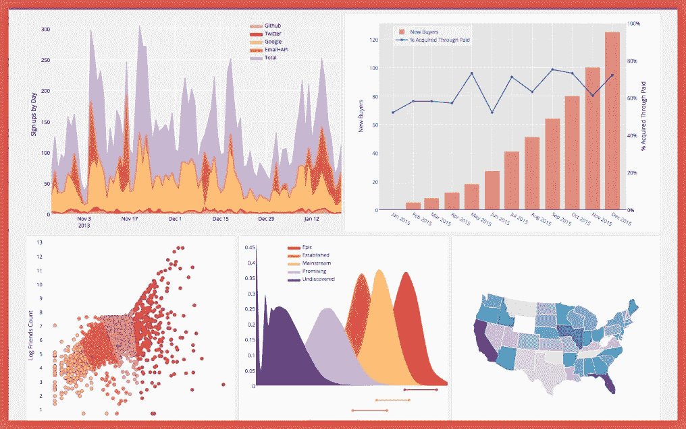

# 酒店预订需求的探索性数据分析——案例研究

> 原文：<https://blog.devgenius.io/exploratory-data-analysis-of-hotel-booking-demand-a-case-study-4a27bff589ca?source=collection_archive---------0----------------------->

> *使用 Python，Seaborn，Matplotlib，Pandas*

你有没有想过一年中预订酒店房间的最佳时间是什么时候？或者获得最佳日房价的最佳停留时间？如果您想预测一家酒店是否会收到不成比例的高数量的特殊请求，该怎么办呢？

这个项目旨在从我们拥有的数据集创建有意义的估计器，并执行探索性数据分析，以便任何希望继续使用机器学习模型的人都可以这样做。

用于该分析的数据集取自 Kaggle。你可以找到很棒的数据集来使用。Kaggle 的社区由来自世界各地的数据科学家和机器学习者组成，他们拥有各种技能和背景。你可以在这里找到数据集: [*酒店预订需求*](https://www.kaggle.com/datasets/jessemostipak/hotel-booking-demand) 。这个数据集包含一个文件，该文件比较两家酒店的各种预订信息:一家城市酒店和一家度假酒店。两家酒店都位于葡萄牙(南欧)(H1 位于阿尔加维度假区，H2 位于里斯本)。

本项目中使用的数据分析工具有 [*Numpy*](https://numpy.org/) 和 [*Pandas*](https://pandas.pydata.org/) 包，并对数据进行可视化和浏览: [*Matplotlib*](https://matplotlib.org/stable/gallery/index) 和 [*Seaborn*](https://seaborn.pydata.org/) 。

探索性数据分析的内容。

*   客人来自哪里？
*   客人每晚付多少钱？
*   一年中每晚的价格如何变化？
*   哪个月最忙？
*   人们在酒店住多长时间？
*   按市场细分的预订
*   有多少预订被取消了？
*   哪个月取消的次数最多？
*   重复客人对取消的影响。
*   在酒店度过的夜数。
*   花费时间较多的酒店类型。
*   押金对按部门取消的影响。
*   提前期与取消的关系。
*   每月客户和取消。

> 1.下载数据集

将数据集导入 Jupyter 有几种选择:

*   手动下载 CSV 并通过 Jupyter 的 GUI 上传
*   使用 urllib.request 中的 urlretrieve 函数从原始 URL 下载 CSV 文件
*   使用一个帮助程序库，例如 opendatasets，它包含一个精选数据集的集合，并提供一个用于直接下载的帮助程序功能。

我们将使用 opendatasets helper 库来下载文件。

让我们从下载数据开始，列出数据集中的文件。

数据集已下载并提取。

让我们验证数据集是否已下载到目录`hotel-booking-demand`中，并检索数据集中的文件列表。

您可以使用 Jupyter 中的“文件”>“打开”菜单选项来浏览下载的文件。数据集似乎只包含一个文件:

*   这个数据集包含一个文件，该文件比较两家酒店的各种预订信息:一家城市酒店和一家度假酒店。两家酒店都位于葡萄牙(南欧)(H1 位于阿尔加维度假区，H2 位于里斯本)。

> 2.数据准备和清理

数据准备是通过在处理和分析之前清理和转换原始数据来准备数据的过程。这是处理前的一个重要步骤，通常涉及重新格式化数据、对数据进行更正以及合并数据集以丰富数据。

数据清理是修复或删除数据集中不正确、损坏、格式不正确、重复或不完整的数据的过程。当组合多个数据源时，有很多机会出现数据重复或标签错误的情况。如果数据不正确，结果和算法是不可靠的，即使它们看起来是正确的。

让我们使用 Pandas 库加载 CSV 文件。我们将数据框命名为 hotel_raw_df，以表示这是未处理的数据，我们可能会对其进行清理、过滤和修改，以准备用于分析的数据框。

我们可以通过以下命令检查数据框中的行数和列数:

数据集包含超过 119，390 行和 32 列。这些回答已被匿名化，以删除个人身份信息。

让我们查看数据框中的列列表。

让我们来查看一些关于数据框的基本信息。

大多数列都有数据类型对象，因为它们包含不同类型的值或包含空值(NaN)。似乎有几列包含一些空值，因为几列的非空计数低于总行数(119390)。我们需要处理空值，并根据具体情况手动调整每一列的数据类型。

但是首先，让我们检查一下数据框中空值的百分比。

我们还可以检查每一列中 null 值的总数，而不是百分比。

成人、婴儿和儿童不能同时为零，所以删除同时为零的行，因为这意味着酒店/房间甚至没有预订。

我们现在已经清理并准备好了用于分析的数据集。让我们来看看数据框中的行示例。

> 3.探索性分析和可视化

在我们询问有关酒店的问题之前，了解客人的人口统计数据会有所帮助，如国家、到达日期、月份、顾客类型等。探究这些变量对于更好地理解数据是至关重要的。这种规模的调查通常会有一些选择偏差。

让我们从导入`matplotlib.pyplot`和`seaborn`开始。

# 国家

让我们看看预订总数来自的国家数量，并绘制出国家数量最多的十个国家。这也包括后来取消的预订。没问题，我们只需要看一下总体数据。

国家名称似乎是短代码，但我们通常对排名前 10 位的国家感兴趣，然后我们会将这些国家代码转换成它们各自的名称。

有多个来自同一个国家的预订，以上数据是所有预订的代表。我们需要首先检查进行预订的唯一(无重复)国家

这表明这两家酒店的预订来自总共 177 个国家。我们可以使用`value_counts`方法确定预订量最高的国家。

这向我们展示了预订最多的 10 个国家。

PRT —葡萄牙、GBR —英国、法国—法国、西班牙、DEU —德国、意大利—意大利、爱尔兰—爱尔兰、比利时、巴西、NLD —荷兰。

我们可以用条形图来显示这些信息。

但是我对结果不满意。

让我们下载另一个包含各个国家的 ISO3 代码的 CSV 文件，并将数据读入另一个 Pandas 数据框。我们会将代码与国家/地区进行匹配，并将其写回到我们的主 hotel_raw_df。

我们只对“Alpha-3 代码”一栏感兴趣，但有一个问题。这些值中似乎有双引号，如果我们试图将它们与另一个数据框匹配，这会给我们带来问题。因此，首先让我们删除双引号，然后删除不必要的列。

现在我们只剩下名为“country”的国家代码，我们可以用 hotel_raw_df 列“country”来映射它。让我们合并这两个数据帧，并将结果放入一个名为 hotel_df 的新数据帧中。

让我们再来看看这些酒店收到预订请求最多的前 10 个国家。

同样，我们可以使用条形图来显示这些信息。

来自葡萄牙的预订量似乎不成比例地高，这可能是因为酒店位于葡萄牙境内。第二个国家是英国。落后 75%。

# 乡村明智的客人

让我们来看看两家酒店总共接待的乡村游客。此处不包括取消预订的数据。

让我们来看看客人来自的前 10 个国家，看看预订数量(包括取消)和未取消预订数量的数据是否有任何变化。

正如我们可以看到的，数据中有一个微小的变化。在这张图表中，巴西无处可寻，美国在未取消预订的客人数量中排名第十。

# 客人每晚付多少钱？

让我们看看住在这些酒店的客人(在一个晚上)支付的价格。两家酒店都有不同的房间类型和不同的用餐安排。季节性因素也很重要。所以价格变化很大。由于未提供货币信息，但葡萄牙是欧洲货币联盟的一部分，我们将假设所有价格均以欧元计算。我们将只把成人和儿童视为付费客人，而不是婴儿。

由于数据集包含无限值，我们可能必须移除这些无限值才能计算平均值或最大值。在这种情况下，我用 0 替换无穷大的值。

让我们打印输出。

让我们绘制一个图表来可视化数据，并以更好的方式理解它。这一次我们将使用方框图。

该图显示了每间房的平均价格，取决于其类型和标准偏差。请注意，由于数据匿名化，不同酒店中相同字母类型的房间不一定相同。

# 一年间，每晚的价格有什么不同？

简单地说，我使用的是每晚和每人的平均价格，而不管房间类型和餐食。

让我们画一个条形图来看看偏差。

这清楚地表明，度假酒店的价格在 8 月份要高得多。那时葡萄牙有夏季。城市酒店的价格变化较小，在分别有春季和秋季的五月和九月是最贵的。

> **问答环节**

让我们问一些更具体的问题，并尝试使用数据框操作和可视化来回答它们。

**Q1:有多少客人多次取消预订？**

我们将使用 seaborn 的 countplot 来绘制这些信息。

**Q2:让我们看看人们喜欢住哪家酒店并且花更多的时间。**

我们将在工作日和周末分别对此进行检查，因为我们可能会在这里看到不对称分布。首先，让我们按细分市场绘制箱型图，我们将首先检查您的周宿时间。细分市场会告诉我们这是什么类型的停留。

现在让我们按细分市场绘制方框图，我们将检查周末住宿情况。

可见，大部分组呈正态分布，部分组偏高。从分布情况来看，可以得出结论，大多数人似乎不喜欢在酒店停留超过 1 周。但在度假酒店住宿 12-13 天似乎是正常的。尽管这根据细分市场而变化，但超过 15 天的停留时间肯定会对每个细分市场产生异常值。如果总时间特征是通过总结周末和周夜来创建的，这将会更清晰，但是当将两个可视化效果放在一起看时，就可以清楚地看到。

事实证明，航空部门的客户似乎不会住在度假酒店，他们的日均消费相对较低。除此之外，周末和工作日的平均值大致相等。由于业务原因，航空领域的客户可能会很快到达。也可能大多数机场离海有点远，最有可能靠近城市酒店。

很明显，当人们去度假酒店时，他们更喜欢呆在那里。

让我们根据市场细分分布来绘制计数图。

**Q3:押金对分段取消有什么影响。**

让我们通过取消来检查这些细分市场中的计数图分布。

当查看离线 TA/TO 和团体时，收到付款的唯一情况是团体到达的情况。为将占据酒店相当大一部分容量的相当多的客人申请押金是非常合理的。

我首先假设有押金的细分市场的取消率比没有押金的细分市场的取消率低。然而，当我们根据另一种表示来看取消时，情况似乎并非如此。

*   团体取消率大于 50%。
*   线下 TA/TOs(旅行社/旅游运营商)和线上 TA 的取消率大于 33%。
*   直达航段取消率较低。

有趣的是，尽管申请了押金，这些地区的取消率仍然很高。这种情况可以从某种程度上解释为，取消和预订一样是联合进行的。

在线预订取消率是流通活跃的动态环境的典型特征。

直接航班的取消率如此之低，这是引起我注意的另一个问题。在人们一对一交谈的情况下，我相信此时已经建立了一种相互信任的关系。我不会在这个问题上停留太久，但我相信有心理因素在起作用。

**Q4:提前期与取消有什么关系？**

我们将通过取消绘制提前期的密度曲线。

当提前期超过 60 小时，客人会频繁取消预订(取消率会更高)。此外，人们希望他们的假期或工作计划以 100 天或 50%的数据来计算。

**问题 5:每个酒店每月接待多少顾客？**

第一张图表显示城市酒店全年接待更多的客人。当比较比例时，度假酒店似乎在夏天更接近城市酒店。

哪几个月最忙？

城市旅馆在价格最高的春季和秋季游客会有所增加。七八月份来的人比较少，那时候价格还比较低。

从 6 月到 9 月，当价格达到最高点时，入住度假酒店的客人会减少。冬季吸引的游客最少。

**Q7-有多少预订被取消？**

# 推论和结论

我们从调查中得出了许多推论。以下为部分选择的总结:

*   来自葡萄牙的预订数量似乎偏高，这可能是因为该酒店位于葡萄牙境内。第二个国家是英国，大约落后 75%。
*   从所有未取消的预订中，所有房型和餐食的平均价格为:-度假酒店:每人每晚 47.56 €。—城市酒店:每人每晚 59.29 €。
*   度假酒店的价格在 8 月份要高得多。那时葡萄牙有夏季。城市酒店的价格变化较小，在分别有春季和秋季的五月和九月是最贵的。
*   反复光顾的客人不会取消他们的预订。当然也有一些例外。而且大多数顾客都不是回头客。
*   大多数人似乎不喜欢在酒店停留超过 1 周。但在度假酒店住宿 12-13 天似乎是正常的。尽管这根据细分市场而变化，但超过 15 天的停留时间肯定会对每个细分市场产生异常值。
*   来自航空细分市场的客户似乎并未入住度假酒店，且日均费用相对较低。
*   周末和工作日的平均值大致相等。
*   由于业务关系，航空领域的客户可能很快就会到来。也可能大多数机场都离海有点远，而且最有可能离城市酒店更近。
*   团体退保率大于 50%。
*   离线 TA/TOs(旅行社/旅行社)和在线 TA 的取消率超过 33%。
*   直接部分的取消率较低。
*   当准备时间超过 60 分钟左右时，客人会经常取消他们的预订(在此之后取消率会更高)。此外，人们希望他们的假期或工作计划可以用 100 天或 50%的数据来计算。
*   城市酒店全年接待更多的客人。相比之下，夏季度假酒店似乎与城市酒店的距离略近。
*   城市酒店在春季和秋季的游客数量有所增加，而这两个季节的房价也是最高的。价格仍然较低的 7 月和 8 月到达的人较少。
*   从 6 月到 9 月，当价格达到最高点时，入住度假酒店的客人会减少。冬季吸引的游客最少。

# 参考文献和未来工作

查看以下资源以了解有关此笔记本中使用的数据集和工具的更多信息:

*   右数据右图表:[https://medium . com/@ entango/right-chart-for-right-data-c 070 e 5 fcf 9 c 9](https://jovian.ai/outlink?url=https%3A%2F%2Fmedium.com%2F%40entango%2Fright-chart-for-right-data-c070e5fcf9c9)
*   熊猫用户指南:【https://pandas.pydata.org/docs/user_guide/index.html 
*   Matplotlib 用户指南:【https://matplotlib.org/3.3.1/users/index.html 
*   Seaborn 用户指南&教程:[https://seaborn.pydata.org/tutorial.html](https://jovian.ai/outlink?url=https%3A%2F%2Fseaborn.pydata.org%2Ftutorial.html)
*   opendatasets Python 库:[https://github.com/JovianML/opendatasets](https://jovian.ai/outlink?url=https%3A%2F%2Fgithub.com%2FJovianML%2Fopendatasets)