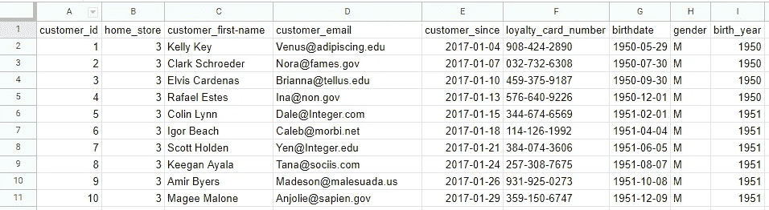
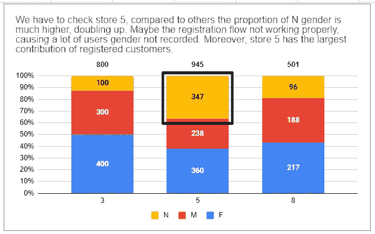
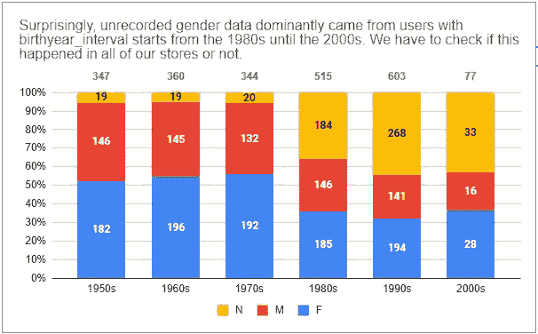
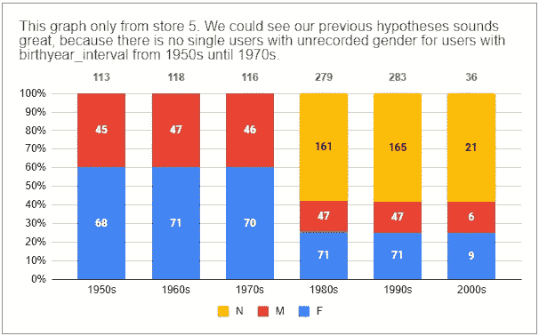
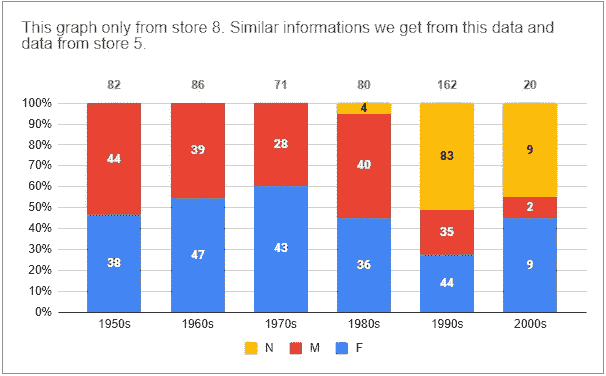
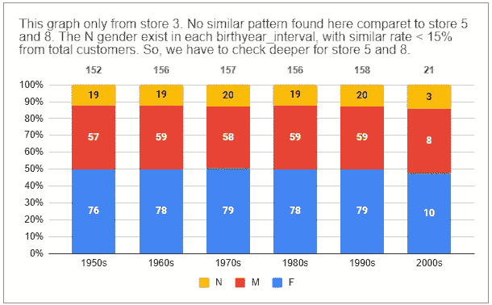
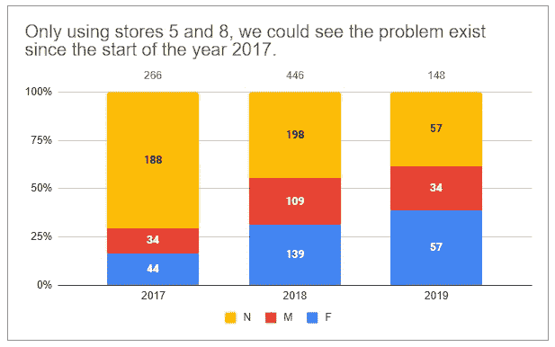
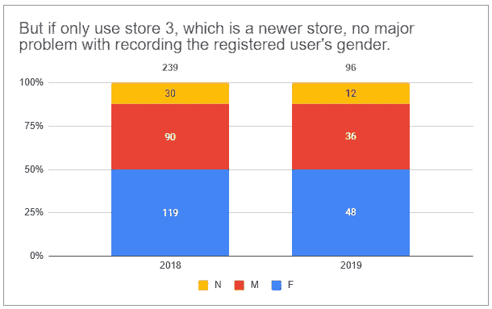
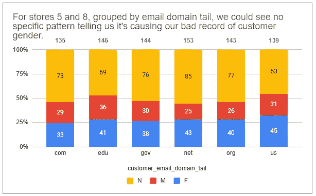
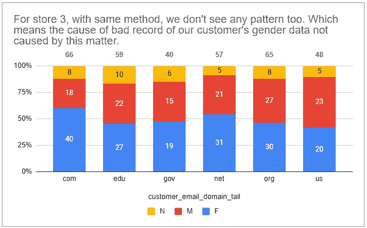

# 使用 Google 电子表格对 Kaggle 的 customer.csv 文件进行探索性数据分析

> 原文：<https://blog.devgenius.io/exploratory-data-analysis-on-customer-csv-file-from-kaggle-using-google-spreadsheets-f8239aa55c96?source=collection_archive---------5----------------------->

嗨，在这篇文章中，我想做基本的探索性数据分析，通常称为 EDA。我希望通过阅读这篇文章，你可以知道当你在未来面对一些原始数据时，你可以做什么，你想探索它。

由于我的任务是为我周围的人提供人性化的数据分析，我将使用谷歌电子表格，假设它是一个比使用 R 或 Python 更常见的工具。我会在另一个机会使用另一个工具做类似的事情。现在，让我们继续吧！

# 首先要做的是，获取数据

我们可以在 [Kaggle](https://www.kaggle.com/) 中获取数据，具体是在这个[页面](https://www.kaggle.com/datasets/ylchang/coffee-shop-sample-data-1113)上。下载之前，不要忘记登录您的帐户。或者，您可以直接进入[这里](https://docs.google.com/spreadsheets/d/10j7K6T_bpE3ZOrdxO99XpFXKx_kIwORex2GhegiG4ec/edit?usp=sharing)并复制文件，这样您就可以尝试进行自己的 EDA。

# 第二件事第二(bruh？)，定义了数据

图一。[客户数据](https://docs.google.com/spreadsheets/d/10j7K6T_bpE3ZOrdxO99XpFXKx_kIwORex2GhegiG4ec/edit?usp=sharing)前 10 行截图。

在开始研究数据之前，我们必须知道数据中每一列的定义是什么。

1.  `customer_id`注册的客户标识符，每行唯一。数据类型:整数。
2.  `home_store`客户注册的商店标识符，对于每一行可能不是唯一的(因为不同的客户可能在同一家商店注册)。类型:整数。
3.  `customer_fist-name`注册客户的名字，每行可能不唯一(因为不同的客户可能有相同的名字)。数据类型:字符串。
4.  `customer_email`注册客户的电子邮件地址，每行唯一。数据类型:字符串。
5.  `customer_since`客户的注册日期，每行可能不唯一(因为不同的客户可能在同一天注册)。数据类型:日期。
6.  `loyalty_card_number`注册客户的积分卡号，每行唯一。数据类型:字符串。
7.  `birthdate`注册客户的出生日期，每行可能不唯一(因为不同的客户可能有相同的出生日期)。数据类型:日期。
8.  `gender`注册客户的性别，每行可能不唯一(因为不同的客户可能有相同的性别，在本文件中，只有 M 代表男性，F 代表女性，N 代表不可用)。数据类型:字符串。
9.  `birthyear`注册客户的出生年份，可能不是每行唯一的(因为不同的客户可能有相同的出生年份)。数据类型:整数。

在定义了数据之后，我们还必须定义我们想要研究的问题。假设我们想知道这个数据集的基本概要。

将`customer_id`与另一个专栏结合起来可以告诉我们:

1.  我们有多少注册客户？
2.  店铺分布怎么样，根据注册客户数有没有喜欢的店铺？
3.  客户最常用的电子邮件域是什么？
4.  我们的注册客户数量的增长率是多少？
5.  来自我们注册客户的性别比例是多少？

使用类似的框架，我们可以为其他变量创建一些问题。但在这种情况下，我们希望根据我们的数据来确定是否存在任何问题。无论我们能发现什么问题，对我们的团队来说都是很好的额外信息。

# 数据清理和操作

我对该数据集进行的一些数据清理和操作如下:

## `birth_year_interval`

通过使用`birth_year`,我们可以很容易地创建一个新的变量，并使用“IF”公式对其进行分组。在我的例子中，我使用了这样一个公式:

> =IF(I2 < 1960, ”1950s” , IF(I2 < 1970, ”1960s”, IF(I2 < 1980, ”1970s”, IF(I2 < 1990, ”1980s”, IF(I2 < 2000, ”1990s”, ”2000s”)))))

## 【

By using 【 we could easily create a new variable to group it by using the “IF” formula. In my case, I’m using a formula like this:

> =IF(YEAR(E2) = 2017, 2017, IF(YEAR(E2) = 2018, 2018, 2019))

## 【

By using 【 we could easily create a new variable to group it by using the “SPLIT” formula. In my case, I’m using a formula like this:

> =SPLIT(D2, ”@”)
> 
> =SPLIT(M2, ”.”)

> We could do more than this. Any data manipulation you think is needed to explore our dataset better?

# Data exploration and visualization

Please check on the sheet with the name 【 . The common thing to do is to create a pivot table. How to create a pivot table in Google Spreadsheets as simple as this:

> Insert >数据透视表>数据区域>新工作表>创建

旋转数据集后，我们可以进行一些数据聚合，直到我们可以在[这里](https://docs.google.com/spreadsheets/d/10j7K6T_bpE3ZOrdxO99XpFXKx_kIwORex2GhegiG4ec/edit#gid=30196051&range=A1:E6)获得数据，然后像这样可视化它:

图二。按 home_store 和性别显示注册顾客的数量。

正如我们所看到的，在做了一点 EDA 和可视化之后，我们已经获得了可能对我们有用的见解，但我们仍然需要看得更深，也许我们可以找到原因或证明问题的存在。下面我们将使用我们的`birth_year`数据来得到`birthyear_interval`，这样我们就可以将[进行更简单的分组](https://docs.google.com/spreadsheets/d/10j7K6T_bpE3ZOrdxO99XpFXKx_kIwORex2GhegiG4ec/edit#gid=30196051&range=A20:E28)。

图 3。通过生日间隔和性别可视化注册客户的数量。

图 4。通过 brithday_interval 和性别可视化注册客户的数量。由商店 5 过滤。

图 5。通过 brithday_interval 和性别可视化注册客户的数量。由商店 8 过滤。

图 6。通过 brithday_interval 和性别可视化注册客户的数量。由商店 3 过滤。

哇，我们正在做，我们得到了另一个信息，知道什么是主要原因。目前我们所知道的是 N 个性别数据，主要由在商店 5 和 8 注册的用户提供，标准`birthday_interval`在 20 世纪 80 年代和 2000 年代之间。让我们看看从我们的数据集中，我们可以使用哪些其他变量来深入了解原因。

图 7。注册时按性别和年份可视化注册用户数。过滤器:仅存储 5 和 8。

图 8。注册时按性别和年份可视化注册用户数。过滤器:仅存储 3。

> 我们可以假设商店 5 和 8 从一开始就有这个问题，但商店 3 是一个较新的商店，没有这个问题。可能是我们“旧”店的登记程序没有遵循新店实施的最新程序，导致顾客的性别没有正确记录。

但是，我们还有另一个问题，那就是:

> 为什么只有出生年份在 20 世纪 80 年代和 21 世纪初之间的客户？

图 9。可视化的注册客户数量，按性别和客户电子邮件域尾分组。筛选器:存储 5 和 8，birthyear _ interval 世纪 80 年代到 2000 年代。

图 10。可视化的注册客户数量，按性别和客户电子邮件域尾分组。筛选器:store 3，birthyear _ interval 世纪 80 年代到 2000 年代。

正如我们所看到的，对于出生年份在 20 世纪 80 年代和 21 世纪初的客户来说，没有特定的客户电子邮件域尾部模式是他们首选的。这意味着我们必须寻找另一个可能是主要原因的变量。

> 但是我们意识到我们还有其他变量没有检查，你会尝试做一些 EDA 来寻找主要原因吗？如果检查后我们仍然找不到它，在您看来，我们需要收集哪些数据来获得与此事相关的更多见解？

# 数据显示

在与他人分享之前，我们可以使用谷歌幻灯片将我们所有的发现放入一个大的幻灯片演示中。请在这里找到我以前的帖子[，它可能对你创建数据演示有用。](https://ichkautzar.medium.com/basic-data-analysis-knowledge-you-have-to-understand-measures-of-central-tendencies-mct-4d4195a6859)

# 关闭

这就是我现在的帖子。我希望你喜欢阅读这篇文章，直到完成，并从这个基本和简单的 EDA 中学到一些新的东西。如果您对我们如何做得更好有任何想法，请提出您的想法！下次见，数据分析专家们，再见！:D