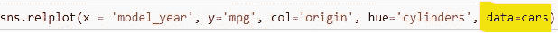
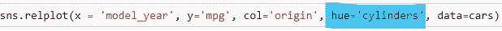
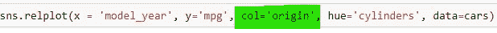
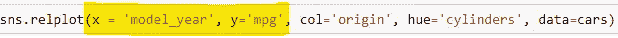

# 使用 Seaborn 进行探索性数据分析:第 1 部分——Seaborn 简介

> 原文：<https://blog.devgenius.io/exploratory-data-analysis-using-seaborn-part-1-introduction-to-seaborn-3549f6505b26?source=collection_archive---------1----------------------->

来自 [Datameer](https://www.datameer.com/blog/data-visualization/) 的特色图片

我打算呈现给大家的这个 Seaborn 系列，就是从这篇文章开始的。本系列中的文章将关注一个方面或一种故事，它不同于您可能已经看过的其他 Seaborn 系列中的故事。幻灯片将用于解释和说明每个主题，代码屏幕共享将展示 Seaborn 的选项和语法，样本视觉效果将展示 Seaborn 的潜力。我们将深入细节，对 Seaborn 图书馆中的每个情节进行彻底的调查。

首先，让我们向您介绍 Seaborn 本身，我们将从三个方面进行介绍。

*   **安装导入***——如何安装 Seaborn 并让它启动运行。*
*   **更新 Matplotlib***—Seaborn 与 Matplotlib 的对比。*
*   **Seaborn 与熊猫***——Seaborn 与熊猫如何互动。*

**注:** *在本文中，我将描述什么是 seaborn，并讨论 seaborn 安装。我比较一下****seaborn vs matplotlib****并解释 seaborn* ***如何更新*** *matplotlib 的 rcParams。我还向你展示了如何使用海洋生物和熊猫。*

> **安装和导入-**

1.  **安装**——要使用 Seaborn 库，您首先需要安装它，这样您就可以通过安装 **anaconda** (seaborn 自带)来获得它，或者您可以在命令行中键入 **pip install seaborn** 并点击 enter。
2.  **导入—** 一旦安装了 seaborn 库，您将需要在您正在处理的任何 Python 脚本中导入该库。我经常在 Jupyter notebook 中工作，但是当然，你也可以在 Python 脚本中这样做。我经常将 seaborn 库别名为 sns，所以你会在我的大部分代码中看到 **import seaborn as sns** 然后每当我需要引用那个 seaborn 库时，我就可以写 sns。

让我们检查一些 seaborn 代码，但我们将首先从 matplotlib 开始。先从导入开始吧。

#让我们创建两个名为 x 和 y 的随机列表

#现在让我们调用 plt 并绘制数据点。

在这里你可以看到，我们只有这些数据点的线条。

> **更新 Matplotlib -**

关于 Seaborn 的好处是，只需导入 Seaborn 并更新您的设置，您就可以让这个图形看起来更好一些，所以让我们来看看实际情况。

#我通常会给它起一个别名，这样以后当我想提到 seaborn 时，我会直接调用**‘SNS’。**

#现在我要设置社交网络

#现在让我们再次调用 plot 函数。

我们可以看到，在我看来，图形明显更好了，因为使用 **set()** 函数，我们改变了几个不同的因素，比如设置我们的风格为深色网格，我们的配色方案，我们的字体，等等。Matplotlib 提供的设置已经被修改为这些更好的默认设置，Seaborn 允许您访问几种不同的样式。

#我们还可以检查 matplotlib 和 seaborn 版本:

让我们深入一点。

*   **问题 Seaborn 是如何更新 matplotlib 数据的？**
*   **回答—** Seaborn 更新 matplotlib **rc 参数。**术语“ **rc** ”代表运行命令。当您创建新图形时，这些默认设置将被初始化。因此，Seaborn **修改了**的一些默认设置，比如**的背景颜色、网格颜色、字体大小**等。你可能听说 Seaborn 是 matplotlib 的**包装器，这仅仅意味着 Seaborn**构建在 matplotlib 代码**之上，但是给了你**额外的功能**，更好的语法，更好的默认值。然而，它从 matplotlib 继承了许多代码，所以您可以继续使用许多 matplotlib 代码来更新您的 Seabourn 图形。**

> **与熊猫一起出生的海洋-**

Seaborn 可以对你的熊猫数据帧进行分组、聚合和绘图。

让我们从 seaborn 库中加载一些样本数据，并显示一些行。Seaborn library 预装了一些数据集。您可以通过以下方式检查预加载的数据集

在我们的例子中，我们将使用“mpg”数据集。我们可以通过下面的命令加载数据集。

#如果我们检查这个对象的类型，那么我们可以看到它是一个数据帧，我们可以执行几个数据帧函数。

**注意:*如果你想知道更多关于熊猫的事情，以及我们可以用它做什么，请在这里查看我的熊猫文章:*** [熊猫——数据科学和机器学习项目的完整指南](/pandas-a-complete-guide-for-data-science-and-machine-learning-projects-8d042751ef53?source=your_stories_page-------------------------------------)

让我们来看看这个数据帧的前五行。

为了方便起见，我将删除包含缺失/空值的行。让我们也检查一下数据帧中的行数和列数。

数据帧包含超过 392 行和 9 列。这个数据帧中的每一行都与一种特定类型的汽车有关，我们在数据帧中有关于这些汽车的各种统计数据。

让我们使用 seaborn 的**关系图**，它被称为 **relplot** (在以后的文章中会有更多关于这个图的内容)。对于本文，只需看一下语法。

只考虑剧情。提供整个数据帧的好处是，我现在可以让 Seaborn 按照我的指示来划分我的数据。所有这一切都是自动完成的，包括根据原产国将数据绘制成不同的列，并根据每辆车的气缸数量对每个点进行着色。这证明了 Seaborn 的图书馆是多么有效。

Seaborn 命令绘制一个图形

*   在这里，我们以熊猫数据帧'**汽车**的形式传递数据。

Seaborn 命令绘制一个图形

*   我们根据一辆汽车的汽缸数量来给数据点着色。

Seaborn 命令绘制一个图形

*   我们将为汽车生产的每个国家绘制不同的图表。这就是为什么我们把圆柱作为原点。在我们的数据框架中，我们只有三个生产汽车的国家，因此我们将得到三幅图。

Seaborn 命令绘制一个图形

*   我们希望在 x 轴上显示汽车的制造年份，在 y 轴上显示 mpg(每加仑英里数)。

这标志着本文的结束。谢谢你一直读到最后。如果您有任何问题，请留言或评论。

请继续关注下一篇文章，因为我将会详细报道整个 Seaborn 图书馆。请随意留下你的任何建议。