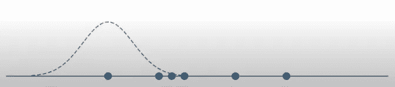

# 使用 Seaborn 的探索性数据分析:第 2 部分——核密度估计图(KDE)

> 原文：<https://blog.devgenius.io/exploratory-data-analysis-using-seaborn-part-2-kernel-density-estimation-plot-kde-6087a8552cd0?source=collection_archive---------3----------------------->

图片由 [Boost Labs](https://www.google.com/url?sa=i&url=https%3A%2F%2Fboostlabs.com%2Fblog%2F10-types-of-data-visualization-tools%2F&psig=AOvVaw1N91xEpKH12julJQG1idbu&ust=1665490832815000&source=images&cd=vfe&ved=0CA0QjhxqFwoTCKCSkf7S1foCFQAAAAAdAAAAABAJ) 提供

这是 Seaborn 系列的第二篇文章。如果你还没有看过我这个系列的第一篇文章，可以看看这里: [**使用 Seaborn 的探索性数据分析:第一部分——Seaborn**简介](/exploratory-data-analysis-using-seaborn-part-1-introduction-to-seaborn-3549f6505b26)

在这篇文章中，我们将深入探究 KDE 的阴谋。KDE 代表**核密度估计。**

**目录:**

1.  **KDE**
2.  **什么是 KDE？**
3.  KDE 是如何工作的？
4.  **单变量 KDE**
5.  **什么是带宽？**
6.  **双变量 KDE**

让我们假设你有一些数据，看起来像下面的快照。

随机数据洞察

为了理解这些数据的底层分布，您必须首先了解它。我们可以生成一个直方图，然后将数据分成多个区间，并计算每个区间中有多少个值。

柱状图

但是我们也可以用所谓的 **KDE** 或**核密度估计来创建这个直方图的平滑连续版本。下面是例子。**

KDE 图

> 什么是 KDE？

KDE，或核密度估计，使我们能够从我们有限的数据集估计概率密度函数。由于这种估计是非参数的，它不需要我们对数据的分布做任何假设。

让我们更深入地了解它到底是如何工作的。

> KDE 是如何工作的？

构建一个 **KDE** 的情节真的相当容易；我们将从一组有限的数据开始。

数据点

这里我只有六个数据点，当然你可以有更多。现在我们将为每个数据点添加一个以每个数据点为中心的小内核，如下所示。

第一个数据点的核心居中

第一个和第二个数据点的核心居中

第一、第二和第三个数据点的内核居中

第一、第二、第三和第四个数据点的内核居中

第一、第二、第三、第四和第五个数据点的内核居中

所有数据点的核心居中

现在，我们需要做的就是把这些加在一起。

KDE 第一

当第一个和第二个结合时的 KDE

当第一、第二和第三个连接时的 KDE

当第一、第二、第三和第四连接时的 KDE

当第一、第二、第三、第四和第五连接时的 KDE

当所有人都加入时，KDE

你可以看到，当我们把它们加起来，我们越来越接近一个概率密度函数，最终结果将是我们的核密度估计。下面是最终结果。

KDE 图

我刚才展示的例子中，我使用了高斯核，但你也可以使用三角形核，或者余弦核。事实证明，只要你有足够的数据，你使用的内核类型并不重要。Seaborn 的默认值将是高斯内核。

现在让我们进入 Seaborn 代码，看看我们将如何得到这个图。我们将从**单变量 KDE 图**开始。

我们将从导入库 **pyplot** 和 **seaborn** 开始，并给它们起别名。然后，从 seaborn 加载一些数据后，让我们删除一些空值/缺失值(如果存在的话)。

这个数据集是关于汽车的，所以我们看到我们有关于各种汽车的各种不同的统计数据。出于演示的目的，让我们继续看看 KDE 的情节是如何工作的。

> **单变量 KDE 图**

单变量 KDE 只适用于一个变量，这意味着我们只用一个变量来绘制 KDE 图。

现在，我们有了数据集中马力的核密度估计图。

这个图让我们对这些车的马力有个大概的了解。大多数汽车的马力在 80 左右，但也有一些汽车超过了 150。

参数

注意:*我们可以使用任何 numpy 数组、Pandas 系列或列表来代替马力。*

让我们来看看 seaborn 的几个可供我们利用的选项。

**底纹-**

这是为了美观，如果我们想在 KDE 图下面加阴影，我们可以将参数 *shade=True* 。

> **什么是带宽？**

带宽对我们的计划有很大的影响。这是一个非常强大的参数。让我们看看带宽能做什么的例子。

如果你开始减少带宽，你的 KDE 的方差将简单地上升；相反，如果您过度提高带宽，曲线将开始变平，您甚至可能错过数据集中的模式，特别是如果您有许多峰。

既然我们已经看到了 seaborn 可以对一维(单变量)数据做什么，让我们看看如何以及何时使用**双变量 KDE** 。

> **二元 KDE 图**

在这种情况下，我们要估计二维数据中'**马力'**'和' **mpg '** '的联合概率密度函数。

Seabourn 的**双变量** KDE 图允许您创建代表数据的各种不同密度水平的等高线，以便您可以估计联合概率密度函数。

多元示例

注意:*你可以认为这些环是从页面中出来的，密度最高的靠近你，密度最低的靠近背景。*

让我们来看看 Seaborn 代码。

为了构建二元或二维 KDE 图，我们将遵循与一元示例类似的代码，除了现在不只是传递'**马力'**，我们还将传递'**每加仑英里数(mpg)”。**

因为我现在已经将两个不同的系列传递给了 KDE 图，它现在应该绘制二元图，而不是一元图。

让我们来看看 seaborn 的几个可供我们利用的选项。

1.  **增加等级-**

也许你想有更多的环或更多的水平。让我们增加一点。可以通过访问参数' ***n_levels*** '来实现

现在，您可以看到关于这些不同密度环的位置的更多粒度，如果您愿意，当然可以减少粒度。

2.**阴影版本-**

这个图也可以变成阴影形式，而不仅仅是简单的线条。

我们可以做的另一件事是，现在你有各种不同的颜色代表各种不同的密度水平，如果你想看看这些密度代表什么，你还可以包括一个颜色条。我们只需使用' **cbar** '参数并将其设置为 true。

3.**不同气缸使用不同颜色-**

请注意，这里有五个不同的圆柱体。

我们可以用两种不同的颜色来表示 8 缸车和缸车，并用 seaborn 来绘制它们，并观察它们的分布。让我们开始吧。

#让我们根据汽缸来区分汽车

这标志着本文的结束。谢谢你一直读到最后。如果您有任何问题，请留言或评论。我想把这里使用的截图归功于:[金伯利·费塞尔](https://www.youtube.com/c/KimberlyFessel)。除了截图，其余的代码完全是我的作品。

请继续关注下一篇文章，因为我将会详细报道整个 Seaborn 图书馆。请随意留下你的任何建议。

谢谢大家！