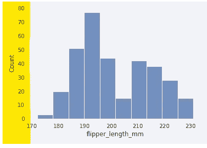

# 使用 Seaborn 的探索性数据分析:第 3 部分—直方图(histplot)

> 原文：<https://blog.devgenius.io/exploratory-data-analysis-using-seaborn-part-3-histogram-plot-histplot-38b7121cc69?source=collection_archive---------2----------------------->

图片由 [XpertUp](https://www.xpertup.com/blog/data-science/data-visualization-using-seaborn-part-1/) 提供

这是 Seaborn 系列的第三篇文章。如果你没有看过我这个系列的其他文章，可以看看这里:

**第一部分:** [**使用 Seaborn 的探索性数据分析:第一部分——Seaborn 简介**](/exploratory-data-analysis-using-seaborn-part-1-introduction-to-seaborn-3549f6505b26)

**第二部分:** [**使用 Seaborn 的探索性数据分析:第二部分—核密度估计图(KDE)**](/exploratory-data-analysis-using-seaborn-part-2-kernel-density-estimation-plot-kde-6087a8552cd0)

在本文中，我们将深入探究 **histplot** 。Seaborn 有新的剧情版本，histplot 就是其中之一。

**目录:**

1.  Histplot 基础知识。
2.  **统计。**
3.  **分类变量。**
4.  二元统计图。
5.  **造型。**

我们将从导入库 **pyplot** 和 **seaborn** 并给它们起别名开始。然后，从 seaborn 加载一些数据后，让我们删除一些空值/缺失值(如果存在的话)。

我们将从加载 seaborn 库的一些数据开始。这些数据是关于企鹅的，所以我们对不同种类的企鹅有不同的测量方法。

> **历史图基础**

让我们看看如何建立一个 histplot。但首先，让我们设置一些造型。

正如您将看到的，创建一个单变量 KDE 图与此非常相似。我们用企鹅的数据图表绘制了企鹅鳍状肢的长度。

创建历史图的另一种方法是可能的。整个企鹅的数据集可能会在数据输入中发送，然后我们可以只提供我们想要在 x 轴上描绘的列。***flipper _ length _ mm*'**将在 x 轴上通过。这里有一个例子。

这里我们画了横线。如果我们想要绘制竖线，我们将把***flipper _ length _ mm***传递到 ***y 轴*** 上。

我们甚至可以将 **KDE** 图放在直方图的顶部，只需将‘kde’设置为 true。

默认情况下，Seaborn 会尝试确定您的数据可以接受多少个箱，但如果您想要更改，我们有一个名为' ***箱*** '的参数，它接受一些不同的东西。让我们先设置“bins = 20”，然后检查结果。

这将在我们的范围**(170–230)**内创建 20 个等间距的独立仓，我们在这里可以看到这个近似分布的更细粒度视图。

如果出于某种原因，您有一个非常具体的位置，您希望这些条块出现在那里，您也可以在' ***条块* '** 参数中传递一个列表，其中每个数字是直方图条块的开始和停止位置。

这里还有两个非常有用的论点。我们先来看看' ***binwidth*** '。

我已经将'***【bin width '***设置为 10，这样做的目的是现在每个 bin 的宽度正好是 10 个单位，所以这可能是有用的，因为现在我的 bin 在途中每 10 个单位停止一次。

假设你心中有一些开始和结束值。我们可以将它放入我们的 bin 范围，并制作我们的绘图。

在此帮助下，我们可以有明确定义的开始和停止值。

> **统计数据**

除了箱和添加一个 **KDE** 之外，您还可以选择更改显示在您的 ***y 轴上的统计数据。***

histplot 也带有这个新的 stat 参数。默认情况下，stat 设置为**计数**。

Stat 设置为在 y 轴计数

在 y 轴上绘制的是，我们实际上有一个计数，我们在每个箱子的每种鳍状肢长度下看到了多少只企鹅，但是我们可以改变我们在 y 轴上绘制的统计数据。

我们有多种选择来传递 stat 参数。我们可以设置***stat =‘密度’。***

当 stat 设置为'***' density '***'时，我们要做的是模拟一个概率密度函数，这意味着对于每一个条形，如果我们实际上用密度标尺中的高度乘以条形的宽度，然后将所有这些条形相加，我们最终应该得到一个值。因此，如果你想看到概率密度函数的表示，你可以切换到这个密度。

您可以在这里访问的另一个统计数据是' ***概率*** '。

如果我们现在将 stat 切换到 probability，我们会看到每一个柱都代表一只企鹅在特定桶中结束的概率，所以现在所有这些柱的高度总和应该是 1，因为我们在处理概率空间。

> **分类变量**

1.  **色相:**

如果你想像其他 seaborn 图一样用分类变量分割你的数据，那么这个图也接受名为' ***色调*'【T7]的参数，你想在这里传递的只是包含你的分类数据的列的名称。**

这将按色调列分割数据，您将看到该列中每个不同的值对应一种不同的颜色。

如果你发现你们组的分布有很多重叠，你有几个不同的选择。

**元素:**

第一个选项是更改' ***元素'*** 参数，这样我们就可以将该元素切换到' ***步骤*** *'* ，而不是使用默认的条，这样我们就可以看到直方图的轮廓了。让我们来看看。

这有时更容易区分你的类别的不同层次。

你也可以选择将这个' ***'元素'*** 参数设置为' ***'多边形'*** ，这将产生漂亮的多边形。

因此，这里我们已经平滑了直方图的外观，这有助于区分不同的类别层。

**多个:**

另一个可以帮助你区分这些不同类别的论点叫做' ***倍数'。***

默认为'**层**'。这些类别中的每一个都在另一个之上。

如果我们愿意，我们可以改变它。让我们把它切换到堆栈。

现在，如果我们在考虑在 y 轴上计数，seaborn 正在计算每个桶里出现了多少只企鹅，然后把它们一只接一只地堆叠起来。

> **二元直方图**

为了构建一个**双变量直方图**，我们需要两个不同的变量，我们还将使用颜色来表示计数。为此，我们需要做的就是传入一个' *x* 和一个' *y'* 值。

***x 轴*** 将是我们的' ***账单长度*** *'* 列，而' ***y 轴*** '将是我们的' ***账单深度*** 列。

现在我们在 *x 轴*上有了共同的长度，在 *y 轴*上有了深度，在中间，我们已经切换到一个热图，这样我们就可以看到 *x* 和 *y* 的值通常落在哪里。

我们还可以添加一个颜色条来理解这些值代表什么，就像我们在 **KDE 图中所做的那样。**我们可以设置 **' *cbar=True* '。**

这很好，因为现在我们可以将我们看到的所有颜色精确地映射到数量上。我们仍然可以根据企鹅的性别来划分这些数据。

**注意:** *我要提醒你的是，如果这些分布是重叠的(它们肯定是重叠的)，你将看不到这些重叠。*

> **造型**

像大多数 seaborn 地块一样，有许多不同的方式来设计 histplot。让我们来看看其中的一些。

**收缩—**

在这个 histplot 中，我们有鸟类的 ***物种*** 和 ***性别*** ，我们使用 ***减淡*** 属性来绘制这个图。

这将给我们提供各种各样的柱状图，从中我们可以看到每个物种有多少雄性和雌性。

但默认情况下，这里发生的是，所有的酒吧运行到对方，而且我们没有任何不同物种之间的差距。

我们可以使用' ***shrink '属性*** ，它基本上只是将那些条缩小。

现在我们确实看到了这些条之间的间隙。

**颜色—**

我们还可以将直方图的颜色设置为我们选择的单一颜色。

**调色板—**

如果你有多种不同的颜色被绘制出来，你会想要使用一个' ***调色板* '** 选项，有这么多不同的调色板，你可以从中选择一个对你的审美有意义的。

**填充—**

seaborn 库也有一个用于 histplot 的' ***【填充】'*** 选项。如果我们不想看到条被填充，或者当我们只想看到条的轮廓时，我们可以使用这个。

**注意** : *histplot 从 matplotlib 继承了很多东西，所以这取决于你使用的是什么。与双变量图相比，单变量图可能有某些不同的参数。*

这标志着本文的结束。谢谢你一直读到最后。如果您有任何问题，请留言或评论。我想把这里使用的截图归功于:[金伯利·费塞尔](https://www.youtube.com/c/KimberlyFessel)。除了截图，其余的代码完全是我的作品。

请继续关注下一篇文章，因为我将会详细报道整个 Seaborn 图书馆。请随意留下你的任何建议。

谢谢大家！