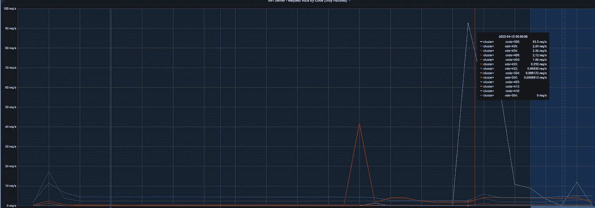

# 探索 API 优先级和公平性，以减轻 APIServer 的负载

> 原文：<https://blog.devgenius.io/explore-api-priority-and-fairness-to-ease-the-load-of-the-apiserver-a4fe9c4e7174?source=collection_archive---------4----------------------->

## 使用 APF 完成事故补救


来自 Unsplash， [@aaroncwu](https://unsplash.com/photos/_8rjlHwN4uk)

Kubernetes 用它的特性大大减轻了我们处理成千上万个节点的服务的负担，其中一个特性是它可以自动将资源从故障恢复到最终的一致性，也就是说，在一些 Pods 或其他资源暂时不可用的场景下，Kubernetes 支持它们保持协调，直到它们最终恢复正常。

由于 Kubernetes 的[控制器机制](https://kubernetes.io/docs/concepts/architecture/controller/)不断与 APIServer 和`etcd`交互，运维压力得到缓解。然而，如果使用不当，它会将集群推向“悬崖”,例如通过不断地列出/查询资源来拖垮 APIServer，最终引发一场[雷鸣般的群体](https://en.wikipedia.org/wiki/Thundering_herd_problem)风暴。

看一个 APIServer 错误请求监控感受一下“悬崖”:APIServer 在某一点上不堪重负，对大量请求返回 5xx，4xx。



是什么引发了这一事件？

根是命名空间范围的运算符的升级。集群中有 5000 多个名称空间，每个名称空间都有一个对应的 Pod，因此运营商的升级会重启所有 Pod 并触发不间断的协调，发出大量的`List`请求，最终重创 APIServer。


# Kubernetes 限速解决方案

为了避免这样的突发事件，Kubernetes 提供了一些保证 APIServer 可用性的方法，即**限速**。

*   [**maxinfolightlimit**](https://pkg.go.dev/k8s.io/kubernetes/pkg/apiserver#MaxInFlightLimit)。通过设置并发请求的最大值来限制 APIServer 的整体流量:在启动 APIServer 时设置`--max-requests-inflight`和`--max-mutating-requests-inflight`标志。
*   [**EventRateLimit**](https://kubernetes.io/docs/reference/access-authn-authz/admission-controllers/#eventratelimit)，只限制事件。在 [1.13](https://kubernetes.io/docs/reference/access-authn-authz/admission-controllers/#eventratelimit) 中引入，应用 webhook 来限制用户、命名空间等事件操作。

```
**apiVersion**: eventratelimit.admission.k8s.io/v1alpha1
**kind**: Configuration
**limits**:
- **type**: Namespace
  **qps**: 50
  **burst**: 100
  **cacheSize**: 2000
- **type**: User
  **qps**: 10
  **burst**: 50
```

*   **客户费率控制。**客户端，限制速率。例如，默认的 client-go [速率限制](https://github.com/kubernetes/client-go/blob/acab036eff5706db06b4eb79253165cf4be0d9c5/util/workqueue/default_rate_limiters.go#L43)是 10 qps 和 100 桶大小。当然，服务器不能受到影响，如果集群中有 100 多个 client-go 工具，这将会失去控制。
*   [**API 优先级和公平性**](https://kubernetes.io/docs/concepts/cluster-administration/flow-control/) (APF)，支持更细粒度的流量控制。是 1.18 新增的，是**maxinfolightlimit**的升级版。

# 耐酸地板（acid proof floor 的缩写）

APF 弥补了`MaxInFlightLimit`的不足，它可能会触发速率限制，并因为单个控制器错误而削弱整个集群的能力。

建议书[KEP-1040:API 服务器请求的优先级和公平性](https://github.com/kubernetes/enhancements/tree/master/keps/sig-api-machinery/1040-priority-and-fairness)详细介绍了 APF 的优势，可以概括为三点。

*   支持更细粒度的限速和隔离。
*   支持公平队列分发，避免一个操作符拖垮整个 APIServer。
*   支持设置队列容量，提高 APIServer 应对突发流量的能力。

## 有源电力滤波器原理

APF 主要通过`FlowSchema`和`PriorityLevelConfiguration`两种资源进行配置。


*   `[FlowSchema](https://docs.w3cub.com/kubernetes/reference/kubernetes-api/cluster-resources/flow-schema-v1beta2/index)` (FS)代表每个请求分类组，一个 FS 可以包含多个流。
*   `[Priority Level](https://docs.w3cub.com/kubernetes/reference/kubernetes-api/cluster-resources/priority-level-configuration-v1beta2/index)`意为请求的轻重缓急不同。不同优先级的资源被隔离以避免相互竞争。并且可以首先处理特定(高)优先级的请求。
*   一个优先级可以映射到多个流模式。优先级有一个`QueueSet`来缓存不能及时处理的请求。通过这种方式，请求不会因为超过 PL 并发限制而被丢弃，队列中的请求将根据 Shuffle-sharing 算法进行分配。

shuffle-sharing 是一种非常强大的分配算法，在 [AWS](https://aws.amazon.com/builders-library/workload-isolation-using-shuffle-sharding/) 中也被广泛使用。回顾上面提到的事件，你会发现如果我们使用 APF 进行隔离，升级后的操作员(rainbow)的请求只会影响 25%的 APIServer 性能，其他大部分资源仍然可以正常工作。


## 使用 APF

在 GKE，APF 默认启用。而对于自己安装的 APIServer，可以通过下面的标志来启用它。

```
--feature-gates=APIPriorityAndFairness=true 
--runtime-config=flowcontrol.apiserver.k8s.io/v1alpha1=true
```

GKE 已经添加了许多默认的`FlowSchema`和`PriorityLevelConfiguration`。


通过研究现有的默认配置，我们可以找到问题的解决方案。以下配置包含在`kube-scheduler`的`FlowSchema`和相应的`PriorityLevelConfiguration.`中

让我们来解释一下这条规则:

对于集群中的`kube-scheduler`名称空间中的`system:kube-scheduler`用户发起的所有请求(资源或非资源),最多可以并行发送 40 个，超过的请求将被放入队列中。队列数量为 128，每个队列的大小为 6 * 50( `handsize * queueLen`)。

现在回顾上面的事件并检查默认的`FlowSchema`。可以看出，运营商发起的请求没有被归类到任何`FlowSchema`中，也没有被放入任何队列中，因此它们没有从 APIServer 获得保护。

我们似乎找到了出路。添加一个合理的`FlowSchema`，并将其连接到一个`PriorityLevelConfiguration`或创建一个新的。

由于所有请求都来自 operator 名称空间下的 pod，并且每个 pod 都由相应的 SA 运行，因此配置非常简单:

*将* `*FlowSchema*` *匹配到该名称空间下的所有服务协议，包含所有请求，默认使用全局默认* `*PriorityLevelConfiguration*`。

很高兴看到我们的集群恢复工作，并且能够影响其他用户的请求。此外，运营商的未来升级仍然会导致一定数量的失败请求，尽管它们都在并发限制内，不会对 APIServer 的能力造成损害。


让我们通过在 grafana 中设置相关指标来监控 APF，从而完成事件补救。

*   `piserver_flowcontrol_rejected_requests_total`，APF 拒绝的请求数。
*   `apiserver_flowcontrol_dispatched_requests_total`，已经处理的请求数。
*   `apiserver_flowcontrol_current_inqueue_requests`，队列中待处理请求的数量。
*   `apiserver_flowcontrol_current_executing_requests`，处理中的请求数。
*   `apiserver_flowcontrol_request_queue_length_after_enqueue`，实时队列中的请求数。
*   `apiserver_flowcontrol_request_concurrency_limit`，每个 plc 的并行限制。
*   `apiserver_flowcontrol_request_wait_duration_seconds`，请求处理排队所需时间，请求处理失败次数。
*   `apiserver_flowcontrol_request_execution_seconds`，请求执行时间。

## APF 源

阅读源代码总能帮助您理解实现，所以让 Kubernetes 的源代码告诉您 APF 是如何实现的。

首先，像`FlowSchema`这样的资源定义都在这个[流控包](https://github.com/kubernetes/kubernetes/tree/9c147baa70c31afc966329df73302e9b52d8e432/staging/src/k8s.io/client-go/applyconfigurations/flowcontrol)下，其中 f [lowschema.go](https://github.com/kubernetes/kubernetes/blob/9c147baa70c31afc966329df73302e9b52d8e432/staging/src/k8s.io/client-go/applyconfigurations/flowcontrol/v1beta2/flowschema.go#L41%5C) ，f [lowschemaspec.go](https://github.com/kubernetes/kubernetes/blob/9c147baa70c31afc966329df73302e9b52d8e432/staging/src/k8s.io/client-go/applyconfigurations/flowcontrol/v1beta2/flowschemaspec.go#L32) ， [flowschemastatus.go](https://github.com/kubernetes/kubernetes/blob/9c147baa70c31afc966329df73302e9b52d8e432/staging/src/k8s.io/client-go/applyconfigurations/flowcontrol/v1beta2/flowschemastatus.go#L29) ， [flowschemacondition.go](https://github.com/kubernetes/kubernetes/blob/9c147baa70c31afc966329df73302e9b52d8e432/staging/src/k8s.io/client-go/applyconfigurations/flowcontrol/v1beta2/flowschemacondition.go#L38) 是针对`FlowSchema`的。整个`FlowSchema`是使用各种`Withxxx` ( [构建器模式](https://medium.com/codex/builder-pattern-in-go-15b400fd4b1e))方法创建的。

然后是同样处于控制器模式的整个 APF 操作。在 [apf_controller.go](https://github.com/kubernetes/kubernetes/blob/2b14fd9fb133a28cf7295986b93d350af77695c5/staging/src/k8s.io/apiserver/pkg/util/flowcontrol/apf_controller.go#L311) 中，这个控制器非常巨大，我们来咬一口。

`[startRequest](https://github.com/kubernetes/kubernetes/blob/2b14fd9fb133a28cf7295986b93d350af77695c5/staging/src/k8s.io/apiserver/pkg/util/flowcontrol/apf_controller.go#L803)`函数将[匹配](https://github.com/kubernetes/kubernetes/blob/2b14fd9fb133a28cf7295986b93d350af77695c5/staging/src/k8s.io/apiserver/pkg/util/flowcontrol/apf_controller.go#L812)当前请求，试图找到相关的`FlowSchema`，仅在`numQueues > 1`时用公平算法分配`[computeFlowDistinguisher](https://github.com/kubernetes/kubernetes/blob/2b14fd9fb133a28cf7295986b93d350af77695c5/staging/src/k8s.io/apiserver/pkg/util/flowcontrol/apf_controller.go#L848)`，最后调用`QueueSet`中的`[startRequest](https://github.com/kubernetes/kubernetes/blob/2b14fd9fb133a28cf7295986b93d350af77695c5/staging/src/k8s.io/apiserver/pkg/util/flowcontrol/apf_controller.go#L857)`。有详细的注释解释了请求的调度，值得深入挖掘。


这个流量控制包中有如此多有趣的实现，我们需要一篇单独的文章来进行深入的讨论。

# 包裹

如果不是这次事件，我永远不会感受到 APF 的强大。这无疑缓解了我们对蜜蜂服务器雷群问题的担忧。这也引发了新的思考:如果我们想在未来增加新的运营商，我们是否也应该评估 APF 限制？为了减少潜在问题，我们是否应该将此视为不同运营商访问集群的要求？当然，还可以期待更多的特性，比如更好地支持文档中提到的[列表](https://github.com/kubernetes/enhancements/tree/master/keps/sig-api-machinery/1040-priority-and-fairness#support-for-list-requests)和[观察](https://github.com/kubernetes/enhancements/tree/master/keps/sig-api-machinery/1040-priority-and-fairness#support-for-watch-requests)。

如果不是这次事件，我可能已经忘记了 Kubernetes 生态系统是如此庞大，有许多未知的功能和新功能等待着被发现和利用，所以永远不要停止研究。

感谢阅读！

# 参考

[https://github . com/kubernetes/enhancements/tree/master/keps/SIG-API-machinery/1040-priority-and-fairness](https://github.com/kubernetes/enhancements/tree/master/keps/sig-api-machinery/1040-priority-and-fairness)

[https://kubernetes . io/docs/concepts/cluster-administration/flow-control/](https://kubernetes.io/docs/concepts/cluster-administration/flow-control/)

【https://www.youtube.com/watch?v=Tps4eAjuCr8 

[https://kubernetes . io/docs/concepts/cluster-administration/_ print/# observability](https://kubernetes.io/docs/concepts/cluster-administration/_print/#observability)