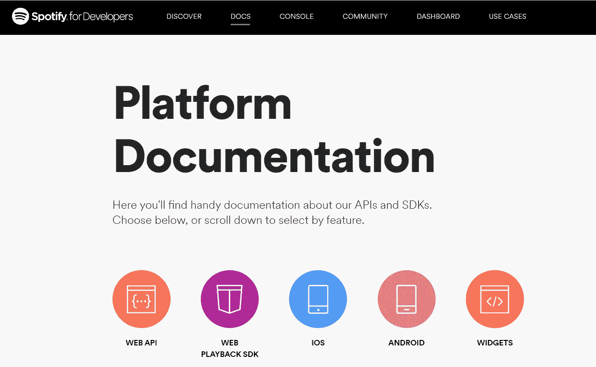
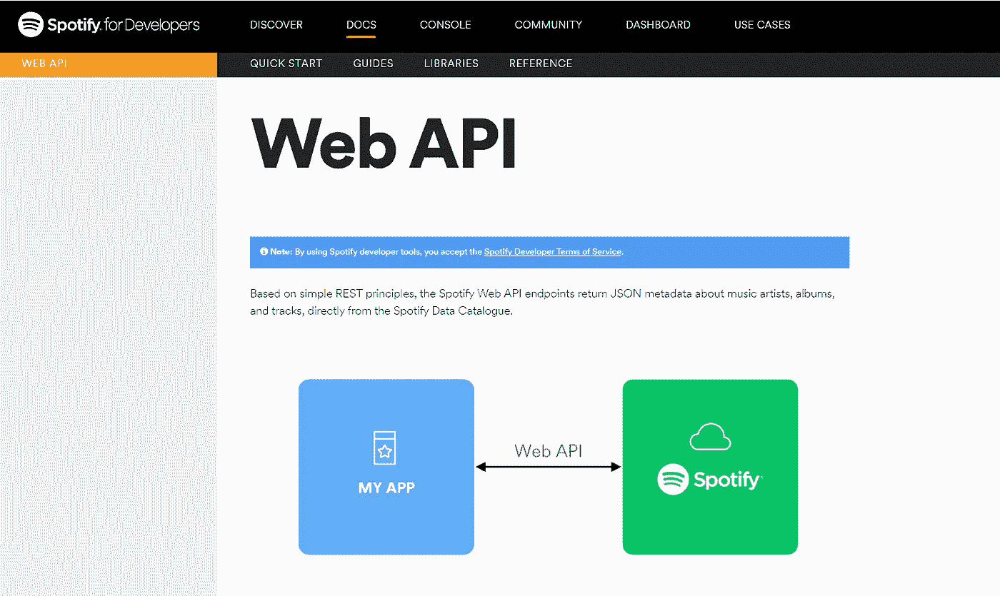
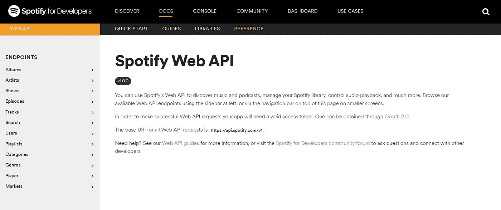
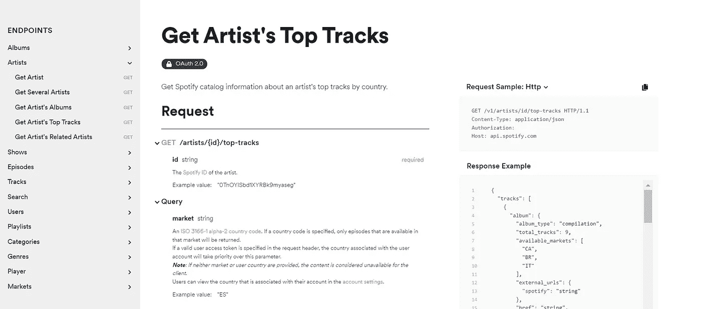
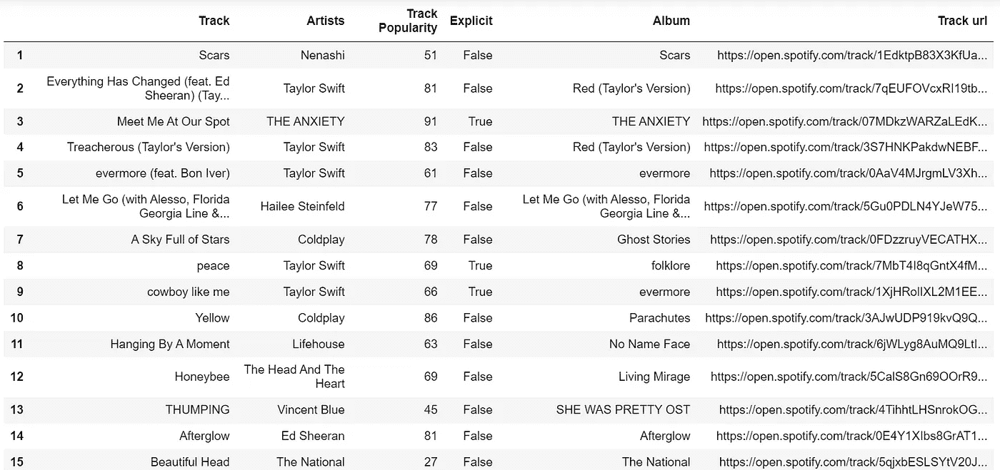

# 使用 Spotify API 探索您最喜爱的音乐数据

> 原文：<https://blog.devgenius.io/explore-your-favorite-music-data-with-spotify-api-2510a635947c?source=collection_archive---------11----------------------->

使用 Spotify API 提取一些关于您最喜欢的歌曲和专辑的有趣数据进行处理！


照片由 Imtiyaz Ali 在 Unsplash 上拍摄

Spotify 为用户提供了一个非常容易上手的 API。让我们首先从定义 API 开始。

[IBM 提供了一个非常简单的解释](https://www.ibm.com/cloud/learn/api):*应用程序编程接口(API)使公司能够向外部第三方开发者、业务合作伙伴和公司内部部门开放其应用程序的数据和功能。*“把 Spotify 想象成一个巨大的歌曲数据库，我们用它来根据自己的喜好播放音乐。现在，Spotify 希望特别向程序员提供这些数据，以便他们可以在自己的项目中使用这些数据，提出创造性的应用程序，将它们提供给 ML 模型等。这些都可以借助应用编程接口来完成。此外，这也有助于在这个过程中为 Spotify 建立一个繁荣的开发者社区:)

# **如何入门**？

首先，在开始实际项目之前，让我们熟悉一下 Spotify API——它是如何工作的，你可以获得什么样的数据，以什么格式获得，以及其他事情。为此，请访问 [Spotify for Developers](https://developer.spotify.com/?_gl=1*18e54ke*_gcl_aw*R0NMLjE2Mzc0ODA1ODAuRUFJYUlRb2JDaE1JaXJHMXVfcW85QUlWU1pKbUFoMThEQXkwRUFBWUFTQUFFZ0w0N2ZEX0J3RQ..*_gcl_dc*R0NMLjE2Mzc0ODA1ODAuRUFJYUlRb2JDaE1JaXJHMXVfcW85QUlWU1pKbUFoMThEQXkwRUFBWUFTQUFFZ0w0N2ZEX0J3RQ..&_ga=2.263976204.1651096753.1637219209-1571326493.1637219209&_gac=1.182577426.1637480580.EAIaIQobChMIirG1u_qo9AIVSZJmAh18DAy0EAAYASAAEgL47fD_BwE) 网站，点击标题中的 **DOCS** 选项。你会看到不同的图标，这些图标都是指向各自指南的链接，点击 **WEB API** 图标。



(图片由作者提供)

在这个新窗口中，你会看到 Spotify 对其 WEB API 的解释——你可以发送的不同 HTTP 请求，它的响应格式，各种端点，对你请求的数据集进行分页等。快速浏览一下这一页，它会让你以后更容易理解:)



(图片由作者提供)

如果你认为你现在有点理解 Spotify API 是如何工作的，让我们看看探索不同 API 端点的各种例子。对我们来说很好，Spotify 为我们提供了一个简单的方法，实际上不需要写一行代码！为此，点击次级导航栏中的**参考**选项卡。这将打开一个名为“Spotify Web API”的新页面，相关端点被分类到网站左侧列出的不同类别中。



(图片由作者提供)

单击您选择的端点后，您将看到使用该端点生成的请求和响应的示例。如您所见，响应是以 JSON 格式生成的，如 WEB API 页面中所述。该页面还解释了请求和响应中使用的各种查询和参数。



使用的端点:获取艺术家的热门曲目(图片由作者提供)

*注意*:如果您想了解更多，请选择顶部横幅中除了我们之前了解的文档之外的**控制台**选项。该选项将允许您发送一个带有您自己选择的 id 和参数的请求，并再次得到结果响应——而无需编写任何代码！

# 斯波特比

*Spotipy* 是 Spotify Web API 的轻量级 Python 库。有了 Spotify，你可以完全访问 Spotify 提供的所有音乐数据。在这个项目中，我们将使用 Spotipy 通过不同的端点发送请求。阅读[这个 Spotify 文档](https://spotipy.readthedocs.io/en/2.19.0/)对你来说很重要，这样你就可以毫无问题地创建自己的 Spotify API 项目。

# 创建应用程序

既然您已经尝试了 Spotify API，让我们从这个项目开始吧。前往顶部横幅中的 Dashboard 选项，登录您的 Spotify 帐户。登录后，点击创建一个应用程序选项，并给它一个你选择的名称和描述。这一步将为您获取一个**客户端 Id** 和一个**客户端机密**，您需要使用它们向 Spotify API 发出请求。请记住安全地存储它，因为如果它被泄露，有人可能会使用它来代表您的应用程序发送请求。在这个例子中，我们将使用 Http GET 方法。要使用 POST 方法，您需要使用 OAuth，您可以在 Spotify 的文档中了解它。

# 我们开始吧

我希望到目前为止，我们已经涵盖了使用 Spotify API 所需的所有基础知识。所以让我们从安装 Spotify 开始吧。

```
pip install spotipy
```

你现在有了你的客户 ID 和客户密码。您可以直接在代码中使用它们，使用 os 库将它们设置为环境变量，或者将它们存储在 python 模块中，稍后您可以将其导入到代码中。

**提出请求**

让我们使用 Spotipy 的 *playlist_items()* 请求获取播放列表项端点。

```
import spotipy
from spotipy.oauth2 import SpotifyClientCredentialssp = spotipy.Spotify(client_credentials_manager = SpotifyClientCredentials( client_id = '*your client id'*, client_secret = '*your client secret'*) )playlist = sp.playlist_items('[*add playlist url of your choice*'](https://open.spotify.com/playlist/37i9dQZF1DX5q67ZpWyRrZ?si=19b6481d00fd4c2b',market='IN'))
```

现在，如果你打印*播放列表*，你会看到 JSON 格式的响应，就像我们之前在 Spotify 网站上看到的例子一样。现在观察数据。寻找您感兴趣并希望包含在数据集/项目中的内容。接下来，您要编写代码来提取您想要的特定数据。下面是从 *playlist_items* 响应中获取一些具体数据的代码。

```
index=[]
track_name = []
album = []
track_artist = []
track_url = []
popularity = []
explicit = [] for idx, item in ennumerate(playlist['items'],1):
    #index
    index.append(idx)

    #track name
    track_name.append(item['track']['name'])     #album
    album.append(item['track']['album']['name']) #track artist
    track_artist.append(item['track']['artists'][0]['name'])

    #track popularity
    popularity.append(item['track']['popularity'])

    #track explicity
    explicit.append(item['track']['explicit'])

    #track url
    track_url.append(item['track']['external_urls']['spotify'])
```

我们现在已经收集了不同列表中的数据。现在让我们用一个熊猫的数据框架来更好地展示我们收集的数据。

```
import pandas as pd playlist = pd.DataFrame( {’Track’:track_name, ’Track Artists’:track_artist,  'Track Popularity’:popularity, 'Explicit’:explicit, 'Album’:album, 'Track url’:track_url} )#Set index
df1.index = index
```

现在，对于任何给定的播放列表，我们的数据集应该看起来像这样



就是这个！我们完了！那不是很难吗？我希望如此:)你现在可以用这个 API 做很多有趣的事情了。想象力是你的极限…

*更多内容尽在*[*blog . dev genius . io*](http://blog.devgenius.io)*。*